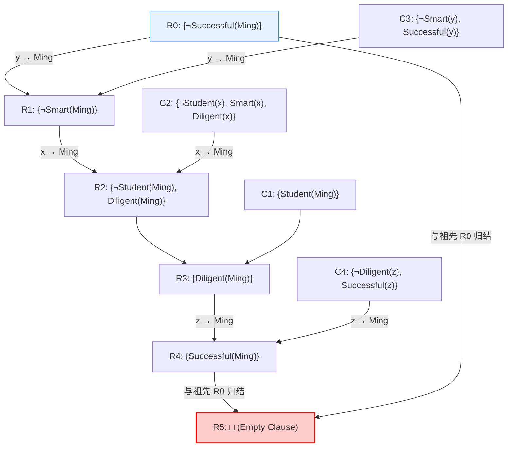
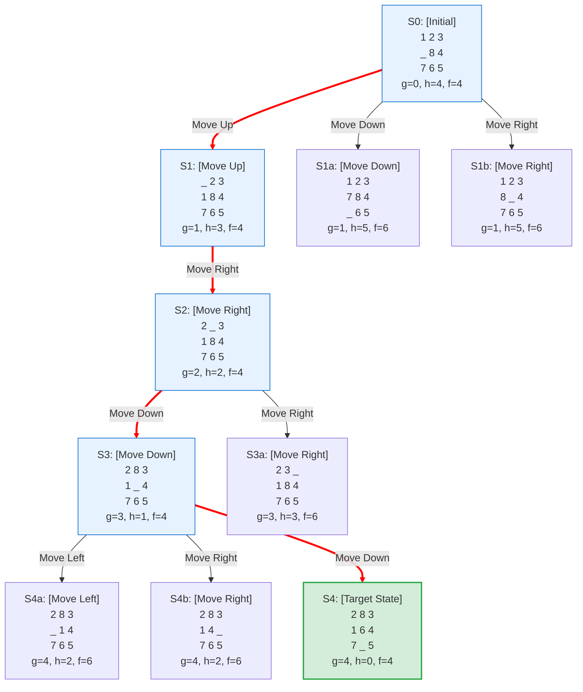
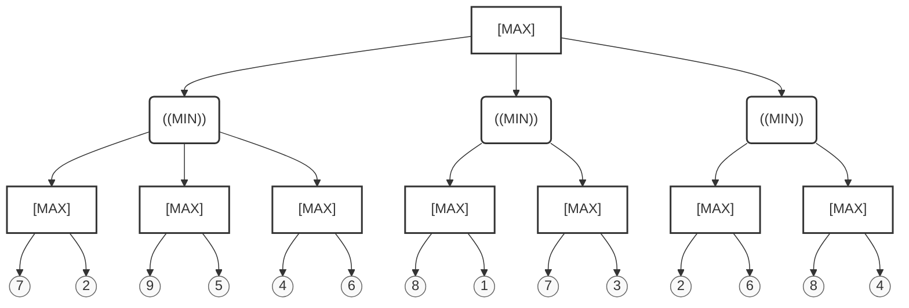
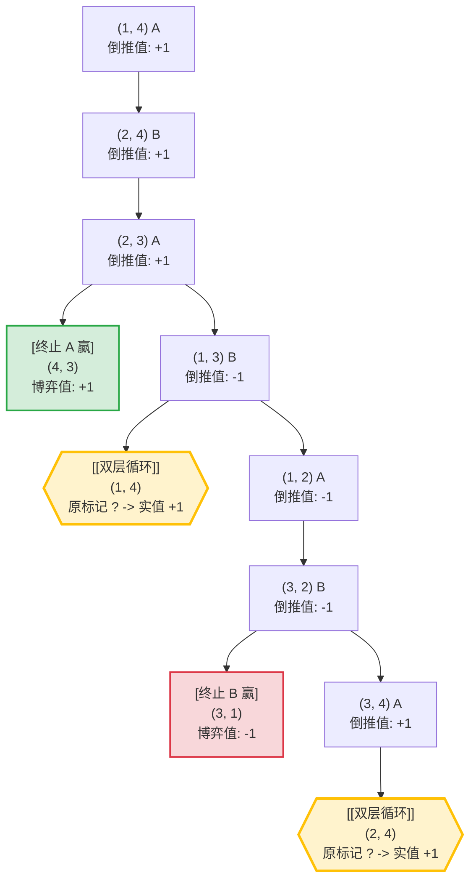

# 归结-搜索理论课作业

## 1. 一阶谓词逻辑转化为子句集
设有如下谓词逻辑公式（已知条件集合），将其转化为等价的子句集 (Clause Set)，要求写出中间步骤，包括：消去蕴含、量词内移、、丢弃全称量词、化为合取范式、提取子句。

$$\forall x \forall y (P(x, y) \rightarrow \exists z (Q(z, x) \land R(y, z)))$$
$$\land \forall u (\exists v S(u, v) \rightarrow \forall w T(w, u))$$
$$\land \neg \exists a \forall b (U(a) \land (V(b) \rightarrow W(a, b)))$$

### 解答与中间步骤：

我们分别对合取式中的三部分逻辑公式 $F_1, F_2, F_3$ 进行转换：

#### **第一部分：** $F_1 = \forall x \forall y (P(x, y) \rightarrow \exists z (Q(z, x) \land R(y, z)))$
1. **消去蕴含式**：
   $$\forall x \forall y (\neg P(x, y) \lor \exists z (Q(z, x) \land R(y, z)))$$
2. **量词内移**：已是最简。
3. **变量标准化**：已是最简。
4. **消去存在量词（Skolem 化）**：
   由于存在量词 $\exists z$ 在全称量词 $\forall x, \forall y$ 的辖域内，引入二元 Skolem 函数 $f(x, y)$ 代替 $z$：
   $$\forall x \forall y (\neg P(x, y) \lor (Q(f(x, y), x) \land R(y, f(x, y))))$$
5. **丢弃全称量词**：
   $$\neg P(x, y) \lor (Q(f(x, y), x) \land R(y, f(x, y)))$$
6. **化为合取范式 (CNF)**：利用分配律：
   $$(\neg P(x, y) \lor Q(f(x, y), x)) \land (\neg P(x, y) \lor R(y, f(x, y)))$$
7. **提取子句并重命名变量以实现标准化**：
   - 子句 1.1: $\{\neg P(x_1, y_1), Q(f(x_1, y_1), x_1)\}$
   - 子句 1.2: $\{\neg P(x_2, y_2), R(y_2, f(x_2, y_2))\}$

---

#### **第二部分：** $F_2 = \forall u (\exists v S(u, v) \rightarrow \forall w T(w, u))$
1. **消去蕴含式**：
   $$\forall u (\neg \exists v S(u, v) \lor \forall w T(w, u))$$
2. **量词内移**：将否定词移入量词，并将全称量词前置：
   $$\forall u (\forall v \neg S(u, v) \lor \forall w T(w, u)) \equiv \forall u \forall v \forall w (\neg S(u, v) \lor T(w, u))$$
3. **变量标准化**：已是最简。
4. **消去存在量词**：公式内无存在量词。
5. **丢弃全称量词**：
   $$\neg S(u, v) \lor T(w, u)$$
6. **化为合取范式**：已是合取范式。
7. **提取子句**：
   - 子句 2.1: $\{\neg S(u, v), T(w, u)\}$

---

#### **第三部分：** $F_3 = \neg \exists a \forall b (U(a) \land (V(b) \rightarrow W(a, b)))$
1. **量词内移，移入否定词**：
   $$\forall a \neg \forall b (U(a) \land (V(b) \rightarrow W(a, b))) \equiv \forall a \exists b \neg (U(a) \land (V(b) \rightarrow W(a, b)))$$
   $$\equiv \forall a \exists b (\neg U(a) \lor \neg (V(b) \rightarrow W(a, b)))$$
2. **消去蕴含式**：
   由于 $\neg (V(b) \rightarrow W(a, b)) \equiv \neg (\neg V(b) \lor W(a, b)) \equiv V(b) \land \neg W(a, b)$，代入得：
   $$\forall a \exists b (\neg U(a) \lor (V(b) \land \neg W(a, b)))$$
3. **消去存在量词（Skolem 化）**：
   存在量词 $\exists b$ 在全称量词 $\forall a$ 的辖域内，引入一元 Skolem 函数 $g(a)$ 代替 $b$：
   $$\forall a (\neg U(a) \lor (V(g(a)) \land \neg W(a, g(a))))$$
4. **丢弃全称量词**：
   $$\neg U(a) \lor (V(g(a)) \land \neg W(a, g(a)))$$
5. **化为合取范式 (CNF)**：利用分配律：
   $$(\neg U(a) \lor V(g(a))) \land (\neg U(a) \lor \neg W(a, g(a)))$$
6. **提取子句并重命名变量以实现标准化**：
   - 子句 3.1: $\{\neg U(a_1), V(g(a_1))\}$
   - 子句 3.2: $\{\neg U(a_2), \neg W(a_2, g(a_2))\}$

---

### **最终得到的子句集形式：**
$$S = \{ \{\neg P(x_1, y_1), Q(f(x_1, y_1), x_1)\}, \{\neg P(x_2, y_2), R(y_2, f(x_2, y_2))\}, \{\neg S(u, v), T(w, u)\}, \{\neg U(a_1), V(g(a_1))\}, \{\neg U(a_2), \neg W(a_2, g(a_2))\} \}$$

---

## 2. 归结法证明
用归结法证明以下推理。

**已知前提：**
1. 任何信任他人的人都是诚实的。
2. 所有有影响力的人都认识张三。
3. 如果一个人认识另一个人，那么要么他们是朋友，要么其中一人不诚实。
4. 如果两个人是朋友，那么他们互相信任。
5. 李四是有影响力的。
6. 张三不信任李四。

**求证：**
* 张三不诚实。

**谓词初始定义统一如下：**
* $x$ 是诚实的人：$\text{Honest}(x)$
* $x$ 信任 $y$：$\text{Trust}(x, y)$
* $x$ 具有影响力：$\text{Influential}(x)$
* $x$ 认识 $y$：$\text{Know}(x, y)$
* $x$ 和 $y$ 是朋友：$\text{Friend}(x, y)$

### 证明过程：

**第一步：写出前提和结论的一阶谓词公式**
1. $\forall x (\exists y \text{Trust}(x, y) \rightarrow \text{Honest}(x))$
2. $\forall x (\text{Influential}(x) \rightarrow \text{Know}(x, \text{Zhang}))$
3. $\forall x \forall y (\text{Know}(x, y) \rightarrow (\text{Friend}(x, y) \lor \neg \text{Honest}(x) \lor \neg \text{Honest}(y)))$
4. $\forall x \forall y (\text{Friend}(x, y) \rightarrow (\text{Trust}(x, y) \land \text{Trust}(y, x)))$
5. $\text{Influential}(\text{Li})$
6. $\neg \text{Trust}(\text{Zhang}, \text{Li})$
7. 待证结论：$\neg \text{Honest}(\text{Zhang})$，其否定形式为：$\text{Honest}(\text{Zhang})$

**第二步：转换为标准子句集**
* $C_1$: $\{\neg \text{Trust}(x_1, y_1), \text{Honest}(x_1)\}$  (由 1 转化得到)
* $C_2$: $\{\neg \text{Influential}(x_2), \text{Know}(x_2, \text{Zhang})\}$ (由 2 转化得到)
* $C_3$: $\{\neg \text{Know}(x_3, y_3), \text{Friend}(x_3, y_3), \neg \text{Honest}(x_3), \neg \text{Honest}(y_3)\}$ (由 3 转化得到)
* $C_{4a}$: $\{\neg \text{Friend}(x_4, y_4), \text{Trust}(x_4, y_4)\}$ (由 4 转化得到的一半)
* $C_{4b}$: $\{\neg \text{Friend}(x_5, y_5), \text{Trust}(y_5, x_5)\}$ (由 4 转化得到的另一半)
* $C_5$: $\{\text{Influential}(\text{Li})\}$
* $C_6$: $\{\neg \text{Trust}(\text{Zhang}, \text{Li})\}$
* $C_7$: $\{\text{Honest}(\text{Zhang})\}$ (结论的否定)

**第三步：推导归结序列**
1. 归结 $C_2$ 与 $C_5$，代换 $[x_2 \to \text{Li}]$，得到：
   $C_8 = \{\text{Know}(\text{Li}, \text{Zhang})\}$
2. 归结 $C_8$ 与 $C_3$，代换 $[x_3 \to \text{Li}, y_3 \to \text{Zhang}]$，得到：
   $C_9 = \{\text{Friend}(\text{Li}, \text{Zhang}), \neg \text{Honest}(\text{Li}), \neg \text{Honest}(\text{Zhang})\}$
3. 归结 $C_9$ 与 $C_7$，消去 $\neg \text{Honest}(\text{Zhang})$，得到：
   $C_{10} = \{\text{Friend}(\text{Li}, \text{Zhang}), \neg \text{Honest}(\text{Li})\}$
4. 归结 $C_{10}$ 与 $C_{4b}$，代换 $[x_5 \to \text{Li}, y_5 \to \text{Zhang}]$，消去相斥文字，得到：
   $C_{11} = \{\text{Trust}(\text{Zhang}, \text{Li}), \neg \text{Honest}(\text{Li})\}$
5. 归结 $C_{11}$ 与 $C_6$，消去 $\text{Trust}(\text{Zhang}, \text{Li})$，得到：
   $C_{12} = \{\neg \text{Honest}(\text{Li})\}$
6. 归结 $C_{10}$ 与 $C_{4a}$，代换 $[x_4 \to \text{Li}, y_4 \to \text{Zhang}]$，消去 $\text{Friend}(\text{Li}, \text{Zhang})$，得到：
   $C_{13} = \{\text{Trust}(\text{Li}, \text{Zhang}), \neg \text{Honest}(\text{Li})\}$
7. 归结 $C_{13}$ 与 $C_{12}$，消去 $\neg \text{Honest}(\text{Li})$，得到：
   $C_{14} = \{\text{Trust}(\text{Li}, \text{Zhang})\}$
8. 归结 $C_{14}$ 与 $C_1$，代换 $[x_1 \to \text{Li}, y_1 \to \text{Zhang}]$，消去 $\text{Trust}$ 谓词，得到：
   $C_{15} = \{\text{Honest}(\text{Li})\}$
9. 归结 $C_{15}$ 与 $C_{12}$，消去相斥文字，得到：
   $C_{16} = \Box \quad (\text{空子句})$

由此，推导出空子句，反设不成立，原命题得证：**张三不诚实**。

---

## 3. 祖先过滤策略归结证明
祖先过滤策略要求当两个句子 $C_1$ 和 $C_2$ 进行归结的时候，需要满足：
1. $C_1$ 和 $C_2$ 中至少有一个是初始子句集中的子句。
2. $C_1$ 和 $C_2$ 中一个是另一个的祖先子句。

使用祖先过滤策略进行以下归结证明：

**已知前提：**
1. 小明是学生。
2. 所有学生要么聪明要么勤奋。
3. 聪明的人都成功。
4. 勤奋的人都成功。

**求证：**
* 小明成功。

**谓词初始定义统一如下：**
* $x$ 是学生：$\text{Student}(x)$
* $x$ 聪明：$\text{Smart}(x)$
* $x$ 勤奋：$\text{Diligent}(x)$
* $x$ 成功：$\text{Successful}(x)$

**要求：**
* 遵循祖先过滤策略进行归结，并画出归结树。

### 证明过程：

**第一步：定义初始子句集**
* $C_1$: $\{\text{Student}(\text{Ming})\}$
* $C_2$: $\{\neg \text{Student}(x), \text{Smart}(x), \text{Diligent}(x)\}$
* $C_3$: $\{\neg \text{Smart}(y), \text{Successful}(y)\}$
* $C_4$: $\{\neg \text{Diligent}(z), \text{Successful}(z)\}$
* $C_5$: $\{\neg \text{Successful}(\text{Ming})\}$ (待证结论的否定)

**第二步：归结序列**
* $R_0 = C_5 = \{\neg \text{Successful}(\text{Ming})\}$ （初始子句）
* $R_1$: 由 $R_0$ 和 初始子句 $C_3$ 归结，代换 $[y \to \text{Ming}]$，得到：
  $R_1 = \{\neg \text{Smart}(\text{Ming})\}$
* $R_2$: 由 $R_1$ 和 初始子句 $C_2$ 归结，代换 $[x \to \text{Ming}]$，得到：
  $R_2 = \{\neg \text{Student}(\text{Ming}), \text{Diligent}(\text{Ming})\}$
* $R_3$: 由 $R_2$ 和 初始子句 $C_1$ 归结，消去 $\neg \text{Student}$，得到：
  $R_3 = \{\text{Diligent}(\text{Ming})\}$
* $R_4$: 由 $R_3$ 和 初始子句 $C_4$ 归结，代换 $[z \to \text{Ming}]$，得到：
  $R_4 = \{\text{Successful}(\text{Ming})\}$
* $R_5$: 由 $R_4$ 和 它的祖先子句（也是初始子句）$R_0$ 归结，消去相斥文字，得到：
  $R_5 = \Box \quad (\text{空子句})$

该过程每次归结均以初始子句作为参与方，且最后一步成功与祖先子句 $R_0$ 归结得到空子句，符合祖先过滤策略。

**归结树：**


---

## 4. 8 数码问题 (A* 搜索)
对于 8 数码问题，令启发式函数 $h(n)$ 为所有数码的当前位置与其目标位置的曼哈顿距离之和。基于上述 $h(n)$，用 $\text{A}^*$ 搜索算法求解初始状态 and 目标状态如下的 8 数码问题。对于空白格，规定其按照向上、向下、向左、向右的顺序进行移动。画出搜索图，并在图中标明所有状态的 $f, g, h$ 值。

*注：每次行动的成本为 1，左右（或上下）相邻数码的曼哈顿距离为 1。可使用环检测。*

### 初始状态与目标状态

**初始状态：**

| 1 | 2 | 3 |
| :---: | :---: | :---: |
|   | 8 | 4 |
| 7 | 6 | 5 |

**目标状态：**

| 2 | 8 | 3 |
| :---: | :---: | :---: |
| 1 | 6 | 4 |
| 7 |   | 5 |

---

### 解答过程：

数码 1-8 在目标状态中的坐标（设第一行第一列为 (0,0)）如下：
* 1: (1, 0), 2: (0, 0), 3: (0, 2), 4: (1, 2)
* 5: (2, 2), 6: (1, 1), 7: (2, 0), 8: (0, 1)
（注：启发式函数 $h(n)$ 计算中不包含空白格本身，只累加数码 1-8 的曼哈顿距离）。

**A\* 搜索扩展序列及 $f, g, h$ 状态记录**：

1. **初始状态 $S_0$**：
   ```
   1  2  3
   _  8  4
   7  6  5
   ```
   * 空白在 (1, 0)。
   * $g=0$。
   * $h = d(1)+d(2)+\dots+d(8) = 1(对1) + 1(对2) + 0(对3) + 0(对4) + 0(对5) + 1(对6) + 0(对7) + 1(对8) = 4$。
   * $f = g + h = 0 + 4 = 4$。
   * 可选移动：
     * **向上**：产生 $S_1$，$g=1, h=3, f=4$。 (数码1下移)
     * **向下**：产生 $S_{1a}$，$g=1, h=5, f=6$。 (数码7上移)
     * **向右**：产生 $S_{1b}$，$g=1, h=5, f=6$。 (数码8左移)
   * **扩展 $S_1$** (因为 $f=4$ 最小)。

2. **状态 $S_1$**：
   ```
   _  2  3
   1  8  4
   7  6  5
   ```
   * 空白在 (0, 0)。
   * $g=1, h=3, f=4$。
   * 可选移动：
     * **向下**：返回 $S_0$ (由环检测过滤)。
     * **向右**：产生 $S_2$，$g=2, h=2, f=4$。 (数码2左移)
   * **扩展 $S_2$**。

3. **状态 $S_2$**：
   ```
   2  _  3
   1  8  4
   7  6  5
   ```
   * 空白在 (0, 1)。
   * $g=2, h=2, f=4$。
   * 可选移动：
     * **向左**：返回 $S_1$ (过滤)。
     * **向右**：产生 $S_{3a}$，$g=3, h=3, f=6$。 (数码3左移)
     * **向下**：产生 $S_3$，$g=3, h=1, f=4$。 (数码8上移)
   * **扩展 $S_3$**。

4. **状态 $S_3$**：
   ```
   2  8  3
   1  _  4
   7  6  5
   ```
   * 空白在 (1, 1)。
   * $g=3, h=1, f=4$。
   * 可选移动：
     * **向上**：返回 $S_2$ (过滤)。
     * **向左**：产生 $S_{4a}$，$g=4, h=2, f=6$。 (数码1右移)
     * **向右**：产生 $S_{4b}$，$g=4, h=2, f=6$。 (数码4左移)
     * **向下**：产生 $S_4$ (目标状态)，$g=4, h=0, f=4$。 (数码6上移)
   * **扩展 $S_4$**（到达目标，成功退出）。

**搜索图如下**（加粗红线标明最优路径）：


---

## 5. 农夫过河问题
农夫需要将一只狼、一只羊和一棵白菜从河的左岸运到右岸。船一次只能载农夫本人以及至多一件物品（即农夫可单独过河，或带上狼、羊、白菜中的某一个）。

如果农夫不在场，则狼会吃羊、羊会吃白菜，因此任何时刻两岸都不能出现“狼和羊同岸且农夫不在该岸”或“羊和白菜同岸且农夫不在该岸”的情况。

状态可用四元组 $(\text{农夫位置}, \text{狼位置}, \text{羊位置}, \text{白菜位置})$ 表示，每个位置取 $0$（左岸）或 $1$（右岸），初始状态为 $(0, 0, 0, 0)$，目标状态为 $(1, 1, 1, 1)$。

**要求：**
1. 使用广度优先搜索（BFS）求解从初始状态到目标状态的最少步数路径。
2. 使用 $\text{A}^*$ 算法求解这一问题，自行设计一个可采纳的启发式函数 $h(n)$，并证明其一致性与可采纳性。给出路径、步数，以及启发式函数的定义与相关证明。
3. 对比两种算法的性能（扩展状态数、运行效率等），并分析启发式函数对搜索效率的影响。

---

### 解答过程：

#### 1. BFS 求解最少步数路径
合法的状态一共 $10$ 个：
$(0,0,0,0)$，$(0,0,0,1)$，$(0,0,1,0)$，$(0,1,0,0)$，$(0,1,0,1)$，$(1,0,1,0)$，$(1,0,1,1)$，$(1,1,0,1)$，$(1,1,1,0)$，$(1,1,1,1)$。

利用 BFS，可以搜索出最少步数为 **7 步**，其对应的解路径有两条（对称）：
* **路径 A（先带狼后运菜）**：
  $$(0, 0, 0, 0) \xrightarrow{\text{带羊过河}} (1, 0, 1, 0) \xrightarrow{\text{独自返回}} (0, 0, 1, 0) \xrightarrow{\text{带狼过河}} (1, 1, 1, 0) \xrightarrow{\text{带羊返回}} (0, 1, 0, 0) \xrightarrow{\text{带菜过河}} (1, 1, 0, 1) \xrightarrow{\text{独自返回}} (0, 1, 0, 1) \xrightarrow{\text{带羊过河}} (1, 1, 1, 1)$$
* **路径 B（先带菜后运狼）**：
  $$(0, 0, 0, 0) \xrightarrow{\text{带羊过河}} (1, 0, 1, 0) \xrightarrow{\text{独自返回}} (0, 0, 1, 0) \xrightarrow{\text{带菜过河}} (1, 0, 1, 1) \xrightarrow{\text{带羊返回}} (0, 0, 0, 1) \xrightarrow{\text{带狼过河}} (1, 1, 0, 1) \xrightarrow{\text{独自返回}} (0, 1, 0, 1) \xrightarrow{\text{带羊过河}} (1, 1, 1, 1)$$

---

#### 2. $\text{A}^*$ 算法启发式函数设计及证明

##### **启发式函数设计：**
设状态为 $n = (F, W, S, C)$。令 $k$ 为**在左岸 (值为0) 的运送物品数**：
$$k = (1-W) + (1-S) + (1-C)$$
设计启发式函数 $h(n)$ 为：
$$h(n) = \begin{cases} 
2k - 1, & \text{若 } F = 0 \\ 
2k, & \text{若 } F = 1 
\end{cases}$$
且规定目标状态 $h(1,1,1,1) = 0$。

##### **可采纳性 (Admissibility) 证明：**
可采纳性要求任意状态下有 $h(n) \le h^*(n)$，其中 $h^*(n)$ 为实际所需的最小过河步数。
* **当 $F=0$ 时**：
  左岸尚有 $k$ 件物品待运送，由于每趟去程船上最多搭载一物，故运完 $k$ 物必需要 $k$ 次去程。
  为返回左岸搭载下一件物品，除去最后一趟，农夫还必须进行至少 $k-1$ 次返程。
  因此总渡河次数至少为 $k + (k-1) = 2k-1$。故 $h^*(n) \ge 2k - 1 = h(n)$。
* **当 $F=1$ 且 $k > 0$ 时**：
  农夫在右岸，左岸还有 $k$ 件物品。农夫必须首先返回左岸一次（1 步），然后进入上述 $F=0, k$ 状态。
  因此总渡河步数至少为 $1 + 2k - 1 = 2k$。故 $h^*(n) \ge 2k = h(n)$。
* **当 $F=1, k=0$ 时**：
  已到达目标状态，此时 $h^*(n) = 0 = h(n)$。

综上，在所有合法状态中均有 $h(n) \le h^*(n)$，因此该启发式函数是**可采纳的**。

##### **一致性 (Consistency) 证明：**
一致性要求对于任意相邻状态 $n$ 和 $n'$，满足 $h(n) \le c(n, n') + h(n')$，其中单步成本 $c(n, n') = 1$。
因为渡河一步后，农夫必定在两岸间切换，故只需证明单步转移中 $|h(n) - h(n')| \le 1$ 即可：
* **情况 1 ($F=0 \to F'=1$)**：
  * **农夫单独过河**：左岸物品数不变即 $k'=k$。
    $$h(n) = 2k-1,\ h(n') = 2k \implies h(n) = h(n') - 1 \le h(n') + 1$$
  * **农夫带走一物过河**：左岸物品数减 1 即 $k'=k-1$。
    $$h(n) = 2k-1,\ h(n') = 2(k-1) = 2k-2 \implies h(n) = h(n') + 1 \le h(n') + 1$$
* **情况 2 ($F=1 \to F'=0$)**：
  * **农夫单独返回**：左岸物品数不变即 $k'=k$。
    $$h(n) = 2k,\ h(n') = 2k-1 \implies h(n) = h(n') + 1 \le h(n') + 1$$
  * **农夫带回一物**：左岸物品数加 1 即 $k'=k+1$。
    $$h(n) = 2k,\ h(n') = 2(k+1)-1 = 2k+1 \implies h(n) = h(n') - 1 \le h(n') + 1$$

由此可见，所有合法单步状态迁移均满足一致性，因此该启发式函数是**一致的**。

##### **$\text{A}^*$ 算法运行路径及 $f, g, h$ 变化序列：**
$$\begin{aligned}
& S_0(0, 0, 0, 0): g=0, h=5, f=5 \xrightarrow{\text{带羊过河}} S_1(1, 0, 1, 0): g=1, h=4, f=5 \\
& \xrightarrow{\text{独自返回}} S_2(0, 0, 1, 0): g=2, h=3, f=5 \xrightarrow{\text{带狼过河}} S_3(1, 1, 1, 0): g=3, h=2, f=5 \\
& \xrightarrow{\text{带羊返回}} S_4(0, 1, 0, 0): g=4, h=3, f=7 \xrightarrow{\text{带菜过河}} S_5(1, 1, 0, 1): g=5, h=2, f=7 \\
& \xrightarrow{\text{独自返回}} S_6(0, 1, 0, 1): g=6, h=1, f=7 \xrightarrow{\text{带羊过河}} S_7(1, 1, 1, 1): g=7, h=0, f=7
\end{aligned}$$

---

#### 3. 两种算法的性能对比与分析
* **数据对比**：
  * **BFS**：扩展了所有 $10$ 个合法状态，最优路径长度为 $7$。
  * **$\text{A}^*$**：扩展了所有 $10$ 个合法状态，最优路径长度为 $7$。
* **原因分析**：
  由于农夫过河问题的有效状态空间非常狭窄（有效状态点共 10 个），所以启发式函数在如此微小的空间内无法展现出强大的“剪枝”和“搜索降维”作用，使得两者的实际状态搜索总数没有差异。
* **启发式函数对搜索效率的影响**：
  在较大规模的问题（例如数码问题、迷宫障碍寻找、地图规划等）中，良好的启发式函数可以建立明显的斜率导向，在探索中剪去与目标背道而驰的路径，极大地降低在不相干状态区域上的时空开销。

---

## 6. 博弈树与 $\alpha\text{-}\beta$ 剪枝
在下图所示的博弈树中，方框表示极大方，圆圈表示极小方。以优先生成左边结点的顺序来进行 $\alpha\text{-}\beta$ 剪枝搜索，试在博弈树上给出何处发生剪枝的标记，并用粗体注明最优路径。



*图例说明：方框 $[ \text{MAX} ]$ 表示极大节点，圆圈 $( ( \text{MIN} ) )$ 表示极小节点。*

---

### 解答过程：

按照深度优先（从左至右）的遍历顺序，剪枝和状态回传推导如下：

1. **A 节点 (MIN) 遍历**（初始化 $\alpha = -\infty, \beta = +\infty$）：
   * A1 (MAX)：其叶子为 7 和 2，倒推值为 $\max(7, 2) = 7$。A 节点更新其 $\beta = \min(+\infty, 7) = 7$。
   * A2 (MAX)：先访问左侧叶子 **9**。因为 $\alpha_{A2} = 9 \ge \beta_A = 7$，触发 **$\beta$ 剪枝**。因此，A2 的右侧子节点 **5** 被剪枝。
   * A3 (MAX)：其叶子为 4 和 6，倒推值为 $\max(4, 6) = 6$。
   * A 的最终倒推值为 $\min(7, 9, 6) = 6$。
   * 根节点 Root 更新其 $\alpha = \max(-\infty, 6) = 6$。

2. **B 节点 (MIN) 遍历**（接收 Root 的 $\alpha = 6$）：
   * B1 (MAX)：其叶子为 8 和 1，倒推值为 $\max(8, 1) = 8$。B 节点更新其 $\beta = \min(+\infty, 8) = 8$。
   * B2 (MAX)：其叶子为 7 和 3，倒推值为 $\max(7, 3) = 7$。因为 $7 < 8$ 且 $7 > 6$，所以不进行剪枝。
   * B 的最终倒推值为 $\min(8, 7) = 7$。
   * 根节点 Root 更新其 $\alpha = \max(6, 7) = 7$。

3. **C 节点 (MIN) 遍历**（接收 Root 的 $\alpha = 7$）：
   * C1 (MAX)：其叶子为 2 和 6，倒推值为 $\max(2, 6) = 6$。
   * C 节点更新其 $\beta = \min(+\infty, 6) = 6$。
   * 检查剪枝条件：因为 $\beta_C = 6 \le \alpha_{Root} = 7$，触发 **$\alpha$ 剪枝**。
   * 因此，C 节点下的 **C2 节点分支（包含叶子 8 和 4）被整枝剪去**。

**结论**：
* 根节点倒推的极大极小值为 **7**。
* 最优决策路径为：**Root $\to$ B $\to$ B2 $\to$ 7**。
* 发生剪枝的位置为：
  1. 叶子节点 **5** 被剪（$\beta$ 剪枝）。
  2. 节点 **C2** 及其全部子节点（**8** 和 **4**）被剪（$\alpha$ 剪枝）。

**剪枝及最优路径图如下（加粗红线为主路径，虚线灰色部分为已剪枝节点）**：
```mermaid
graph TD
    Root["[MAX] (7)"] ===>|最优路径| B("((MIN)) (7)")
    Root --> A("((MIN)) (6)")
    Root -.->|C2 剪枝| C("((MIN)) (<=6)")

    A --> A1["[MAX] (7)"]
    A --> A2["[MAX] (9)"]
    A --> A3["[MAX] (6)"]

    B --> B1["[MAX] (8)"]
    B ===>|最优路径| B2["[MAX] (7)"]

    C --> C1["[MAX] (6)"]
    C -.->|α 剪枝| C2["[MAX] (Pruned)"]

    A1 --> A1_1(("7"))
    A1 --> A1_2(("2"))
    
    A2 --> A2_1(("9"))
    A2 -.->|β 剪枝| A2_2(("5"))
    
    A3 --> A3_1(("4"))
    A3 --> A3_2(("6"))

    B1 --> B1_1(("8"))
    B1 --> B1_2(("1"))
    B2 ===>|最优路径| B2_1(("7"))
    B2 --> B2_2(("3"))

    C1 --> C1_1(("2"))
    C1 --> C1_2(("6"))
    
    C2 -.-> C2_1(("8"))
    C2 -.-> C2_2(("4"))

    %% 样式配置
    classDef maxNode fill:#fff,stroke:#333,stroke-width:2px;
    classDef minNode fill:#fff,stroke:#333,stroke-width:2px;
    classDef leafNode fill:#f9f9f9,stroke:#666,stroke-width:1px;
    classDef prunedNode fill:#eaeaea,stroke:#bbb,stroke-dasharray: 5 5;

    class Root,A1,A2,A3,B1,B2,C1 maxNode;
    class A,B,C minNode;
    class A1_1,A1_2,A2_1,A3_1,A3_2,B1_1,B1_2,B2_1,B2_2,C1_1,C1_2 leafNode;
    class A2_2,C2,C2_1,C2_2 prunedNode;

    linkStyle 0 stroke:#ff0000,stroke-width:4px;
    linkStyle 7 stroke:#ff0000,stroke-width:4px;
    linkStyle 16 stroke:#ff0000,stroke-width:4px;
    
    linkStyle 2 stroke:#bbb,stroke-width:1px,stroke-dasharray: 5 5;
    linkStyle 11 stroke:#bbb,stroke-width:1px,stroke-dasharray: 5 5;
    linkStyle 15 stroke:#bbb,stroke-width:1px,stroke-dasharray: 5 5;
    linkStyle 27 stroke:#bbb,stroke-width:1px,stroke-dasharray: 5 5;
    linkStyle 28 stroke:#bbb,stroke-width:1px,stroke-dasharray: 5 5;
```

---

## 7. 四格博弈游戏
考虑图中描述的两人游戏。

**游戏规则：**
选手 A 先走，两个选手轮流走棋，每个人只能把自己的棋子移动到任一方向的相邻空位中。如果对方的棋子占据着相邻的位置，那么可以跳过对方的棋子到下一个空位。（例如，A 在位置 3，B 在位置 2，那么 A 可以移回位置 1。）

当一方的棋子移动到对方的端点时，游戏结束。如果 A 先到位置 4，A 的值为 $+1$；如果 B 先到位置 1，A 的值为 $-1$。

### 初始格局 (four-square game)

| 1 | 2 | 3 | 4 |
| :---: | :---: | :---: | :---: |
| **A** | | | **B** |

**问题要求：**
1. 根据如下约定画出完整博弈树：
   * ① 每个状态用 $(s_A, s_B)$ 表示，其中 $s_A$ 和 $s_B$ 表示棋子的位置。
   * ② 每个终止状态用方框画出，用圆圈写出它的博弈值。
   * ③ 把循环状态（在到根结点的路径上已经出现过的状态）画上双层方框。由于不清楚它们的值，所以在圆圈里标记一个“？”。
2. 给出每个结点倒推的极小极大值（也标记在圆圈里）。解释怎样处理 “？” 值和为什么这么处理。
3. 解释标准的极小极大算法为什么在这棵博弈树中会失败，简要说明你将如何修正它，在第 (2) 问的图上画出你的答案。你修正后的算法对于所有包含循环的游戏都能给出最优决策吗？

**思考：**
这个 4 方格游戏可以推广到 $n$ 个方格，其中 $n > 2$。证明：如果 $n$ 是偶数，A 则一定能赢；如果 $n$ 是奇数，则 A 一定会输。

---

### 解答过程：

#### 1. 完整博弈树与极小极大倒推值图示

基于各节点在理性博弈下的选择（即值迭代求解），倒推求出的极大极小值已标在节点旁：



##### **如何处理 “?” 值及原因**：
我们通过列出极小极大值方程组（即逆向归纳与值迭代）来确定 “?” 节点的实际收益：
1. **分析 $(3, 2)$ 节点 [B (MIN) 走]**：
   B 的后继有终止节点 $(3, 1)$（值为 -1，B胜）和节点 $(3, 4)$（值为 $V(3, 4)$）。
   作为极小化玩家，B 会选择极小值。既然 $-1$ 已是游戏中的最低得分，B 必然选择移动到 $(3, 1)$，因此该节点的倒推值为：
   $$V(3, 2) = \min(-1, V(3, 4)) = -1$$
   这也直接决定了 $V(1, 2) = V(3, 2) = -1$。
2. **分析 $(1, 3)$ 节点 [B (MIN) 走]**：
   B 可以选择走向循环节点 $(1, 4)$（其值待定，记为 $V(1, 4)$）或节点 $(1, 2)$（其值已被锁定为 $-1$）。
   因为 B 目标是追求 $-1$（B获胜），所以无论循环值 $V(1, 4)$ 为多少，B 在理性情况下绝对会直接走 $V(1, 2) = -1$，所以：
   $$V(1, 3) = \min(V(1, 4), -1) = -1$$
3. **分析 $(2, 3)$ 节点 [A (MAX) 走]**：
   A 可以选择走向终止节点 $(4, 3)$（值为 $+1$，A胜）或 $(1, 3)$（值为 $-1$）。
   作为极大化玩家，A 会选择走向 $+1$。所以：
   $$V(2, 3) = \max(+1, V(1, 3)) = +1$$
   这进一步锁定了其上游的 $V(2, 4) = V(2, 3) = +1$ 和 $V(1, 4) = V(2, 4) = +1$。
   

**原因归纳**：在包含循环的博弈中，一旦某些分支提供了玩家能够强制达到的最高/最低终止值，那么该玩家就无需考虑任何会导致死循环的选项，从而解开了所有 “?” 值的依赖。

---

#### 2. 标准极小极大算法失败原因与修正
* **失败原因**：
  标准的极小极大算法是基于深度优先搜索（DFS）的。当博弈中存在可以往复循环的状态（如 $(1, 4) \leftrightarrow (2, 4)$ 相关的回退操作）时，DFS 的递归搜索没有出口，将陷入无限循环导致栈溢出。
* **修正方法**：
  1. **环检测与切断**：在递归时维护当前路径哈希表。一旦再次遇到相同状态和行动权，将该节点断开，作为临时叶子节点，根据规则赋予平局值（如 0）或标记为未定。
  2. **值迭代（或逆向倒退分析法 Retrograde Analysis）**：从所有叶子状态（如已分出胜负的端点状态 $+1$ 和 $-1$）开始逆向传播值。
     * 若前驱是 MAX 节点且任一后继为 $+1$，则前驱设为 $+1$；
     * 若前驱是 MIN 节点且任一后继为 $-1$，则前驱设为 $-1$；
     * 不断迭代直至所有节点的值收敛，剩余无法决出胜负的节点自动归为平局值 0。
* **此修正算法能否解决所有循环游戏的最优决策**：
  **可以**。只要状态空间是有限的，值迭代与逆向分析算法就一定能对所有的循环博弈（如包含了“三劫循环”等复杂局面的围棋、有和棋规则的国际象棋）给出的最优决策路径。

---

#### 3. 思考：$n$ 格博弈游戏推广证明
**证明 (基于步数奇偶性与距离奇偶性不变原理)**：
在 $n$ 个格子的棋盘中，A 位于 $1$，B 位于 $n$，两人的初始相对距离为：
$$d_0 = n - 1$$
在任意不发生越过的普通移动中，每人每次只能移动一个格子。因此，在任何玩家走一步后，两人的相对距离 $d = s_B - s_A$ 必然变成 $d \pm 1$，也就是说，**每走一步，相对距离 $d$ 的奇偶性就会交替改变**。

由于 A 先行，且二人交替落子：
* 每次到 **A 的回合**时，已经移动的累计总步数为偶数，因此此时两人的距离 $d$ 的奇偶性与初始距离 $d_0 = n-1$ **完全相同**。
* 每次到 **B 的回合**时，已经移动的累计总步数为奇数，因此此时两人的距离 $d$ 的奇偶性与初始距离 $d_0 = n-1$ **完全相反**。

两枚棋子如果要发生跨越或相遇，必须先到达相邻状态（即 $d = 1$，属于**奇数**）。

* **若 $n$ 为偶数**：
  初始相对距离 $d_0 = n - 1$ 为**奇数**。
  * 根据奇偶性保持规律，只有在 **A 的回合**中，两人的距离 $d$ 才能是奇数。
  * 这意味着当两人迎面撞上、距离变为 $d = 1$ 时，**必然轮到 A 走棋**。
  * 此时 A 可以直接跃过 B 占据 $s_B + 1$。一旦跃过，B 将落在 A 的后方，且因为只能向相邻空位移动，B 无法向后拦截，只能眼睁睁看 A 走向终点 $n$。因此 **A 必赢**。
* **若 $n$ 为奇数**：
  初始相对距离 $d_0 = n - 1$ 为**偶数**。
  * 根据奇偶性保持规律，只有在 **B 的回合**中，两人的距离 $d$ 才能是奇数。
  * 这意味着当两人距离拉近到 $d = 1$ 时，**必然轮到 B 走棋**。
  * 此时 B 会直接跃过 A 占据 $s_A - 1$。B 跃过后会奔向端点 1，A 无法往回拦截。因此 **A 必输 (B 必赢)**。

证明完毕。
