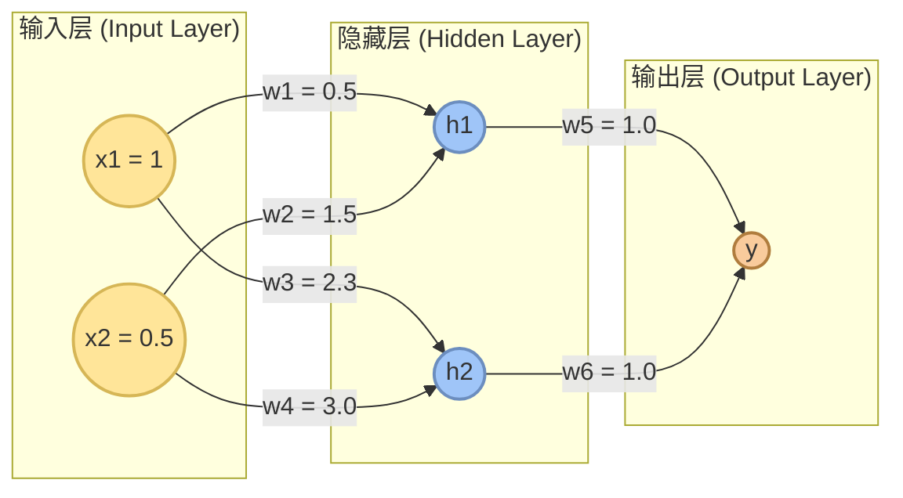

# 机器学习-深度学习理论课作业

## 1. 贝叶斯公式概念题
给定贝叶斯公式：

$$P(c_j|x) = \frac{P(x|c_j)P(c_j)}{P(x)}$$

公式中 $P(c_j|x)$ 为（ **B** ）
* A. 先验概率
* **B. 后验概率**
* C. 全概率
* D. 联合概率

*注：其中 $P(c_j)$ 为先验概率，$P(x|c_j)$ 为似然值（条件概率），$P(x)$ 为证据因子（全概率）。*

---

## 2. 信息增益计算
以下为“是否买电脑”数据集（简化版）：计算选择“年龄”作为划分属性的信息增益。

| 年龄 | 是否买电脑 |
| :---: | :---: |
| $\le 30$ | 否 |
| $\le 30$ | 否 |
| $31 \sim 40$ | 是 |
| $> 40$ | 是 |
| $> 40$ | 否 |

---

### 计算过程：

设目标属性为 $Y$（“是否买电脑”），整个数据集为 $D$，总样本数 $|D| = 5$。
其中，买电脑（“是”）的样本数有 $2$ 个，不买（“否”）的样本数有 $3$ 个。

1. **计算根节点（全集 $D$）的信息熵 $Entropy(D)$**：
   $$Entropy(D) = - \sum_{i=1}^{2} p_i \log_2 p_i = - \frac{2}{5} \log_2 \frac{2}{5} - \frac{3}{5} \log_2 \frac{3}{5}$$
   $$Entropy(D) \approx - 0.4 \times (-1.32193) - 0.6 \times (-0.73697) \approx 0.52877 + 0.44218 = 0.97095$$

2. **计算选择“年龄”属性进行划分后的各子集熵**：
   “年龄”属性包含三个取值：$\le 30$，$31 \sim 40$，$> 40$。
   * **子集 $D_1$（$\text{年龄} \le 30$）**：包含 2 个样本，均为“否”。
     $$Entropy(D_1) = 0$$
   * **子集 $D_2$（$\text{年龄 } 31 \sim 40$）**：包含 1 个样本，为“是”。
     $$Entropy(D_2) = 0$$
   * **子集 $D_3$（$\text{年龄} > 40$）**：包含 2 个样本，1 个为“是”，1 个为“否”。
     $$Entropy(D_3) = - \frac{1}{2} \log_2 \frac{1}{2} - \frac{1}{2} \log_2 \frac{1}{2} = 1.0$$

3. **计算选择“年龄”划分后的条件熵（加权平均熵）**：
   $$Entropy_{\text{年龄}}(D) = \frac{|D_1|}{|D|} Entropy(D_1) + \frac{|D_2|}{|D|} Entropy(D_2) + \frac{|D_3|}{|D|} Entropy(D_3)$$
   $$Entropy_{\text{年龄}}(D) = \frac{2}{5} \times 0 + \frac{1}{5} \times 0 + \frac{2}{5} \times 1.0 = 0.4$$

4. **计算信息增益 $Gain(D, \text{年龄})$**：
   $$Gain(D, \text{年龄}) = Entropy(D) - Entropy_{\text{年龄}}(D) = 0.97095 - 0.4 = 0.57095$$

**结论**：选择“年龄”作为划分属性的信息增益约为 **0.57095**。

---

## 3. k-Means 聚类
假设有如下八个点：
$$(1, 2), (2, 4), (1, 9), (6, 5), (4, 2), (7, 2), (8, 2), (4, 3)$$

使用 k-Means 算法对其进行聚类。设 $K=2$，初始聚类两个中心点坐标分别为 $(1, 2)$，$(8, 2)$，算法使用曼哈顿距离（L1 距离）作为距离度量。

请计算一次迭代后的聚类中心坐标，并写出上述八个点分别属于哪个簇（cluster）。

---

### 计算过程：

设初始聚类中心为 $C_1 = (1, 2)$，$C_2 = (8, 2)$。
两点之间的曼哈顿距离公式为：$d(p, q) = |p_x - q_x| + |p_y - q_y|$。

1. **计算八个点到两个初始中心的曼哈顿距离，并划分簇**：
   * $x_1(1, 2)$: $d(x_1, C_1) = 0$, $d(x_1, C_2) = 7 \implies$ **属于簇 1**
   * $x_2(2, 4)$: $d(x_2, C_1) = 1+2 = 3$, $d(x_2, C_2) = 6+2 = 8 \implies$ **属于簇 1**
   * $x_3(1, 9)$: $d(x_3, C_1) = 0+7 = 7$, $d(x_3, C_2) = 7+7 = 14 \implies$ **属于簇 1**
   * $x_4(6, 5)$: $d(x_4, C_1) = 5+3 = 8$, $d(x_4, C_2) = 2+3 = 5 \implies$ **属于簇 2**
   * $x_5(4, 2)$: $d(x_5, C_1) = 3+0 = 3$, $d(x_5, C_2) = 4+0 = 4 \implies$ **属于簇 1**
   * $x_6(7, 2)$: $d(x_6, C_1) = 6+0 = 6$, $d(x_6, C_2) = 1+0 = 1 \implies$ **属于簇 2**
   * $x_7(8, 2)$: $d(x_7, C_1) = 7+0 = 7$, $d(x_7, C_2) = 0+0 = 0 \implies$ **属于簇 2**
   * $x_8(4, 3)$: $d(x_8, C_1) = 3+1 = 4$, $d(x_8, C_2) = 4+1 = 5 \implies$ **属于簇 1**

   **此时的分配结果为**：
   * **簇 1 (Cluster 1)**：$x_1(1, 2)$，$x_2(2, 4)$，$x_3(1, 9)$，$x_5(4, 2)$，$x_8(4, 3)$
   * **簇 2 (Cluster 2)**：$x_4(6, 5)$，$x_6(7, 2)$，$x_7(8, 2)$

2. **计算一次迭代更新后的聚类中心坐标**：
   在 k-Means 算法中，新的聚类中心为该簇内所有样本坐标的算术平均值（均值）：
   * **新中心 $C_1^+$（簇 1 平均值）**：
     $$X_{mean} = \frac{1+2+1+4+4}{5} = \frac{12}{5} = 2.4$$
     $$Y_{mean} = \frac{2+4+9+2+3}{5} = \frac{20}{5} = 4.0$$
     所以，更新后的簇 1 中心为 **$(2.4, 4.0)$**。
   * **新中心 $C_2^+$（簇 2 平均值）**：
     $$X_{mean} = \frac{6+7+8}{3} = \frac{21}{3} = 7.0$$
     $$Y_{mean} = \frac{5+2+2}{3} = \frac{9}{3} = 3.0$$
     所以，更新后的簇 2 中心为 **$(7.0, 3.0)$**。

   *(注：在少数变体 k-Medians 算法中，配合 L1 距离有时会使用中位数更新中心，此时中位数中心分别为 $C_1^+=(2,3)$ 和 $C_2^+=(7,2)$。这里给出标准的 k-Means 算术平均均值解 $(2.4, 4.0)$ 和 $(7.0, 3.0)$。)*

---

## 4. MLP 反向传播计算
如图是一个 MLP 模型。现有一个仅包含一个数据的数据集，该数据输入 $x_1 = 1, x_2 = 0.5$，输出的目标值 $t = 4$。如果随机初始化后，$w_1 = 0.5, w_2 = 1.5, w_3 = 2.3, w_4 = 3, w_5 = 1, w_6 = 1$，若学习率 $\eta = 0.1$，激活函数均为 ReLU，求经过 1 轮反向传播后，权重的更新值 $w_5^+$ 和 $w_1^+$。

### MLP 模型结构图

---

### 计算过程：

设激活函数为 $f(z) = \text{ReLU}(z) = \max(0, z)$，其导数为 $f'(z) = 1$ (当 $z>0$ 时) 或 $0$ (当 $z<0$ 时)。
损失函数使用平方误差损失（Squared Error Loss）：$E = \frac{1}{2}(y - t)^2$。

#### **1. 前向传播 (Forward Pass)**：
* **隐藏层节点 $h_1$**：
  输入加权和：$z_{h1} = x_1 w_1 + x_2 w_2 = 1 \times 0.5 + 0.5 \times 1.5 = 1.25$
  由于 $z_{h1} > 0$，激活输出为：$h_1 = f(z_{h1}) = 1.25$
* **隐藏层节点 $h_2$**：
  输入加权和：$z_{h2} = x_1 w_3 + x_2 w_4 = 1 \times 2.3 + 0.5 \times 3.0 = 3.8$
  由于 $z_{h2} > 0$，激活输出为：$h_2 = f(z_{h2}) = 3.8$
* **输出层节点 $y$**：
  输入加权和：$z_y = h_1 w_5 + h_2 w_6 = 1.25 \times 1.0 + 3.8 \times 1.0 = 5.05$
  由于 $z_y > 0$，最终输出为：$y = f(z_y) = 5.05$

#### **2. 反向传播与梯度计算 (Backward Pass)**：
* **计算输出节点误差项 $\delta_y$**：
  $$\frac{\partial E}{\partial y} = y - t = 5.05 - 4 = 1.05$$
  $$\delta_y = \frac{\partial E}{\partial z_y} = \frac{\partial E}{\partial y} \cdot f'(z_y) = 1.05 \times 1 = 1.05$$

* **计算权重 $w_5$ 的梯度与更新值 $w_5^+$**：
  $$\frac{\partial E}{\partial w_5} = \delta_y \cdot h_1 = 1.05 \times 1.25 = 1.3125$$
  更新公式为：
  $$w_5^+ = w_5 - \eta \frac{\partial E}{\partial w_5} = 1.0 - 0.1 \times 1.3125 = 1.0 - 0.13125 = 0.86875$$

* **计算权重 $w_1$ 的梯度与更新值 $w_1^+$**：
  误差回传至隐藏节点 $h_1$ 的激活前输入 $z_{h1}$：
  $$\delta_{h1} = \frac{\partial E}{\partial z_{h1}} = \left( \delta_y \cdot w_5 \right) \cdot f'(z_{h1}) = (1.05 \times 1.0) \times 1 = 1.05$$
  计算对 $w_1$ 的偏导数：
  $$\frac{\partial E}{\partial w_1} = \delta_{h1} \cdot x_1 = 1.05 \times 1.0 = 1.05$$
  更新公式为：
  $$w_1^+ = w_1 - \eta \frac{\partial E}{\partial w_1} = 0.5 - 0.1 \times 1.05 = 0.5 - 0.105 = 0.395$$

**结论**：
经过 1 轮反向传播后，权重更新值分别为：
* **$w_5^+ = 0.86875$**
* **$w_1^+ = 0.395$**

---

## 5. $1 \times 1$ 卷积核作用
分析卷积神经网络中用 $1 \times 1$ 的卷积核的作用。

---

### 解答：

$1 \times 1$ 卷积核（也称为网中网 Network-in-Network 结构）在卷积神经网络中具有极其重要的作用，主要体现在以下几个方面：

1. **通道数控制（升维与降维）**：
   在不改变特征图空间尺寸（高度 $H$ 和宽度 $W$）的前提下，通过设置不同数量的 $1 \times 1$ 卷积核，可以非常方便地增加或减少特征图的通道数。这在 GoogLeNet (Inception 结构) 和 ResNet 中得到了大量应用（例如 bottleneck 层），能在提取高阶特征前先减少计算开销。
2. **非线性特征提取与表示能力增强**：
   由于 $1 \times 1$ 卷积之后通常会跟一个非线性激活函数（如 ReLU），它可以在不改变感受野大小的情况下，增加网络的深度和非线性表达能力，使网络能够学习到更加复杂的特征关系。
3. **跨通道的信息交互（特征融合）**：
   它会对当前像素位置在所有输入通道上的数值进行加权求和，这本质上是跨通道特征的线性组合与融合，从而实现了像素点在通道轴上的协同表示。
4. **参数缩减与计算量控制**：
   通过在复杂的 $3 \times 3$ 或 $5 \times 5$ 卷积之前加入 $1 \times 1$ 卷积进行降维，可以呈倍数地减少后续高维卷积的参数量和计算开销（FLOPs），使得网络结构能在更深的同时保持轻量化。

---

## 6. LSTM 缓解梯度消失
请简述 LSTM 相较于普通 RNN 能够缓解梯度消失问题的原因。

---

### 解答：

传统循环神经网络（RNN）在时间展开反向传播中，由于反复乘以同一个权重矩阵 $W$，梯度会以指数级别衰减或爆炸（连乘效应），导致网络无法学习长距离的依赖关系。而长短期记忆网络（LSTM）能有效缓解梯度消失，核心在于以下几点：

1. **细胞状态（Cell State）的线性传送轴**：
   LSTM 引入了细胞状态 $C_t$，它像一条平行的传送带，在时间轴上几乎没有阻碍地传递信息。其更新公式是加法（Additive）形式：
   $$C_t = f_t \odot C_{t-1} + i_t \odot \tilde{C}_t$$
   在反向传播计算偏导数 $\frac{\partial C_t}{\partial C_{t-1}}$ 时，由于是加法结构，求导结果主要包含遗忘门 $f_t$：
   $$\frac{\partial C_t}{\partial C_{t-1}} = f_t + \text{其他相加项}$$
   这打破了传统 RNN 中的累乘结构，梯度能够以加法路径顺着细胞状态传送带回溯。
2. **遗忘门（Forget Gate）的作用**：
   遗忘门 $f_t$ 控制前一时刻记忆保留的比例。当遗忘门打开（$f_t \approx 1$）时，前驱的梯度可以通过它以几乎不发生衰减的形式（乘 1）回传到遥远的过去，从而解决了梯度在时间长河中消散的问题。
3. **门控机制（Gating Mechanism）的动态调节**：
   通过输入门 $i_t$、遗忘门 $f_t$ 和输出门 $o_t$，LSTM 在每一个时刻可以通过自适应学习动态地控制信息的写入、擦除与读取。这保证了即使在局部发生梯度下降阻滞时，重要的历史特征仍能在梯度反向传播中得以保留。

---

## 7. Transformer 残差连接与层归一化
请分析 Transformer 中残差连接（Residual Connection）和层归一化（Layer Normalization）的作用。

---

### 解答：

在 Transformer 架构的每个子层（Self-Attention 和 Feed-Forward 网络）周围，都采用了 $\text{LayerNorm}(x + \text{SubLayer}(x))$ 结构。它们的作用如下：

#### **1. 残差连接（Residual Connection）的作用**：
* **避免梯度消失**：
  残差连接直接将输入 $x$ 无损地加到子层的输出上：$y = x + \text{SubLayer}(x)$。在反向传播时，即使子层 $\text{SubLayer}(x)$ 的梯度由于网络极深而衰减到接近 0，恒等映射路径 $x$ 也能保留大小为 1 的梯度：
  $$\frac{\partial y}{\partial x} = 1 + \frac{\partial \text{SubLayer}(x)}{\partial x}$$
  这保证了梯度能够直接流回底层，使 Transformer 能够堆叠上百层（如大语言模型）而不出现训练瘫痪。
* **信息无损回传**：
  残差连接可以视为一个特征高速通道，使网络能够跨越非线性层保留底层原始特征，确保重要的表征信息不被多层变换所稀释。

#### **2. 层归一化（Layer Normalization, LN）的作用**：
* **稳定激活分布**：
  层归一化在单个样本内，跨越所有的特征维度（即通道/隐藏单元维度）进行均值和方差归一化。
  它使得隐藏层输出保持在较为稳定的零均值、单位方差范围，降低了“内部协变量偏移”（Internal Covariate Shift），从而让模型收敛速度显著加快。
* **对序列长度和 Batch Size 灵活适应**：
  与 Batch Normalization 依赖样本批次（Batch）不同，LN 独立计算每个样本的均值与方差。这使得 Transformer 在处理长度不一的句子以及小 batch size（甚至 batch size=1）或海量并行计算时，能保持一致的归一化效果，极其适合变长序列的自回归解码。

---

## 8. 卷积神经网络参数与特征图计算
已知输入图像尺寸为 $28 \times 28$，输入通道数为 $3$（RGB 图像）。现使用一个卷积层，其参数如下：
* 卷积核大小：$3 \times 3$
* 卷积核个数：$32$
* 步长 (stride) = $2$
* 填充 (padding) = $1$

请计算：
1. 输出特征图的空间尺寸（宽和高）
2. 输出特征图的通道数
3. 该卷积层的参数总量（包含偏置项）

---

### 计算过程与解答：

1. **输出特征图的空间尺寸（宽和高）**：
   输出尺寸计算公式为：
   $$W_{out} = \lfloor \frac{W_{in} - K + 2P}{S} \rfloor + 1$$
   其中：输入空间尺寸 $W_{in} = 28$，卷积核大小 $K = 3$，填充大小 $P = 1$，步长 $S = 2$。
   代入计算：
   $$W_{out} = \lfloor \frac{28 - 3 + 2 \times 1}{2} \rfloor + 1 = \lfloor \frac{27}{2} \rfloor + 1 = \lfloor 13.5 \rfloor + 1 = 13 + 1 = 14$$
   由于宽和高对称，输出特征图的空间高和宽均为 **$14 \times 14$**。

2. **输出特征图的通道数**：
   输出特征图的通道数等于该卷积层中卷积核的个数。
   已知卷积核个数为 32，故输出通道数为 **$32$**。

3. **该卷积层的参数总量（包含偏置项）**：
   卷积层的参数主要由权重（Weights）和偏置（Biases）组成：
   * **权重参数量**：
     每个卷积核的通道数等于输入图像的通道数 $C_{in} = 3$，单个核尺寸为 $3 \times 3$。所以单个卷积核的权重参数为 $3 \times 3 \times 3 = 27$。
     该层共有 32 个卷积核，所以总权重参数量为：
     $$\text{Weights} = 3 \times 3 \times 3 \times 32 = 27 \times 32 = 864$$
   * **偏置参数量**：
     每个输出通道（即每个卷积核）配有一个偏置项，共有 32 个偏置项：
     $$\text{Biases} = 32$$
   * **参数总量**：
     $$\text{Total Params} = \text{Weights} + \text{Biases} = 864 + 32 = 896$$

**结论**：
1. 输出特征图的空间尺寸为 **$14 \times 14$**。
2. 输出特征图的通道数为 **$32$**。
3. 该卷积层的参数总量为 **$896$**。
