# 信号与系统作业题目汇总

## 第 1 讲

作业来源：`1.24(b) 1.26(c)`

### 1.24

需完成：b

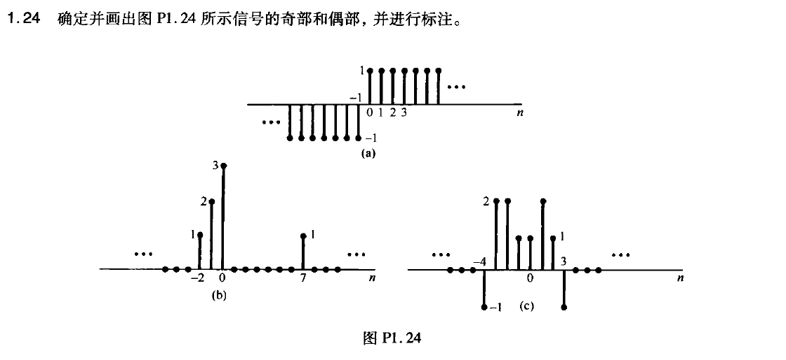

**题目文本：**

1.24 确定并画出图 P1.24 所示信号的奇部和偶部，并进行标注。

图 P1.24 包含三个离散时间信号：

- **(a)** 信号在 $n < 0$ 时值为 $-1$，在 $n \geq 0$ 时值为 $1$（即 $x[n] = \text{sgn}(n)$ 类型，$n=0$ 处值为 $1$）
- **(b)** 信号在 $n = -2$ 处值为 $1$，$n = 0$ 处值为 $2$，$n = 7$ 处值为 $1$，其余为零
- **(c)** 信号在 $n = -4$ 处值为 $-1$，$n = -3$ 处值为 $2$，$n = -2$ 处值为 $2$，$n = -1$ 处值为 $1$，$n = 0$ 处值为 $1$，$n = 3$ 处值为 $1$，其余为零

> **注意：** 本图包含 (a)(b)(c) 三个子题的波形图，作业只需完成 (b)。

---

### 1.26

需完成：c（注：作业来源标注为 1.26(c)，但图片中 (c) 为 $x[n]=\cos(\frac{\pi}{8}n^2)$；第2讲作业来源标注为 1.26(e)）

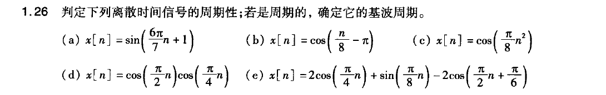

**题目文本：**

1.26 判定下列离散时间信号的周期性；若是周期的，确定它的基波周期。

- (a) $x[n] = \sin\!\left(\dfrac{6\pi}{7}n + 1\right)$
- (b) $x[n] = \cos\!\left(\dfrac{n}{8} - \pi\right)$
- (c) $x[n] = \cos\!\left(\dfrac{\pi}{8}n^2\right)$
- (d) $x[n] = \cos\!\left(\dfrac{\pi}{2}n\right)\cos\!\left(\dfrac{\pi}{4}n\right)$
- (e) $x[n] = 2\cos\!\left(\dfrac{\pi}{4}n\right) + \sin\!\left(\dfrac{\pi}{8}n\right) - 2\cos\!\left(\dfrac{\pi}{2}n + \dfrac{\pi}{6}\right)$

> **注意：** 本图包含 (a)~(e) 五个子题，第1讲作业需完成 (c)，第2讲作业需完成 (e)。

---

## 第 2 讲 [缺交]

作业来源：`1.25(b) 1.26(e)`

### 1.25

需完成：b

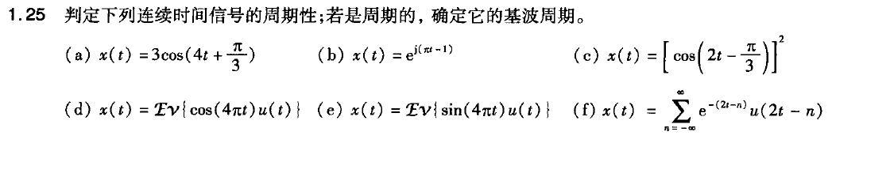

**题目文本：**

1.25 判定下列连续时间信号的周期性；若是周期的，确定它的基波周期。

- (a) $x(t) = 3\cos\!\left(4t + \dfrac{\pi}{3}\right)$
- (b) $x(t) = e^{j(\pi t - 1)}$
- (c) $x(t) = \left[\cos\!\left(2t - \dfrac{\pi}{3}\right)\right]^2$
- (d) $x(t) = \mathcal{Ev}\{\cos(4\pi t)\,u(t)\}$
- (e) $x(t) = \mathcal{Ev}\{\sin(4\pi t)\,u(t)\}$
- (f) $x(t) = \displaystyle\sum_{n=-\infty}^{\infty} e^{-(2t-n)}\,u(2t - n)$

> **注意：** 本图包含 (a)~(f) 六个子题，作业只需完成 (b)。

---

### 1.26

需完成：e

**题目文本：**

（同第1讲 1.26 题，见上方。需完成子题 (e)：$x[n] = 2\cos\!\left(\dfrac{\pi}{4}n\right) + \sin\!\left(\dfrac{\pi}{8}n\right) - 2\cos\!\left(\dfrac{\pi}{2}n + \dfrac{\pi}{6}\right)$）

---

## 第 3 讲 [缺交]

作业来源：`1.21(f) 1.22(e) 1.46`

### 1.21

需完成：f

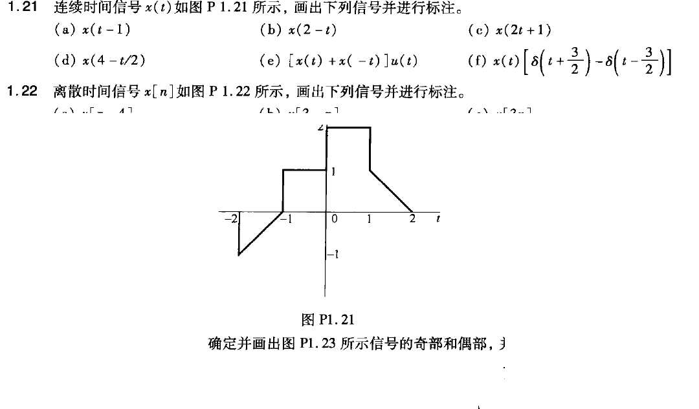

**题目文本：**

1.21 连续时间信号 $x(t)$ 如图 P1.21 所示，画出下列信号并进行标注。

- (a) $x(t-1)$
- (b) $x(2-t)$
- (c) $x(2t+1)$
- (d) $x(4-t/2)$
- (e) $[x(t)+x(-t)]\,u(t)$
- (f) $x(t)\left[\delta\!\left(t+\dfrac{3}{2}\right) - \delta\!\left(t-\dfrac{3}{2}\right)\right]$

图 P1.21 所示信号 $x(t)$ 为：

$$
x(t) = \begin{cases}
-1, & -2 < t < -1 \\
t+1, & -1 \leq t < 0 \quad (\text{从 } -1 \text{ 线性上升到 } 0 \text{ 处值为 } 1)\\
\text{（图中显示：} t \in [-2,-1] \text{ 从 } 0 \text{ 下降到 } -1\text{；} t \in [-1,0] \text{ 从 } -1 \text{ 上升到 } 1\text{；} t \in [0,1] \text{ 保持 } 1\text{；} t \in [1,2] \text{ 从 } 1 \text{ 下降到 } 0\text{）}
\end{cases}
$$

更准确地描述图 P1.21：$x(t)$ 在 $t=-2$ 处为 $0$，线性下降到 $t=-1$ 处为 $-1$，然后线性上升到 $t=0$ 处为 $1$，在 $t \in [0,1]$ 保持为 $1$（实际图中 $t=0$ 到 $t=1$ 之间有一段平台值为 $1$，但图中显示 $t=0$ 处跳变到 $2$ 然后保持到 $t=1$ 再下降到 $t=2$ 处为 $0$）。

> **注意：** 图 P1.21 的精确描述——信号从 $t=-2$ 处值 $0$ 线性下降到 $t=-1$ 处值 $-1$，再线性上升到 $t=0$ 处值 $1$，在 $t=0$ 处跳变到值 $2$，保持到 $t=1$，然后线性下降到 $t=2$ 处值 $0$。作业只需完成子题 (f)。

---

### 1.22

需完成：e

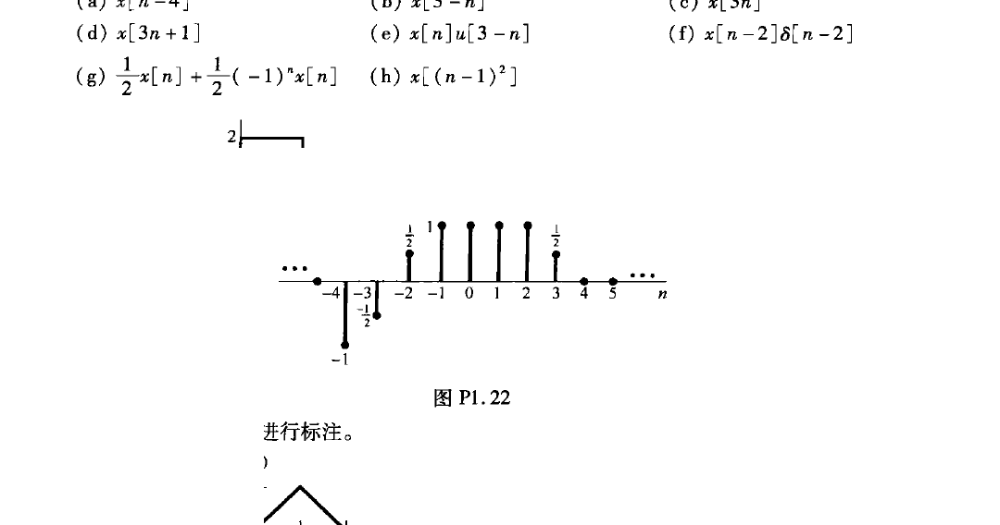

**题目文本：**

1.22 离散时间信号 $x[n]$ 如图 P1.22 所示，画出下列信号并进行标注。

- (a) $x[n-4]$
- (b) $x[3-n]$
- (c) $x[3n]$
- (d) $x[3n+1]$
- (e) $x[n]\,u[3-n]$
- (f) $x[n-2]\,\delta[n-2]$
- (g) $\dfrac{1}{2}x[n] + \dfrac{1}{2}(-1)^n x[n]$
- (h) $x[(n-1)^2]$

图 P1.22 所示信号 $x[n]$ 为：

$$
x[n] = \begin{cases}
\frac{1}{2}, & n = -2 \\
-\frac{1}{2}, & n = -3 \\
-1, & n = -4 \\
1, & n = -1, 0, 1, 2 \\
\frac{1}{2}, & n = 3 \\
0, & \text{其他}
\end{cases}
$$

> **注意：** 本图包含 (a)~(h) 八个子题，作业只需完成 (e)。

---

### 1.46

需完成：整题

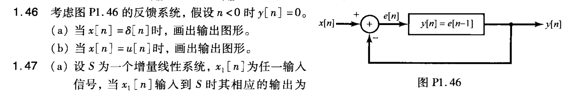

**题目文本：**

1.46 考虑图 P1.46 的反馈系统，假设 $n < 0$ 时 $y[n] = 0$。

- (a) 当 $x[n] = \delta[n]$ 时，画出输出图形。
- (b) 当 $x[n] = u[n]$ 时，画出输出图形。

图 P1.46 所示反馈系统：输入 $x[n]$ 进入加法器（+），加法器输出为 $e[n]$，$e[n]$ 经过延迟单元 $y[n] = e[n-1]$ 得到输出 $y[n]$，$y[n]$ 反馈回加法器取负号。即：

$$e[n] = x[n] - y[n], \quad y[n] = e[n-1]$$

联立得：$y[n] = x[n-1] - y[n-1]$。

---

## 第 4 讲 [缺交]

作业来源：`1.27(b) 1.28(b)`

### 1.27

需完成：b

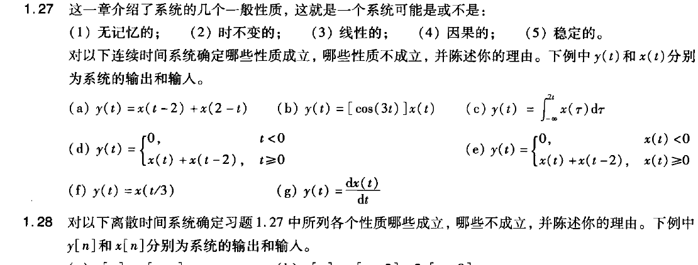

**题目文本：**

1.27 这一章介绍了系统的几个一般性质，这就是一个系统可能是或不是：

（1）无记忆的；（2）时不变的；（3）线性的；（4）因果的；（5）稳定的。

对以下连续时间系统确定哪些性质成立，哪些性质不成立，并陈述你的理由。下例中 $y(t)$ 和 $x(t)$ 分别为系统的输出和输入。

- (a) $y(t) = x(t-2) + x(2-t)$
- (b) $y(t) = [\cos(3t)]\,x(t)$
- (c) $y(t) = \displaystyle\int_{-\infty}^{2t} x(\tau)\,d\tau$
- (d) $y(t) = \begin{cases} 0, & t < 0 \\ x(t) + x(t-2), & t \geq 0 \end{cases}$
- (e) $y(t) = \begin{cases} 0, & x(t) < 0 \\ x(t) + x(t-2), & x(t) \geq 0 \end{cases}$
- (f) $y(t) = x(t/3)$
- (g) $y(t) = \dfrac{dx(t)}{dt}$

> **注意：** 本图包含 (a)~(g) 七个子题以及 1.28 题的开头，作业只需完成 (b)。

---

### 1.28

需完成：b

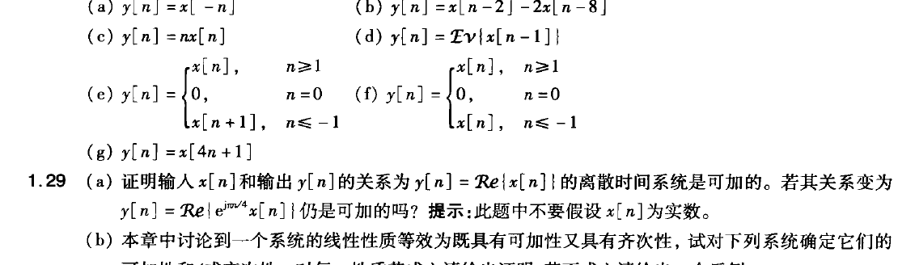

**题目文本：**

1.28 对以下离散时间系统确定习题 1.27 中所列各个性质哪些成立，哪些不成立，并陈述你的理由。下例中 $y[n]$ 和 $x[n]$ 分别为系统的输出和输入。

- (a) $y[n] = x[-n]$
- (b) $y[n] = x[n-2] - 2x[n-8]$
- (c) $y[n] = nx[n]$
- (d) $y[n] = \mathcal{Ev}\{x[n-1]\}$
- (e) $y[n] = \begin{cases} x[n], & n \geq 1 \\ 0, & n = 0 \\ x[n+1], & n \leq -1 \end{cases}$
- (f) $y[n] = \begin{cases} x[n], & n \geq 1 \\ 0, & n = 0 \\ x[n], & n \leq -1 \end{cases}$
- (g) $y[n] = x[4n+1]$

> **注意：** 本图包含 (a)~(g) 七个子题以及 1.29 题的开头，作业只需完成 (b)。

---

## 第 5 讲 [缺交]

作业来源：`2.21(a) 2.22(c) 2.47(b,d,f)`

### 2.21

需完成：a

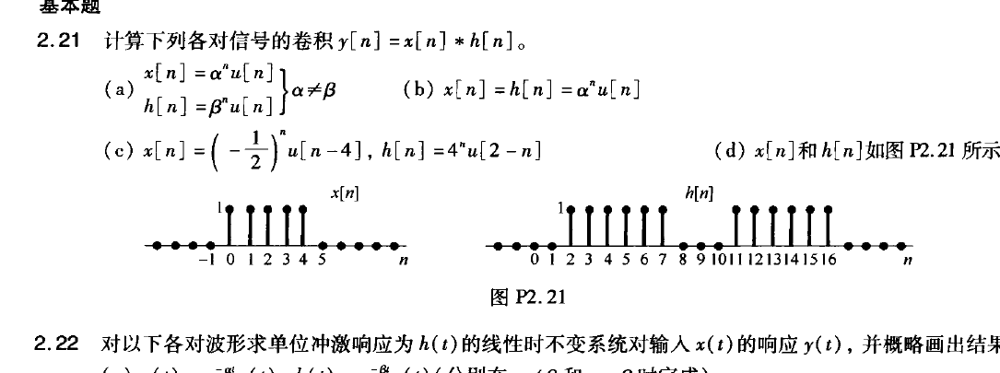

**题目文本：**

2.21 计算下列各对信号的卷积 $y[n] = x[n] * h[n]$。

- (a) $\left.\begin{array}{l} x[n] = \alpha^n u[n] \\ h[n] = \beta^n u[n] \end{array}\right\} \alpha \neq \beta$
- (b) $x[n] = h[n] = \alpha^n u[n]$
- (c) $x[n] = \left(-\dfrac{1}{2}\right)^n u[n-4]$，$h[n] = 4^n u[2-n]$
- (d) $x[n]$ 和 $h[n]$ 如图 P2.21 所示

图 P2.21：$x[n]$ 在 $n=0,1,2,3,4$ 处值为 $1$，其余为零；$h[n]$ 在 $n=2,3,4,5,6,7$ 处值为 $1$，在 $n=10,11,12,13,14,15,16$ 处值为 $1$，其余为零。

> **注意：** 本图包含 (a)~(d) 四个子题，作业只需完成 (a)。

---

### 2.22

需完成：c

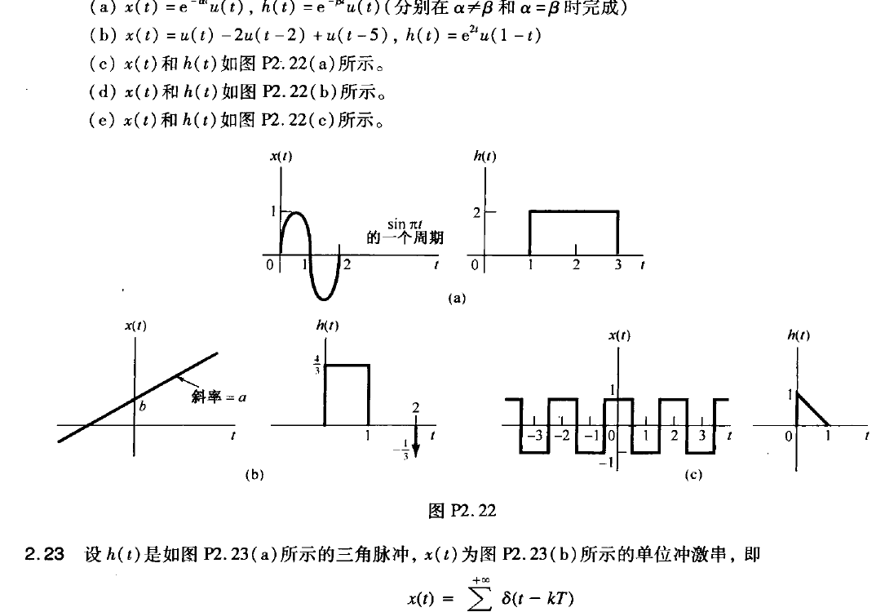

**题目文本：**

2.22 对以下各对波形求单位冲激响应为 $h(t)$ 的线性时不变系统对输入 $x(t)$ 的响应 $y(t)$，并概略画出结果。

- (a) $x(t) = e^{-\alpha t}u(t)$，$h(t) = e^{-\beta t}u(t)$（分别在 $\alpha \neq \beta$ 和 $\alpha = \beta$ 时完成）
- (b) $x(t) = u(t) - 2u(t-2) + u(t-5)$，$h(t) = e^{2t}u(1-t)$
- (c) $x(t)$ 和 $h(t)$ 如图 P2.22(a) 所示。
- (d) $x(t)$ 和 $h(t)$ 如图 P2.22(b) 所示。
- (e) $x(t)$ 和 $h(t)$ 如图 P2.22(c) 所示。

图 P2.22(a)：$x(t) = \sin(\pi t)$ 的一个周期（$0 \leq t \leq 2$），$h(t)$ 为从 $t=1$ 到 $t=3$ 高度为 $2$ 的矩形脉冲。

图 P2.22(b)：$x(t)$ 为斜率为 $a$、截距为 $b$ 的直线，$h(t)$ 为从 $t=0$ 到 $t=1$ 高度为 $\frac{4}{3}$ 的矩形脉冲（在 $t=2$ 处有值为 $-\frac{1}{3}$ 的冲激）。

图 P2.22(c)：$x(t)$ 为周期方波（在 $[-1,0]$ 值为 $1$，在 $[0,1]$ 值为 $-1$，周期为 $2$），$h(t)$ 为从 $t=0$ 到 $t=1$ 高度为 $1$ 的三角脉冲（从 $(0,1)$ 线性下降到 $(1,0)$）。

> **注意：** 本图包含 (a)~(e) 五个子题以及 2.23 题的开头，作业只需完成 (c)。

---

### 2.47

需完成：b, d, f

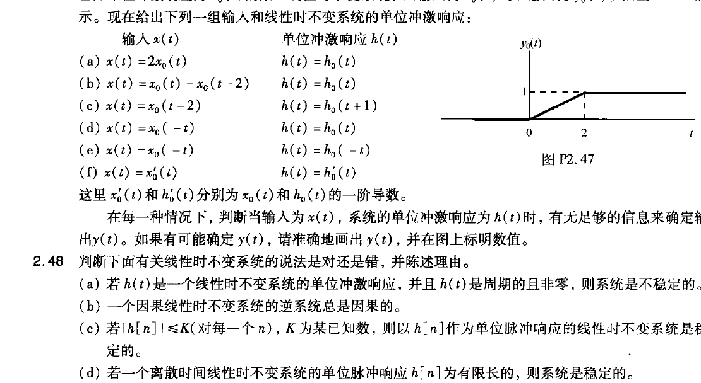

**题目文本：**

2.47 现给出一组输入和线性时不变系统的单位冲激响应：

| 输入 $x(t)$ | 单位冲激响应 $h(t)$ |
|---|---|
| (a) $x(t) = 2x_0(t)$ | $h(t) = h_0(t)$ |
| (b) $x(t) = x_0(t) - x_0(t-2)$ | $h(t) = h_0(t)$ |
| (c) $x(t) = x_0(t-2)$ | $h(t) = h_0(t+1)$ |
| (d) $x(t) = x_0(-t)$ | $h(t) = h_0(t)$ |
| (e) $x(t) = x_0(-t)$ | $h(t) = h_0(-t)$ |
| (f) $x(t) = x_0'(t)$ | $h(t) = h_0'(t)$ |

这里 $x_0'(t)$ 和 $h_0'(t)$ 分别为 $x_0(t)$ 和 $h_0(t)$ 的一阶导数。

图 P2.47：$y_0(t)$ 为从 $t=0$ 到 $t=2$ 线性上升到 $1$，之后保持为 $1$ 的信号（即 $y_0(t) = \frac{t}{2}$ for $0 \leq t \leq 2$，$y_0(t) = 1$ for $t > 2$，$y_0(t) = 0$ for $t < 0$）。

在每一种情况下，判断当输入为 $x(t)$，系统的单位冲激响应为 $h(t)$ 时，有无足够的信息来确定输出 $y(t)$。如果有可能确定 $y(t)$，请准确地画出 $y(t)$，并在图上标明数值。

> **注意：** 本图包含 (a)~(f) 六个子题以及 2.48 题的开头，作业需完成 (b)(d)(f)。

---

## 第 6 讲 [缺交]

作业来源：`2.28(c) 2.29(g) 2.33(a)(i, ii, iii) (b) (i, ii)`

### 2.28

需完成：c

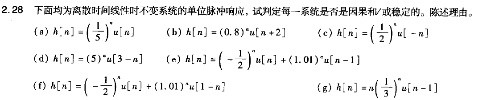

**题目文本：**

2.28 下面均为离散时间线性时不变系统的单位脉冲响应，试判定每一系统是否是因果和/或稳定的。陈述理由。

- (a) $h[n] = \left(\dfrac{1}{5}\right)^n u[n]$
- (b) $h[n] = (0.8)^n u[n+2]$
- (c) $h[n] = \left(\dfrac{1}{2}\right)^n u[-n]$
- (d) $h[n] = (5)^n u[3-n]$
- (e) $h[n] = \left(-\dfrac{1}{2}\right)^n u[n] + (1.01)^n u[n-1]$
- (f) $h[n] = \left(-\dfrac{1}{2}\right)^n u[n] + (1.01)^n u[1-n]$
- (g) $h[n] = n\left(\dfrac{1}{3}\right)^n u[n-1]$

> **注意：** 本图包含 (a)~(g) 七个子题，作业只需完成 (c)。

---

### 2.29

需完成：g

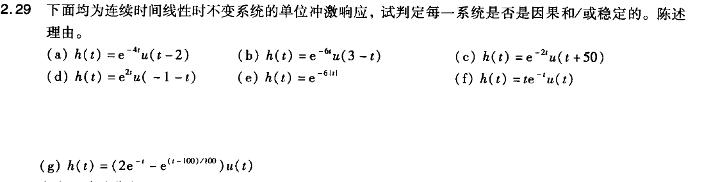

**题目文本：**

2.29 下面均为连续时间线性时不变系统的单位冲激响应，试判定每一系统是否是因果和/或稳定的。陈述理由。

- (a) $h(t) = e^{-4t}u(t-2)$
- (b) $h(t) = e^{-6t}u(3-t)$
- (c) $h(t) = e^{-2t}u(t+50)$
- (d) $h(t) = e^{2t}u(-1-t)$
- (e) $h(t) = e^{-6|t|}$
- (f) $h(t) = t e^{-t}u(t)$
- (g) $h(t) = \left(2e^{-t} - e^{(t-100)/100}\right)u(t)$

> **注意：** 本图包含 (a)~(g) 七个子题，作业只需完成 (g)。

---

### 2.33

需完成：a(i, ii, iii); b(i, ii)

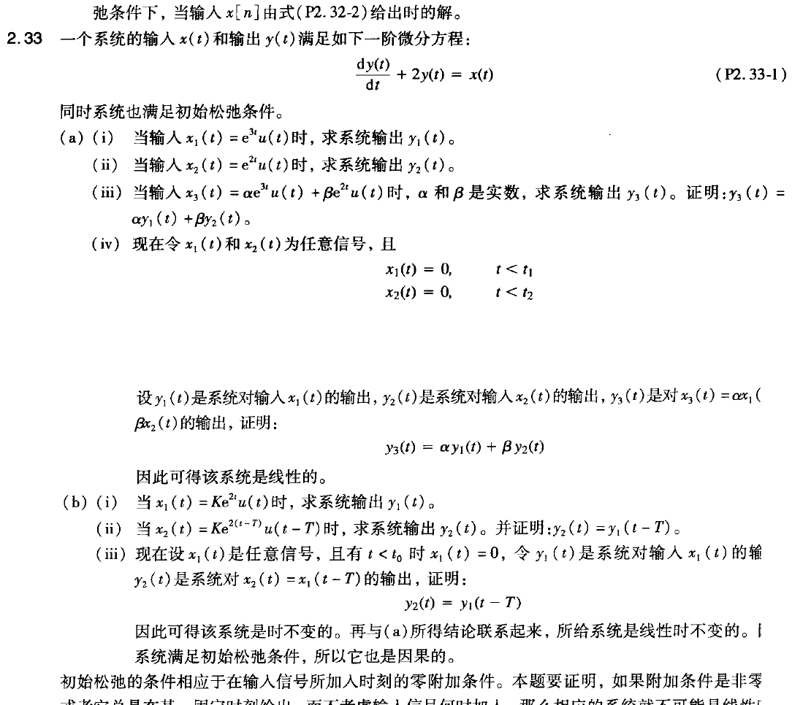

**题目文本：**

2.33 一个系统的输入 $x(t)$ 和输出 $y(t)$ 满足如下一阶微分方程：

$$\frac{dy(t)}{dt} + 2y(t) = x(t) \qquad \text{(P2.33-1)}$$

同时系统也满足初始松弛条件。

**(a)**

- (i) 当输入 $x_1(t) = e^{3t}u(t)$ 时，求系统输出 $y_1(t)$。
- (ii) 当输入 $x_2(t) = e^{2t}u(t)$ 时，求系统输出 $y_2(t)$。
- (iii) 当输入 $x_3(t) = \alpha e^{3t}u(t) + \beta e^{2t}u(t)$ 时，$\alpha$ 和 $\beta$ 是实数，求系统输出 $y_3(t)$。证明：$y_3(t) = \alpha y_1(t) + \beta y_2(t)$。
- (iv) 现在令 $x_1(t)$ 和 $x_2(t)$ 为任意信号，且 $x_1(t) = 0,\ t < t_1$；$x_2(t) = 0,\ t < t_2$。设 $y_1(t)$ 是系统对输入 $x_1(t)$ 的输出，$y_2(t)$ 是系统对输入 $x_2(t)$ 的输出，$y_3(t)$ 是对 $x_3(t) = \alpha x_1(t) + \beta x_2(t)$ 的输出，证明：$y_3(t) = \alpha y_1(t) + \beta y_2(t)$。因此可得该系统是线性的。

**(b)**

- (i) 当 $x_1(t) = K e^{2t}u(t)$ 时，求系统输出 $y_1(t)$。
- (ii) 当 $x_2(t) = K e^{2(t-T)}u(t-T)$ 时，求系统输出 $y_2(t)$。并证明：$y_2(t) = y_1(t-T)$。
- (iii) 现在设 $x_1(t)$ 是任意信号，且有 $t < t_0$ 时 $x_1(t) = 0$，令 $y_1(t)$ 是系统对输入 $x_1(t)$ 的输出，$y_2(t)$ 是系统对 $x_2(t) = x_1(t-T)$ 的输出，证明：$y_2(t) = y_1(t-T)$。因此可得该系统是时不变的。再与 (a) 所得结论联系起来，所给系统是线性时不变的。系统满足初始松弛条件，所以它也是因果的。

> **注意：** 本图包含 (a)(i)~(iv) 和 (b)(i)~(iii)，作业需完成 (a)(i)(ii)(iii) 和 (b)(i)(ii)。

---

## 第 7 讲 [缺交]

作业来源：`2.39(b) 2.20`

### 2.39

需完成：b

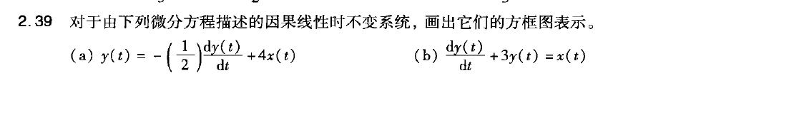

**题目文本：**

2.39 对于由下列微分方程描述的因果线性时不变系统，画出它们的方框图表示。

- (a) $y(t) = -\left(\dfrac{1}{2}\right)\dfrac{dy(t)}{dt} + 4x(t)$
- (b) $\dfrac{dy(t)}{dt} + 3y(t) = x(t)$

> **注意：** 本图包含 (a)(b) 两个子题，作业只需完成 (b)。

---

### 2.20

需完成：整题

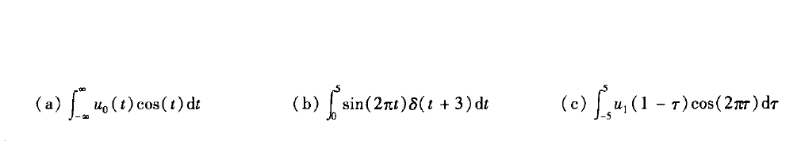

**题目文本：**

2.20 计算下列积分：

- (a) $\displaystyle\int_{-\infty}^{\infty} u_0(t)\cos(t)\,dt$
- (b) $\displaystyle\int_{0}^{5} \sin(2\pi t)\,\delta(t+3)\,dt$
- (c) $\displaystyle\int_{-5}^{5} u_1(1-\tau)\cos(2\pi\tau)\,d\tau$

其中 $u_0(t)$ 为单位冲激函数 $\delta(t)$，$u_1(t)$ 为单位冲激偶（$\delta(t)$ 的一阶导数）。

---

## 第 8 讲 [缺交]

作业来源：`3.21 3.23(c) 3.22(b) 3.28(c)`

### 3.21

需完成：整题

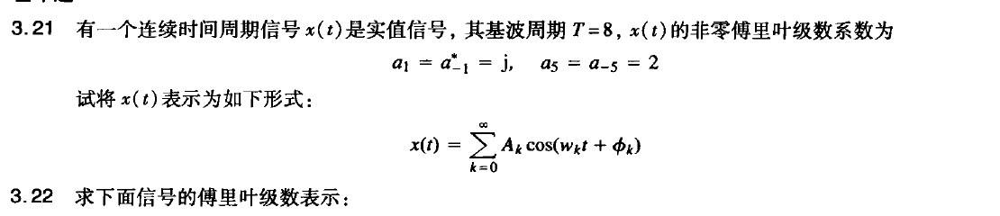

**题目文本：**

3.21 有一个连续时间周期信号 $x(t)$ 是实值信号，其基波周期 $T = 8$，$x(t)$ 的非零傅里叶级数系数为

$$a_1 = a_{-1}^* = j, \quad a_5 = a_{-5} = 2$$

试将 $x(t)$ 表示为如下形式：

$$x(t) = \sum_{k=0}^{\infty} A_k \cos(\omega_k t + \phi_k)$$

---

### 3.23

需完成：c

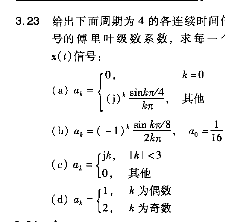

**题目文本：**

3.23 给出下面周期为 4 的各连续时间信号的傅里叶级数系数，求每一个 $x(t)$ 信号：

- (a) $a_k = \begin{cases} 0, & k = 0 \\ (j)^k \dfrac{\sin(k\pi/4)}{k\pi}, & \text{其他} \end{cases}$
- (b) $a_k = (-1)^k \dfrac{\sin(k\pi/8)}{2k\pi}$，$a_0 = \dfrac{1}{16}$
- (c) $a_k = \begin{cases} jk, & |k| < 3 \\ 0, & \text{其他} \end{cases}$
- (d) $a_k = \begin{cases} 1, & k \text{ 为偶数} \\ 2, & k \text{ 为奇数} \end{cases}$

> **注意：** 本图包含 (a)~(d) 四个子题，作业只需完成 (c)。

---

### 3.22

需完成：b

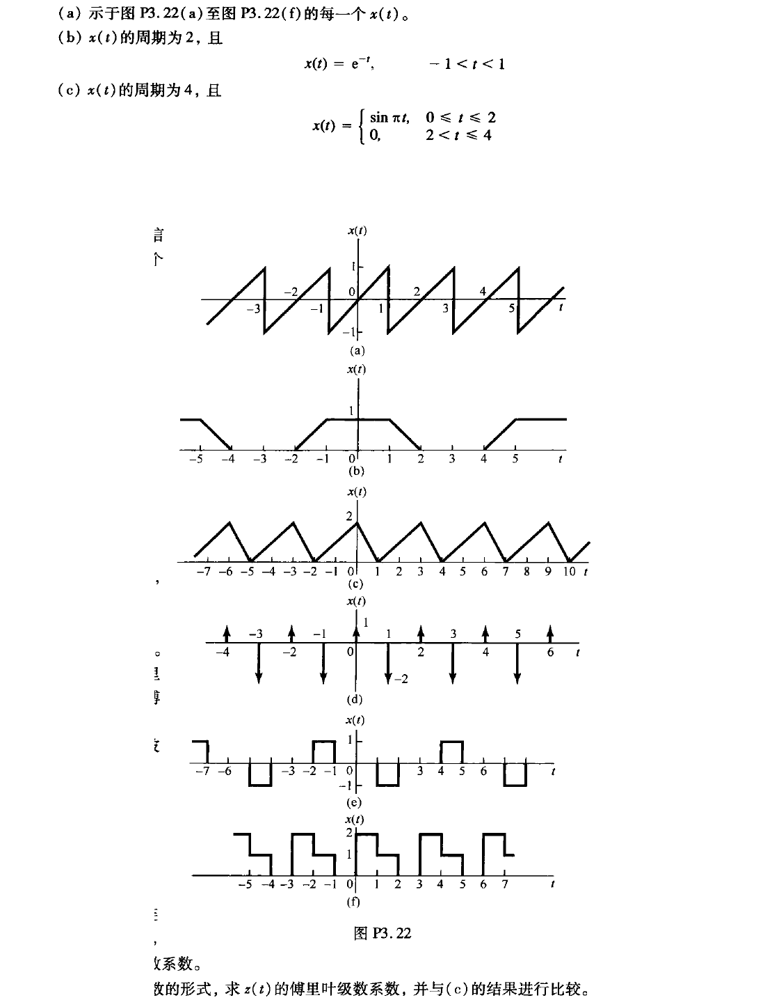

**题目文本：**

3.22 求下面信号的傅里叶级数表示：

- (a) 示于图 P3.22(a) 至图 P3.22(f) 的每一个 $x(t)$。
- (b) $x(t)$ 的周期为 2，且 $x(t) = e^{-t}$，$-1 < t < 1$
- (c) $x(t)$ 的周期为 4，且 $x(t) = \begin{cases} \sin\pi t, & 0 \leq t \leq 2 \\ 0, & 2 < t \leq 4 \end{cases}$

图 P3.22 包含六个信号波形 (a)~(f)：
- (a) 周期三角波，周期为 2，在 $[-1,0]$ 从 $-1$ 线性上升到 $1$，在 $[0,1]$ 从 $1$ 线性下降到 $-1$
- (b) 周期梯形波，周期为 4
- (c) 周期三角波，周期为 2，峰值为 2
- (d) 周期冲激串，周期为 2，在偶数点有向上的冲激（强度 1），在奇数点有向下的冲激（强度 -2）
- (e) 周期方波，周期为 4
- (f) 周期阶梯波，周期为 4

> **注意：** 本图包含 (a)(b)(c) 三个子题及图 P3.22 的六个波形，作业只需完成 (b)。

---

### 3.28

需完成：c

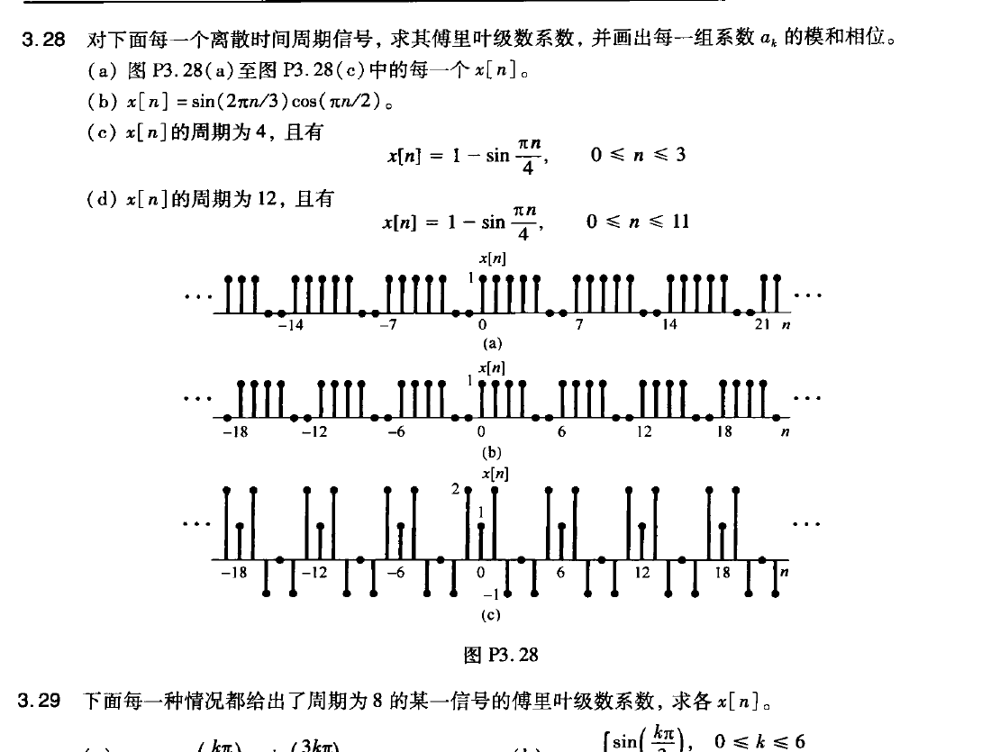

**题目文本：**

3.28 对下面每一个离散时间周期信号，求其傅里叶级数系数，并画出每一组系数 $a_k$ 的模和相位。

- (a) 图 P3.28(a) 至图 P3.28(c) 中的每一个 $x[n]$。
- (b) $x[n] = \sin(2\pi n/3)\cos(\pi n/2)$。
- (c) $x[n]$ 的周期为 4，且有 $x[n] = 1 - \sin\dfrac{\pi n}{4}$，$0 \leq n \leq 3$
- (d) $x[n]$ 的周期为 12，且有 $x[n] = 1 - \sin\dfrac{\pi n}{4}$，$0 \leq n \leq 11$

图 P3.28 包含三个离散时间周期信号波形 (a)(b)(c)。

> **注意：** 本图包含 (a)~(d) 四个子题以及 3.29 题的开头，作业只需完成 (c)。

---

## 第 9 讲

作业来源：`3.28(c) 3.34(c, 方波高度=1) 3.35`

### 3.28

需完成：c

**题目文本：**

（同第8讲 3.28 题，见上方。需完成子题 (c)：$x[n]$ 的周期为 4，且有 $x[n] = 1 - \sin\dfrac{\pi n}{4}$，$0 \leq n \leq 3$）

---

### 3.34

需完成：c, 方波高度=1

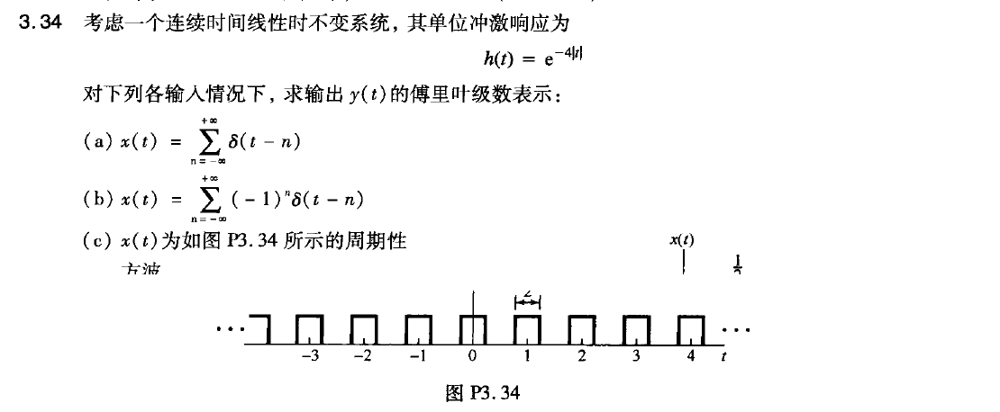

**题目文本：**

3.34 考虑一个连续时间线性时不变系统，其单位冲激响应为

$$h(t) = e^{-4|t|}$$

对下列各输入情况下，求输出 $y(t)$ 的傅里叶级数表示：

- (a) $x(t) = \displaystyle\sum_{n=-\infty}^{+\infty} \delta(t-n)$
- (b) $x(t) = \displaystyle\sum_{n=-\infty}^{+\infty} (-1)^n \delta(t-n)$
- (c) $x(t)$ 为如图 P3.34 所示的周期性方波

图 P3.34：周期性方波，周期为 1，在每个周期 $[n, n+1)$ 内，从 $t=n$ 到 $t=n+\frac{1}{4}$ 为高电平（方波高度=1，按作业要求），其余为低电平 0。图中显示方波宽度为 $\frac{1}{4}$，周期为 1。

> **注意：** 本图包含 (a)(b)(c) 三个子题，作业只需完成 (c)，且方波高度改为 1。

---

### 3.35

需完成：整题

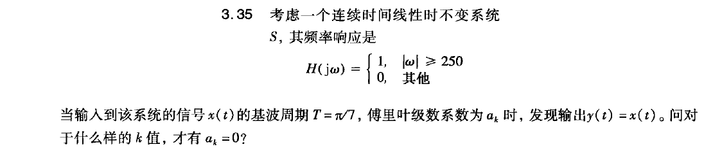

**题目文本：**

3.35 考虑一个连续时间线性时不变系统 $S$，其频率响应是

$$H(j\omega) = \begin{cases} 1, & |\omega| \geq 250 \\ 0, & \text{其他} \end{cases}$$

当输入到该系统的信号 $x(t)$ 的基波周期 $T = \pi/7$，傅里叶级数系数为 $a_k$ 时，发现输出 $y(t) = x(t)$。问对于什么样的 $k$ 值，才有 $a_k = 0$？

---

## 第 10 讲 [缺交]

作业来源：`4.21(g) 4.22(c, d)`

### 4.21

需完成：g

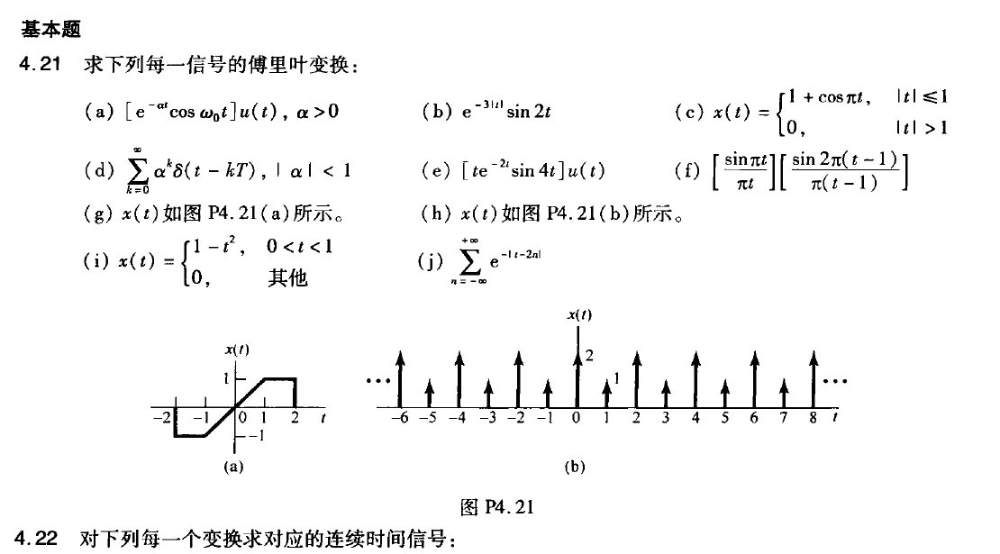

**题目文本：**

4.21 求下列每一信号的傅里叶变换：

- (a) $[e^{-\alpha t}\cos\omega_0 t]\,u(t)$，$\alpha > 0$
- (b) $e^{-3|t|}\sin 2t$
- (c) $x(t) = \begin{cases} 1 + \cos\pi t, & |t| \leq 1 \\ 0, & |t| > 1 \end{cases}$
- (d) $\displaystyle\sum_{k=0}^{\infty} \alpha^k \delta(t-kT)$，$|\alpha| < 1$
- (e) $[t e^{-2t}\sin 4t]\,u(t)$
- (f) $\left[\dfrac{\sin\pi t}{\pi t}\right]\left[\dfrac{\sin 2\pi(t-1)}{\pi(t-1)}\right]$
- (g) $x(t)$ 如图 P4.21(a) 所示。
- (h) $x(t)$ 如图 P4.21(b) 所示。
- (i) $x(t) = \begin{cases} 1-t^2, & 0 < t < 1 \\ 0, & \text{其他} \end{cases}$
- (j) $\displaystyle\sum_{n=-\infty}^{+\infty} e^{-|t-2n|}$

图 P4.21(a)：$x(t)$ 在 $t \in [-2,-1]$ 值为 $-1$，在 $t \in [-1,0]$ 从 $-1$ 线性上升到 $0$，在 $t \in [0,1]$ 从 $0$ 线性上升到 $1$，在 $t \in [1,2]$ 保持为 $1$，其余为零。

图 P4.21(b)：$x(t)$ 为离散冲激串，在 $n=0$ 处强度为 $2$，在 $n=\pm 1, \pm 2, \pm 3, \ldots$ 处强度为 $1$（即 $x(t) = 2\delta(t) + \sum_{n \neq 0} \delta(t-n)$，但图中显示的是非均匀间隔的冲激）。

> **注意：** 本图包含 (a)~(j) 十个子题以及 4.22 题的开头，第10讲作业只需完成 (g)，第11讲作业需完成 (h)。

---

### 4.22

需完成：c, d

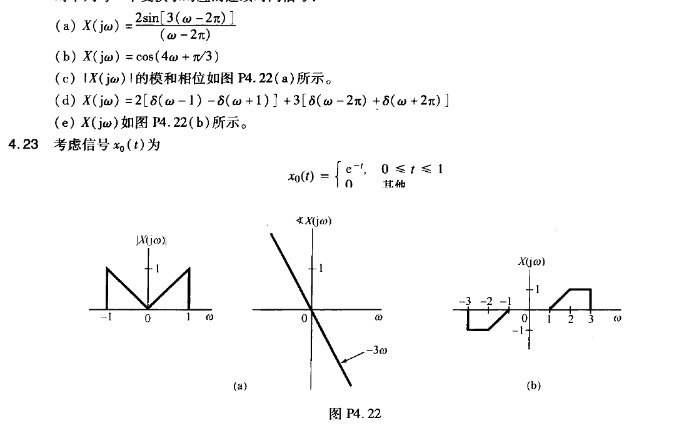

**题目文本：**

4.22 对下列每一个变换求对应的连续时间信号：

- (a) $X(j\omega) = \dfrac{2\sin[3(\omega-2\pi)]}{(\omega-2\pi)}$
- (b) $X(j\omega) = \cos(4\omega + \pi/3)$
- (c) $|X(j\omega)|$ 的模和相位如图 P4.22(a) 所示。
- (d) $X(j\omega) = 2[\delta(\omega-1) - \delta(\omega+1)] + 3[\delta(\omega-2\pi) + \delta(\omega+2\pi)]$
- (e) $X(j\omega)$ 如图 P4.22(b) 所示。

图 P4.22(a)：$|X(j\omega)|$ 为三角波形，在 $\omega \in [-1,0]$ 从 $0$ 线性上升到 $1$，在 $\omega \in [0,1]$ 从 $1$ 线性下降到 $0$；$\angle X(j\omega) = -3\omega$。

图 P4.22(b)：$X(j\omega)$ 在 $\omega \in [-3,-2]$ 值为 $-1$，在 $\omega \in [-2,-1]$ 从 $-1$ 线性上升到 $0$，在 $\omega \in [1,2]$ 从 $0$ 线性上升到 $1$，在 $\omega \in [2,3]$ 保持为 $1$，其余为零。

> **注意：** 本图包含 (a)~(e) 五个子题以及 4.23 题的开头，第10讲作业需完成 (c)(d)，第12讲作业需完成 (a)。

---

## 第 11 讲 [缺交]

作业来源：`4.21(h) 4.25(a,b,c,d,f) 4.35`

### 4.21

需完成：h

**题目文本：**

（同第10讲 4.21 题，见上方。需完成子题 (h)：$x(t)$ 如图 P4.21(b) 所示。）

图 P4.21(b)：$x(t)$ 为冲激串信号，在 $t=0$ 处强度为 $2$，在 $t=\pm 1, \pm 2, \pm 3, \ldots$ 处强度为 $1$。更准确地说，图中显示在 $t = 0, \pm 2, \pm 4, \pm 6, \pm 8$ 处有较大的冲激（强度 2 在 $t=0$，强度 1 在其他偶数点），在 $t = \pm 1, \pm 3, \pm 5, \pm 7$ 处有较小的冲激（强度 1）。

> **待确认：** 图 P4.21(b) 的冲激间隔和强度需要仔细确认。从图中看，冲激出现在整数点 $t = -6,-5,-4,-3,-2,-1,0,1,2,3,4,5,6,7,8$，其中 $t=0$ 处强度为 2，$t=1$ 处强度为 1，其余位置强度为 1。

---

### 4.25

需完成：a, b, c, d, f

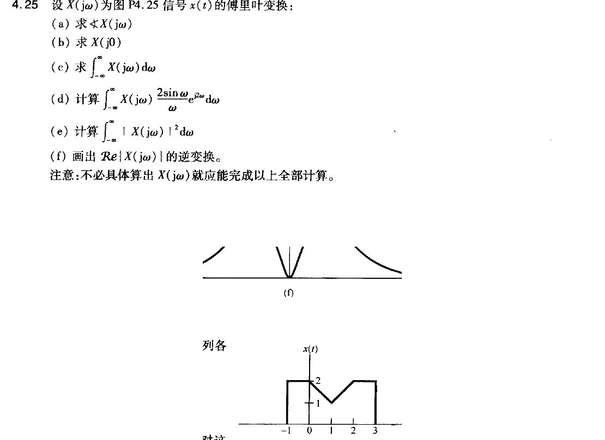

**题目文本：**

4.25 设 $X(j\omega)$ 为图 P4.25 信号 $x(t)$ 的傅里叶变换：

- (a) 求 $\angle X(j\omega)$
- (b) 求 $X(j0)$
- (c) 求 $\displaystyle\int_{-\infty}^{\infty} X(j\omega)\,d\omega$
- (d) 计算 $\displaystyle\int_{-\infty}^{\infty} X(j\omega)\,\frac{2\sin\omega}{\omega}\,e^{j2\omega}\,d\omega$
- (e) 计算 $\displaystyle\int_{-\infty}^{\infty} |X(j\omega)|^2\,d\omega$
- (f) 画出 $\mathcal{Re}\{X(j\omega)\}$ 的逆变换。

注意：不必具体算出 $X(j\omega)$ 就应能完成以上全部计算。

图 P4.25：$x(t)$ 在 $t \in [-1,0]$ 值为 $2$，在 $t \in [0,1]$ 从 $2$ 线性下降到 $1$，在 $t \in [1,2]$ 从 $1$ 线性上升到 $2$，在 $t \in [2,3]$ 保持为 $2$，其余为零。

> **注意：** 本图包含 (a)~(f) 六个子题，作业需完成 (a)(b)(c)(d)(f)，不需要完成 (e)。

---

### 4.35

需完成：整题

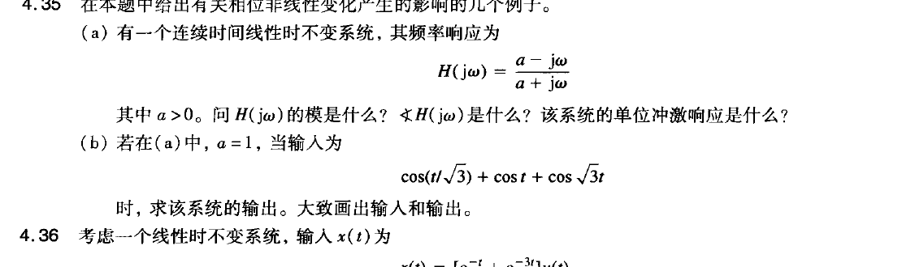

**题目文本：**

4.35 在本题中给出有关相位非线性变化产生的影响的几个例子。

- (a) 有一个连续时间线性时不变系统，其频率响应为

$$H(j\omega) = \frac{a - j\omega}{a + j\omega}$$

其中 $a > 0$。问 $H(j\omega)$ 的模是什么？$\angle H(j\omega)$ 是什么？该系统的单位冲激响应是什么？

- (b) 若在 (a) 中，$a = 1$，当输入为

$$\cos(t/\sqrt{3}) + \cos t + \cos\sqrt{3}t$$

时，求该系统的输出。大致画出输入和输出。

---

## 第 12 讲 [缺交]

作业来源：`4.22(a) 4.28(a) 4.36`

### 4.22

需完成：a

**题目文本：**

（同第10讲 4.22 题，见上方。需完成子题 (a)：$X(j\omega) = \dfrac{2\sin[3(\omega-2\pi)]}{(\omega-2\pi)}$）

---

### 4.28

需完成：a

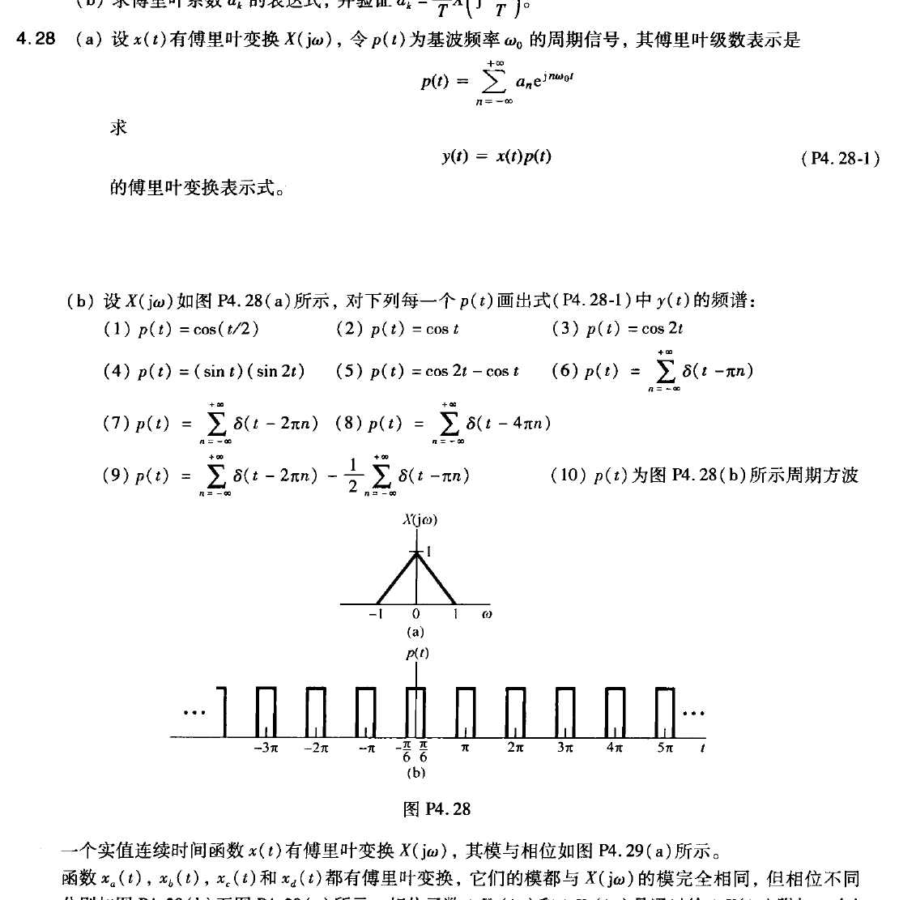

**题目文本：**

4.28

- (a) 设 $x(t)$ 有傅里叶变换 $X(j\omega)$，令 $p(t)$ 为基波频率 $\omega_0$ 的周期信号，其傅里叶级数表示是

$$p(t) = \sum_{n=-\infty}^{+\infty} a_n e^{jn\omega_0 t}$$

求

$$y(t) = x(t)p(t) \qquad \text{(P4.28-1)}$$

的傅里叶变换表示式。

- (b) 设 $X(j\omega)$ 如图 P4.28(a) 所示，对下列每一个 $p(t)$ 画出式 (P4.28-1) 中 $y(t)$ 的频谱：

  - (1) $p(t) = \cos(t/2)$
  - (2) $p(t) = \cos t$
  - (3) $p(t) = \cos 2t$
  - (4) $p(t) = (\sin t)(\sin 2t)$
  - (5) $p(t) = \cos 2t - \cos t$
  - (6) $p(t) = \displaystyle\sum_{n=-\infty}^{+\infty} \delta(t-\pi n)$
  - (7) $p(t) = \displaystyle\sum_{n=-\infty}^{+\infty} \delta(t-2\pi n)$
  - (8) $p(t) = \displaystyle\sum_{n=-\infty}^{+\infty} \delta(t-4\pi n)$
  - (9) $p(t) = \displaystyle\sum_{n=-\infty}^{+\infty} \delta(t-2\pi n) - \frac{1}{2}\sum_{n=-\infty}^{+\infty} \delta(t-\pi n)$
  - (10) $p(t)$ 为图 P4.28(b) 所示周期方波

图 P4.28(a)：$X(j\omega)$ 为三角波形，在 $\omega \in [-1,0]$ 从 $0$ 线性上升到 $1$，在 $\omega \in [0,1]$ 从 $1$ 线性下降到 $0$。

图 P4.28(b)：$p(t)$ 为周期方波，周期为 $\pi$，在每个周期内从 $t = n\pi - \frac{\pi}{6}$ 到 $t = n\pi + \frac{\pi}{6}$ 为高电平。

> **注意：** 本图包含 (a)(b) 两个子题（(b) 含 10 个小问），作业只需完成 (a)。

---

### 4.36

需完成：整题

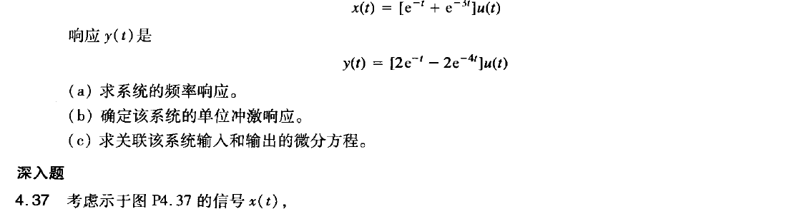

**题目文本：**

4.36 考虑一个线性时不变系统，输入 $x(t)$ 为

$$x(t) = [e^{-t} + e^{-3t}]u(t)$$

响应 $y(t)$ 是

$$y(t) = [2e^{-t} - 2e^{-4t}]u(t)$$

- (a) 求系统的频率响应。
- (b) 确定该系统的单位冲激响应。
- (c) 求关联该系统输入和输出的微分方程。

## 第 13 讲 [缺交]

作业来源：`5.21(e, j) 5.22(a) 5.26(a, d)`

### 5.21

需完成：e, j

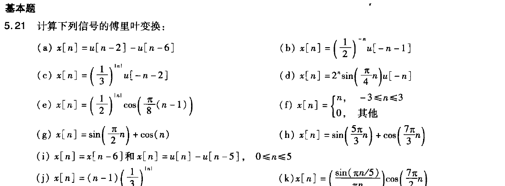

**题目文本：**

5.21 计算下列信号的傅里叶变换：

- (a) $x[n] = u[n-2] - u[n-6]$
- (b) $x[n] = \left(\dfrac{1}{2}\right)^{-n} u[-n-1]$
- (c) $x[n] = \left(\dfrac{1}{3}\right)^{|n|} u[-n-2]$
- (d) $x[n] = 2^n \sin\!\left(\dfrac{\pi}{4}n\right) u[-n]$
- (e) $x[n] = \left(\dfrac{1}{2}\right)^{|n|} \cos\!\left(\dfrac{\pi}{8}(n-1)\right)$
- (f) $x[n] = \begin{cases} n, & -3 \leq n \leq 3 \\ 0, & \text{其他} \end{cases}$
- (g) $x[n] = \sin\!\left(\dfrac{\pi}{2}n\right) + \cos(n)$
- (h) $x[n] = \sin\!\left(\dfrac{5\pi}{3}n\right) + \cos\!\left(\dfrac{7\pi}{3}n\right)$
- (i) $x[n] = x_1[n-6]$ 和 $x_1[n] = u[n] - u[n-5]$，$0 \leq n \leq 5$
- (j) $x[n] = (n-1)\left(\dfrac{1}{3}\right)^{|n|}$
- (k) $x[n] = \left(\dfrac{\sin(\pi n/5)}{\pi n}\right)\cos\!\left(\dfrac{7\pi}{2}n\right)$

> **注意：** 本图包含 (a)~(k) 十一个子题，第13讲作业需完成 (e)(j)，第14讲作业需完成 (k)。

---

### 5.22

需完成：a

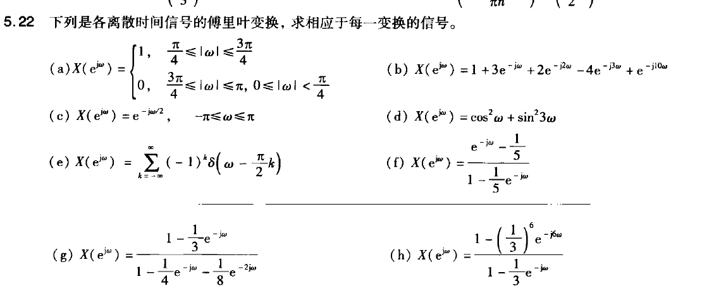

**题目文本：**

5.22 下列是各离散时间信号的傅里叶变换，求相应于每一变换的信号。

- (a) $X(e^{j\omega}) = \begin{cases} 1, & \dfrac{\pi}{4} \leq |\omega| \leq \dfrac{3\pi}{4} \\ 0, & \dfrac{3\pi}{4} \leq |\omega| \leq \pi,\ 0 \leq |\omega| < \dfrac{\pi}{4} \end{cases}$
- (b) $X(e^{j\omega}) = 1 + 3e^{-j\omega} + 2e^{-j2\omega} - 4e^{-j3\omega} + e^{-j10\omega}$
- (c) $X(e^{j\omega}) = e^{-j\omega/2}$，$-\pi \leq \omega \leq \pi$
- (d) $X(e^{j\omega}) = \cos^2\omega + \sin^2 3\omega$
- (e) $X(e^{j\omega}) = \displaystyle\sum_{k=-\infty}^{\infty} (-1)^k \delta\!\left(\omega - \dfrac{\pi}{2}k\right)$
- (f) $X(e^{j\omega}) = \dfrac{e^{-j\omega} - \frac{1}{5}}{1 - \frac{1}{5}e^{-j\omega}}$
- (g) $X(e^{j\omega}) = \dfrac{1 - \frac{1}{3}e^{-j\omega}}{1 - \frac{1}{4}e^{-j\omega} - \frac{1}{8}e^{-j2\omega}}$
- (h) $X(e^{j\omega}) = \dfrac{1 - \left(\frac{1}{3}\right)^6 e^{-j6\omega}}{1 - \frac{1}{3}e^{-j\omega}}$

> **注意：** 本图包含 (a)~(h) 八个子题，作业只需完成 (a)。

---

### 5.26

需完成：a, d

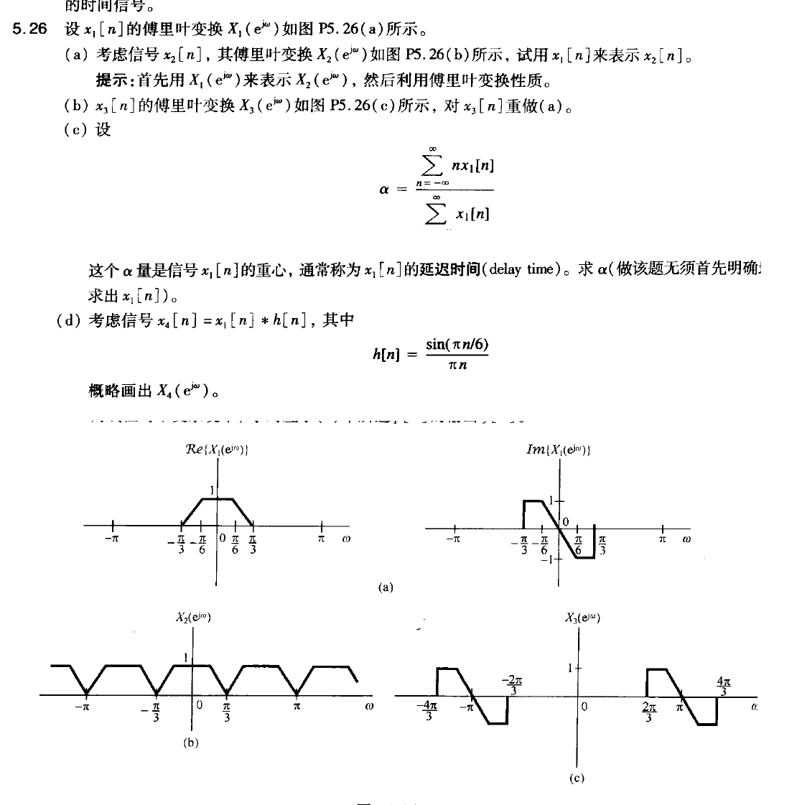

**题目文本：**

5.26 设 $x_1[n]$ 的傅里叶变换 $X_1(e^{j\omega})$ 如图 P5.26(a) 所示。

- (a) 考虑信号 $x_2[n]$，其傅里叶变换 $X_2(e^{j\omega})$ 如图 P5.26(b) 所示，试用 $x_1[n]$ 来表示 $x_2[n]$。

  提示：首先用 $X_1(e^{j\omega})$ 来表示 $X_2(e^{j\omega})$，然后利用傅里叶变换性质。

- (b) $x_3[n]$ 的傅里叶变换 $X_3(e^{j\omega})$ 如图 P5.26(c) 所示，对 $x_3[n]$ 重做 (a)。
- (c) 设

$$\alpha = \frac{\displaystyle\sum_{n=-\infty}^{\infty} n\,x_1[n]}{\displaystyle\sum_{n=-\infty}^{\infty} x_1[n]}$$

  这个 $\alpha$ 量是信号 $x_1[n]$ 的重心，通常称为 $x_1[n]$ 的延迟时间（delay time）。求 $\alpha$（做该题无须首先明确求出 $x_1[n]$）。

- (d) 考虑信号 $x_4[n] = x_1[n] * h[n]$，其中

$$h[n] = \frac{\sin(\pi n/6)}{\pi n}$$

  概略画出 $X_4(e^{j\omega})$。

图 P5.26(a)：$X_1(e^{j\omega})$ 的实部 $\mathcal{Re}\{X_1(e^{j\omega})\}$ 为梯形波，在 $\omega \in [-\pi/3, -\pi/6]$ 从 0 线性上升到 1，在 $\omega \in [-\pi/6, \pi/6]$ 保持为 1，在 $\omega \in [\pi/6, \pi/3]$ 从 1 线性下降到 0；虚部 $\mathcal{Im}\{X_1(e^{j\omega})\}$ 在 $\omega \in [-\pi/3, -\pi/6]$ 为 1 的矩形脉冲，在 $\omega \in [-\pi/6, \pi/6]$ 从 0 线性下降到 -1，在 $\omega \in [\pi/6, \pi/3]$ 为 -1 的矩形脉冲。

图 P5.26(b)：$X_2(e^{j\omega})$ 为周期三角波，周期为 $2\pi/3$，在每个周期内从波谷线性上升到峰值 1 再下降。

图 P5.26(c)：$X_3(e^{j\omega})$ 在 $\omega \in [-4\pi/3, -\pi]$ 为矩形脉冲（值 1），在 $\omega \in [-\pi, -2\pi/3]$ 从 1 线性下降到 0 再下降到负值，在 $\omega \in [2\pi/3, \pi]$ 为矩形脉冲（值 1），在 $\omega \in [\pi, 4\pi/3]$ 从 1 线性下降。

> **注意：** 本图包含 (a)~(d) 四个子题，作业需完成 (a)(d)。

---

## 第 14 讲 [缺交]

作业来源：`5.21(k) 5.33(b.iv, c.i)`

### 5.21

需完成：k

**题目文本：**

（同第13讲 5.21 题，见上方。需完成子题 (k)：$x[n] = \left(\dfrac{\sin(\pi n/5)}{\pi n}\right)\cos\!\left(\dfrac{7\pi}{2}n\right)$）

---

### 5.33

需完成：b.iv; c.i

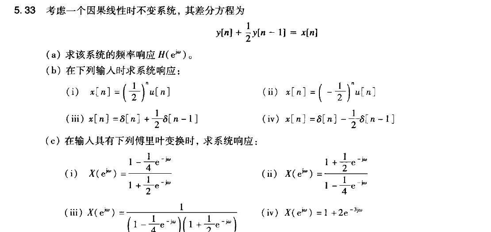

**题目文本：**

5.33 考虑一个因果线性时不变系统，其差分方程为

$$y[n] + \frac{1}{2}y[n-1] = x[n]$$

- (a) 求该系统的频率响应 $H(e^{j\omega})$。
- (b) 在下列输入时求系统响应：
  - (i) $x[n] = \left(\dfrac{1}{2}\right)^n u[n]$
  - (ii) $x[n] = \left(-\dfrac{1}{2}\right)^n u[n]$
  - (iii) $x[n] = \delta[n] + \dfrac{1}{2}\delta[n-1]$
  - (iv) $x[n] = \delta[n] - \dfrac{1}{2}\delta[n-1]$
- (c) 在输入具有下列傅里叶变换时，求系统响应：
  - (i) $X(e^{j\omega}) = \dfrac{1 - \frac{1}{4}e^{-j\omega}}{1 + \frac{1}{2}e^{-j\omega}}$
  - (ii) $X(e^{j\omega}) = \dfrac{1 + \frac{1}{2}e^{-j\omega}}{1 - \frac{1}{4}e^{-j\omega}}$
  - (iii) $X(e^{j\omega}) = \dfrac{1}{\left(1 - \frac{1}{4}e^{-j\omega}\right)\left(1 + \frac{1}{2}e^{-j\omega}\right)}$
  - (iv) $X(e^{j\omega}) = 1 + 2e^{-3j\omega}$

> **注意：** 本图包含 (a)、(b)(i)~(iv)、(c)(i)~(iv)，作业需完成 (b)(iv) 和 (c)(i)。

---

## 第 15 讲 [缺交]

作业来源：`6.23 7.3 7.23`

### 6.23

需完成：整题

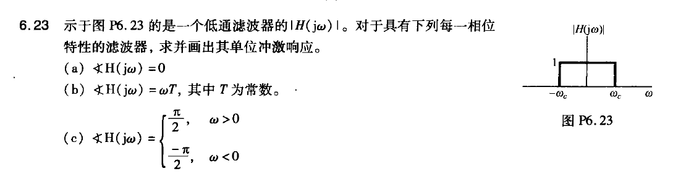

**题目文本：**

6.23 示于图 P6.23 的是一个低通滤波器的 $|H(j\omega)|$。对于具有下列每一相位特性的滤波器，求并画出其单位冲激响应。

- (a) $\angle H(j\omega) = 0$
- (b) $\angle H(j\omega) = \omega T$，其中 $T$ 为常数。
- (c) $\angle H(j\omega) = \begin{cases} \dfrac{\pi}{2}, & \omega > 0 \\[6pt] -\dfrac{\pi}{2}, & \omega < 0 \end{cases}$

图 P6.23：$|H(j\omega)|$ 为理想低通滤波器，在 $\omega \in [-\omega_c, \omega_c]$ 值为 1，其余为 0。

---

### 7.3

需完成：整题

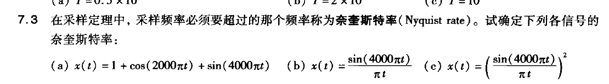

**题目文本：**

7.3 在采样定理中，采样频率必须要超过的那个频率称为奈奎斯特率（Nyquist rate）。试确定下列各信号的奈奎斯特率：

- (a) $x(t) = 1 + \cos(2000\pi t) + \sin(4000\pi t)$
- (b) $x(t) = \dfrac{\sin(4000\pi t)}{\pi t}$
- (c) $x(t) = \left(\dfrac{\sin(4000\pi t)}{\pi t}\right)^2$

---

### 7.23

需完成：整题

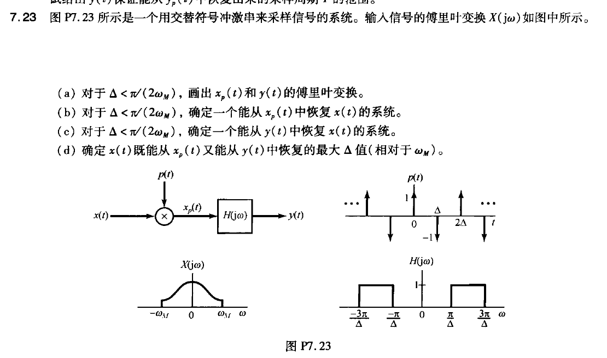

**题目文本：**

7.23 图 P7.23 所示是一个用交替符号冲激串来采样信号的系统。输入信号的傅里叶变换 $X(j\omega)$ 如图中所示。

- (a) 对于 $\Delta < \pi/(2\omega_M)$，画出 $x_p(t)$ 和 $y(t)$ 的傅里叶变换。
- (b) 对于 $\Delta < \pi/(2\omega_M)$，确定一个能从 $x_p(t)$ 中恢复 $x(t)$ 的系统。
- (c) 对于 $\Delta < \pi/(2\omega_M)$，确定一个能从 $y(t)$ 中恢复 $x(t)$ 的系统。
- (d) 确定 $x(t)$ 既能从 $x_p(t)$ 又能从 $y(t)$ 中恢复的最大 $\Delta$ 值（相对于 $\omega_M$）。

图 P7.23 系统结构：输入 $x(t)$ 与 $p(t)$ 相乘得到 $x_p(t)$，再经过滤波器 $H(j\omega)$ 得到 $y(t)$。

$p(t)$ 为交替符号冲激串：在 $t = 0, 2\Delta, 4\Delta, \ldots$ 处有强度为 1 的正冲激，在 $t = \Delta, 3\Delta, 5\Delta, \ldots$ 处有强度为 -1 的负冲激。

$X(j\omega)$ 为带限信号，在 $\omega \in [-\omega_M, \omega_M]$ 非零。

$H(j\omega)$ 为带通滤波器，在 $\omega \in [-3\pi/\Delta, -\pi/\Delta]$ 和 $\omega \in [\pi/\Delta, 3\pi/\Delta]$ 值为 1，其余为 0。

---

## 第 16 讲 [缺交]

作业来源：`8.24`

### 8.24

需完成：整题

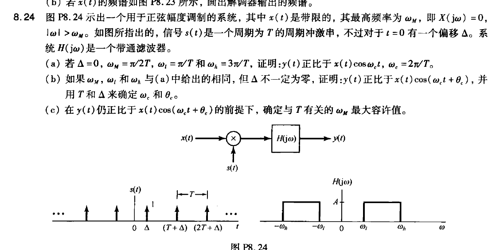

**题目文本：**

8.24 图 P8.24 示出一个用于正弦幅度调制的系统，其中 $x(t)$ 是带限的，其最高频率为 $\omega_M$，即 $X(j\omega) = 0$，$|\omega| > \omega_M$。如图所指出的，信号 $s(t)$ 是一个周期为 $T$ 的周期冲激串，不过对于 $t = 0$ 有一个偏移 $\Delta$。系统 $H(j\omega)$ 是一个带通滤波器。

- (a) 若 $\Delta = 0$，$\omega_M = \pi/2T$，$\omega_l = \pi/T$ 和 $\omega_h = 3\pi/T$，证明：$y(t)$ 正比于 $x(t)\cos\omega_c t$，$\omega_c = 2\pi/T$。
- (b) 如果 $\omega_M$，$\omega_l$ 和 $\omega_h$ 与 (a) 中给出的相同，但 $\Delta$ 不一定为零，证明：$y(t)$ 正比于 $x(t)\cos(\omega_c t + \theta_c)$，并用 $T$ 和 $\Delta$ 来确定 $\omega_c$ 和 $\theta_c$。
- (c) 在 $y(t)$ 仍正比于 $x(t)\cos(\omega_c t + \theta_c)$ 的前提下，确定与 $T$ 有关的 $\omega_M$ 最大容许值。

图 P8.24 系统结构：输入 $x(t)$ 与 $s(t)$ 相乘，再经过带通滤波器 $H(j\omega)$ 得到 $y(t)$。

$s(t)$ 为周期冲激串，周期为 $T$，在 $t = \Delta, T+\Delta, 2T+\Delta, \ldots$ 处有冲激。

$H(j\omega)$ 为带通滤波器，在 $\omega \in [-\omega_h, -\omega_l]$ 和 $\omega \in [\omega_l, \omega_h]$ 值为 $A$，其余为 0。

---

## 第 17 讲 [缺交]

作业来源：`9.21(b, j) 9.23(1) 9.22(e)`

### 9.21

需完成：b, j

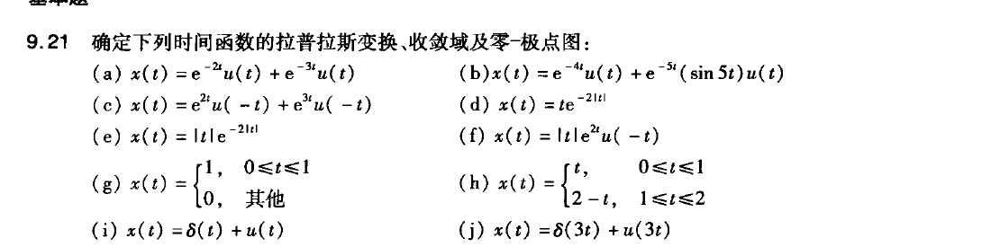

**题目文本：**

9.21 确定下列时间函数的拉普拉斯变换、收敛域及零-极点图：

- (a) $x(t) = e^{-2t}u(t) + e^{-3t}u(t)$
- (b) $x(t) = e^{-4t}u(t) + e^{-5t}(\sin 5t)\,u(t)$
- (c) $x(t) = e^{2t}u(-t) + e^{3t}u(-t)$
- (d) $x(t) = t e^{-2|t|}$
- (e) $x(t) = |t| e^{-2|t|}$
- (f) $x(t) = |t| e^{2t} u(-t)$
- (g) $x(t) = \begin{cases} 1, & 0 \leq t \leq 1 \\ 0, & \text{其他} \end{cases}$
- (h) $x(t) = \begin{cases} t, & 0 \leq t \leq 1 \\ 2-t, & 1 \leq t \leq 2 \end{cases}$
- (i) $x(t) = \delta(t) + u(t)$
- (j) $x(t) = \delta(3t) + u(3t)$

> **注意：** 本图包含 (a)~(j) 十个子题，作业需完成 (b)(j)。

---

### 9.23

需完成：1

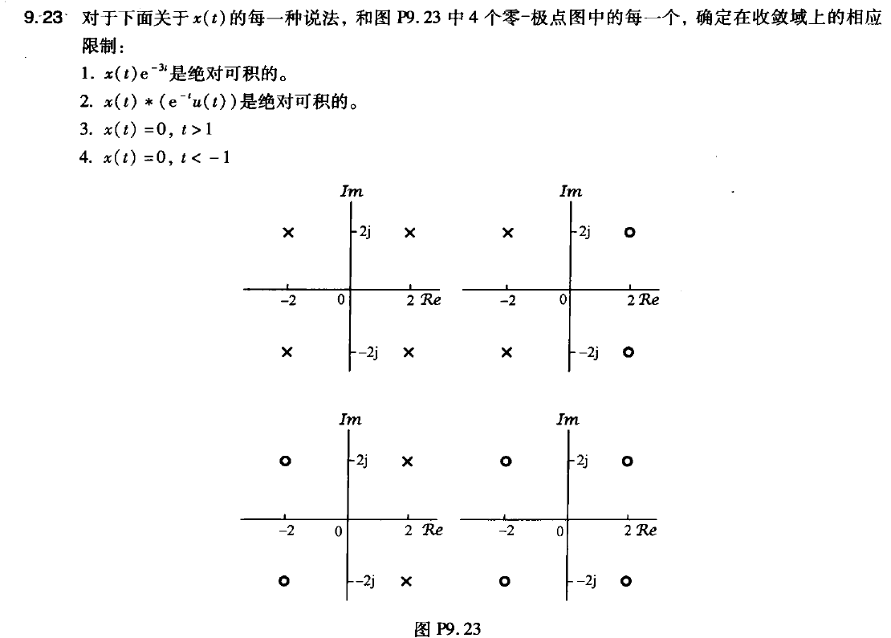

**题目文本：**

9.23 对于下面关于 $x(t)$ 的每一种说法，和图 P9.23 中 4 个零-极点图中的每一个，确定在收敛域上的相应限制：

1. $x(t)e^{-3t}$ 是绝对可积的。
2. $x(t) * (e^{-t}u(t))$ 是绝对可积的。
3. $x(t) = 0$，$t > 1$
4. $x(t) = 0$，$t < -1$

图 P9.23 包含四个零-极点图：

- **左上图**：极点在 $s = -2 \pm 2j$ 和 $s = 2 \pm 2j$（四个极点，无零点）
- **右上图**：极点在 $s = -2 \pm 2j$，零点在 $s = 2 \pm 2j$
- **左下图**：零点在 $s = -2 \pm 2j$，极点在 $s = 2 \pm 2j$
- **右下图**：零点和极点均在 $s = -2 \pm 2j$ 和 $s = 2 \pm 2j$（四个零点和四个极点重合位置）

> **注意：** 作业需完成说法 1 与四个零-极点图的组合。

---

### 9.22

需完成：e

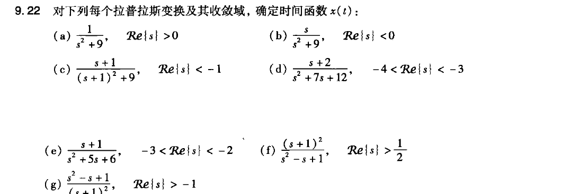

**题目文本：**

9.22 对下列每个拉普拉斯变换及其收敛域，确定时间函数 $x(t)$：

- (a) $\dfrac{1}{s^2+9}$，$\mathcal{Re}\{s\} > 0$
- (b) $\dfrac{s}{s^2+9}$，$\mathcal{Re}\{s\} < 0$
- (c) $\dfrac{s+1}{(s+1)^2+9}$，$\mathcal{Re}\{s\} < -1$
- (d) $\dfrac{s+2}{s^2+7s+12}$，$-4 < \mathcal{Re}\{s\} < -3$
- (e) $\dfrac{s+1}{s^2+5s+6}$，$-3 < \mathcal{Re}\{s\} < -2$
- (f) $\dfrac{(s+1)^2}{s^2-s+1}$，$\mathcal{Re}\{s\} > \dfrac{1}{2}$
- (g) $\dfrac{s^2-s+1}{(s+1)^2}$，$\mathcal{Re}\{s\} > -1$

> **注意：** 本图包含 (a)~(g) 七个子题，作业只需完成 (e)。

---

## 第 18 讲 [缺交]

作业来源：`9.25(c)`

### 9.25

需完成：c

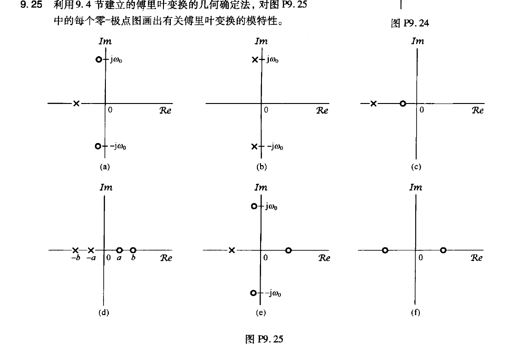

**题目文本：**

9.25 利用 9.4 节建立的傅里叶变换的几何确定法，对图 P9.25 中的每个零-极点图画出有关傅里叶变换的模特性。

图 P9.25 包含六个零-极点图：

- **(a)** 极点在 $s = 0$（实轴原点），零点在 $s = \pm j\omega_0$（虚轴上）
- **(b)** 极点在 $s = \pm j\omega_0$（虚轴上），无零点
- **(c)** 零点在 $s = 0$（实轴原点），极点在 $s = -a$（负实轴，$a > 0$）
- **(d)** 极点在 $s = -a$ 和 $s = -b$（$b > a > 0$，负实轴），零点在 $s = a$ 和 $s = b$（正实轴）
- **(e)** 极点在 $s = \pm j\omega_0$（虚轴上），零点在 $s = 0$（实轴原点）和 $s = a$（正实轴）
- **(f)** 零点在 $s = \pm a$（实轴上对称），无极点

> **注意：** 本图包含 (a)~(f) 六个零-极点图，作业只需完成 (c)。

---

## 第 19 讲 [缺交]

作业来源：`9.26 9.31`

### 9.26

需完成：整题

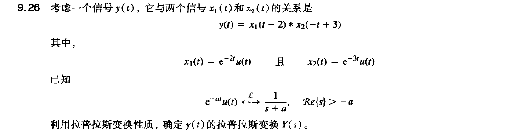

**题目文本：**

9.26 考虑一个信号 $y(t)$，它与两个信号 $x_1(t)$ 和 $x_2(t)$ 的关系是

$$y(t) = x_1(t-2) * x_2(-t+3)$$

其中，

$$x_1(t) = e^{-2t}u(t) \quad \text{且} \quad x_2(t) = e^{-3t}u(t)$$

已知

$$e^{-at}u(t) \stackrel{\mathcal{L}}{\longleftrightarrow} \frac{1}{s+a}, \quad \mathcal{Re}\{s\} > -a$$

利用拉普拉斯变换性质，确定 $y(t)$ 的拉普拉斯变换 $Y(s)$。

---

### 9.31

需完成：整题

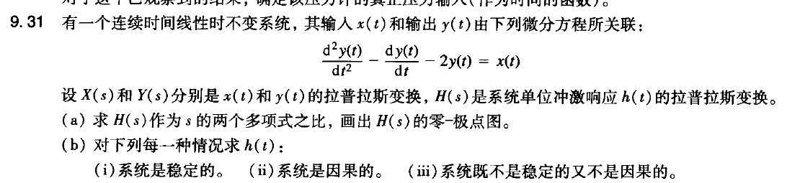

**题目文本：**

9.31 有一个连续时间线性时不变系统，其输入 $x(t)$ 和输出 $y(t)$ 由下列微分方程所关联：

$$\frac{d^2y(t)}{dt^2} - \frac{dy(t)}{dt} - 2y(t) = x(t)$$

设 $X(s)$ 和 $Y(s)$ 分别是 $x(t)$ 和 $y(t)$ 的拉普拉斯变换，$H(s)$ 是系统单位冲激响应 $h(t)$ 的拉普拉斯变换。

- (a) 求 $H(s)$ 作为 $s$ 的两个多项式之比，画出 $H(s)$ 的零-极点图。
- (b) 对下列每一种情况求 $h(t)$：
  - (i) 系统是稳定的。
  - (ii) 系统是因果的。
  - (iii) 系统既不是稳定的又不是因果的。

---

## 第 20 讲 [缺交]

作业来源：`9.35 9.40`

### 9.35

需完成：整题

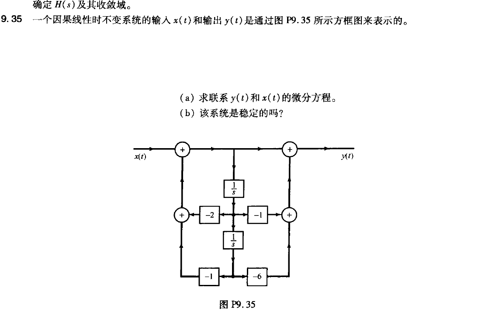

**题目文本：**

9.35 一个因果线性时不变系统的输入 $x(t)$ 和输出 $y(t)$ 是通过图 P9.35 所示方框图来表示的。

- (a) 求联系 $y(t)$ 和 $x(t)$ 的微分方程。
- (b) 该系统是稳定的吗？

图 P9.35 方框图结构：

系统包含两个积分器（$1/s$ 模块）和多个增益模块。信号流如下：
- 输入 $x(t)$ 进入第一个加法器
- 第一个加法器输出经过 $1/s$ 积分器，再经过第二个 $1/s$ 积分器
- 反馈路径包含增益 $-2$、$-1$、$-1$、$-6$
- 最终输出为 $y(t)$

从框图可以读出系统函数：前向路径和反馈路径的增益分别为 $-2$、$-1$（第一级反馈）和 $-1$、$-6$（第二级反馈）。

---

### 9.40

需完成：整题

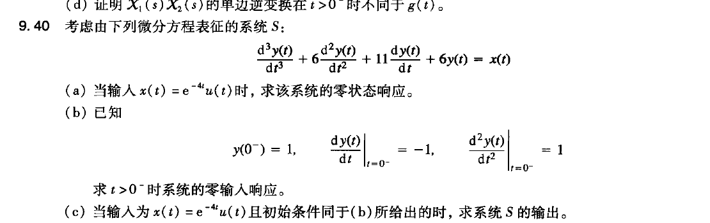

**题目文本：**

9.40 考虑由下列微分方程表征的系统 $S$：

$$\frac{d^3y(t)}{dt^3} + 6\frac{d^2y(t)}{dt^2} + 11\frac{dy(t)}{dt} + 6y(t) = x(t)$$

- (a) 当输入 $x(t) = e^{-4t}u(t)$ 时，求该系统的零状态响应。
- (b) 已知

$$y(0^-) = 1, \quad \left.\frac{dy(t)}{dt}\right|_{t=0^-} = -1, \quad \left.\frac{d^2y(t)}{dt^2}\right|_{t=0^-} = 1$$

  求 $t > 0^-$ 时系统的零输入响应。

- (c) 当输入为 $x(t) = e^{-4t}u(t)$ 且初始条件同于 (b) 所给出的时，求系统 $S$ 的输出。

---

## 第 21 讲 [缺交]

作业来源：`10.21(a, g) 10.7`

### 10.21

需完成：a, g

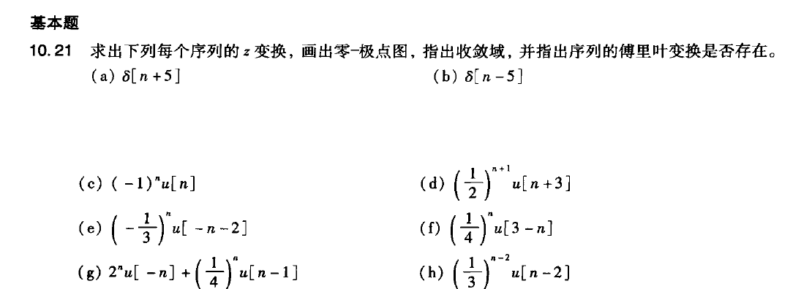

**题目文本：**

10.21 求出下列每个序列的 $z$ 变换，画出零-极点图，指出收敛域，并指出序列的傅里叶变换是否存在。

- (a) $\delta[n+5]$
- (b) $\delta[n-5]$
- (c) $(-1)^n u[n]$
- (d) $\left(\dfrac{1}{2}\right)^{n+1} u[n+3]$
- (e) $\left(-\dfrac{1}{3}\right)^n u[-n-2]$
- (f) $\left(\dfrac{1}{4}\right)^n u[3-n]$
- (g) $2^n u[-n] + \left(\dfrac{1}{4}\right)^n u[n-1]$
- (h) $\left(\dfrac{1}{3}\right)^{n-2} u[n-2]$

> **注意：** 本图包含 (a)~(h) 八个子题，作业需完成 (a)(g)。

---

### 10.7

需完成：整题

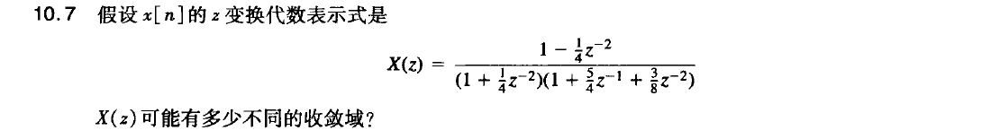

**题目文本：**

10.7 假设 $x[n]$ 的 $z$ 变换代数表示式是

$$X(z) = \frac{1 - \frac{1}{4}z^{-2}}{\left(1 + \frac{1}{4}z^{-2}\right)\left(1 + \frac{5}{4}z^{-1} + \frac{3}{8}z^{-2}\right)}$$

$X(z)$ 可能有多少不同的收敛域？

---

## 第 22 讲 [缺交]

作业来源：`10.24(a, b)`

### 10.24

需完成：a, b

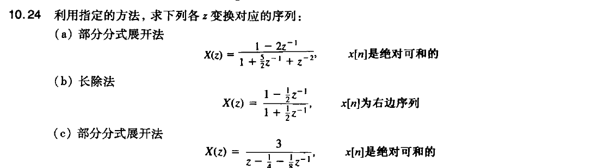

**题目文本：**

10.24 利用指定的方法，求下列各 $z$ 变换对应的序列：

- (a) 部分分式展开法

$$X(z) = \frac{1 - 2z^{-1}}{1 + \frac{5}{2}z^{-1} + z^{-2}}, \quad x[n] \text{ 是绝对可和的}$$

- (b) 长除法

$$X(z) = \frac{1 - \frac{1}{2}z^{-1}}{1 + \frac{1}{2}z^{-1}}, \quad x[n] \text{ 为右边序列}$$

- (c) 部分分式展开法

$$X(z) = \frac{3}{z - \frac{1}{4} - \frac{1}{8}z^{-1}}, \quad x[n] \text{ 是绝对可和的}$$

> **注意：** 本图包含 (a)(b)(c) 三个子题，作业需完成 (a)(b)。

---

## 第 23 讲

作业来源：`10.16 10.33 10.59`

### 10.16

需完成：整题

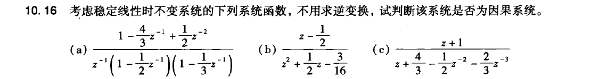

**题目文本：**

10.16 考虑稳定线性时不变系统的下列系统函数，不用求逆变换，试判断该系统是否为因果系统。

- (a) $\dfrac{1 - \frac{4}{3}z^{-1} + \frac{1}{2}z^{-2}}{z^{-1}\left(1 - \frac{1}{2}z^{-1}\right)\left(1 - \frac{1}{3}z^{-1}\right)}$
- (b) $\dfrac{z - \frac{1}{2}}{z^2 + \frac{1}{2}z - \frac{3}{16}}$
- (c) $\dfrac{z+1}{z + \frac{4}{3} - \frac{1}{2}z^{-2} - \frac{2}{3}z^{-3}}$

---

### 10.33

需完成：整题

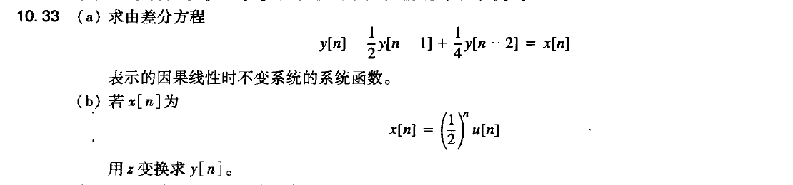

**题目文本：**

10.33

- (a) 求由差分方程

$$y[n] - \frac{1}{2}y[n-1] + \frac{1}{4}y[n-2] = x[n]$$

  表示的因果线性时不变系统的系统函数。

- (b) 若 $x[n]$ 为

$$x[n] = \left(\frac{1}{2}\right)^n u[n]$$

  用 $z$ 变换求 $y[n]$。

---

### 10.59

需完成：整题

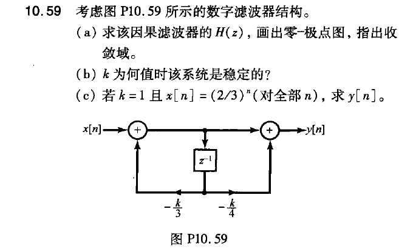

**题目文本：**

10.59 考虑图 P10.59 所示的数字滤波器结构。

- (a) 求该因果滤波器的 $H(z)$，画出零-极点图，指出收敛域。
- (b) $k$ 为何值时该系统是稳定的？
- (c) 若 $k = 1$ 且 $x[n] = (2/3)^n$（对全部 $n$），求 $y[n]$。

图 P10.59 数字滤波器结构：

输入 $x[n]$ 进入第一个加法器，加法器输出分为两路：一路直接到第二个加法器作为输出 $y[n]$ 的一部分，另一路经过 $z^{-1}$ 延迟单元。延迟单元的输出经过增益 $-k/3$ 反馈回第一个加法器，同时经过增益 $-k/4$ 到第二个加法器。

即系统方程为：

$$y[n] = x[n] - \frac{k}{3}y[n-1] - \frac{k}{4}y[n-1] = x[n] - \frac{7k}{12}y[n-1]$$

> **注意：** 框图的具体连接方式需要根据图示确认，上述方程为初步解读。
