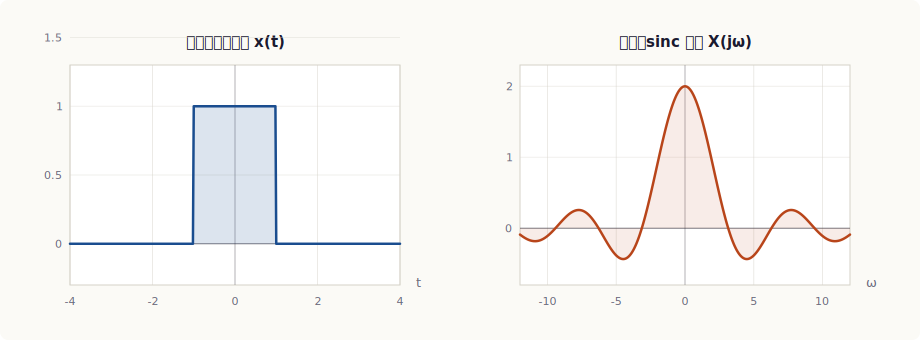
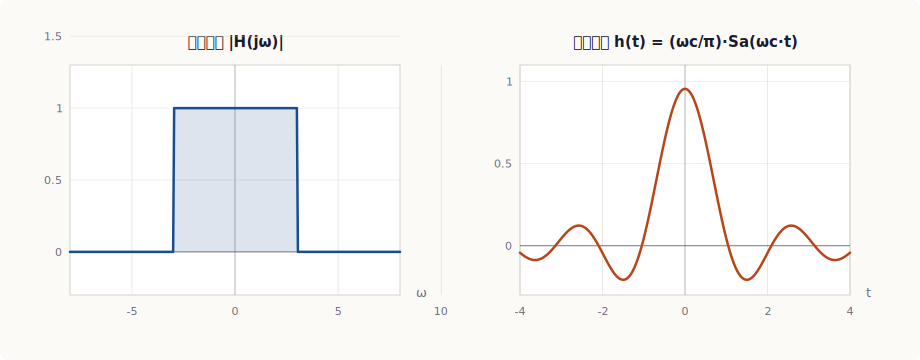
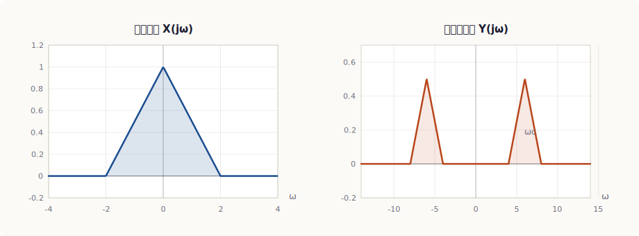
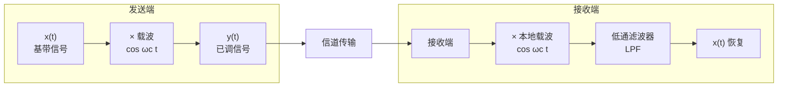
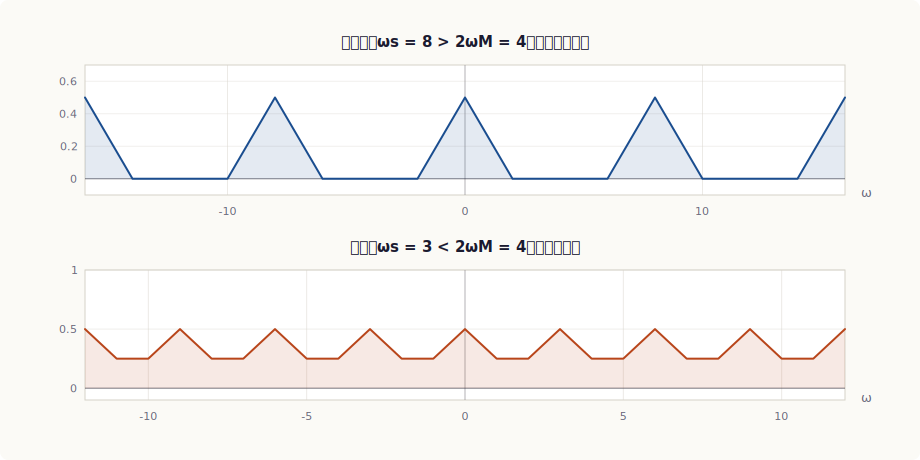
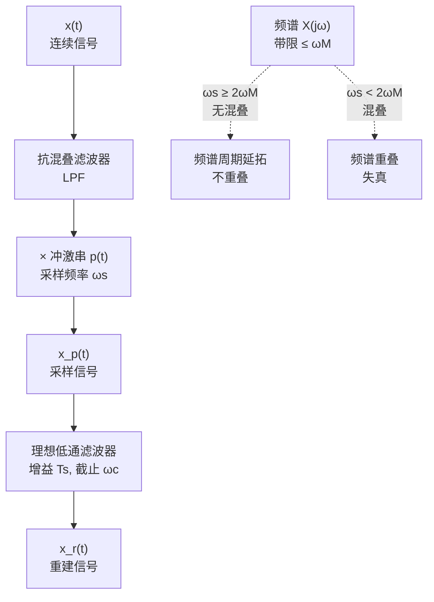

<!-- Converted from fourier-transform-tutorial.html. Tables are native Markdown; static chart SVGs are in assets/generated/. -->

# 傅里叶变换完整教程

> _基于奥本海姆《信号与系统》第4–5章，系统覆盖连续时间傅里叶变换的全部核心考点，包含定义推导、性质证明、常用变换对、LTI系统频域分析、调制、采样定理及离散时间傅里叶变换，并配以典型例题。_

## 目录
- [第1章 引言与基本概念](#ch1)
- [第2章 傅里叶级数回顾](#ch2)
- [第3章 傅里叶变换的定义](#ch3)
- [第4章 常用信号的傅里叶变换](#ch4)
- [第5章 傅里叶变换的性质](#ch5)
  - [5.1 线性与时移频移](#ch5-1)
  - [5.2 尺度变换与对偶性](#ch5-2)
  - [5.3 微分与积分性质](#ch5-3)
  - [5.4 Parseval定理与对称性](#ch5-4)
- [第6章 卷积与乘积性质](#ch6)
- [第7章 周期信号的傅里叶变换](#ch7)
- [第8章 频率响应与滤波](#ch8)
- [第9章 幅度调制与解调](#ch9)
- [第10章 采样定理](#ch10)
- [第11章 离散时间傅里叶变换](#ch11)
- [第12章 核心考点与典型例题](#ch12)

## 第1章 引言与基本概念

### 1.1 傅里叶分析的核心思想

傅里叶分析的核心思想是：将一个复杂的信号分解为一系列基本分量——复指数信号 $e^{j\omega t}$ 的叠加。这种分解的价值在于，复指数信号是线性时不变（LTI）系统的特征函数，即一个 LTI 系统对复指数输入的响应仍然是同频率的复指数，只是幅度和相位发生了改变。

正是基于这一特性，傅里叶变换将信号从**时域**（以时间 $t$ 为自变量）转换到**频域**（以频率 $\omega$ 为自变量），使我们能够在频域中直观地分析信号的频率成分以及系统对不同频率分量的响应特性。这种时域–频域的双重表示构成了信号与系统课程的理论骨架。

### 1.2 三种傅里叶表示的总体框架

奥本海姆教材中，傅里叶分析按照信号类型（连续/离散）和信号性质（周期/非周期）分为四种表示形式。本教程聚焦其中的连续时间非周期信号表示——连续时间傅里叶变换（CTFT），并适当涵盖与之关联的级数和离散形式。

| 信号类型 | 周期信号 | 非周期信号 |
| --- | --- | --- |
| 连续时间 (CT) | 连续时间傅里叶级数 (CTFS) 离散频率谱 $\{a_k\}$ | **连续时间傅里叶变换 (CTFT)** 连续频率谱 $X(j\omega)$ |
| 离散时间 (DT) | 离散时间傅里叶级数 (DTFS) 有限离散频率谱 | 离散时间傅里叶变换 (DTFT) 连续周期频率谱 $X(e^{j\omega})$ |

> [!NOTE]
> **关键概念**
>
> 四种表示之间存在深刻的对偶关系：周期信号对应离散频率谱，非周期信号对应连续频率谱。从周期信号的级数出发，令周期趋于无穷大，即可自然导出非周期信号的傅里叶变换。这一"从周期到非周期"的推导思路是理解 CTFT 定义的关键。

### 1.3 本教程的组织

本教程按照以下逻辑展开：先回顾傅里叶级数作为基础（第2章），再推导傅里叶变换的定义与收敛条件（第3章），随后系统介绍常用变换对（第4章）和全部核心性质（第5–6章）。第7–10章将傅里叶变换应用于周期信号分析、LTI系统滤波、通信调制和采样定理等工程场景。第11章简要介绍离散时间傅里叶变换。最后在第12章总结核心考点并给出典型例题。

## 第2章 连续时间傅里叶级数回顾

傅里叶级数是傅里叶变换的直接前驱。理解级数的表示方法，是理解变换定义的必要基础。本章简要回顾连续时间傅里叶级数的核心内容。

### 2.1 周期信号与基波频率

一个连续时间信号 $x(t)$ 如果满足 $x(t) = x(t + T)$ 对所有 $t$ 成立，则称其为周期信号，$T$ 为基波周期。基波频率定义为 $\omega_0 = \frac{2\pi}{T}$，对应的基波频率（以 Hz 计）为 $f_0 = \frac{1}{T}$。

### 2.2 傅里叶级数表示

满足一定条件的周期信号可以表示为复指数的线性叠加：

$$x(t) = \sum_{k=-\infty}^{\infty} a_k \, e^{jk\omega_0 t} \tag{2.1}$$

这是**综合方程**（synthesis equation），它将信号表示为所有谐波分量之和。其中 $a_k$ 为第 $k$ 次谐波的傅里叶级数系数，由**分析方程**（analysis equation）给出：

$$a_k = \frac{1}{T} \int_{T} x(t) \, e^{-jk\omega_0 t} \, dt \tag{2.2}$$

积分区间可以取任意一个完整周期，通常取 $[0, T]$ 或 $[-T/2, T/2]$。系数 $a_k$ 构成了信号的**离散频谱**：$|a_k|$ 为幅度谱，$\arg(a_k)$ 为相位谱。

### 2.3 傅里叶级数的收敛条件

并非所有周期信号都能用傅里叶级数表示。Dirichlet 给出了**充分条件**（非必要），满足以下条件的信号其傅里叶级数收敛：

1. 在任意一个周期内，信号绝对可积：$\int_T |x(t)| dt < \infty$；
2. 在任意一个周期内，信号只有有限个极大值和极小值；
3. 在任意一个周期内，信号只有有限个不连续点，且这些不连续点处的函数值有限。

若 $x(t)$ 在 $t_0$ 处连续，则级数收敛于 $x(t_0)$；若在 $t_0$ 处不连续，则级数收敛于左右极限的平均值 $\frac{x(t_0^+) + x(t_0^-)}{2}$——这就是著名的 **Gibbs 现象**的体现。

### 2.4 傅里叶级数的性质概览

傅里叶级数具有许多与傅里叶变换平行的性质，这些性质将在第5章中详细展开。这里仅列出核心结论：

| 性质 | 时域 $x(t)$ | 频域 $a_k$ |
| --- | --- | --- |
| 线性 | $ \alpha x(t) + \beta y(t) $ | $\alpha a_k + \beta b_k$ |
| 时移 | $x(t - t_0)$ | $a_k \, e^{-jk\omega_0 t_0}$ |
| 频移 | $e^{jM\omega_0 t} x(t)$ | $a_{k-M}$ |
| 共轭对称 | $x^*(t)$（实信号） | $a_{-k} = a_k^*$ |
| 时间反转 | $x(-t)$ | $a_{-k}$ |
| 时域尺度变换 | $x(\alpha t),\; \alpha>0$ | 周期变为 $T/\alpha$，$\omega_0 \to \alpha\omega_0$ |
| 卷积（周期） | $\int_T x(\tau)y(t-\tau)d\tau$ | $T \cdot a_k \cdot b_k$ |
| 相乘 | $x(t)y(t)$ | $\sum_{l=-\infty}^{\infty} a_l \, b_{k-l}$ |
| Parseval | $\frac{1}{T}\int_T \lvert x(t)\rvert^2 dt$ | $\sum_{k=-\infty}^{\infty} \lvert a_k\rvert^2$ |

### 2.5 典型周期信号的傅里叶级数

#### 周期方波

占空比为 50% 的周期方波（在半个周期内为 1，另半个周期内为 −1），其傅里叶系数为：

$$a_k = \begin{cases} \frac{2}{\pi(1-4k^2)}, & k \text{ 为偶数} \\[6pt] 0, & k \text{ 为奇数（含 } k=0\text{）} \end{cases} \tag{2.3}$$

实际中更常见的形式是单极性方波（半个周期为 1，另半个周期为 0），其系数 $a_k = \frac{\sin(k\pi/2)}{k\pi}$，$a_0 = 1/2$。只含奇次谐波，这是典型的**奇谐信号**。

#### 周期冲激串

周期为 $T$ 的冲激串 $\delta_T(t) = \sum_{n=-\infty}^{\infty} \delta(t - nT)$ 的所有傅里叶系数都等于 $1/T$：

$$a_k = \frac{1}{T}, \quad \forall\, k \in \mathbb{Z} \tag{2.4}$$

这个结果在采样定理中起核心作用，因为冲激串在频域也是一个冲激串。

## 第3章 连续时间傅里叶变换的定义

### 3.1 从傅里叶级数到傅里叶变换

傅里叶变换的导出思路极为精妙：将非周期信号视为周期趋于无穷大的周期信号的极限。设 $x(t)$ 是一个有限持续时间的非周期信号，构造一个以 $T$ 为周期的周期延拓信号 $\tilde{x}(t)$，使得在 $[-T/2, T/2]$ 内 $\tilde{x}(t) = x(t)$。当 $T$ 足够大时，各周期的延拓不重叠。

对 $\tilde{x}(t)$ 写出傅里叶级数表示：

$$\tilde{x}(t) = \sum_{k=-\infty}^{\infty} a_k \, e^{jk\omega_0 t}, \quad a_k = \frac{1}{T}\int_{-T/2}^{T/2} x(t) \, e^{-jk\omega_0 t} dt \tag{3.1}$$

当 $T \to \infty$ 时，发生以下变化：

- 基波频率 $\omega_0 = \frac{2\pi}{T} \to 0$，离散频率 $k\omega_0$ 变成连续频率 $\omega$；
- 相邻谱线间距 $\omega_0$ 趋于零，离散谱变成连续谱；
- $a_k = \frac{1}{T} \int_{-T/2}^{T/2} x(t) e^{-jk\omega_0 t} dt \to 0$（因 $1/T \to 0$），但 $T \cdot a_k$ 趋于一个有限值。

定义 $X(j\omega) = T \cdot a_k = \int_{-\infty}^{\infty} x(t) e^{-j\omega t} dt$，并注意到求和 $\sum_k \to \frac{1}{2\pi}\int_{-\infty}^{\infty} d\omega$（因为 $\Delta\omega = \omega_0 = \frac{2\pi}{T}$），便得到傅里叶变换对。

### 3.2 傅里叶变换对

**分析方程**（正变换，时域 → 频域）：

$$X(j\omega) = \int_{-\infty}^{\infty} x(t) \, e^{-j\omega t} \, dt \tag{3.2}$$

**综合方程**（逆变换，频域 → 时域）：

$$x(t) = \frac{1}{2\pi} \int_{-\infty}^{\infty} X(j\omega) \, e^{j\omega t} \, d\omega \tag{3.3}$$

我们用记号 $x(t) \stackrel{\mathcal{F}}{\longleftrightarrow} X(j\omega)$ 或简写 $x(t) \leftrightarrow X(j\omega)$ 表示变换对。

### 3.3 频谱密度函数的物理意义

$X(j\omega)$ 称为信号 $x(t)$ 的**频谱密度函数**。与傅里叶级数系数 $a_k$ 不同，$X(j\omega)$ 不直接代表某一频率分量的幅度，而是表示单位频率带宽内的频谱"密度"。这一点可以从 $a_k = \frac{1}{T} X(j\omega)\big|_{\omega = k\omega_0}$ 看出：周期信号的离散谱线 $a_k$ 等于非周期信号连续频谱在对应频率处的采样值除以 $T$。

由于 $X(j\omega)$ 通常是复数，可以表示为：

$$X(j\omega) = |X(j\omega)| \, e^{j\arg X(j\omega)} \tag{3.4}$$

其中 $|X(j\omega)|$ 称为**幅度谱**，$\arg X(j\omega)$ 称为**相位谱**。幅度谱反映各频率分量的相对强度，相位谱反映各频率分量的相对时延。

### 3.4 傅里叶变换的收敛条件

与傅里叶级数类似，傅里叶变换的存在性也有 Dirichlet 充分条件：

> [!WARNING]
> **Dirichlet 收敛条件（充分非必要）**
>
> 信号 $x(t)$ 的傅里叶变换存在，若满足：
> 1. **绝对可积**：$\displaystyle\int_{-\infty}^{\infty} |x(t)| \, dt < \infty$
> 2. 在任意有限区间内，$x(t)$ 只有有限个极大值和极小值
> 3. 在任意有限区间内，$x(t)$ 只有有限个不连续点，且这些不连续点处的函数值有限
> 若 $x(t)$ 在 $t_0$ 处连续，逆变换收敛于 $x(t_0)$；若在 $t_0$ 处不连续，逆变换收敛于 $\frac{x(t_0^+) + x(t_0^-)}{2}$。

> [!NOTE]
> **关于条件①的说明**
>
> 绝对可积是能量有限的充分条件（但非必要）。许多不满足绝对可积的信号（如常数、正弦信号、单位阶跃信号）在引入冲激函数后仍然可以定义傅里叶变换——这类变换在广义函数意义上存在。这是奥本海姆教材的一个重要处理方式，使得周期信号的傅里叶变换也能用 $X(j\omega)$ 统一表示。

### 3.5 傅里叶变换的对称性

对于**实信号** $x(t)$，其傅里叶变换具有共轭对称性：

$$X(-j\omega) = X^*(j\omega) \tag{3.5}$$

由此推得：$|X(j\omega)|$ 是 $\omega$ 的偶函数，$\arg X(j\omega)$ 是 $\omega$ 的奇函数。这意味着实信号的幅度谱关于 $\omega = 0$ 对称，相位谱关于原点反对称。因此在分析实信号时，只需考虑 $\omega \geq 0$ 的部分。

进一步，若实信号 $x(t)$ 还是**偶函数**，则 $X(j\omega)$ 为实偶函数；若 $x(t)$ 是**奇函数**，则 $X(j\omega)$ 为纯虚奇函数。这些对称性在简化计算时非常有用。

## 第4章 常用信号的傅里叶变换

掌握常用信号的傅里叶变换对是运用变换性质求解复杂问题的基础。本章逐一推导最重要的变换对，这些结果在后续章节中被反复引用。

### 4.1 单位冲激信号 $\delta(t)$

利用冲激函数的抽样性质 $x(t)\delta(t) = x(0)\delta(t)$，直接代入分析方程：

$$\mathcal{F}\{\delta(t)\} = \int_{-\infty}^{\infty} \delta(t) \, e^{-j\omega t} dt = e^0 = 1 \tag{4.1}$$

冲激信号的频谱是常数 1，即**等宽白谱**——所有频率分量等强度存在。这正是冲激信号"无限窄、无限高"在频域的对应体现。

### 4.2 直流信号（常数）

利用对偶性（将在第5章正式讨论）或直接由逆变换可知，常数 1 的傅里叶变换是频域冲激：

$$\mathcal{F}\{1\} = 2\pi \, \delta(\omega) \tag{4.2}$$

直流信号只含 $\omega = 0$ 的频率分量，因此在频域表现为位于原点的冲激。这与"时域无限宽对应频域无限窄"的直观一致。

### 4.3 复指数信号 $e^{j\omega_0 t}$

由频移性质或直接推导，复指数信号的傅里叶变换为频移冲激：

$$\mathcal{F}\{e^{j\omega_0 t}\} = 2\pi \, \delta(\omega - \omega_0) \tag{4.3}$$

这是理解正弦/余弦信号频谱的基础。由欧拉公式 $e^{j\omega_0 t} = \cos\omega_0 t + j\sin\omega_0 t$，可推得：

$$\cos\omega_0 t \;\leftrightarrow\; \pi[\delta(\omega - \omega_0) + \delta(\omega + \omega_0)] \tag{4.4}$$
$$\sin\omega_0 t \;\leftrightarrow\; \frac{\pi}{j}[\delta(\omega - \omega_0) - \delta(\omega + \omega_0)] \tag{4.5}$$

余弦信号在 $\pm\omega_0$ 处各有一个冲激（幅度 $\pi$），正弦信号同理但带虚数因子。两者均不满足绝对可积条件，其傅里叶变换在广义函数意义下成立。

### 4.4 矩形脉冲信号

宽度为 $2T_1$、中心在原点的矩形脉冲定义为：

$$x(t) = \begin{cases} 1, & |t| < T_1 \\ 0, & |t| > T_1 \end{cases} \tag{4.6}$$

直接计算分析方程：

$$X(j\omega) = \int_{-T_1}^{T_1} e^{-j\omega t} dt = \frac{e^{-j\omega T_1} - e^{j\omega T_1}}{-j\omega} = \frac{2\sin(\omega T_1)}{\omega} = 2T_1 \,\text{sinc}\!\left(\frac{\omega T_1}{\pi}\right) \tag{4.7}$$

这里使用了归一化 sinc 函数定义 $\text{sinc}(x) = \frac{\sin(\pi x)}{\pi x}$。为避免混淆，奥本海姆教材中使用非归一化形式 $\text{Sa}(x) = \frac{\sin x}{x}$，故 $X(j\omega) = 2T_1 \,\text{Sa}(\omega T_1)$。

> [!TIP]
> **时频对应关系**
>
> 矩形脉冲的频谱是 sinc 函数，这是最重要的变换对之一。关键特征：**脉冲越窄（$T_1$ 小），频谱越宽**；脉冲越宽，频谱越窄。极限情况下，$\delta(t)$（无限窄脉冲）对应频谱常数 1（无限宽），直流信号（无限宽）对应 $\delta(\omega)$（无限窄）。这体现了时频尺度反比关系。

*图4.1 矩形脉冲及其傅里叶变换（sinc 频谱）*

### 4.5 sinc 函数的傅里叶变换（对偶性）

由对偶性（第5章），sinc 函数的傅里叶变换为矩形函数：

$$\frac{\omega_1}{\pi} \text{Sa}(\omega_1 t) \;\leftrightarrow\; \begin{cases} 1, & |\omega| < \omega_1 \\ 0, & |\omega| > \omega_1 \end{cases} \tag{4.8}$$

即频域的矩形（理想低通滤波器的频率响应）对应时域的 sinc 函数。这一对偶关系是理想低通滤波器分析的基础。

### 4.6 符号函数 $\text{sgn}(t)$

符号函数 $\text{sgn}(t) = \begin{cases} 1, & t > 0 \\ -1, & t < 0 \end{cases}$ 不满足绝对可积条件，但其傅里叶变换可通过极限过程求得：

$$\text{sgn}(t) \;\leftrightarrow\; \frac{2}{j\omega} \tag{4.9}$$

### 4.7 单位阶跃信号 $u(t)$

将 $u(t) = \frac{1}{2} + \frac{1}{2}\text{sgn}(t)$ 代入，利用线性和已得结果：

$$u(t) \;\leftrightarrow\; \pi\delta(\omega) + \frac{1}{j\omega} \tag{4.10}$$

单位阶跃的频谱含一个直流冲激（对应直流分量 1/2）和一个 $\frac{1}{j\omega}$ 项（对应阶跃跳变的高频成分）。

### 4.8 单边指数信号 $e^{-at}u(t),\; a > 0$

这是满足绝对可积的典型信号，直接积分：

$$X(j\omega) = \int_0^{\infty} e^{-at} e^{-j\omega t} dt = \int_0^{\infty} e^{-(a+j\omega)t} dt = \frac{1}{a + j\omega} \tag{4.11}$$

幅度谱 $|X(j\omega)| = \frac{1}{\sqrt{a^2 + \omega^2}}$，相位谱 $\arg X(j\omega) = -\arctan(\omega/a)$。这是一个典型的低通型频谱。

### 4.9 双边指数信号 $e^{-a|t|},\; a > 0$

偶对称的双边指数信号：

$$X(j\omega) = \int_{-\infty}^{0} e^{at} e^{-j\omega t} dt + \int_{0}^{\infty} e^{-at} e^{-j\omega t} dt = \frac{2a}{a^2 + \omega^2} \tag{4.12}$$

由于 $e^{-a|t|}$ 是实偶函数，$X(j\omega)$ 也是实偶函数，且恒为正。

### 4.10 高斯信号 $e^{-at^2},\; a > 0$

高斯信号的傅里叶变换仍然是高斯信号——这是傅里叶变换的一个优美性质：

$$e^{-at^2} \;\leftrightarrow\; \sqrt{\frac{\pi}{a}} \, e^{-\omega^2/(4a)} \tag{4.13}$$

高斯函数是唯一在傅里叶变换下保持形式不变的函数（差一个常数因子），这在量子力学和概率论中有深刻意义。

### 4.11 周期冲激串

周期为 $T$ 的冲激串 $p(t) = \sum_{n=-\infty}^{\infty} \delta(t - nT)$ 的傅里叶变换也是频域冲激串：

$$P(j\omega) = \frac{2\pi}{T} \sum_{k=-\infty}^{\infty} \delta\!\left(\omega - \frac{2\pi k}{T}\right) = \omega_0 \sum_{k=-\infty}^{\infty} \delta(\omega - k\omega_0) \tag{4.14}$$

其中 $\omega_0 = \frac{2\pi}{T}$。时域冲激串的间距为 $T$，频域冲激串的间距为 $\omega_0 = 2\pi/T$，两者互为倒数。这个变换对在采样定理中是核心工具。

### 4.12 常用变换对汇总表

| 序号 | 时域信号 $x(t)$ | 傅里叶变换 $X(j\omega)$ | 备注 |
| --- | --- | --- | --- |
| 1 | $\delta(t)$ | $1$ | 冲激 → 等宽白谱 |
| 2 | $1$ | $2\pi\delta(\omega)$ | 直流 → 频域冲激 |
| 3 | $e^{j\omega_0 t}$ | $2\pi\delta(\omega - \omega_0)$ | 复指数 |
| 4 | $\cos\omega_0 t$ | $\pi[\delta(\omega-\omega_0)+\delta(\omega+\omega_0)]$ | 余弦 |
| 5 | $\sin\omega_0 t$ | $\frac{\pi}{j}[\delta(\omega-\omega_0)-\delta(\omega+\omega_0)]$ | 正弦 |
| 6 | 矩形脉冲 $\lvert t\rvert<T_1$ | $2T_1\text{Sa}(\omega T_1)$ | 矩形 → sinc |
| 7 | $\frac{\omega_c}{\pi}\text{Sa}(\omega_c t)$ | 矩形 $\lvert \omega\rvert<\omega_c$ | sinc → 矩形（对偶） |
| 8 | $\text{sgn}(t)$ | $\frac{2}{j\omega}$ | 符号函数 |
| 9 | $u(t)$ | $\pi\delta(\omega)+\frac{1}{j\omega}$ | 单位阶跃 |
| 10 | $e^{-at}u(t),\, a>0$ | $\frac{1}{a+j\omega}$ | 单边指数 |
| 11 | $e^{-a\lvert t\rvert},\, a>0$ | $\frac{2a}{a^2+\omega^2}$ | 双边指数 |
| 12 | $te^{-at}u(t),\, a>0$ | $\frac{1}{(a+j\omega)^2}$ | 频域微分性质 |
| 13 | $e^{-at^2},\, a>0$ | $\sqrt{\pi/a}\,e^{-\omega^2/(4a)}$ | 高斯 |
| 14 | $\sum_{n}\delta(t-nT)$ | $\omega_0\sum_k\delta(\omega-k\omega_0)$ | 冲激串，$\omega_0=2\pi/T$ |
| 15 | $\sum_k a_k e^{jk\omega_0 t}$ | $2\pi\sum_k a_k\delta(\omega-k\omega_0)$ | 一般周期信号 |

## 第5章 傅里叶变换的性质

傅里叶变换的性质是本课程的核心考点。掌握性质不仅有助于快速求解变换，更是理解 LTI 系统频域分析、滤波、调制和采样的理论基础。本章系统推导每条性质，并给出其在解题中的应用。

### 5.0 性质总览表

下表汇总全部核心性质，便于快速查阅。随后各节给出详细推导。

| 性质 | 时域 $x(t)$ | 频域 $X(j\omega)$ | 备注 |
| --- | --- | --- | --- |
| 线性 | $ax(t)+by(t)$ | $aX(j\omega)+bY(j\omega)$ | 叠加原理 |
| 时移 | $x(t-t_0)$ | $X(j\omega)e^{-j\omega t_0}$ | 幅度不变，相位线性变化 |
| 频移 | $x(t)e^{j\omega_0 t}$ | $X(j(\omega-\omega_0))$ | 调制基础 |
| 共轭 | $x^*(t)$ | $X^*(-j\omega)$ | 实信号→共轭对称 |
| 时间反转 | $x(-t)$ | $X(-j\omega)$ |   |
| 尺度变换 | $x(at),\,a>0$ | $\frac{1}{a}X\!\left(\frac{j\omega}{a}\right)$ | 时频压缩/展宽反比 |
| 对偶性 | $X(t)$（$X$ 的函数形式） | $2\pi x(-j\omega)$ | 正反变换的对称 |
| 时域微分 | $\frac{dx(t)}{dt}$ | $j\omega\, X(j\omega)$ | 微分增强高频 |
| 频域微分 | $t\,x(t)$ | $j\frac{dX(j\omega)}{d\omega}$ |   |
| 时域积分 | $\int_{-\infty}^{t}x(\tau)d\tau$ | $\frac{X(j\omega)}{j\omega}+\pi X(0)\delta(\omega)$ | 注意冲激项 |
| 频域积分 | $\frac{x(t)}{-jt}+\pi x(0)\delta(t)$ | $\int_{-\infty}^{\omega}X(j\eta)d\eta$ |   |
| 卷积 | $x(t)*y(t)$ | $X(j\omega)\cdot Y(j\omega)$ | LTI 系统核心 |
| 相乘 | $x(t)\cdot y(t)$ | $\frac{1}{2\pi}X(j\omega)*Y(j\omega)$ | 加窗/调制 |
| Parseval | $\int_{-\infty}^{\infty}\lvert x(t)\rvert^2 dt$ | $\frac{1}{2\pi}\int_{-\infty}^{\infty}\lvert X(j\omega)\rvert^2 d\omega$ | 能量守恒 |

### 5.1 线性、时移与频移

#### 线性性质

若 $x(t) \leftrightarrow X(j\omega)$ 且 $y(t) \leftrightarrow Y(j\omega)$，则对任意常数 $a, b$：

$$a\,x(t) + b\,y(t) \;\leftrightarrow\; a\,X(j\omega) + b\,Y(j\omega) \tag{5.1}$$

**证明**：直接由积分的线性性得到。线性性质是傅里叶变换的基础，几乎所有计算都隐含使用了它。例如求 $u(t)$ 的变换时，将 $u(t) = \frac{1}{2} + \frac{1}{2}\text{sgn}(t)$ 拆开分别变换，就是线性的应用。

#### 时移性质

若 $x(t) \leftrightarrow X(j\omega)$，则：

$$x(t - t_0) \;\leftrightarrow\; X(j\omega)\, e^{-j\omega t_0} \tag{5.2}$$

**证明**：令 $\tau = t - t_0$，则

$$\int_{-\infty}^{\infty} x(t-t_0)\, e^{-j\omega t} dt = \int_{-\infty}^{\infty} x(\tau)\, e^{-j\omega(\tau+t_0)} d\tau = e^{-j\omega t_0} \int_{-\infty}^{\infty} x(\tau)\, e^{-j\omega \tau} d\tau = X(j\omega)\,e^{-j\omega t_0}$$

> [!NOTE]
> **时移的物理意义**
>
> 时移不改变信号的幅度谱 $|X(j\omega)|$，只改变相位谱——增加一个线性相位 $-\omega t_0$。这意味着信号延迟 $t_0$ 等价于各频率分量附加与频率成正比的相移。这正是"线性相位 = 纯时延"的体现，也是理想传输系统的特征。

#### 频移性质

若 $x(t) \leftrightarrow X(j\omega)$，则：

$$x(t)\, e^{j\omega_0 t} \;\leftrightarrow\; X\big(j(\omega - \omega_0)\big) \tag{5.3}$$

**证明**：

$$\int_{-\infty}^{\infty} x(t)\,e^{j\omega_0 t}\, e^{-j\omega t} dt = \int_{-\infty}^{\infty} x(t)\, e^{-j(\omega - \omega_0) t} dt = X\big(j(\omega - \omega_0)\big)$$

> [!TIP]
> **频移 = 调制**
>
> 频移性质是**幅度调制**的理论基础。将信号 $x(t)$ 乘以载波 $\cos\omega_c t$，利用欧拉公式 $\cos\omega_c t = \frac{1}{2}(e^{j\omega_c t} + e^{-j\omega_c t})$，频谱 $X(j\omega)$ 被搬移到 $\pm\omega_c$ 处，幅度减半。这就是 AM 调制的本质（详见第9章）。

### 5.2 共轭对称、时间反转、尺度变换与对偶性

#### 共轭性质

若 $x(t) \leftrightarrow X(j\omega)$，则：

$$x^*(t) \;\leftrightarrow\; X^*(-j\omega) \tag{5.4}$$

**推论**：若 $x(t)$ 为实信号（$x(t) = x^*(t)$），则 $X(j\omega) = X^*(-j\omega)$，即共轭对称。由此得：

- 实信号幅度谱 $|X(j\omega)|$ 为偶函数
- 实信号相位谱 $\arg X(j\omega)$ 为奇函数
- 实偶信号的 $X(j\omega)$ 为实偶函数
- 实奇信号的 $X(j\omega)$ 为纯虚奇函数

#### 时间反转

若 $x(t) \leftrightarrow X(j\omega)$，则：

$$x(-t) \;\leftrightarrow\; X(-j\omega) \tag{5.5}$$

证明中令 $\tau = -t$ 即可。对于实信号，结合共轭性质可得 $x(-t) \leftrightarrow X^*(j\omega)$。

#### 时间与频率尺度变换

若 $x(t) \leftrightarrow X(j\omega)$，且 $a > 0$，则：

$$x(at) \;\leftrightarrow\; \frac{1}{a}\, X\!\left(\frac{j\omega}{a}\right) \tag{5.6}$$

**证明**：令 $\tau = at$（$a > 0$ 时积分上下限不变）：

$$\int_{-\infty}^{\infty} x(at)\, e^{-j\omega t} dt = \frac{1}{a}\int_{-\infty}^{\infty} x(\tau)\, e^{-j(\omega/a) \tau} d\tau = \frac{1}{a}\,X\!\left(\frac{j\omega}{a}\right)$$

当 $a < 0$ 时，令 $a = -|a|$，结合时间反转性质，一般形式为：

$$x(at) \;\leftrightarrow\; \frac{1}{|a|}\, X\!\left(\frac{j\omega}{a}\right), \quad a \neq 0 \tag{5.7}$$

> [!WARNING]
> **考点：时频尺度反比关系**
>
> 尺度变换揭示了一个根本性的时频对偶：**时域压缩（$a > 1$）导致频域展宽且幅度降低；时域展宽（$a < 1$）导致频域压缩且幅度升高**。极端情况：$a \to \infty$ 时 $x(at) \to \delta(t)$，频谱趋于常数；$a \to 0$ 时 $x(at) \to$ 常数，频谱趋于 $\delta(\omega)$。这就是信号处理中"时间分辨率与频率分辨率不可兼得"的数学根源。

#### 对偶性

对偶性是傅里叶变换最优雅的性质之一。若 $x(t) \leftrightarrow X(j\omega)$，则：

$$X(t) \;\leftrightarrow\; 2\pi\, x(-j\omega) \tag{5.8}$$

这里 $X(t)$ 表示将 $X(j\omega)$ 中的 $\omega$ 替换为 $t$ 所得的时域函数，$x(-j\omega)$ 表示将 $x(t)$ 中的 $t$ 替换为 $-\omega$ 所得的频域函数。

**证明思路**：比较正变换和逆变换公式。正变换 $X(j\omega) = \int x(t) e^{-j\omega t} dt$，逆变换 $x(t) = \frac{1}{2\pi}\int X(j\omega) e^{j\omega t} d\omega$。交换 $t$ 和 $\omega$ 的角色，即可看出对称性。

> [!TIP]
> **对偶性的应用**
>
> 利用对偶性可以"免费"获得新的变换对。例如，已知矩形脉冲 $\leftrightarrow$ sinc，由对偶性立即得到 sinc $\leftrightarrow$ 矩形（差常数因子）。已知 $\delta(t) \leftrightarrow 1$，由对偶性得 $1 \leftrightarrow 2\pi\delta(\omega)$。已知 $e^{-at}u(t) \leftrightarrow \frac{1}{a+j\omega}$，由对偶性可得 $\frac{1}{a+jt} \leftrightarrow 2\pi e^{a\omega}u(-\omega)$ 等。

### 5.3 微分性质与积分性质

#### 时域微分

若 $x(t) \leftrightarrow X(j\omega)$，则：

$$\frac{dx(t)}{dt} \;\leftrightarrow\; j\omega\, X(j\omega) \tag{5.9}$$

**证明**：对逆变换公式两边求导：

$$\frac{dx(t)}{dt} = \frac{1}{2\pi}\int_{-\infty}^{\infty} X(j\omega)\, \frac{d}{dt}e^{j\omega t}\, d\omega = \frac{1}{2\pi}\int_{-\infty}^{\infty} \big[j\omega\, X(j\omega)\big]\, e^{j\omega t}\, d\omega$$

可见 $\frac{dx}{dt}$ 的傅里叶变换正是 $j\omega\, X(j\omega)$。推广到 $n$ 阶微分：

$$\frac{d^n x(t)}{dt^n} \;\leftrightarrow\; (j\omega)^n\, X(j\omega) \tag{5.10}$$

> [!NOTE]
> **微分性质的物理意义与应用**
>
> 微分运算相当于乘以 $j\omega$，即**增强高频、抑制低频**——微分器是一个高通滤波器。这一性质在求解微分方程时极为有用：将常系数线性微分方程变换到频域后，微分运算变为代数乘法，从而将微分方程化为代数方程求解。

#### 频域微分

若 $x(t) \leftrightarrow X(j\omega)$，则：

$$t\, x(t) \;\leftrightarrow\; j\,\frac{dX(j\omega)}{d\omega} \tag{5.11}$$

**证明**：对正变换公式两边对 $\omega$ 求导：

$$\frac{dX(j\omega)}{d\omega} = \int_{-\infty}^{\infty} x(t)\, \frac{d}{d\omega}e^{-j\omega t}\, dt = \int_{-\infty}^{\infty} \big[-jt\, x(t)\big]\, e^{-j\omega t}\, dt$$

因此 $-jt\, x(t) \leftrightarrow \frac{dX}{d\omega}$，即 $t\,x(t) \leftrightarrow j\frac{dX}{d\omega}$。推广到 $n$ 阶：

$$t^n\, x(t) \;\leftrightarrow\; j^n\, \frac{d^n X(j\omega)}{d\omega^n} \tag{5.12}$$

> [!TIP]
> **频域微分的解题应用**
>
> 频域微分常用于处理形如 $t^n e^{-at}u(t)$ 的信号。例如求 $te^{-at}u(t)$ 的变换：已知 $e^{-at}u(t) \leftrightarrow \frac{1}{a+j\omega}$，由频域微分得 $te^{-at}u(t) \leftrightarrow j\frac{d}{d\omega}\frac{1}{a+j\omega} = j \cdot \frac{-j}{(a+j\omega)^2} = \frac{1}{(a+j\omega)^2}$。

#### 时域积分

若 $x(t) \leftrightarrow X(j\omega)$，则：

$$\int_{-\infty}^{t} x(\tau)\, d\tau \;\leftrightarrow\; \frac{X(j\omega)}{j\omega} + \pi\, X(0)\, \delta(\omega) \tag{5.13}$$

其中 $X(0) = \int_{-\infty}^{\infty} x(t)\, dt$ 是 $x(t)$ 的总面积。

**理解**：积分是微分的逆运算，频域相当于除以 $j\omega$。但除以 $j\omega$ 在 $\omega = 0$ 处有奇异性，需要补充冲激项 $\pi X(0)\delta(\omega)$ 来表示积分可能引入的直流分量。

> [!WARNING]
> **积分性质中的冲激项——高频考点**
>
> 积分性质中的冲激项 $\pi X(0)\delta(\omega)$ 极易被遗漏。**当且仅当 $X(0) = 0$（即 $x(t)$ 的积分为零，正负面积抵消）时，冲激项消失**。例如 $\text{sgn}(t) = 2\int_0^t \delta(\tau) d\tau - 1$... 更直接地，$\delta(t) \leftrightarrow 1$，$X(0) = 1 \neq 0$，故 $\int_{-\infty}^t \delta(\tau) d\tau = u(t) \leftrightarrow \frac{1}{j\omega} + \pi\delta(\omega)$，这与第4章的结果一致。若信号总面积为零（如 $\text{sgn}(t)$ 的"微分"即 $2\delta(t)$），则无冲激项。

### 5.4 Parseval 定理与能量谱

#### Parseval 定理（能量定理）

若 $x(t) \leftrightarrow X(j\omega)$，则：

$$\int_{-\infty}^{\infty} |x(t)|^2\, dt \;=\; \frac{1}{2\pi}\int_{-\infty}^{\infty} |X(j\omega)|^2\, d\omega \tag{5.14}$$

这表明信号在时域的总能量等于频域总能量除以 $2\pi$。**能量谱密度**定义为 $|X(j\omega)|^2$，它表示单位频率内的能量分布。Parseval 定理是能量守恒在时频域的体现。

**证明思路**：利用逆变换和乘积性质。将 $|x(t)|^2 = x(t)\,x^*(t)$ 展开，$x^*(t)$ 的变换为 $X^*(-j\omega)$，再交换积分顺序即可得到结果。

> [!IMPORTANT]
> **典型考点：利用 Parseval 定理计算积分**
>
> Parseval 定理常用于将难算的时域积分转化为易算的频域积分。例如计算 $\int_{-\infty}^{\infty} \text{Sa}^2(\omega t) d\omega$ 类问题时，先找到对应的时域信号（矩形脉冲），用时域能量代替频域积分。又如 $\int_{-\infty}^{\infty} \frac{1}{(a^2+\omega^2)^2} d\omega$ 可以通过 $e^{-a|t|} \leftrightarrow \frac{2a}{a^2+\omega^2}$，取 $|X(j\omega)|^2 = \frac{4a^2}{(a^2+\omega^2)^2}$，用时域能量 $\int |e^{-a|t|}|^2 dt = \frac{1}{a}$ 求得频域积分结果 $\frac{\pi}{2a^3}$。

### 5.5 实因果信号的特性

对于**实且因果**的信号 $x(t)$（即 $x(t)$ 为实数且 $t < 0$ 时 $x(t) = 0$），其傅里叶变换的实部和虚部之间存在确定的约束关系——**Hilbert 变换**关系。具体而言，$X(j\omega) = X_R(j\omega) + jX_I(j\omega)$ 的实部 $X_R$ 和虚部 $X_I$ 互为 Hilbert 变换对：

$$X_R(j\omega) = \frac{1}{\pi} \mathcal{P}\!\int_{-\infty}^{\infty} \frac{X_I(j\eta)}{\omega - \eta}\, d\eta, \quad X_I(j\omega) = -\frac{1}{\pi} \mathcal{P}\!\int_{-\infty}^{\infty} \frac{X_R(j\eta)}{\omega - \eta}\, d\eta \tag{5.15}$$

其中 $\mathcal{P}$ 表示柯西主值积分。这一性质意味着实因果信号的频域表示只需实部或虚部之一即可完全确定，另一部分可由 Hilbert 变换推出。

## 第6章 卷积性质与乘积性质

卷积性质和乘积性质是傅里叶变换最重要的两条性质，它们是 LTI 系统频域分析和信号调制/加窗的理论基石。

### 6.1 卷积性质

若 $x(t) \leftrightarrow X(j\omega)$ 且 $h(t) \leftrightarrow H(j\omega)$，则：

$$x(t) * h(t) \;\leftrightarrow\; X(j\omega) \cdot H(j\omega) \tag{6.1}$$

即时域卷积等于频域相乘。**证明**：

$$\mathcal{F}\{x*h\} = \int_{-\infty}^{\infty} \left[\int_{-\infty}^{\infty} x(\tau)\,h(t-\tau)\,d\tau\right] e^{-j\omega t} dt = \int_{-\infty}^{\infty} x(\tau) \left[\int_{-\infty}^{\infty} h(t-\tau)\, e^{-j\omega t} dt\right] d\tau$$

交换积分顺序，内层积分利用时移性质得 $H(j\omega)\,e^{-j\omega\tau}$，因此：

$$\mathcal{F}\{x*h\} = \int_{-\infty}^{\infty} x(\tau)\, H(j\omega)\, e^{-j\omega\tau}\, d\tau = H(j\omega) \int_{-\infty}^{\infty} x(\tau)\, e^{-j\omega\tau}\, d\tau = X(j\omega)\,H(j\omega)$$

> [!NOTE]
> **卷积性质的核心地位**
>
> 卷积性质将时域的卷积运算（积分）转化为频域的乘法运算（代数），这是傅里叶变换在系统分析中的根本价值所在。LTI 系统的输出 $y(t) = x(t)*h(t)$ 在频域变为 $Y(j\omega) = X(j\omega) \cdot H(j\omega)$——输出频谱等于输入频谱乘以系统频率响应。这种"乘法关系"使滤波器的设计和分析变得直观：滤波器的作用就是选择性地通过或抑制某些频率分量。

### 6.2 乘积性质

若 $x(t) \leftrightarrow X(j\omega)$ 且 $y(t) \leftrightarrow Y(j\omega)$，则：

$$x(t) \cdot y(t) \;\leftrightarrow\; \frac{1}{2\pi}\, X(j\omega) * Y(j\omega) \tag{6.2}$$

即时域相乘等于频域卷积（除以 $2\pi$）。乘积性质是卷积性质的对偶——由对偶性和卷积性质直接推得。

> [!TIP]
> **乘积性质的应用**
>
> 乘积性质在以下场景中起关键作用：
> - **加窗**：将无限长信号截断为有限长，等价于乘以窗函数 $w(t)$，频谱变为 $X(j\omega) * W(j\omega)$，导致频谱展宽和泄漏。
> - **调制**：信号乘以载波 $\cos\omega_c t$，频谱被搬移到载波频率附近（详见第9章）。
> - **采样**：信号乘以冲激串，频谱变为周期延拓（详见第10章）。

### 6.3 卷积与乘积的对偶关系总结

> [!IMPORTANT]
> 傅里叶变换在时域和频域之间建立了精妙的对偶：
>
> | **时域卷积** | $\leftrightarrow$ | **频域相乘** |
> | --- | --- | --- |
> | **时域相乘** | $\leftrightarrow$ | **频域卷积（÷2π）** |
>
>
> 这种对偶性意味着：在时域做卷积等价于在频域做乘法，反之亦然。选择在时域还是频域处理，取决于哪种域中运算更简单。例如，滤波在频域是乘法（简单），在时域是卷积（复杂）；而调制在时域是乘法（简单），在频域是卷积（复杂）。

## 第7章 周期信号的傅里叶变换

第3章指出，不满足绝对可积的信号（如周期信号）在普通意义下不存在傅里叶变换。但引入冲激函数后，周期信号也能在频域用冲激串表示，这使得周期与非周期信号可以在统一的傅里叶变换框架下处理。

### 7.1 复指数的傅里叶变换回顾

第4章已得到 $e^{j\omega_0 t} \leftrightarrow 2\pi\delta(\omega - \omega_0)$。这是推导任意周期信号傅里叶变换的基础。

### 7.2 一般周期信号的傅里叶变换

设周期信号 $x(t)$ 的基波频率为 $\omega_0 = 2\pi/T$，傅里叶级数系数为 $\{a_k\}$，则：

$$x(t) = \sum_{k=-\infty}^{\infty} a_k \, e^{jk\omega_0 t} \tag{7.1}$$

对两边取傅里叶变换，利用线性和 $e^{jk\omega_0 t} \leftrightarrow 2\pi\delta(\omega - k\omega_0)$，得：

$$X(j\omega) = 2\pi \sum_{k=-\infty}^{\infty} a_k \, \delta(\omega - k\omega_0) \tag{7.2}$$

这表明**周期信号的傅里叶变换是位于谐波频率 $k\omega_0$ 处的冲激串**，各冲激的强度为 $2\pi a_k$。这与傅里叶级数给出的离散谱一致：级数系数 $a_k$ 对应频域冲激的强度（除以 $2\pi$）。

> [!NOTE]
> **周期信号 FT 与 FS 的关系**
>
> 傅里叶级数系数 $a_k$ 是离散的数值序列，而傅里叶变换 $X(j\omega)$ 是频域的冲激串函数。两者的关系为 $X(j\omega) = 2\pi \sum a_k \delta(\omega - k\omega_0)$。换言之，$a_k$ 是 $X(j\omega)$ 中各冲激的"权重"（除以 $2\pi$）。这种统一表示使得我们可以在同一框架下分析周期和非周期信号通过 LTI 系统的响应。

### 7.3 周期冲激串的傅里叶变换

作为特例，周期冲激串 $p(t) = \sum_{n=-\infty}^{\infty} \delta(t - nT)$ 的所有级数系数 $a_k = 1/T$，因此：

$$P(j\omega) = \frac{2\pi}{T} \sum_{k=-\infty}^{\infty} \delta(\omega - k\omega_0) = \omega_0 \sum_{k=-\infty}^{\infty} \delta(\omega - k\omega_0) \tag{7.3}$$

时域冲激串（间距 $T$）对应频域冲激串（间距 $\omega_0 = 2\pi/T$），这一对偶关系是采样定理的核心。

### 7.4 由单周期求周期信号的傅里叶系数

设 $x_0(t)$ 是周期信号 $x(t)$ 的一个周期截取（即在 $[-T/2, T/2]$ 内等于 $x(t)$，其余为零），则 $x_0(t)$ 的傅里叶变换 $X_0(j\omega)$ 与周期信号的级数系数有如下关系：

$$a_k = \frac{1}{T}\, X_0(j\omega)\Big|_{\omega = k\omega_0} \tag{7.4}$$

即周期信号的级数系数等于其单周期截取信号的连续频谱在谐波频率处的采样值除以 $T$。这一关系在计算周期信号的级数系数时极为方便——先求一个周期的傅里叶变换，再在谐波频率处采样。

## 第8章 LTI 系统的频率响应与滤波

### 8.1 频率响应的定义

对于一个冲激响应为 $h(t)$ 的 LTI 系统，当输入为 $x(t) = e^{j\omega t}$ 时，输出为：

$$y(t) = x(t) * h(t) = \int_{-\infty}^{\infty} h(\tau)\, e^{j\omega(t-\tau)} d\tau = e^{j\omega t} \int_{-\infty}^{\infty} h(\tau)\, e^{-j\omega\tau} d\tau = H(j\omega)\, e^{j\omega t} \tag{8.1}$$

其中 $H(j\omega) = \int_{-\infty}^{\infty} h(t)\, e^{-j\omega t} dt$ 正是冲激响应 $h(t)$ 的傅里叶变换。$H(j\omega)$ 称为系统的**频率响应**（frequency response）。

> [!NOTE]
> **复指数是 LTI 系统的特征函数**
>
> 上述推导表明，复指数 $e^{j\omega t}$ 通过 LTI 系统后，输出仍然是同频率的复指数 $H(j\omega)e^{j\omega t}$，只是幅度和相位被 $H(j\omega)$ 修改。这就是"复指数是 LTI 系统的特征函数，$H(j\omega)$ 是对应的特征值"这一核心结论。傅里叶变换之所以在信号与系统中如此重要，根源正在于此。

### 8.2 频域系统分析

由卷积性质，LTI 系统的输入输出关系 $y(t) = x(t) * h(t)$ 在频域变为：

$$Y(j\omega) = X(j\omega) \cdot H(j\omega) \tag{8.2}$$

将 $H(j\omega) = |H(j\omega)|e^{j\arg H(j\omega)}$ 写成模和辐角形式，得：

$$|Y(j\omega)| = |X(j\omega)| \cdot |H(j\omega)|, \quad \arg Y(j\omega) = \arg X(j\omega) + \arg H(j\omega) \tag{8.3}$$

系统对输入信号各频率分量的幅度乘以 $|H(j\omega)|$（幅度加权），相位加上 $\arg H(j\omega)$（相移）。$|H(j\omega)|$ 称为**幅频响应**，$\arg H(j\omega)$ 称为**相频响应**。

### 8.3 用傅里叶变换求解微分方程

考虑常系数线性微分方程描述的系统：

$$\sum_{k=0}^{N} a_k \frac{d^k y(t)}{dt^k} = \sum_{k=0}^{M} b_k \frac{d^k x(t)}{dt^k} \tag{8.4}$$

两边取傅里叶变换，利用微分性质 $\frac{d^k}{dt^k} \leftrightarrow (j\omega)^k$：

$$\sum_{k=0}^{N} a_k (j\omega)^k Y(j\omega) = \sum_{k=0}^{M} b_k (j\omega)^k X(j\omega) \tag{8.5}$$

因此频率响应为：

$$H(j\omega) = \frac{Y(j\omega)}{X(j\omega)} = \frac{\sum_{k=0}^{M} b_k (j\omega)^k}{\sum_{k=0}^{N} a_k (j\omega)^k} \tag{8.6}$$

微分方程在频域化为代数方程，频率响应直接由方程系数确定。这是傅里叶变换在系统分析中的核心应用之一。

### 8.4 线性相位与群时延

若系统的相频响应为 $\arg H(j\omega) = -\omega t_0$（$\omega$ 的线性函数），则称系统具有**线性相位**。此时各频率分量通过系统的时延相同（均为 $t_0$），信号波形不发生畸变，只是整体延迟。这是理想传输系统的特征。

对于非线性相位系统，不同频率分量经历不同的时延，导致信号波形畸变。**群时延**定义为：

$$\tau_g(\omega) = -\frac{d}{d\omega}\arg H(j\omega) \tag{8.7}$$

群时延表示以 $\omega$ 为中心的窄带信号群通过系统的时延。线性相位系统的群时延为常数。

### 8.5 理想滤波器

滤波器是一种选择性地通过或抑制某些频率分量的 LTI 系统。理想滤波器的频率响应在通带内为常数（通常为 1），阻带内为零。

> [!IMPORTANT]
> #### 理想低通滤波器
>
> 频率响应：
>
> $$H_{lp}(j\omega) = \begin{cases} 1, & |\omega| \leq \omega_c \\ 0, & |\omega| > \omega_c \end{cases}$$
>
> 截止频率 $\omega_c$。冲激响应为 $h(t) = \frac{\omega_c}{\pi}\text{Sa}(\omega_c t)$，是一个非因果的 sinc 函数。

> [!IMPORTANT]
> #### 理想高通滤波器
>
> 频率响应：
>
> $$H_{hp}(j\omega) = 1 - H_{lp}(j\omega)$$
>
> 冲激响应 $h_{hp}(t) = \delta(t) - \frac{\omega_c}{\pi}\text{Sa}(\omega_c t)$。通带为 $|\omega| > \omega_c$。

> [!IMPORTANT]
> #### 理想带通滤波器
>
> 通带为 $\omega_1 < |\omega| < \omega_2$。可由低通经频移得到。

> [!IMPORTANT]
> #### 理想带阻滤波器
>
> 阻带为 $\omega_1 < |\omega| < \omega_2$，其余为通带。是带通的补。

*图8.1 理想低通滤波器：频率响应与冲激响应*

### 8.6 理想滤波器的不可实现性

> [!WARNING]
> **Paley-Wiener 判据**
>
> 理想滤波器（通带内恒为常数、阻带内严格为零）是物理不可实现的。Paley-Wiener 判据指出，因果系统的频率响应 $|H(j\omega)|$ 必须满足：
> $$\int_{-\infty}^{\infty} \frac{|\ln|H(j\omega)||}{1+\omega^2} d\omega < \infty \tag{8.8}$$
> 理想滤波器在阻带内 $|H(j\omega)| = 0$，导致 $\ln|H| = -\infty$，积分发散，故不可实现。此外，理想低通滤波器的冲激响应 $h(t) = \frac{\omega_c}{\pi}\text{Sa}(\omega_c t)$ 在 $t < 0$ 时不为零，即非因果，这也是不可实现的直接原因。实际中只能用因果逼近（如 Butterworth、Chebyshev 等近似）来接近理想特性。

## 第9章 幅度调制与解调

幅度调制（AM）是傅里叶变换频移性质最直接的应用。通过调制，可以将低频信号的频谱搬移到高频载波附近，便于天线发射和频分复用。

### 9.1 正弦幅度调制

设基带信号 $x(t)$ 的频谱为 $X(j\omega)$，载波为 $c(t) = \cos\omega_c t$。调制信号为：

$$y(t) = x(t) \cos\omega_c t \tag{9.1}$$

利用欧拉公式 $\cos\omega_c t = \frac{1}{2}(e^{j\omega_c t} + e^{-j\omega_c t})$ 和频移性质：

$$Y(j\omega) = \frac{1}{2}\Big[X\big(j(\omega - \omega_c)\big) + X\big(j(\omega + \omega_c)\big)\Big] \tag{9.2}$$

调制后的频谱是原始频谱 $X(j\omega)$ 分别搬移到 $+\omega_c$ 和 $-\omega_c$ 处，幅度减半。基带信号被搬移到载波频率附近。

*图9.1 幅度调制频谱搬移示意*

> [!TIP]
> **调制的频域解释**
>
> 调制的本质是频谱搬移。低频信号 $x(t)$ 的频谱集中在 $\omega = 0$ 附近，乘以载波后频谱被搬移到 $\pm\omega_c$ 处。只要载波频率 $\omega_c$ 足够大，使搬移后的频谱不重叠，就可以用频分复用的方式同时传输多路信号。

### 9.2 同步解调

在接收端，将接收信号 $y(t)$ 再乘以相同的载波 $\cos\omega_c t$：

$$r(t) = y(t) \cos\omega_c t = x(t) \cos^2\omega_c t = \frac{1}{2}x(t) + \frac{1}{2}x(t)\cos 2\omega_c t \tag{9.3}$$

利用 $\cos^2\theta = \frac{1+\cos 2\theta}{2}$。频域上：

$$R(j\omega) = \frac{1}{2}X(j\omega) + \frac{1}{4}\Big[X\big(j(\omega - 2\omega_c)\big) + X\big(j(\omega + 2\omega_c)\big)\Big] \tag{9.4}$$

$R(j\omega)$ 包含三部分：基带频谱 $\frac{1}{2}X(j\omega)$（在 $\omega = 0$ 附近）和以 $\pm 2\omega_c$ 为中心的搬移频谱。用一个低通滤波器（截止频率满足 $\omega_c < \omega_{LP} < 2\omega_c - \omega_m$，其中 $\omega_m$ 是 $x(t)$ 的最高频率）即可滤除高频分量，恢复 $\frac{1}{2}x(t)$，再放大 2 倍即得原信号。

> [!NOTE]
> **同步解调的要求**
>
> 同步解调要求接收端的本地载波与发送端载波**同频同相**。若存在相位偏差 $\theta$，解调输出为 $\frac{1}{2}x(t)\cos\theta$，幅度衰减；若存在频率偏差，输出会产生拍频效应。实际中需要锁相环（PLL）等技术来保持同步。

### 9.3 调制与解调的系统框图

*图9.2 正弦幅度调制与同步解调系统框图*

## 第10章 采样定理

采样定理（Nyquist 采样定理）是连接连续时间信号与离散时间信号的桥梁，也是数字信号处理的理论基础。傅里叶变换在采样定理的推导中起核心作用。

### 10.1 冲激串采样

采样过程在数学上表示为信号 $x(t)$ 与冲激串 $p(t) = \sum_{n=-\infty}^{\infty} \delta(t - nT_s)$ 的乘积：

$$x_p(t) = x(t) \cdot p(t) = \sum_{n=-\infty}^{\infty} x(nT_s)\, \delta(t - nT_s) \tag{10.1}$$

其中 $T_s$ 为采样周期，$\omega_s = 2\pi/T_s$ 为采样频率。由乘积性质，采样信号的频谱为：

$$X_p(j\omega) = \frac{1}{2\pi} X(j\omega) * P(j\omega) = \frac{1}{T_s} \sum_{k=-\infty}^{\infty} X\big(j(\omega - k\omega_s)\big) \tag{10.2}$$

采样信号的频谱是原信号频谱以采样频率 $\omega_s$ 为周期的**周期延拓**，幅度缩小为 $1/T_s$。

### 10.2 Nyquist 采样定理

> [!WARNING]
> **采样定理（Nyquist-Shannon 定理）**
>
> 设 $x(t)$ 是一个带限信号，即当 $|\omega| > \omega_M$ 时 $X(j\omega) = 0$，其中 $\omega_M$ 为信号的最高频率。若采样频率 $\omega_s$ 满足：
> $$\omega_s \geq 2\omega_M \quad \text{即} \quad T_s \leq \frac{\pi}{\omega_M} \tag{10.3}$$
> 则 $x(t)$ 可以由其样本 $x(nT_s)$ 完全确定（无失真恢复）。临界频率 $2\omega_M$ 称为**Nyquist 角频率**。

**推导**：采样后 $X_p(j\omega)$ 是 $X(j\omega)$ 的周期延拓。当 $\omega_s > 2\omega_M$ 时，相邻延拓副本之间不重叠，$X_p(j\omega)$ 在 $|\omega| < \omega_s/2$ 范围内恰好等于 $\frac{1}{T_s}X(j\omega)$。此时用一个增益为 $T_s$、截止频率 $\omega_c$（满足 $\omega_M < \omega_c < \omega_s - \omega_M$）的理想低通滤波器即可完全恢复 $X(j\omega)$，进而恢复 $x(t)$。

*图10.1 采样频谱：无混叠（上）与混叠（下）对比*

### 10.3 频谱混叠

当采样频率不足（$\omega_s < 2\omega_M$）时，频谱延拓副本发生重叠，$X_p(j\omega)$ 在每个频率处的值是多个副本的叠加，无法通过滤波分离——这种现象称为**混叠**（aliasing）。混叠导致高频分量"折叠"到低频，使恢复的信号失真。

> [!NOTE]
> **抗混叠**
>
> 实际中为防止混叠，在采样前先用一个抗混叠低通滤波器（anti-aliasing filter）将信号中高于 $\omega_s/2$ 的频率分量滤除，确保采样后不发生混叠。这是模数转换（ADC）系统中的标准做法。

### 10.4 信号的重建

当满足采样定理条件时，理想低通滤波器的频率响应为：

$$H_r(j\omega) = \begin{cases} T_s, & |\omega| < \omega_c \\ 0, & |\omega| \geq \omega_c \end{cases} \tag{10.4}$$

其中 $\omega_M < \omega_c < \omega_s - \omega_M$。对应的冲激响应为：

$$h_r(t) = \frac{\omega_c T_s}{\pi} \text{Sa}(\omega_c t) \tag{10.5}$$

重建信号为 $x_r(t) = x_p(t) * h_r(t)$，代入后得到：

$$x_r(t) = \sum_{n=-\infty}^{\infty} x(nT_s) \, \frac{\omega_c T_s}{\pi} \text{Sa}\big(\omega_c(t - nT_s)\big) \tag{10.6}$$

这是**带限插值公式**——用 sinc 函数对样本进行插值来完全重建原信号。当 $\omega_c = \omega_s/2 = \pi/T_s$ 时，插值公式简化为：

$$x(t) = \sum_{n=-\infty}^{\infty} x(nT_s) \, \text{Sa}\!\left(\frac{\pi(t - nT_s)}{T_s}\right) \tag{10.7}$$

### 10.5 采样过程示意图

*图10.2 采样与重建过程示意图*

## 第11章 离散时间傅里叶变换（DTFT）

离散时间傅里叶变换（DTFT）是连续时间傅里叶变换在离散时间域的对应物。奥本海姆教材第5章系统讨论了 DTFT，本章给出其核心定义和与 CTFT 的类比。

### 11.1 DTFT 的定义

对于离散时间非周期信号 $x[n]$，其 DTFT 定义为：

$$X(e^{j\omega}) = \sum_{n=-\infty}^{\infty} x[n] \, e^{-j\omega n} \tag{11.1}$$

逆变换（IDTFT）为：

$$x[n] = \frac{1}{2\pi} \int_{2\pi} X(e^{j\omega}) \, e^{j\omega n} \, d\omega \tag{11.2}$$

其中 $\int_{2\pi}$ 表示在任意 $2\pi$ 区间上积分，通常取 $[-\pi, \pi]$ 或 $[0, 2\pi]$。

### 11.2 DTFT 与 CTFT 的关键区别

| 特征 | CTFT（连续时间） | DTFT（离散时间） |
| --- | --- | --- |
| 时域信号 | $x(t)$，连续变量 $t$ | $x[n]$，离散变量 $n$ |
| 正变换 | 积分 $\int dt$ | 求和 $\sum_n$ |
| 逆变换 | 积分 $\frac{1}{2\pi}\int d\omega$ | 积分 $\frac{1}{2\pi}\int_{2\pi} d\omega$ |
| 频域变量 | $\omega$，连续，范围 $(-\infty, \infty)$ | $\omega$，连续但**以 $2\pi$ 为周期** |
| 频谱性质 | 一般非周期 | 必然以 $2\pi$ 为周期 |
| 收敛条件 | 绝对可积 $\int\lvert x\rvert dt<\infty$ | 绝对可和 $\sum\lvert x[n]\rvert<\infty$ |

> [!NOTE]
> **DTFT 频谱的周期性**
>
> DTFT 的频谱 $X(e^{j\omega})$ 以 $2\pi$ 为周期，这是离散时间信号的本质特征。原因在于 $e^{-j\omega n}$ 中 $\omega$ 以 $2\pi$ 为周期：$e^{-j(\omega+2\pi)n} = e^{-j\omega n}$。因此只需分析 $[-\pi, \pi]$ 或 $[0, 2\pi]$ 内的频谱即可。离散时间频率 $\omega$ 的物理含义是每个样本间的相位增量，$\omega = \pi$ 对应最高（Nyquist）频率。

### 11.3 DTFT 的性质

DTFT 的性质与 CTFT 高度平行，主要区别在于卷积性质和周期性处理：

| 性质 | 时域 $x[n]$ | 频域 $X(e^{j\omega})$ |
| --- | --- | --- |
| 线性 | $ax[n]+by[n]$ | $aX(e^{j\omega})+bY(e^{j\omega})$ |
| 时移 | $x[n-n_0]$ | $X(e^{j\omega})e^{-j\omega n_0}$ |
| 频移 | $e^{j\omega_0 n}x[n]$ | $X(e^{j(\omega-\omega_0)})$ |
| 时间反转 | $x[-n]$ | $X(e^{-j\omega})$ |
| 时域差分 | $x[n]-x[n-1]$ | $(1-e^{-j\omega})X(e^{j\omega})$ |
| 时域累加 | $\sum_{k=-\infty}^{n}x[k]$ | $\frac{X(e^{j\omega})}{1-e^{-j\omega}}+\pi X(e^{j0})\sum_k\delta(\omega-2\pi k)$ |
| 频域微分 | $n\,x[n]$ | $j\frac{dX(e^{j\omega})}{d\omega}$ |
| （周期）卷积 | $x[n]*y[n]$ | $X(e^{j\omega})\cdot Y(e^{j\omega})$ |
| 相乘 | $x[n]\cdot y[n]$ | $\frac{1}{2\pi}\int_{2\pi}X(e^{j\theta})Y(e^{j(\omega-\theta)})d\theta$ |
| Parseval | $\sum_n\lvert x[n]\rvert^2$ | $\frac{1}{2\pi}\int_{2\pi}\lvert X(e^{j\omega})\rvert^2d\omega$ |

### 11.4 常用 DTFT 变换对

| 时域 $x[n]$ | DTFT $X(e^{j\omega})$ |
| --- | --- |
| $\delta[n]$ | $1$ |
| $\delta[n-n_0]$ | $e^{-j\omega n_0}$ |
| $a^n u[n],\,\lvert a\rvert<1$ | $\frac{1}{1-ae^{-j\omega}}$ |
| $a^{\lvert n\rvert},\,\lvert a\rvert<1$ | $\frac{1-a^2}{1-2a\cos\omega+a^2}$ |
| $1$（所有 $n$） | $\sum_{k=-\infty}^{\infty}2\pi\delta(\omega-2\pi k)$ |
| $e^{j\omega_0 n}$ | $\sum_{k=-\infty}^{\infty}2\pi\delta(\omega-\omega_0-2\pi k)$ |
| 矩形序列 $n\in[0,N-1]$ | $e^{-j\omega(N-1)/2}\frac{\sin(\omega N/2)}{\sin(\omega/2)}$ |

### 11.5 从 DTFT 到 DFT

DTFT 的频率变量 $\omega$ 是连续的，不便于计算机处理。离散傅里叶变换（DFT）通过对 DTFT 在频域进行等间隔采样，得到有限长度的离散频谱。对于长度为 $N$ 的有限长序列 $x[n]$，其 $N$ 点 DFT 为：

$$X[k] = \sum_{n=0}^{N-1} x[n] \, e^{-j2\pi kn/N}, \quad k = 0, 1, \ldots, N-1 \tag{11.3}$$

DFT 是 DTFT 在 $\omega_k = 2\pi k/N$ 处的采样值，即 $X[k] = X(e^{j\omega})\big|_{\omega = 2\pi k/N}$。DFT 可以用快速傅里叶变换（FFT）算法高效计算，是数字信号处理的核心工具。

## 第12章 核心考点总结与典型例题

### 12.1 核心考点速查

以下按照考试中出现的频率和重要程度，列出傅里叶变换章节的核心考点：

| 考点 | 重要度 | 关键内容 |
| --- | --- | --- |
| 傅里叶变换定义与推导 | ★★★★★ | 从级数到变换的推导，分析/综合方程 |
| Dirichlet 收敛条件 | ★★★★ | 充分非必要，绝对可积，广义函数 |
| 常用变换对 | ★★★★★ | 冲激、直流、复指数、矩形→sinc、阶跃、指数 |
| 时移与频移性质 | ★★★★★ | 时移不改变幅度谱，频移=调制 |
| 尺度变换性质 | ★★★★★ | 时频反比关系，$a>0$ 与 $a<0$ 的区别 |
| 对偶性 | ★★★★ | 正反变换的对称，推导新变换对 |
| 时域微分/积分 | ★★★★★ | 解微分方程，积分的冲激项 |
| 频域微分 | ★★★★ | 处理 $tx(t)$ 类信号 |
| 卷积性质 | ★★★★★ | LTI 系统频域分析核心 |
| 乘积性质 | ★★★★ | 调制、加窗、采样的理论基础 |
| Parseval 定理 | ★★★★ | 能量守恒，计算定积分 |
| 周期信号 FT | ★★★★ | 冲激串表示，$X(jω)=2π\sum a_k δ(ω-kω_0)$ |
| 频率响应 | ★★★★★ | $H(jω)$，幅频/相频，解微分方程 |
| 理想滤波器 | ★★★ | 低通/高通/带通，非因果不可实现 |
| 幅度调制与解调 | ★★★★ | 频谱搬移，同步解调，LPF 恢复 |
| 采样定理 | ★★★★★ | Nyquist 条件，混叠，带限插值 |
| DTFT 基本概念 | ★★★ | 定义，$2π$ 周期性，与 CTFT 类比 |
| 对称性分析 | ★★★★ | 实/偶/奇信号的频谱特性 |

### 12.2 典型例题

#### 例题1：利用性质求傅里叶变换

> [!IMPORTANT]
> **题目**：求信号 $x(t) = t e^{-at} u(t)$（$a > 0$）的傅里叶变换。
>
> **解**：已知 $e^{-at}u(t) \leftrightarrow \frac{1}{a + j\omega}$。利用频域微分性质 $t\,x(t) \leftrightarrow j\frac{dX(j\omega)}{d\omega}$：
>
> $$X(j\omega) = j\frac{d}{d\omega}\left(\frac{1}{a+j\omega}\right) = j \cdot \frac{-j}{(a+j\omega)^2} = \frac{1}{(a+j\omega)^2}$$
>
> **关键**：识别 $tx(t)$ 结构，直接应用频域微分性质，避免从定义积分。

#### 例题2：时移与频移的综合应用

> [!IMPORTANT]
> **题目**：求 $x(t) = \text{rect}\!\left(\frac{t-2}{4}\right) \cos(10t)$ 的傅里叶变换，其中 $\text{rect}(t/T)$ 是宽度 $2T$ 的矩形脉冲。
>
> **解**：分两步——先求时移矩形脉冲的变换，再乘以余弦。
>
> 第1步：$\text{rect}\!\left(\frac{t}{4}\right) \leftrightarrow 4\text{Sa}(2\omega)$（宽度 $2T=4$，$T=2$）。由时移性质，$\text{rect}\!\left(\frac{t-2}{4}\right) \leftrightarrow 4\text{Sa}(2\omega)\,e^{-j2\omega}$。
>
> 第2步：乘以 $\cos 10t$，由频移性质（乘积性质 + 欧拉公式）：
>
> $$X(j\omega) = 2\text{Sa}\big(2(\omega-10)\big)\,e^{-j2(\omega-10)} + 2\text{Sa}\big(2(\omega+10)\big)\,e^{-j2(\omega+10)}$$
>
> **关键**：时移先处理（乘 $e^{-j\omega t_0}$），频移后处理（$\omega \to \omega \mp \omega_0$），两者叠加。

#### 例题3：用微分性质求变换

> [!IMPORTANT]
> **题目**：求三角脉冲 $x(t) = \begin{cases} 1 - |t|/T, & |t| \leq T \\ 0, & |t| > T \end{cases}$ 的傅里叶变换。
>
> **解**：直接积分较繁，利用微分性质更简洁。对 $x(t)$ 求二阶导：
>
> - $x'(t)$ 是高度 $\pm 1/T$ 的矩形脉冲对
> - $x''(t) = \frac{1}{T}\delta(t+T) - \frac{2}{T}\delta(t) + \frac{1}{T}\delta(t-T)$
>
> 由微分性质 $\mathcal{F}\{x''(t)\} = (j\omega)^2 X(j\omega) = -\omega^2 X(j\omega)$，而：
>
> $$\mathcal{F}\{x''(t)\} = \frac{1}{T}e^{j\omega T} - \frac{2}{T} + \frac{1}{T}e^{-j\omega T} = \frac{2\cos\omega T - 2}{T} = -\frac{2(1-\cos\omega T)}{T}$$
>
> 因此 $-\omega^2 X(j\omega) = -\frac{2(1-\cos\omega T)}{T}$，利用 $1-\cos\theta = 2\sin^2(\theta/2)$：
>
> $$X(j\omega) = \frac{2(1-\cos\omega T)}{T\omega^2} = \frac{4\sin^2(\omega T/2)}{T\omega^2} = T\,\text{Sa}^2\!\left(\frac{\omega T}{2}\right)$$
>
> **关键**：三角脉冲的导数是矩形脉冲，二阶导引入冲激，使频域计算变为代数运算。注意 $X(0) = T$ 需用极限验证（$\text{Sa}(0)=1$）。

#### 例题4：Parseval 定理应用

> [!IMPORTANT]
> **题目**：计算 $I = \int_{-\infty}^{\infty} \frac{1}{(a^2+\omega^2)^2}\,d\omega$（$a > 0$）。
>
> **解**：利用 $e^{-a|t|} \leftrightarrow \frac{2a}{a^2+\omega^2}$，即 $X(j\omega) = \frac{2a}{a^2+\omega^2}$，$|X(j\omega)|^2 = \frac{4a^2}{(a^2+\omega^2)^2}$。由 Parseval 定理：
>
> $$\int_{-\infty}^{\infty} |x(t)|^2 dt = \frac{1}{2\pi}\int_{-\infty}^{\infty} |X(j\omega)|^2 d\omega = \frac{1}{2\pi}\int_{-\infty}^{\infty} \frac{4a^2}{(a^2+\omega^2)^2} d\omega$$
>
> 左边时域积分：$\int_{-\infty}^{\infty} e^{-2a|t|} dt = 2\int_0^{\infty} e^{-2at} dt = \frac{1}{a}$。因此：
>
> $$\frac{1}{a} = \frac{4a^2}{2\pi} \cdot I \quad \Longrightarrow \quad I = \frac{2\pi}{4a^3} = \frac{\pi}{2a^3}$$
>
> **关键**：找到变换对使被积函数匹配 $|X(j\omega)|^2$，用时域能量代替频域积分。

#### 例题5：系统频域分析

> [!IMPORTANT]
> **题目**：LTI 系统的微分方程为 $y''(t) + 3y'(t) + 2y(t) = x'(t) + x(t)$，求频率响应 $H(j\omega)$。若输入 $x(t) = e^{-t}u(t)$，求输出 $y(t)$。
>
> **解**：第1步——求频率响应。两边取傅里叶变换：
>
> $$\big[(j\omega)^2 + 3(j\omega) + 2\big]Y(j\omega) = \big[j\omega + 1\big]X(j\omega)$$
>
> $$H(j\omega) = \frac{j\omega + 1}{(j\omega)^2 + 3j\omega + 2} = \frac{j\omega + 1}{(j\omega+1)(j\omega+2)} = \frac{1}{j\omega + 2}$$
>
> 第2步——求输出。$x(t) = e^{-t}u(t) \leftrightarrow X(j\omega) = \frac{1}{1+j\omega}$，因此：
>
> $$Y(j\omega) = H(j\omega) \cdot X(j\omega) = \frac{1}{(j\omega+2)(j\omega+1)} = \frac{1}{j\omega+1} - \frac{1}{j\omega+2}$$
>
> （部分分式展开）。逆变换得：
>
> $$y(t) = e^{-t}u(t) - e^{-2t}u(t) = (e^{-t} - e^{-2t})u(t)$$
>
> **关键**：微分方程→代数方程→频率响应→输出频谱=输入×响应→部分分式→逆变换。这是频域系统分析的标准流程。

#### 例题6：采样与恢复

> [!IMPORTANT]
> **题目**：信号 $x(t) = \text{sinc}(2Wt)$（归一化 sinc），最高频率为 $W$ Hz。求最小采样频率 $f_s$ 和恢复滤波器的截止频率范围。
>
> **解**：$\text{sinc}(2Wt) = \frac{\sin(2\pi W t)}{2\pi W t}$ 的傅里叶变换为 $\frac{1}{2W}\text{rect}\!\left(\frac{\omega}{4\pi W}\right)$，即在 $|\omega| < 2\pi W$ 内为常数，即最高角频率 $\omega_M = 2\pi W$，最高频率 $f_M = W$ Hz。
>
> 由采样定理，最小采样频率 $f_{s,\min} = 2f_M = 2W$ Hz（即 Nyquist 率），对应采样周期 $T_s = \frac{1}{2W}$。
>
> 恢复滤波器的截止频率 $\omega_c$ 应满足 $\omega_M 2W$，截止频率范围 $2\pi W < \omega_c < 2\pi(f_s - W)$。
>
> **关键**：先确定信号带宽，再应用 Nyquist 条件，最后确定恢复滤波器参数。

### 12.3 常见易错点

> [!WARNING]
> **考试中最容易犯的错误**
>
> 1. **积分性质遗漏冲激项**：$\int_{-\infty}^{t} x(\tau)d\tau$ 的变换中，当 $X(0) \neq 0$ 时必须加 $\pi X(0)\delta(\omega)$。
> 2. **尺度变换符号**：$x(at)$ 当 $a < 0$ 时，幅度因子是 $\frac{1}{|a|}$ 而非 $\frac{1}{a}$，且需结合时间反转。
> 3. **sinc 函数定义**：归一化 $\text{sinc}(x) = \frac{\sin\pi x}{\pi x}$ 与非归一化 $\text{Sa}(x) = \frac{\sin x}{x}$ 的区别，使用时需明确。
> 4. **周期信号 FT 的冲激强度**：$X(j\omega) = 2\pi\sum a_k \delta(\omega - k\omega_0)$ 中冲激强度是 $2\pi a_k$，容易漏乘 $2\pi$。
> 5. **调制后频谱幅度**：$x(t)\cos\omega_c t$ 的频谱搬移后幅度是 $\frac{1}{2}$，容易写成 $1$。
> 6. **Nyquist 频率**：采样频率 $\omega_s \geq 2\omega_M$，不是 $\omega_s \geq \omega_M$。注意角频率与频率的单位。
> 7. **实信号对称性**：实信号幅度谱为偶函数、相位谱为奇函数，不是"实部偶、虚部奇"（那需要信号本身是偶/奇函数）。
> 8. **对偶性中的常数因子**：$X(t) \leftrightarrow 2\pi x(-\omega)$ 中的 $2\pi$ 和负号容易遗漏。

### 12.4 解题策略总结

> [!IMPORTANT]
> 1. **优先用性质，少用定义积分**：绝大多数变换可以通过已知变换对 + 性质组合得到，只有少数（如高斯信号）需要直接积分。
> 2. **分解信号为基本分量**：将复杂信号写成已知变换对的线性组合、时移、频移、尺度变换等形式。
> 3. **注意冲激项的出现**：积分、常数、周期信号等场景下，频域会引入冲激函数。
> 4. **利用对称性简化**：判断信号是实/虚、偶/奇，可以预先确定频谱的形式（实偶/纯虚奇等），减少计算量。
> 5. **频域分析系统的标准流程**：微分方程→取 FT→求 $H(j\omega)$→$Y = XH$→部分分式→逆变换。
> 6. **验证特殊点**：$\omega = 0$ 处 $X(0) = \int x(t)dt$，可用于验证结果是否正确。
