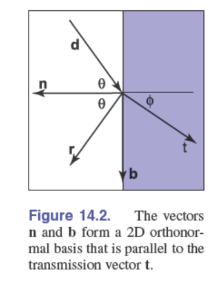

在图形学中我们可以这样认为：**光子是一束光，它有位置、传播方向和波长 λ**。

### 光滑金属

对于光滑的金属，反射光的量由菲涅耳方程决定。方程很简单，但很麻烦。此外，它们的值随光的偏振而变化，这是图形学中通常忽略的一个特性。菲涅耳方程的主要视觉效果是反射率随着入射角的增加而增加，特别是在接近掠角的地方，它达到 100%。

几乎所有的图形程序都使用由 **Schlick(1994)开发的菲涅耳方程作为简单近似**。对于金属，我们通常指定**正入射（垂直入射）**时的**反射率 $R_0(\lambda)$**。反射率应根据菲涅耳方程而变化，Schlick(1994)给出了一个很好的近似。

$$R(\theta,\lambda)=R_0(\lambda)+(1-R_0(\lambda))(1-\cos{\theta})^5$$

式中 θ 为光传播方向与表面法线之间的夹角。

这里，这个近似值允许我们通过数据或肉眼来设置金属的法向反射率。

### 光滑电介质

电介质是一种能折射光线的材料。有一种很好的启发式的记忆方法——如果**材料不是金属，那它就是电介质**。

几乎所有日常材料都是电介质，它们往往是不透明的，因为它们是不同折射率和吸光杂质的混合物。但是**光滑均匀的电介质（匀质）是透明的**，例如玻璃、水和眼睛里的晶状体。

对于光滑的电介质，只有三个重要的性质:

1. 在每个入射角和波长**反射**多少光。
2. 当光以给定的距离和波长穿过材料时，有**多少部分被吸收**。
3. 反射光和折射光的**方向**是什么?

#### 反射率

对于电介质，其反射性能**也可以用 Schlick 方程**来描述。而且其反射率与折射率有比较简单的公式关系，我们可以用折射率 $n(\lambda)$ 计算出法线入射反射率 $R_0(\lambda)$。

当其中一种材料是空气时（$n_i(\lambda) = 1$），

$$R_0(\lambda)=\Big(  \frac{n(\lambda)-1}{n(\lambda)+1} \Big)^2$$

当光线从任意介质 $i$（Incident，折射率为 $n_i$）射入另一种任意介质 $t$（Transmitted，折射率为 $n_t$）时，则适用此公式：

$$R_0(\lambda)=\Big(  \frac{n_t(\lambda)-n_i(\lambda)}{n_t(\lambda)+n_i(\lambda)} \Big)^2$$

由于能量守恒，透射的光量就是没有被反射的光量。所以我们不需要显式地计算传递分数的公式，只需要用总光强相减即可。

> 实际上金属的也具有相似的公式，但由于金属的特殊性质需要引入复折射率。
>
> $$\tilde{n} = n + i k$$
>
> 可以求出从空气到金属上的 `R_0` 为：
>
> $$R_{0} = \frac{(n-1)^2 + k^2}{(n+1)^2 + k^2}$$

#### 折射



##### 折射向量

折射的方向符合斯涅尔定律，我们在初中阶段就学习过。唯一的问题是如何通过简单的方法计算出来。

我们添加一个额外的向量$\mathbf{b}$来与$\mathbf{n}$构成正交基底辅助我们计算。可以知道：

$$\mathbf{d} = \sin\theta \mathbf{b} - \cos\theta \mathbf{n}$$（图形学中$\mathbf{d}$向量一般指向反射面），可以解出：$$\mathbf{b} = \frac{\mathbf{d} + \mathbf{n}\cos\theta}{\sin\theta}$$

由斯涅尔定律：$$n\sin{\theta}=n_t\sin{\phi}$$，$$\cos^2{\phi}=1- \frac{n^2(1-\cos^2{\theta})}{n_t^2}$$

由此，我们可以只通过向量和三角函数的运算得出t：

$$\begin{aligned} \mathbf{t} &= \frac{n(\mathbf{d} + \mathbf{n}\cos\theta)}{n_t} - \mathbf{n}\cos\phi \\ &= \frac{n(\mathbf{d} - \mathbf{n}(\mathbf{d} \cdot \mathbf{n}))}{n_t} - \mathbf{n}\sqrt{1 - \frac{n^2(1 - (\mathbf{d} \cdot \mathbf{n})^2)}{n_t^2}}. \end{aligned}$$

这个公式与 $n$ 和 $n_t$ 哪个更大无关，因为我们推导的过程并没有受到两个角度大小的影响。

我们观察这个公式，会发现如果根式下的数字为负，$\mathbf{t}$ 向量将不是实向量。这时折射向量（折射光）会直接消失，这也就是我们中学就学过的全反射现象（全内反射）。全反射仅发生在 $n > n_t$ 的情况下。

> 需要注意的是，“与 $n$ 和 $n_t$ 哪个更大无关”指的是代数形式可以统一，但实现时必须正确选择入射/出射介质的折射率。在从物质内部射出时，还需要翻转法线（因为法线一般朝向物体外部）。

##### 折射强度

折射光线会随着光线在介质里行进不断损失强度。

在这个过程中，光强度的损失 $dI$ 是由以下的要素决定的：

- **当前的初始光强 $I$** （光越强，被吸收的绝对量就越多）。
- **介质的吸收能力 $C$** （颜色越深的玻璃，吸收越厉害）。
- **行进的距离 $dx$** 

因此，光强度的衰减率可以表示为：$$\frac{dI}{dx} = -CI$$  *(注意这里的负号，表示光强是在减少的)*

解这个微分方程，可以得到：$$I(x) = k \cdot e^{-Cx}$$，k为一个常数

我们将 $x = 0$ 时 $I = I_0$ 代入上面的等式，可以得出$$I_0 = k$$

则我们最终光强的衰减公式为：$$I(x) = I_0 e^{-Cx}$$

但直接使用吸收系数 $C$ 是很难在三维软件里进行直观调节的。美术人员更希望这样控制：“当光线穿过 1 个单位距离的玻璃后，我希望它变成什么颜色？”这也并不困难。

我们换一个符号，将距离写为$s$。我们希望：经过单位距离 ($s=1$)光线的强度衰减为了原来的 $a(a<1)$ 倍。即 $I(1) = a \cdot I_0$

我们将 $s=1$ 代入刚刚解出的公式 $I(s) = I_0 \cdot e^{-Cs}$，得$$a \cdot I_0 = I_0 \cdot e^{-C \cdot 1}$$

可以解得$$I(s) = I_0 \cdot a^s$$

这就是我们在图形学中最常用的光强衰减公式。我们只需要设置每个光通道的a值，就能指定光会如何改变颜色。

> //TODO:物理解释

### 拥有次表面散射的电介质

在现实中，其实绝大多数物体都是拥有次表面散射的电介质。这个名字听起来可能有些唬人，但实际上就是指一般的不透明物体（比如牛奶、木头、皮肤、纸张等）。

从经典电磁学和基础光学的角度来看，物质其实可以被极简地划分为两大阵营：含有**大量自由电子的金属（导体）**和**电子被束缚的电介质（绝缘体/半导体）**。也就是我们在之前讨论到的两种物质。

可是理想中（纯净、均匀、可见光吸收弱）的电介质都是半透明的，为什么现实中的其他物质会出现不透明的情况？

这是由于现实中物体本身的复杂性。我们常说的“透明”，其实是指光线能够**沿直线**穿透物体，这要求材料在光学尺度上是极其均匀的。可是现实中的物体完全不是这样的。现实中绝大多数电介质内部是**非均匀的混合物**，由不同衰减系数的物质，气泡等不均匀分布。

当光线进入这些物质时，会频繁地从一种介质穿入另一种介质。因为这些微小结构之间的**折射率 $n$ 不同**，光线在每一次跨越边界时，都会发生折射和反射。光线在这些物体内部经历了成千上万次的折射和反射，大部分光被“原路弹回”到了空气中（从附近或较远位置重新射出）。这就是**次表面散射 (Subsurface Scattering, 简称 SSS)** 现象。没有被物质吸收最终被反射的光，就是我们在图形学中常说的**漫反射（Diffuse Reflection）**。（漫反射实际上是对浅层SSS的近似，并不是完全的SSS）

另外，根据朗伯比尔定律，不同物质的衰减系数不同（特别是颜料等带有颜色的粒子），光线在复杂的物质内部不断折射和反射时，某些部分波长的光会被更多的吸收。使物质呈现出特定的颜色。

另一种方法导致物体看起来不透明（实际上是失去透视性/变得半透明）是物体表面的粗糙度。这被称为**表面散射（Surface Scattering）**。就比如磨砂玻璃（本质上是那种粗糙的表面），扰动越粗糙，就会出现不透明度。

在微观尺度下，任何看起来粗糙的表面（比如磨砂玻璃、被划伤的冰块）实际上都是由无数个极其微小的、朝向各异的光滑小平面组成的。这些微小的平面在物理和图形学中被称为**微面元（Microfacets）**。光线在每一个微小的面上，依然绝对遵守斯涅尔折射定律和反射定律。

但是，因为每个微小面的倾斜角度不同，平行的入射光打在表面上后，会被折射/反射到四面八方。表面光滑时，反射光集中就会产生常见的镜面高光；表面粗糙时（微面元的法线混乱），反射光分散，就会出现模糊的高光，让物体显得粗糙。这种高光我们在图形学中称为**镜面反射波瓣（Specular Lobe）**。

### 暴力光子追踪器

在我们开始真正实用的图形学PBR渲染之前，我们先来讨论如何暴力模拟光子，然后如何从传感器反向发送伴随(向后)光子。实际上这可以产生很好的图形效果，而且只需要很少的代码，但速度会非常慢。

#### 传感器

我们不需要考虑现实中的传感器如何实现，但是还是要对图像捕获设备有一些概念。

我们可以这样简单的考虑：在空间中有一个矩形的传感器阵列，阵列中的每个传感器本质上都充当光子计数器。当一个光子打到一个传感器时，我们根据光子的波长和强度增加传感器的值。

为了生成彩色图像，我们在传感器前以某种模式放置红、绿、蓝滤光片，使得只有特定波长的光可以被接收。

1. [400,500 nm] 蓝色
2. [500,600 nm] 绿色
3. [600,700 nm] 红色

接着根据小孔成像的原理，我们将传感器阵列放在一个带有小孔的盒子中，只有穿过小孔的光子能够击中传感器。

> 实际上，光栅化渲染也是基于小孔成像原理。但它将成像面（近裁剪面）放置在小孔（摄像机）之前，看起来并不像是小孔成像。根据相似性，我们可以知道两种情况下的像是相同的（但是发生倒置）。

#### 光子追踪器

对于一个光子，我们在光源上随机选择一个点，随机选择一个方向和 400 到 700 nm 之间的随机波长(其他波长不会影响传感器阵列，因此不需要计算)。然后我们模拟光子的前进过程。

当光子碰到一个表面时，我们计算它的反射率（反射强度）并决定是反射还是折射。反射强度的计算由我们前面提到的 Schlick 方程近似得出的，我们称它为 R，现在生成一个均匀随机数 xi∈[0,1]。

```c++
// R 为 Schlick 方程计算出的反射率 (Reflectance) 
// xi 为均匀分布的随机数 [0, 1]
if (xi < R) {
    // 执行反射逻辑 (Reflection)
  	// 创建反射光线并继续追踪
} else {
    // 执行折射逻辑 (Refraction)
  	// 创建折射光线并继续追踪
  	// 如果是金属材质，则光子被吸收
}
```

当光子进入电介质后发生下一次碰撞时，如果比尔定律系数不是 1，那么光子可能被吸收(从而死亡)

```c++
// s  为光子在介质内部行进到下一个交点的距离
// a  为单位距离的存活率（比尔定律系数）
// xi 为新生成的均匀分布随机数 [0, 1]

float survival_prob = pow(a, s); // 实际存活概率随距离呈指数衰减

if (xi < survival_prob) {
    // 光子存活，成功抵达下一个界面，继续传播
    continue_tracking();
} else {
    // 光子在行进途中被吸收（死亡）
}
```

> 我们现在采用的通过随机数 $\xi$ 和反射率 $R$ 来决定发生反射还是折射的算法，被称为**俄罗斯轮盘赌**。
>
> 为什么我们在计算反射时，不直接根据反射强度创建一个新的反射光线和一个折射光线呢？
>
> 实际上这是可行的，但我们选择不采用这种做法。这主要有两个方面的原因：
>
> - 防止指数递归导致的栈溢出。如果一次反射会产生两个新光线，这会导致一次循环中同时产生极其大量的光线，挤爆内存发生栈溢出。
> - 符合光子本身的物理性质。光子在物理上是一种不可分割的粒子，实际上它在反射面只会发生反射或者折射。宏观的反射率实际上是一个统计学现象，在微观反应出来的就是发生反射的概率。

#### 透镜

上面的针孔相机将产生非常清晰的图像，就像一个真正的针孔相机。但这会需要非常长时间的曝光，因为只有极少数光子能够在被吸收之前穿过针孔击中传感器。

我们可以解决这个问题，这需要我们在相机上增加一个镜头（凸透镜）——把针孔变大，把镜头放在针孔的位置。我们可以模拟一套真正的复合玻璃透镜（就像真正的相机那样），也可以我们可以插入一个理想的薄透镜。

最简单的玻璃透镜可以被建模成两个球体的相交部分(“双凸球面透镜”)。这样的透镜也会有不错的成像特性(虽然不如大多数真实相机中的复合镜头好)，并且很容易写出光线求交的代码。

模拟这种实体透镜好处是我们不需要考虑其他要素只是在空间中增加了一个透明物体。成像的原理是由其本身的物理结构导致的，不需要我们做额外操作。

薄透镜是一种理想的透镜，它是无限薄的(一个平面圆盘)，只指定半径(透镜的物理尺寸)和焦距 f。薄透镜的折射可以通过确定以下三个性质来计算:

1. 离开三维点 p 到达透镜中心的光线不会弯曲(我们称这条线从该点穿过 p 的中心线)。
2. 所有离开点 p 到达透镜的线都会在透镜之后汇聚在中心线上的点 q。
3. 点 p 沿透镜光轴的距离 a 和点 q 沿透镜光轴的距离 b，符合薄透镜规律：$1 / a+1 / b=1 / f$

我们只需要对击中薄透镜的光子计算出折射光线即可。

使用真实或理想的镜头会自动产生真实照片中出现的那种模糊，这种成像模糊现象通常称为散焦模糊（失焦Defocus）。我们常说的**景深**是这种现象出现时，画面中被视为清晰的距离范围。

> 实际上，加入透镜时，我们的成像方式改变了。从原先的小孔成像变成了**凸透镜成像**。
>
> 当小孔趋近于无穷小时，小孔成的像是完全清晰的（理论上）。但凸透镜成像不能做到让所有物体的像都完全清晰。
>
> 根据高斯成像公式$$\frac{1}{u} + \frac{1}{v} = \frac{1}{f}$$，不同物距的光子对应的像距也不同。
>
> 对于一个物体来说，它上面的每一个点都会有大量的光子被反射和折射出来。当从这个点出发的光子穿过凸透镜时，最终汇集到对应像距的平面上。如果我们的传感器就位于这个平面上，那么此时我们得到的像是清晰的。
>
> 可传感器只能固定在一个平面上，而我们的每个物体的物距不同，这会导致光子的汇集点在传感器平面的前方或者后。
>
> 在传感器阵列上，这些光子形成的圆锥体被截断形成一个模糊的光斑，我们称之为**弥散圆 (Circle of Confusion)**。
>
> 当弥散圆足够小时，我们认为这个点的成像依然是清晰的。画面中能够保持这种“可接受的清晰度”的**前后距离范围**，就是**景深 (Depth of Field)**。

采用这种光子追踪器模拟还有一个好处，我们可以简单的实现**运动模糊 (Motion Blur)**。只需要让光子在相机记录(或相机快门打开)的时间间隔内以随机时间从光源发射出即可。

#### 逆向追踪

上面的光子追踪器可以产生很好的效果，但依然非常慢。因为即使在你插入一个镜头之后，大多数光子依然不会击中镜头。

既然我们只关心会进入相机的光线，那我们为什么不把过程反过来？

在图形学中我们通常的做法是进行逆向的追踪：从相机发出射线，并在射线击中光源时记录下来。这在我们创造的光子追踪器中并不困难。

我们从每个像素发出光子 (技术上说是伴随光子)，看看它们在哪里碰到光源。这些光子的波长是通过将彩色滤光片作为彩色光线发射器处理的（也就是随机发出不同颜色的光子），当我们碰到光源时，我们用发射光的权重记录光子 (在像素传感器阵列上)。

### 辐射度量学

FCG 原书中的概念看起来有些复杂，那是因为它一开始就更加严谨地考虑了光的波长：把 $Q_\lambda(\lambda)$ 作为光谱能量，也就是能量关于波长的密度函数来考虑。

但是这样看起来更加复杂，不利于初步理解。我们先参考 PBRT 一书的做法：暂时只考虑单色光（或者把波长维度积分掉），用 $Q$ 直接表示总能量。

有四个辐射度量数量是渲染的核心：通量 (flux)、辐射照度 (irradiance)、强度 (intensity)和辐射亮度 (radiance)。它们每个都可以从能量（单位为焦耳）依次对时间、面积和方向取极限推导出来。所有这些辐射度量数量一般都依赖于波长。对于本章的剩余部分，我们不再明确这一依赖关系，但记住这一性质是很重要的。

#### 能量

我们从**能量**开始 (energy)，单位为焦耳 (J)。照射源发射光子 (photon)，每个光子有特定波长并携带特定数量的能量。所有这些基本辐射度量数量实际都是对光子的不同度量。波长为 $\lambda$ 的一个光子携带能量为

$$q(\lambda) = \frac{hc}{\lambda},$$

对于我们所有光子的集合，它们的总能量写作 $Q$，可以通过将每个光子的能量 $q(\lambda_i)$ 相加来计算。

#### （辐射能）通量

辐射通量 $\Phi$ 是辐射能量 $Q$ 对时间的变化率，也就是辐射功率，这个功率可以衡量一定时间内光源的能量产生量。**辐射能通量** (radiant energy flux)，也称为辐射功率 (radiant power)，是单位时间内穿过表面或空间区域的能量总量。辐射通量可以通过求每个微分时间内微分能量的极限算出：

$$\Phi = \lim_{\Delta t \to 0} \frac{\Delta Q}{\Delta t} = \frac{\mathrm{d}Q}{\mathrm{d}t}.$$

它的单位是焦耳/秒，即更常见的瓦特 (watt)(瓦，W)。

反之，设通量是时间的函数，我们可以在一段时间上积分算出总能量：

$$Q = \int_{t_0}^{t_1} \Phi(t) \mathrm{d}t.$$

注意这里的记号有些不正式：在其他问题中，因为光子实际上是离散量子，对趋近于零的微分时间取极限没有实际意义。但对于渲染目的，光子数量相比于我们感兴趣的度量是巨大的，在实践中这一细节不会有问题。

#### 辐射照度

当我们“有多少光照射到这一点？”这个问题时，我们需要将面积因素也纳入考虑范畴。

给定有限区域 $A$，我们可以定义该区域上功率的平均密度 $E = \frac{\Phi}{A}$。该量要么是**辐射照度（irradiance）** (E)，即到达表面的通量面密度，要么是辐射出射度 (M)，即离开表面的通量面密度。这些度量单位为 $\text{W/m}^2$。（术语“辐射照度”有时也用于指代离开表面的通量，但为了清楚起见我们将为两种情况使用不同术语。）

对于点光源例子，外层球面上一点的辐射照度小于内层球面上一点的辐射照度，因为外层球的表面积更大。一般来说，如果点光源朝所有方向进行同样多的照射，则对于这样配置的半径为 $r$ 的球体，

$$E = \frac{\Phi}{4\pi r^2}.$$

该公式解释了为什么一点从光源接收的能量随着到光源距离的平方而下降。

更一般地，我们可以通过取每块微分面上微分功率的极限来定义一点 $p$ 处的辐射照度：

$$E(p) = \lim_{\Delta A \to 0} \frac{\Delta \Phi(p)}{\Delta A} = \frac{\mathrm{d}\Phi(p)}{\mathrm{d}A}.$$

我们也可以在一区域上积分辐射照度以求得功率：

$$\Phi = \int_{A} E(p) \mathrm{d}A.$$

辐射照度方程也可以帮助我们理解朗伯余弦定律的E_θ = E_0 cosθ由来，它指出到达表面光的能量数量正比于光方向与曲面法线夹角的余弦。考虑面积为 $A$ 且通量为 $\Phi$ 的光源照射表面。

如果光源直接向下照射表面，则接收光的表面积 $A_1$ 等于 $A$。于是在 $A_1$ 内任意点的辐射照度为

$$E_1 = \frac{\Phi}{A}.$$

然而，如果光源和表面有倾角，则接收光照的表面积更大。如果 $A$ 很小，则接收通量的区域 $A_2$ 大致为 $\frac{A}{\cos\theta}$。因此对于 $A_2$ 内的点，其辐射照度为

$$E_2 = \frac{\Phi \cos\theta}{A}.$$

#### 立体角与强度

为了定义强度，我们首先需要定义立体角 (solid angle)的表示 。立体角是平面上 2D 角拓展到球上的角。立体角把 2D 单位圆扩展到 3D 单位球。单位球上总面积 $s$ 即物体所对的立体角 。立体角的单位为球面度 (steradian)(sr) 。

整个球体所对的立体角为$4\pi\text{sr}$，半球对应 $2\pi\text{sr}$。

以 $p$ 为球心的单位球上的点集可以用来描述从 $p$ 发出的向量。我们将经常使用符号 $\omega$ 来表示这些方向，并且我们将约定 $\omega$ 是标准化的向量。

现在考虑无穷小光源发射光子。如果我们将该光源置于单位球球心处，则我们可以计算出射功率的角密度。表示为 $I$ 的**辐射强度** (radiant intensity) 就是这样的量；它的单位为 $\text{W}/\text{sr}$。在各向同性的整个球的方向上，我们有

$$I = \frac{\Phi}{4\pi},$$

但更一般地我们感兴趣的是取微分方向锥的极限 ：

$$I = \lim_{\Delta\omega \to 0} \frac{\Delta\Phi}{\Delta\omega} = \frac{\text{d}\Phi}{\text{d}\omega}.$$

和平常一样，我们可以对强度积分回到功率：设强度是方向的函数 $I(\omega)$，我们可以在有限方向集 $\Omega$ 上积分以反求功率：

$$\Phi = \int_{\Omega} I(\omega)\text{d}\omega.$$

强度描述了光的方向分布，但它只对点光源有意义。

#### 辐射亮度

最后，最重要的辐射度量数量是辐射亮度 (radiance) $L$。辐射照度和辐射出射度为我们给出了在点 $p$ 处每块微分面积上的微分功率，但它们不区分功率的方向分布。辐射亮度执行最后一步并度量关于**立体角的辐射照度**或辐射出射度。它定义为

$$L(p, \omega) = \lim_{\Delta\omega \to 0} \frac{\Delta E_{\omega}(p)}{\Delta\omega} = \frac{\text{d}E_{\omega}(p)}{\text{d}\omega} = \frac{\text{d}E(p)}{\text{d}\omega\cos\theta}$$

其中我们已经用 $E_{\omega}$ 表示垂直于方向 $\omega$ 的曲面上的辐射照度。换句话说，辐射亮度并不是根据入射到 $p$ 所在表面上的辐射照度来度量的。实际上，面积计算的这一变化利于抵消辐射亮度定义中来自朗伯定律的项 $\cos\theta$。

辐射亮度是单位面积单位立体角上的通量密度。用通量表示时，它定义为

$$L = \frac{d^2\Phi}{d\omega dA^{\perp}} = \frac{dI}{dA \cos\theta} = \frac{d^2\Phi}{dA \cos\theta\, d\omega}$$

其中 $\text{d}A^{\perp}$ 是 $\text{d}A$ 在垂直于 $\omega$ 的假想面上的投影面积\(dA^\perp = dA\cos\theta\)。因此，它是当所关心的入射方向锥 $\text{d}\omega$ 变得非常小且曲面上关心的局部面积 $\text{d}A$ 也变得非常小时对入射光度量的极限。

所有这些辐射度量数量中，**辐射亮度**是最频繁使用的量。一个直观原因是在一些场景中它是所有辐射度量数量中最为基本的；如果给定辐射亮度，则所有其他值都能通过在面积和方向上对辐射亮度积分而计算出来。辐射亮度另一很好的性质是它在沿穿过空的空间的光线时保持不变。因此它自然是光线追踪要计算的量。

> **辐射度量学**可以这样概括：从能量 \(Q\) 出发，先对时间求变化率得到通量 \(\Phi\)，然后可以按面积分布得到 \(E\)，按方向立体角分布得到 \(I\)，同时按面积和方向分布得到 \(L\)
>
> \[ Q \xrightarrow{/dt} \Phi \]			\[ \Phi \xrightarrow{/dA} E \text{ 或 } M \]
>
> \[ \Phi \xrightarrow{/d\omega} I \]			\[ \Phi \xrightarrow{/dA^\perp d\omega} L \]
>

#### 光谱能量 (补充内容)
##### 光谱能量 (Spectral Energy)

在前面的讨论中，为了简化理解，我们假设光只具有单一波长（单色光），或者把所有波长的能量积分成了一个宏观的总能量 $Q$。但在真实的物理世界中，光源发出的光通常包含一个连续的波长范围（光谱）。

为了严谨地描述这种包含多种波长的光，我们引入**光谱能量 (Spectral Energy)**，记作 $Q_\lambda(\lambda)$。它本质上是能量关于波长的**密度函数**（Spectral Density）：

$$Q_\lambda(\lambda) = \frac{\mathrm{d}Q}{\mathrm{d}\lambda}.$$

通常情况下波长用 nm 度量， $Q_\lambda$ 的单位是 $\text{J/nm}$。某个波长区间 $[\lambda_1, \lambda_2]$ 内的总能量为：

$$Q = \int_{\lambda_1}^{\lambda_2} Q_\lambda(\lambda) \mathrm{d}\lambda.$$

当只考虑 $\lambda$ 附近的微分波长区间 $\mathrm{d}\lambda$ 时，该区间内的微分能量可以表示为：

$$\mathrm{d}Q = Q_\lambda(\lambda) \mathrm{d}\lambda.$$

注意这里有一个容易混淆的点：$q(\lambda)=hc/\lambda$ 是**单个光子**的能量，而 $Q_\lambda(\lambda)$ 是**许多光子或连续光场**在波长维度上的能量密度。两者不是同一个量。如果用 $N_\lambda(\lambda)$ 表示光子数量关于波长的密度，那么可以写成：

$$Q_\lambda(\lambda) = N_\lambda(\lambda)\frac{hc}{\lambda}.$$

##### 辐射度量学的光谱扩展 (Spectral Radiometry)

引入光谱能量后，前面提到的所有辐射度量学概念都可以扩展为光谱形式（Spectral Quantities）。可以把它们理解为“原来的量再对波长取一次密度”，因此单位会在原有基础上再除以一个波长单位：

* **光谱辐射通量 (Spectral Radiant Flux)**: $\Phi_\lambda(\lambda) = \frac{\mathrm{d}\Phi}{\mathrm{d}\lambda} = \frac{\partial^2 Q}{\partial t\,\partial\lambda} = \frac{\partial Q_\lambda(\lambda)}{\partial t}$ （单位: $\text{W/nm}$）
* **光谱辐射照度 (Spectral Irradiance)**: $E_\lambda(\lambda) = \frac{\mathrm{d}E}{\mathrm{d}\lambda} = \frac{\mathrm{d}\Phi_\lambda}{\mathrm{d}A}$ （单位: $\text{W}/(\text{m}^2 \cdot \text{nm})$）
* **光谱辐射强度 (Spectral Radiant Intensity)**: $I_\lambda(\lambda) = \frac{\mathrm{d}I}{\mathrm{d}\lambda} = \frac{\mathrm{d}\Phi_\lambda}{\mathrm{d}\omega}$ （单位: $\text{W}/(\text{sr} \cdot \text{nm})$）
* **光谱辐射亮度 (Spectral Radiance)**: $L_\lambda(\lambda) = \frac{\mathrm{d}L}{\mathrm{d}\lambda} = \frac{\mathrm{d}^3\Phi}{\mathrm{d}A^\perp \mathrm{d}\omega \mathrm{d}\lambda} = \frac{\mathrm{d}^2\Phi_\lambda}{\mathrm{d}A^\perp \mathrm{d}\omega}$ （单位: $\text{W}/(\text{m}^2 \cdot \text{sr} \cdot \text{nm})$）

反过来，只要对波长积分，就能回到前面不显式考虑波长的总量。例如：

$$L = \int_{\lambda_1}^{\lambda_2} L_\lambda(\lambda)\mathrm{d}\lambda.$$

##### 工程实践 

虽然物理上光是一个连续的光谱，但在现代图形学中，进行全光谱渲染（Spectral Rendering，即显式采样或积分波长维度）的成本很高。

实际运用中通常采用**RGB 三通道近似**：
我们在推导物理公式时，先把每个波长独立看成一个标量问题；在代码实现时，再用 R、G、B 三个通道来近似表示完整光谱。于是材质的反射率、光源的强度等参数通常会分别存成 RGB 三个分量，并在反射方程里按通道独立计算。

更准确地说，RGB 并不严格等价于把可见光切成三个狭窄波段，也不等价于只取三个单一波长。它更像是把完整光谱投影到三个颜色通道上，近似保留人眼或显示设备关心的颜色信息。（采用一定算法）

这种做法把复杂的连续光谱计算降维成三次标量计算，效率很高，但也无法准确处理同色异谱、色散、荧光等强烈依赖完整光谱分布的现象。

### BRDF（双向反射分布函数）

我们此前提到了微面元模型，它认为粗糙的表面实际上都是由无数个极其微小的、朝向各异的光滑小平面组成的。我们可以通过精细的建模模拟这种特性。但这需要模型具有非常精细几何细节，而且需要复杂的计算。

图形学中很重要的一点就是通过简化模型对现实进行近似，来提高计算效率。对于粗糙的表面，我们不是用实际的几何形状来表示所有微小的划痕，而是**统计性地表征**表面对不同入射和出射方向的反射分布。**双向反射分布函数(BRDF)** 就是这种表面反射关系的描述；它不只用于粗糙表面，理想漫反射、微表面高光，甚至理想镜面反射（通常用 delta 分布表示）都可以放在这个框架下讨论。

#### BRDF

双向反射分布函数 (bidirectional reflectance distribution function, BRDF) 描述的是：单位入射辐照度会在某个出射方向上产生多少出射辐射亮度。

我们想知道，作为沿方向 $\omega_i$ 入射辐射亮度 $L_i(p, \omega_i)$ 的结果，在朝向观察者的方向 $\omega_o$ 中有多少辐射亮度 $L_o(p, \omega_o)$ 离开表面。

如果方向 $\omega_i$ 视作方向的微分锥，则 $p$ 处的微分辐照度是

$$\text{d}E(p, \omega_i) = L_i(p, \omega_i) \cos \theta_i \text{d}\omega_i.$$

要被反射到方向 $\omega_o$ 的辐射亮度微分量取决于该辐照度。因为几何光学的线性假设，**反射的微分辐射亮度正比于辐照度**

$$\text{d}L_o(p, \omega_o) \propto \text{d}E(p, \omega_i).$$

这个比例系数就为这对特定方向 $\omega_i$ 和 $\omega_o$ 定义了曲面的 BRDF：

$$f_r(p, \omega_o, \omega_i) = \frac{\text{d}L_o(p, \omega_o)}{\text{d}E(p, \omega_i)} = \frac{\text{d}L_o(p, \omega_o)}{L_i(p, \omega_i) \cos \theta_i \text{d}\omega_i}.$$

基于物理的 BRDF 有两个重要性质：

1. **互易性** (reciprocity): 对所有方向对 $\omega_i$ 和 $\omega_o$，$f_r(p, \omega_i, \omega_o) = f_r(p, \omega_o, \omega_i).$
2. **能量守恒**：光反射的总能量少于或等于入射光的能量。对于任意入射方向 $\omega_i$，反射到整个出射半球的比例都不能超过 1：
$$\int_{H^2(n)} f_r(p, \omega_o, \omega_i) \cos \theta_o \text{d}\omega_o \le 1.$$

> 固定点 $p$ 处的 BRDF $f_r(p, \omega_o, \omega_i)$ 是一个**四维函数**，虽然两个方向向量让函数看起来有六个维度。
>
> 但是我们只在意向量的方向，采用单位向量，这引入了一个几何约束等式：$$x^2 + y^2 + z^2 = 1$$。我们可以根据任意两个维度的值推出另一个（比如已知 x，y 可以计算出 ±z）。在考虑反射时，我们只考虑指向平面同一侧的向量，这让我们可以消除 z 的方向歧义。因此我们只需要两个维度的值就可以推出唯一的方向向量。
>
> 一个更容易理解的角度是：建立一个以该测量点为原点、以表面法线为极轴（Z 轴）的**局部球面坐标系（Spherical Coordinates）**。
>
> 在这个半球面坐标系下，任何一条射入或射出的光线方向，都可以通过**两个角度**来唯一确定：**$\theta_i$ (天顶角 / Zenith angle)：** 入射光线与表面法线之间的夹角。**$\phi_i$ (方位角 / Azimuth angle)：** 入射光线在表面上的投影，与表面上某条人为规定的参考切线（X 轴）之间的夹角。

#### 定向半球面反射率

给定 BRDF，我们有时候会需要知道：入射光的反射比例是多少？实际上，反射部分的比例也取决于入射光的方向分布。

对于一个固定的入射方向 $\omega_i$，反射到整个出射半球的比例被称为**定向半球面反射率** $R(\omega_i)$。

$$R(\omega_i) = \int_{H^2(n)} f_r(p, \omega_o, \omega_i) \cos \theta_o \text{d}\omega_o.$$

> 根据定义，表面接收到的入射辐照度微分为：
> $$ \text{d}E_i = L_i(\omega_i) \cos \theta_i \text{d}\omega_i $$
>
> 根据 BRDF 的定义，由于这束特定的入射光，表面在任意出射方向 $\omega_o$ 上产生的反射辐射亮度微分为：
> $$ \text{d}L_o(\omega_o) = f_r(p, \omega_o, \omega_i) \text{d}E_i $$
> *(注：这里的 $\text{d}L_o$ 表示仅由 $\omega_i$ 方向入射光引起的出射辐射亮度。)*
>
> 我们要计算反射到**整个半球空间**的总能量。总反射能量（辐射出射度）是所有出射方向上的辐射亮度在表面法线上的投影积分：
> $$ \text{d}M_o = \int_{H^2(\mathbf{n})} \text{d}L_o(\omega_o) \cos \theta_o \text{d}\omega_o $$
> 将步骤二中的 $\text{d}L_o(\omega_o)$ 代入上式：
> $$ \text{d}M_o = \int_{H^2(\mathbf{n})} \left( f_r(p, \omega_o, \omega_i) \text{d}E_i \right) \cos \theta_o \text{d}\omega_o $$
>
> 反射率的定义是“反射总通量”与“入射总通量”的比值（在这里表现为辐射出射度与辐照度的比值）：
> $$ R(\omega_i) = \frac{\text{d}M_o}{\text{d}E_i} $$
> 将 $\text{d}M_o$ 的表达式代入：
> $$ R(\omega_i) = \frac{\int_{H^2(\mathbf{n})} f_r(p, \omega_o, \omega_i) \text{d}E_i \cos \theta_o \text{d}\omega_o}{\text{d}E_i} $$
> 由于 $\text{d}E_i$ 是一个与积分变量 $\omega_o$ 无关的常数项，可以将其从积分号中提取出来并约掉：
> $$ R(\omega_i) = \int_{H^2(\mathbf{n})} f_r(p, \omega_o, \omega_i) \cos \theta_o \text{d}\omega_o $$

#### 理想漫射 BRDF

理想的漫射曲面称为朗伯曲面。这样的表面在自然界是不可能存在的，但从数学上讲，它们确实能够存在并保证能量守恒。

朗伯 BRDF 的 $f_r$ 值对于所有入射和出射角度都是常数。（注意 $f_r$ 本身不是反射率，而是单位为 $\text{sr}^{-1}$ 的分布函数；真正的反射率需要对出射半球积分得到。）这意味着朗伯表面在所有视角下都具有相同的亮度，并且该亮度将与辐照度成正比。

如果我们计算 $f_r = C$ 的朗伯曲面的 $R(\omega_i)$，可以得到：

$$R(\omega_i) = \int_{H^2(n)} C \cos \theta_o \text{d}\omega_o$$

$$= \int_{\phi_o=0}^{2\pi} \int_{\theta_o=0}^{\pi/2} C \cos \theta_o \sin \theta_o \text{d}\theta_o \text{d}\phi_o$$

$$= \pi C.$$

因此，要让朗伯曲面的半球反射率为 $\rho$，就需要 $C = \rho/\pi$，也就是

$$f_r(p, \omega_o, \omega_i) = \frac{\rho}{\pi}.$$

当 $\rho = 1$ 时，它是数学上的完美漫反射上限；实际材质通常满足 $\rho < 1$。

#### 传递方程

BRDF 的定义告诉我们：某个入射方向 $\omega_i$ 上的一小束光，会对出射方向 $\omega_o$ 上的辐射亮度产生一个微分贡献。

在前面我们已经写过入射辐照度：

$$\text{d}E(p, \omega_i) = L_i(p, \omega_i) \cos \theta_i \text{d}\omega_i.$$

根据 BRDF 的定义：

$$f_r(p, \omega_o, \omega_i) = \frac{\text{d}L_o(p, \omega_o)}{\text{d}E(p, \omega_i)}.$$

所以，这一小束入射光对出射辐射亮度的贡献就是

$$\text{d}L_o(p, \omega_o) = f_r(p, \omega_o, \omega_i)L_i(p, \omega_i)\cos \theta_i \text{d}\omega_i.$$

这条式子可以这样理解：

- $L_i(p, \omega_i)$：从方向 $\omega_i$ 到达点 $p$ 的入射辐射亮度。
- $\cos\theta_i$：斜着照射时，同一束光摊到更大的表面面积上，因此单位面积收到的能量减少。
- $\text{d}\omega_i$：这束光只占一个很小的方向范围。
- $f_r(p, \omega_o, \omega_i)$：表面材质决定有多少入射光会被反射到 $\omega_o$。

如果要得到点 $p$ 沿方向 $\omega_o$ 离开的总反射辐射亮度，就需要把所有可能入射方向的贡献加起来：

$$L_o(p, \omega_o) = \int_{H^2(n)} f_r(p, \omega_o, \omega_i)L_i(p, \omega_i)\cos \theta_i \text{d}\omega_i.$$

这就是最常见的**反射方程**。如果表面本身还会发光，需要额外加上自发光项：

$$L_o(p, \omega_o) = L_e(p, \omega_o) + \int_{H^2(n)} f_r(p, \omega_o, \omega_i)L_i(p, \omega_i)\cos \theta_i \text{d}\omega_i.$$

这条式子可以看作**渲染方程**的一种局部形式。它说的是：一个点看到的出射光，等于自己发出的光，加上它从所有方向收到的光经过 BRDF 反射后的结果。完整的渲染方程还会进一步说明这些入射光来自场景中其他点的出射光。

---

上面的公式是按方向积分的，也就是在点 $p$ 周围的半球 $H^2(n)$ 上积分。但在一个封闭场景中，进入 $p$ 的光并不是凭空来的，它一定来自场景里的其他表面点。

设另一个表面点为 $p'$。从 $p$ 看向 $p'$ 的方向为

$$\omega_i = \frac{p' - p}{\|p' - p\|}.$$

注意这里使用 PBRT 的方向约定：$\omega_i$ 表示从着色点 $p$ 指向入射光来源的方向。真实光线的传播方向则是从 $p'$ 到 $p$。

如果 $p$ 能看见 $p'$，那么 $p$ 从方向 $\omega_i$ 收到的入射辐射亮度，就是 $p'$ 朝向 $p$ 发出的出射辐射亮度：

$$L_i(p, \omega_i) = L_o(p', -\omega_i).$$

接下来要做的是把方向积分中的 $\text{d}\omega_i$ 换成 $p'$ 附近的面积微元 $\text{d}A'$。

从 $p$ 看过去，$p'$ 附近的一小块面积 $\text{d}A'$ 所占的立体角为

$$\text{d}\omega_i = \frac{|\cos\theta'|}{\|p' - p\|^2}\text{d}A'.$$

其中 $\theta'$ 是 $p'$ 的表面法线 $n'$ 与方向 $-\omega_i$ 的夹角。这个式子包含两个因素：

- 距离越远，同样大的面积看起来占据的立体角越小，所以有 $\frac{1}{\|p' - p\|^2}$。
- 面片越倾斜，从 $p$ 看起来的投影面积越小，所以有 $|\cos\theta'|$。

将它代入反射方程，可以得到按场景表面积分的形式：

$$L_o(p, \omega_o) = L_e(p, \omega_o) + \int_A f_r(p, \omega_o, \omega_i)L_o(p', -\omega_i)\frac{|\cos\theta_i||\cos\theta'|}{\|p' - p\|^2}V(p, p')\text{d}A'.$$

其中：

$$\omega_i = \frac{p' - p}{\|p' - p\|}.$$

$V(p, p')$ 是**可见性函数**：如果 $p$ 和 $p'$ 之间没有遮挡，$V(p, p') = 1$；如果中间被遮挡，$V(p, p') = 0$。

这里 $\cos\theta_i = n(p)\cdot\omega_i$，$\cos\theta' = n(p')\cdot(-\omega_i)$。对于纯 BRDF，只有入射和出射方向都位于对应表面的正面半球时才有贡献；否则贡献为 0。

PBRT 中常把距离、两个余弦项和可见性合在一起写成**几何项**：

$$G(p \leftrightarrow p') = \frac{|\cos\theta_i||\cos\theta'|}{\|p' - p\|^2}V(p, p').$$

于是传递方程可以写得更紧凑：

$$L_o(p, \omega_o) = L_e(p, \omega_o) + \int_A f_r(p, \omega_o, \omega_i)L_o(p', -\omega_i)G(p \leftrightarrow p')\text{d}A'.$$

这就是传递方程的核心含义：**点 $p$ 的出射光，来自场景中所有能看见的其他点 $p'$ 的出射光；这些光经过距离衰减、两个表面的夹角投影、可见性判断，再由 $p$ 处的 BRDF 分配到观察方向 $\omega_o$。**

如果暂时不考虑自发光表面，可以令 $L_e(p, \omega_o)=0$。如果只对可见点积分，也可以把 $V(p,p')$ 省略，因为积分域本身已经排除了被遮挡的点。
