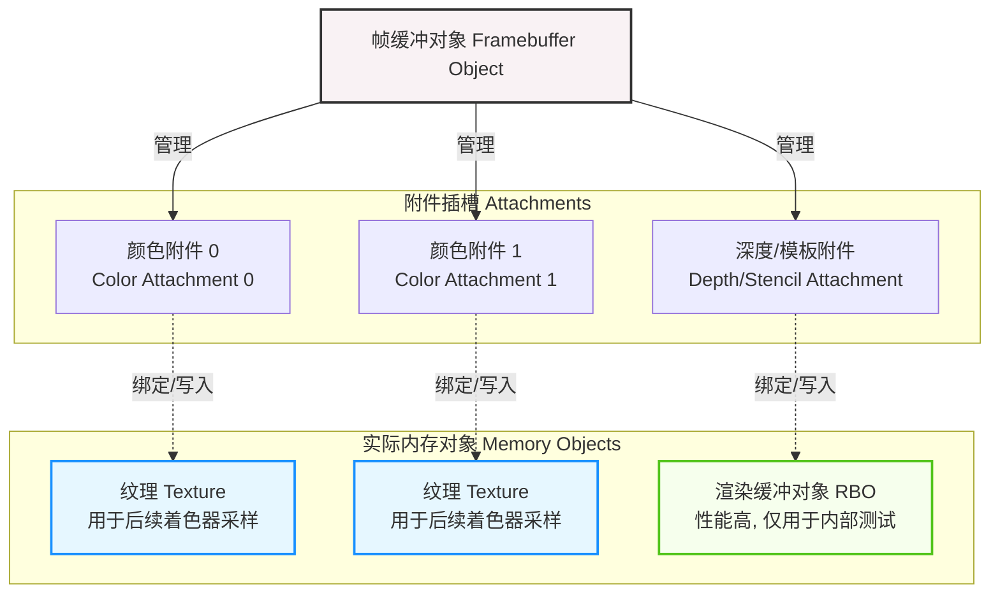

### 概念

- **帧缓冲对象 (Framebuffer Object, FBO)：** 它是管理者，本身**不包含**任何用于存储图像的内存。它只是一个状态机，负责管理各种“挂载点”（附件）。如果你不绑定自定义的 FBO，OpenGL 会默认渲染到屏幕（默认帧缓冲）上。
- **附件 (Attachment)：** 它们是 FBO 上的“插槽”。主要分为三种：颜色附件（Color Attachment，可以有多个）、深度附件（Depth Attachment）和模板附件（Stencil Attachment）。你必须把实际的内存对象插入这些插槽，FBO 才能工作。
- **纹理 (Texture)：** 实际的内存数据块。当把纹理挂载到 FBO 的**颜色附件**上时，OpenGL 的渲染指令就会把像素数据画到这张纹理里。它的最大优势是**可读写**：渲染完成后，你可以把这张纹理传给其他的着色器（Shader）进行采样（Sample），比如用来做屏幕模糊特效。
- **渲染缓冲对象 (Renderbuffer Object, RBO)：** 也是实际的内存数据块，但它是为 OpenGL **内部执行高度优化**的。它的最大特点是**通常只写不可读**（很难直接提取数据给着色器采样）。因此，RBO 非常适合用作不需要被后续着色器读取的附件，最典型的应用就是挂载到**深度和模板附件**上，用来做深度测试和模板测试。



### 伪代码使用

```c++
// 1. 创建并绑定帧缓冲对象 (FBO)
unsigned int fbo;
glGenFramebuffers(1, &fbo);
glBindFramebuffer(GL_FRAMEBUFFER, fbo);

// ---------------------------------------------------------
// 2. 创建纹理对象，并将其作为【颜色附件】挂载到 FBO
// ---------------------------------------------------------
unsigned int textureColorBuffer;
glGenTextures(1, &textureColorBuffer);
glBindTexture(GL_TEXTURE_2D, textureColorBuffer);
// 分配内存，但不填充数据 (NULL)
glTexImage2D(GL_TEXTURE_2D, 0, GL_RGB, 800, 600, 0, GL_RGB, GL_UNSIGNED_BYTE, NULL);
// 设置过滤参数
glTexParameteri(GL_TEXTURE_2D, GL_TEXTURE_MIN_FILTER, GL_LINEAR);
glTexParameteri(GL_TEXTURE_2D, GL_TEXTURE_MAG_FILTER, GL_LINEAR);
// 将纹理挂载到 FBO 的颜色附件0上
glFramebufferTexture2D(GL_FRAMEBUFFER, GL_COLOR_ATTACHMENT0, GL_TEXTURE_2D, textureColorBuffer, 0);

// ---------------------------------------------------------
// 3. 创建渲染缓冲对象 (RBO)，并将其作为【深度和模板附件】挂载到 FBO
// ---------------------------------------------------------
unsigned int rbo;
glGenRenderbuffers(1, &rbo);
glBindRenderbuffer(GL_RENDERBUFFER, rbo);
// 分配内存，专门用于深度和模板格式 (GL_DEPTH24_STENCIL8)
glRenderbufferStorage(GL_RENDERBUFFER, GL_DEPTH24_STENCIL8, 800, 600);
// 将 RBO 挂载到 FBO 的深度和模板附件上
glFramebufferRenderbuffer(GL_FRAMEBUFFER, GL_DEPTH_STENCIL_ATTACHMENT, GL_RENDERBUFFER, rbo);

// ---------------------------------------------------------
// 4. 检查帧缓冲是否完整 (所有必需的附件都已配置正确)
// ---------------------------------------------------------
if(glCheckFramebufferStatus(GL_FRAMEBUFFER) != GL_FRAMEBUFFER_COMPLETE)
    std::cout << "ERROR::FRAMEBUFFER:: Framebuffer is not complete!" << std::endl;

// 5. 解绑自定义 FBO，切回默认帧缓冲 (屏幕)
glBindFramebuffer(GL_FRAMEBUFFER, 0);

// =========================================================
// 渲染循环中的使用方式
// =========================================================
// while(!glfwWindowShouldClose(window)) {
//     // 第一阶段：渲染到自定义帧缓冲 (离屏渲染)
//     glBindFramebuffer(GL_FRAMEBUFFER, fbo);
//     glClear(GL_COLOR_BUFFER_BIT | GL_DEPTH_BUFFER_BIT);
//     DrawScene(); // 你的场景现在被画到了 textureColorBuffer 里
//
//     // 第二阶段：回到默认帧缓冲，使用刚才生成的纹理进行渲染
//     glBindFramebuffer(GL_FRAMEBUFFER, 0);
//     glClear(GL_COLOR_BUFFER_BIT);
//     UsePostProcessingShader(); // 使用后处理着色器
//     glBindTexture(GL_TEXTURE_2D, textureColorBuffer); // 传入刚才画好的纹理
//     DrawScreenQuad(); // 画一个铺满屏幕的矩形来显示结果
// }
```

```c++
    // 在macos上，缓冲区大小实际不一定等于屏幕大小
    int fbWidth, fbHeight;
    glfwGetFramebufferSize(window, &fbWidth, &fbHeight);

    unsigned int FBO;
    glGenFramebuffers(1, &FBO);
    glBindFramebuffer(GL_FRAMEBUFFER, FBO);

    unsigned int textureColorBuffer;
    glGenTextures(1, &textureColorBuffer);
    glBindTexture(GL_TEXTURE_2D, textureColorBuffer);
    glTexImage2D(GL_TEXTURE_2D, 0, GL_RGB, fbWidth, fbHeight, 0, GL_RGB, GL_UNSIGNED_BYTE, nullptr);
    glTexParameteri(GL_TEXTURE_2D, GL_TEXTURE_MIN_FILTER, GL_LINEAR);
    glTexParameteri(GL_TEXTURE_2D, GL_TEXTURE_MAG_FILTER, GL_LINEAR);
    glFramebufferTexture2D(GL_FRAMEBUFFER, GL_COLOR_ATTACHMENT0, GL_TEXTURE_2D, textureColorBuffer, 0);

    unsigned int rbo;
    glGenRenderbuffers(1, &rbo);
    glBindRenderbuffer(GL_RENDERBUFFER, rbo);
    glRenderbufferStorage(GL_RENDERBUFFER, GL_DEPTH24_STENCIL8, fbWidth, fbHeight);
    glFramebufferRenderbuffer(GL_FRAMEBUFFER, GL_DEPTH_STENCIL_ATTACHMENT, GL_RENDERBUFFER, rbo);
    if (glCheckFramebufferStatus(GL_FRAMEBUFFER) != GL_FRAMEBUFFER_COMPLETE) {
        std::cout << "Framebuffer not complete" << std::endl;
        return -1;
    }
    glBindFramebuffer(GL_FRAMEBUFFER, 0);

    unsigned int mirrorFBO;
    glGenFramebuffers(1, &mirrorFBO);
    glBindFramebuffer(GL_FRAMEBUFFER, mirrorFBO);
    unsigned int mirrorTexture;
    glGenTextures(1, &mirrorTexture);
    glBindTexture(GL_TEXTURE_2D, mirrorTexture);
    glTexImage2D(GL_TEXTURE_2D, 0, GL_RGB, fbWidth, fbHeight, 0, GL_RGB, GL_UNSIGNED_BYTE, nullptr);
    glTexParameteri(GL_TEXTURE_2D, GL_TEXTURE_MIN_FILTER, GL_LINEAR);
    glTexParameteri(GL_TEXTURE_2D, GL_TEXTURE_MAG_FILTER, GL_LINEAR);
    glFramebufferTexture2D(GL_FRAMEBUFFER, GL_COLOR_ATTACHMENT0, GL_TEXTURE_2D, mirrorTexture, 0);

    unsigned int mirrorRBO;
    glGenRenderbuffers(1, &mirrorRBO);
    glBindRenderbuffer(GL_RENDERBUFFER, mirrorRBO);
    glRenderbufferStorage(GL_RENDERBUFFER, GL_DEPTH24_STENCIL8, fbWidth, fbHeight);
    glFramebufferRenderbuffer(GL_FRAMEBUFFER, GL_DEPTH_STENCIL_ATTACHMENT, GL_RENDERBUFFER, mirrorRBO);
    if (glCheckFramebufferStatus(GL_FRAMEBUFFER) != GL_FRAMEBUFFER_COMPLETE) {
        std::cout << "Mirror Framebuffer not complete" << std::endl;
        return -1;
    }
    glBindFramebuffer(GL_FRAMEBUFFER, 0);
```


### 卷积核/卷积矩阵/掩膜

卷积核的使用是把原始矩阵中的每一个元素，都与其相邻的元素根据卷积核的权重分布做**加权平均**

通常采用3*3矩阵，并且矩阵元素之和为1