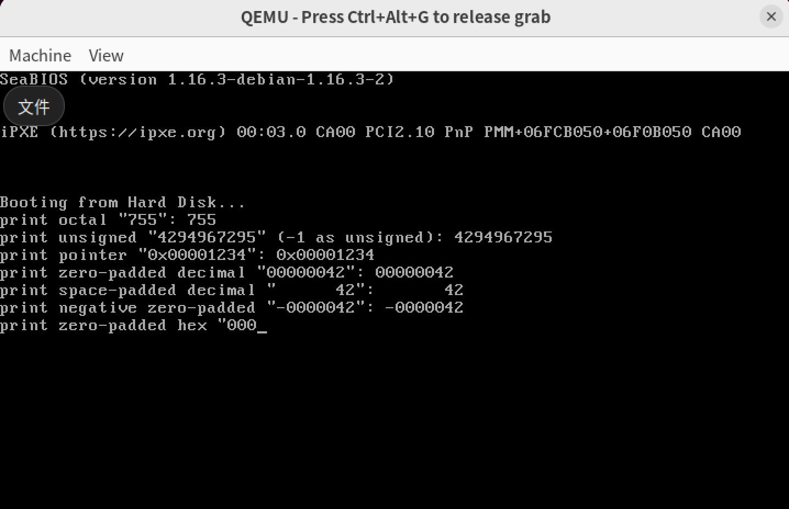
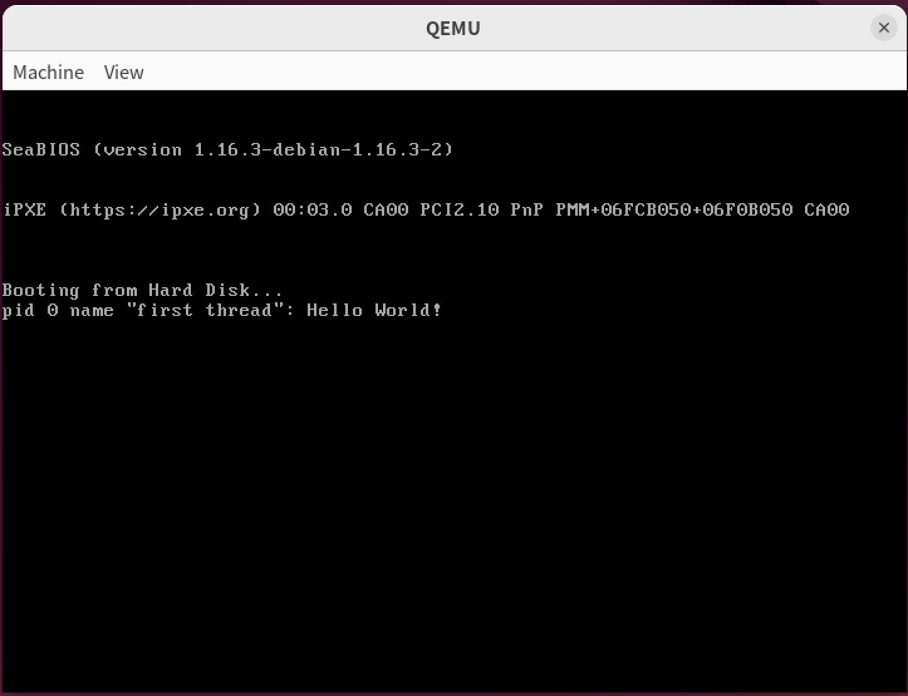
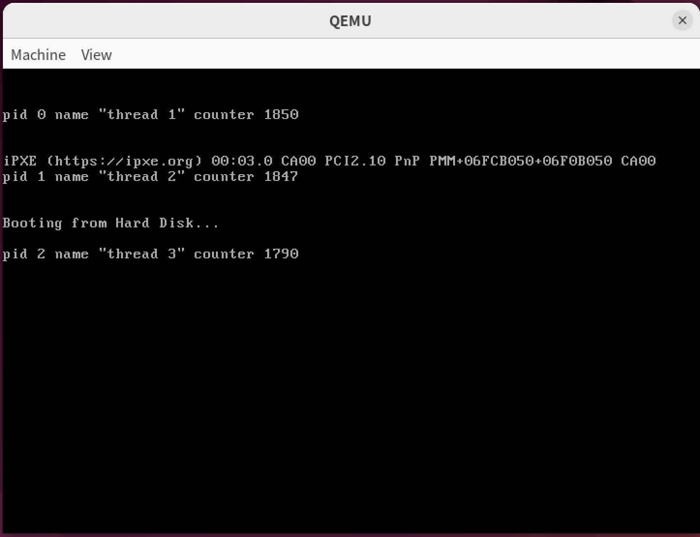
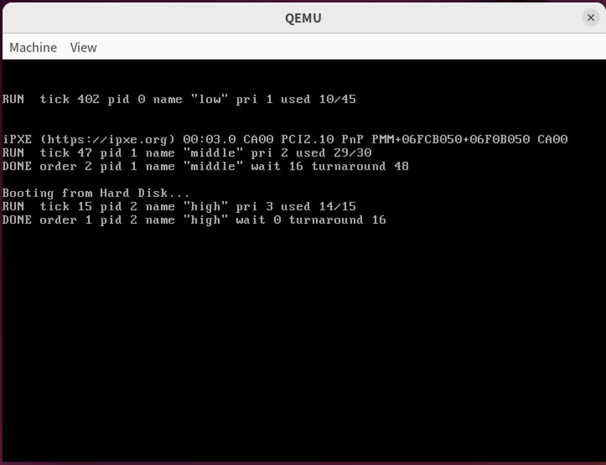
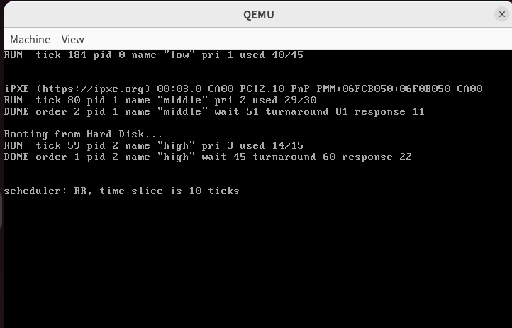

# Lab5 内核线程

### 实验环境

- 操作系统版本：虚拟机ubuntu arm64 22.04LTS
- CPU 架构：ARM64
- 主要工具：QEMU、gdb/gdb-multiarch、gcc/g++ 或 i686-elf-gcc/g++

### 实验概述

本次实验围绕格式化输出、内核线程、线程切换机制和调度算法展开，主要任务如下：

- 实验任务1：学习C语言的可变参数机制，理解可变参数在32位保护模式下基于栈传参的实现方法，并实现自己的`va_list`、`va_start`、`va_arg`、`va_end`宏。在此基础上实现一个较为简单的`printf`函数，并进一步扩展`%o`、`%u`、`%p`和`%0Nd`等格式化输出能力。
- 实验任务2：实现内核线程机制，设计PCB结构，完成PCB分配、线程创建、线程栈初始化和线程退出处理，并基于时钟中断实现时间片轮转调度。通过创建多个线程在不同屏幕行输出线程标识和计数器，观察线程并发执行和轮转切换效果。
- 实验任务3：使用gdb跟踪线程调度和切换过程，重点观察`c_time_interrupt_handler`、`ProgramManager::schedule`和`asm_switch_thread`中的栈指针、寄存器和`eip`变化，分析新线程首次运行以及已运行线程被中断后恢复执行的过程，并画出两种情况下的线程栈布局。
- 实验任务4：在时间片轮转调度的基础上实现一种新的调度算法，本实验选择优先级调度算法。通过同一组具有不同执行时间和优先级的测试线程，对比RR调度和优先级调度下的执行顺序、等待时间、周转时间以及算法优缺点。

### A1 可变参数函数与printf实现

#### 可变参数的实现

C语言的可变参数函数本身是语法特性，只是我们通常使用C语言的<stdarg.h>库来辅助实现避免复杂性。我们也可以不依赖标准库自行实现一个可变参数函数。

```c++
// ...作为C语言本身的语法特性，不需要依赖标准库
int sum(int count, ...) { /* 具体实现 */ }
int main() {
    int result = sum(3, 10, 20, 30); // 传入3个可变参数：10, 20, 30
    return 0;
}
```

在32位保护模式下，C语言编译器实际上只干了一件事，把参数都压入栈内：

```assembly
push 30          ; 压入第4个参数 (可变)
push 20          ; 压入第3个参数 (可变)
push 10          ; 压入第2个参数 (可变)
push 3           ; 压入第1个参数 count (固定)
call sum         ; 调用 sum 函数 (这会将返回地址压栈)
add esp, 16      ; 调用者清理栈 4个参数 * 4字节 = 16字节
```

我们只需要想办法处理所有的参数，就可以实现所需的可变参数函数的效果。

我们可以参考C语言<stdarg.h>库中的实现方法，来实现自己的可变参数函数。库中采用了一个变量类型和三个宏实现：

```C++
va_list // 定义一个指针变量，用于遍历可变参数列表。
va_start(ap, last) // 初始化 va_list 变量 ap，使其指向最后一个固定参数 last 之后的第一个可变参数。
va_arg(ap, type) // 获取当前参数的值，并将指针 ap 移动到下一个参数。必须指定正确的 type。
va_end(ap) // 清理工作 通常在函数返回前调用。
```

其中较为关键的在于两点：

- 可变参数函数至少具有一个固定参数。这是由于我们不知道函数具体有多少参数，什么时候结束，需要通过固定参数或格式约定获取。比如printf是通过格式字符串结尾的`\0`结束函数，而这里的sum直接指定参数个数。
- 每个可变参数的类型需要能够被确定。即使32位保护模式下我们压入栈中的变量按照顺序排列，我们依然需要能够确定其大小。关键在于此时不能使用简单的sizeof()确定其大小。

```c++
typedef char *va_list;
#define _INTSIZEOF(n) ((sizeof(n) + sizeof(int) - 1) & ~(sizeof(int) - 1))
#define va_start(ap, v) (ap = (va_list)&v + _INTSIZEOF(v))
#define va_arg(ap, type) (*(type *)((ap += _INTSIZEOF(type)) - _INTSIZEOF(type)))
#define va_end(ap) (ap = (va_list)0)
```

这段代码中最重要的是_INTSIZEOF(n)的实现。实际上这个公式使用了位运算来实现高效的向上取整。它会将变量的大小取整到比它大的最小4的倍数。比如当 `n` 是 `char` (1字节) 时：`(1 + 3) & ~3` => `4 & 1111...1100` = 4 字节。

这是由于C语言规定，在传递可变参数时，会发生默认参数提升：`char` 和 `short` 会被强制提升为 `int`。`float` 会被强制提升为 `double`。

接着我们就可以用这些定义的宏来实现我们自己的可变参数函数了。

```c++
int sum(int count, ...) {
    va_list ap;
    va_start(ap, count); // 将ap初始化为count的下一个参数
    int total = 0;
    
    for (int i = 0; i < count; ++i) {
        total += va_arg(ap, int); // 获取参数值并移动ap指针
    }
    
    va_end(ap);
    return total;
}
```

#### A1.1`printf()`的实现

根据这个原理，我们可以实现一个基础的`printf()`函数

```C++
int printf(const char *const fmt, ...)
{
    const int BUF_LEN = 32;
    char buffer[BUF_LEN + 1];
    char number[33];
  
    int idx, counter;
    va_list ap;

    va_start(ap, fmt);
    idx = 0;
    counter = 0;

    for (int i = 0; fmt[i]; ++i)
    {
        if (fmt[i] != '%')
        {
            counter += printf_add_to_buffer(buffer, fmt[i], idx, BUF_LEN);
        }
        else
        {
            i++;
            if (fmt[i] == '\0') { break; }

            switch (fmt[i])
            {
            case '%':
                counter += printf_add_to_buffer(buffer, fmt[i], idx, BUF_LEN);
                break;

            case 'c':
                counter += printf_add_to_buffer(buffer, va_arg(ap, int), idx, BUF_LEN);
                // char 会在可变参数传递时提升为 int，因此这里按 int 取出
                break;
                
						//...其他具体实现
            }
        }
    }

    buffer[idx] = '\0';
    counter += stdio.print(buffer);// 由于我们连putchar都没有，这里需要自行实现一个打印字符串的功能，在前面的实验中已经做过了

    return counter;
}
```

基础版本主要支持`%%`、`%c`、`%s`、`%d`和`%x`等格式。后续增强版本在保留这些基础格式的基础上，继续增加无符号数、八进制、指针地址和补零宽度等输出能力。

#### A1.2扩展实现：`%o %u %p %0Nd`的实现

实际上这几个处理方式比较相似，我们可以一起实现它们。

```c++
for (int i = 0; fmt[i]; ++i) {
        if (fmt[i] != '%') {
            counter += printf_add_to_buffer(buffer, fmt[i], idx, BUF_LEN);
        } else {
            i++; // 跳过 '%'
            if (fmt[i] == '\0') break;

            int width = 0;
            int zero_pad = 0;

            // 解析 '0' 标志
            if (fmt[i] == '0') {
                zero_pad = 1;
                i++;
            }
            // 解析宽度 N
            while (fmt[i] >= '0' && fmt[i] <= '9') {
                width = width * 10 + (fmt[i] - '0');
                i++;
            }

            char spec = fmt[i];
            switch (spec) {
								// ... 其他实现
                case 'd':
                case 'u':
                case 'x':
                case 'o':
                case 'p': {
                    unsigned int num = 0;
                    int base = 10;
                    int is_neg = 0;

                    if (spec == 'p') {
                        num = (unsigned int)va_arg(ap, void *);
                        base = 16;
                        zero_pad = 1;
                        if (width < 8) width = 8; // %p 强制至少8位
                        counter += printf_add_to_buffer(buffer, '0', idx, BUF_LEN);
                        counter += printf_add_to_buffer(buffer, 'x', idx, BUF_LEN);
                    } else if (spec == 'd') {
                        int val = va_arg(ap, int);
                        base = 10;
                        if (val < 0) {
                            is_neg = 1;
                            num = (val == 0x80000000) ? 0x80000000U : (unsigned int)(-val);
                        } else {
                            num = (unsigned int)val;
                        }
                    } else if (spec == 'u') {
                        num = va_arg(ap, unsigned int);
                        base = 10;
                    } else if (spec == 'x') {
                        num = va_arg(ap, unsigned int);
                        base = 16;
                    } else if (spec == 'o') {
                        num = va_arg(ap, unsigned int);
                        base = 8;
                    }

                    itos(number, num, base);
                  	int len = 0;
										while (number[len] != '\0') {
    										len++;
										}
										int total_len = len + is_neg;
                    int pad = (width > total_len) ? (width - total_len) : 0;

                    // 输出前导填充/符号
                    if (!zero_pad) {
                        for (int k = 0; k < pad; k++)
                            counter += printf_add_to_buffer(buffer, ' ', idx, BUF_LEN);
                        if (is_neg)
                            counter += printf_add_to_buffer(buffer, '-', idx, BUF_LEN);
                    } else {
                        if (is_neg)
                            counter += printf_add_to_buffer(buffer, '-', idx, BUF_LEN);
                        for (int k = 0; k < pad; k++)
                            counter += printf_add_to_buffer(buffer, '0', idx, BUF_LEN);
                    }

                    // 输出数字本体
                    for (int k = 0; k < len; k++)
                        counter += printf_add_to_buffer(buffer, number[k], idx, BUF_LEN);
                    break;
                }

            }
        }
    }
```

关键在于以下几点：

- 为这几个数字类型`%u %o %0Nd`统一输出方式，提前分析进制，宽度，是否有负号最后统一输出。
- `%p`时直接变量地址，然后将其视为0x开头宽度恒为8的16进制数输出。

我们用一个测试函数测试：

```c++
    printf("print octal \"755\": %o\n"
           "print unsigned \"4294967295\" (-1 as unsigned): %u\n"
           "print pointer \"0x00001234\": %p\n"
           "print zero-padded decimal \"00000042\": %08d\n"
           "print space-padded decimal \"      42\": %8d\n"
           "print negative zero-padded \"-0000042\": %08d\n"
           "print zero-padded hex \"00001234\": %08x\n",
           0755,            // 八进制字面量，预期输出 755
           -1,              // 传入 -1，按无符号解析应为 4294967295
           (void*)0x1234,   // 指针，预期输出 0x00001234
           42,              // %08d，预期输出 00000042
           42,              // %8d，预期输出 6个空格 + 42
           -42,             // %08d，预期输出 -0000042 (负号占一位)
           0x1234);         // %08x，预期输出 00001234
```

输出结果符合预期：



### A2 内核线程

内核线程实际上就是在操作系统内核中实现了线程的机制。线程是实际的程序运作单位。

内核线程可以视为内核中的执行流。同一进程创建的线程共享进程所拥有的资源，而调度器实际调度的是线程本身，会将CPU时间分配给每一个可运行线程。

我们这次不会创建进程，而是让所有线程都运行在操作系统内核中，先学习线程的调度。

#### PCB

我们使用一个数据结构——**PCB(Process Control Block)**进程控制块来保存线程的信息。

> 为什么这里仍使用PCB来描述线程？这里的设计可以参考Linux系统的实现方案。Linux 将线程视为**轻量级进程（Lightweight Process, LWP）**，无论是进程还是线程，都使用同一个数据结构`task_struct` 来表示。这代表着如果几个 `task_struct` 共享同一个虚拟地址空间（以及打开的文件等资源），它们就是**线程**。如果一个 `task_struct` 拥有自己独立的虚拟地址空间，它就是传统意义上的**进程**。

```c++
// 线程的状态有5个，分别是创建态、运行态、就绪态、阻塞态和终止态。
enum ProgramStatus
{
    CREATED,
    RUNNING,
    READY,
    BLOCKED,
    DEAD
};

struct PCB
{
    int *stack;                      // 栈指针，用于调度时保存esp，初始指向PCB页的末尾
    char name[MAX_PROGRAM_NAME + 1]; // 线程名
    enum ProgramStatus status;       // 线程的状态
    int priority;                    // 线程优先级
    int pid;                         // 线程pid
    int ticks;                       // 线程时间片总时间
    int ticksPassedBy;               // 线程已执行时间
    ListItem tagInGeneralList;       // 线程队列标识 ListItem是链表节点
    ListItem tagInAllList;           // 线程队列标识
};
```

#### PCB分配

我们目前没有内存管理的知识，只能在内存中预留了若干个PCB的内存空间来存放和管理PCB。

```c++
// PCB的大小，4KB。
const int PCB_SIZE = 4096;         
// 存放PCB的数组，预留了MAX_PROGRAM_AMOUNT个PCB的大小空间。
char PCB_SET[PCB_SIZE * MAX_PROGRAM_AMOUNT]; 
// PCB的分配状态，true表示已经分配，false表示未分配。
bool PCB_SET_STATUS[MAX_PROGRAM_AMOUNT];     
```

```c++
class ProgramManager
{
public:
    List allPrograms;   // 所有状态的线程/进程的队列
    List readyPrograms; // 处于ready(就绪态)的线程/进程的队列

public:
    ProgramManager();
    void initialize(); // 调用成员的初始化函数 将所有PCB状态设置为false
    
    // 分配一个PCB 只需要找到一个未被分配的PCB返回即可
    PCB *allocatePCB();
    // 归还一个PCB 将PCB对应的状态设置为false
    // program：待释放的PCB
    void releasePCB(PCB *program);
};
```

#### 线程初始化

线程实际上执行的是某一个函数的代码，但不是所有的函数都可以放入到线程中执行。这里我们规定**线程只能执行返回值为`void`，参数为`void *`的函数**，其中，`void *`指向了函数的参数。

```c++
//ThreadFunction是 一个指向 （返回值为 void，且接受一个 void *作为参数的函数） 的函数指针
typedef void(*ThreadFunction)(void *); 
// C++中也可以写作
using ThreadFunction = void (*)(void *);
```

我们给ProgramManager增加一个分配函数

```c++
    // 创建一个线程并放入就绪队列
    // function：线程执行的函数
    // parameter：指向函数的参数的指针
    // name：线程的名称
    // priority：线程的优先级
    // 成功，返回pid；失败，返回-1
    int executeThread(ThreadFunction function, void *parameter, const char *name, int priority);
```

```c++
int ProgramManager::executeThread(ThreadFunction function, void *parameter, const char *name, int priority)
{
    // 关中断，防止创建线程的过程被打断
    bool status = interruptManager.getInterruptStatus();
    interruptManager.disableInterrupt();

    // 分配一页作为PCB
    PCB *thread = allocatePCB();

    if (!thread)
        return -1;

    // 初始化分配的页
    memset(thread, 0, PCB_SIZE);

    for (int i = 0; i < MAX_PROGRAM_NAME && name[i]; ++i)
    {
        thread->name[i] = name[i];
    }

    thread->status = ProgramStatus::READY; // 所有的线程初始化为READY
    thread->priority = priority;
    thread->ticks = priority * 10; // 默认的执行tick数设置为优先级的10倍
    thread->ticksPassedBy = 0;
    thread->pid = ((int)thread - (int)PCB_SET) / PCB_SIZE; // pid直接采用PCB的位置索引

    // 线程栈
    thread->stack = (int *)((int)thread + PCB_SIZE);
    thread->stack -= 7;
    thread->stack[0] = 0; // 这四个0预留给寄存器使用
    thread->stack[1] = 0;
    thread->stack[2] = 0;
    thread->stack[3] = 0;
    thread->stack[4] = (int)function; // 线程函数起始地址
    thread->stack[5] = (int)program_exit; // 所有线程的退出函数的地址
    thread->stack[6] = (int)parameter; // 线程函数的参数

    allPrograms.push_back(&(thread->tagInAllList));
    readyPrograms.push_back(&(thread->tagInGeneralList));

    // 恢复中断
    interruptManager.setInterruptStatus(status);

    return thread->pid;
}
```

这里的核心在于线程栈的初始化，我们之后会讲。

#### 线程调度

我们在`ProgramManager`中放入成员`running`，表示当前在处理机上执行的线程的PCB。

```c++
class ProgramManager
{
public:
    PCB *running;       // 当前执行的线程
    ...
};
```

接着我们修改时钟中断函数

```c++
extern "C" void c_time_interrupt_handler()
{
    PCB *cur = programManager.running;

  	// 这是一个简单的时间片轮转算法（Round Robin, RR）
  	// 当cur->ticks降为0时触发调度
    if (cur->ticks)
    {
        --cur->ticks;
        ++cur->ticksPassedBy;
    }
    else
    {
        programManager.schedule();
    }
}
```

现在的核心是如何实现调度函数

```c++
void ProgramManager::schedule()
{
    bool status = interruptManager.getInterruptStatus();
    interruptManager.disableInterrupt();

    if (readyPrograms.size() == 0)
    {
        interruptManager.setInterruptStatus(status);
        return;
    }

  	// 当发生调度但程序未结束时 我们重置其ticks然后放到队尾 并改为READY状态 
    if (running->status == ProgramStatus::RUNNING)
    {
        running->status = ProgramStatus::READY;
        running->ticks = running->priority * 10;
        readyPrograms.push_back(&(running->tagInGeneralList));
    }
    else if (running->status == ProgramStatus::DEAD)
    {
        releasePCB(running);
    }

  	// 这里是调度核心 如何保存并切换线程
    ListItem *item = readyPrograms.front();
    PCB *next = ListItem2PCB(item, tagInGeneralList);
    PCB *cur = running;
    next->status = ProgramStatus::RUNNING;
    running = next;
    readyPrograms.pop_front();

    asm_switch_thread(cur, next);

    interruptManager.setInterruptStatus(status);
}
```

`ListItem2PCB()`用于从链表节点反推出对应PCB的起始地址。

```c++
#define ListItem2PCB(ADDRESS, LIST_ITEM) ((PCB *)((int)(ADDRESS) - (int)&((PCB *)0)->LIST_ITEM))
```

这里的核心在于：放入就绪队列`readyPrograms`的是每一个PCB的`&tagInGeneralList`，而`tagInGeneralList`在**PCB中的偏移地址是固定的**。

也就是说，我们将`item`的值减去`tagInGeneralList`在PCB中的偏移地址就能够得到PCB的起始地址。我们将上述过程写成一个宏。

`(int)&((PCB *)0)->LIST_ITEM`求出的是`LIST_ITEM`这个属性在PCB中的偏移地址。

这里的**关键**是`asm_switch_thread`的实现，以及其如何实现线程执行的切换

```assembly
asm_switch_thread:
    push ebp ; C语言要求被调函数主动为主调函数保存这4个寄存器的值
    push ebx ; 也就是我们此前预留的四个线程栈位置
    push edi
    push esi

    mov eax, [esp + 5 * 4] ; 获取cur指针 此时栈顶往下依次是：esi, edi, ebx, ebp, 函数返回地址, cur指针, next指针
    mov [eax], esp ; 保存当前栈指针到PCB中，以便日后恢复
    ; 把当前 CPU 的栈指针（记录了当前线程执行的所有痕迹）存入了当前线程 PCB 的 stack 变量中

    mov eax, [esp + 6 * 4] ; 获取next指针 
    mov esp, [eax] ; 此时栈已经从cur栈切换到next栈
		
    pop esi ; 从新线程的栈中弹出了它被换下时保存的寄存器状态
    pop edi
    pop ebx
    pop ebp

    sti
    ret ; ret的作用是把当前栈顶（esp）的 4 个字节弹出来，塞进 CPU 的指令指针寄存器
    		; 这里会弹出新线程的函数返回地址 也就是对新线程来说的函数起始位置 或者上一次被中断时asm_switch_thread的下一条指令
```

#### 函数执行结束

当进行调度后我们进入一个函数时，`esi`, `edi`, `ebx`, `ebp`, 函数返回地址都已经被弹出。此时栈指针指向我们预先给出的统一返回地址。

在这个函数结束处，C语言的编译器在函数尾部会生成一条退出函数的ret指令。而此时的栈顶正好是`void (*)(void *)`这个函数返回所需的情况，`esp`存放返回地址，`esp + 4`存放函数参数。

因此程序会正常执行，进入`program_exit`函数。

```c++
void program_exit()
{
    PCB *thread = programManager.running;
    thread->status = ProgramStatus::DEAD;

    if (thread->pid)
    {
      	// 函数执行结束时也进行一次调度
        programManager.schedule();
    }
    else
    {
      	// 规定第一个线程是不可以返回的，这个线程的pid为0
        interruptManager.disableInterrupt();
        printf("halt\n");
        asm_halt();
    }
}
```

#### A2.1 第一个线程

```c++
void first_thread(void *arg)
{
    // 第1个线程不可以返回
    printf("pid %d name \"%s\": Hello World!\n", 
           programManager.running->pid, programManager.running->name);
    asm_halt();
}

extern "C" void setup_kernel()
{
		...

    // 创建第一个线程
    int pid = programManager.executeThread(first_thread, nullptr, "first thread", 1);
    if (pid == -1)
    {
        printf("can not execute thread\n");
        asm_halt();
    }

  	// 手动进行一次线程切换进入第一个线程
    ListItem *item = programManager.readyPrograms.front();
    PCB *firstThread = ListItem2PCB(item, tagInGeneralList);
    firstThread->status = RUNNING;
    programManager.readyPrograms.pop_front();
    programManager.running = firstThread;
    asm_switch_thread(0, firstThread);

    asm_halt();
}
```

这里进行第一个线程的分配并没有什么额外的内容，关键在于手动进行一次线程调度中的线程切换，进入第一个线程的执行。

执行效果：



#### A2.2 多线程并发

我们创建三个线程函数，它们的作用相同仅仅是无限循环输出它们经过的时间。

```c++
void delay()
{
    for (volatile int i = 0; i < 1000000; ++i){} // 让数据不要增长太快比较容易辨别
}

// 使用moveCursor移动到不同行 期间关闭中断，避免线程在 moveCursor + printf 中途被切走
void print_thread_info(int row, int counter)
{
    bool status = interruptManager.getInterruptStatus();
    interruptManager.disableInterrupt();

    stdio.moveCursor(row, 0);
    printf("pid %d name \"%s\" counter %d        ",
           programManager.running->pid,
           programManager.running->name,
           counter);

    interruptManager.setInterruptStatus(status);
}

void first_thread(void *arg)
{
    (void)arg;

    int counter = 0; // counter可以反应执行的次数/时间
    while (1)
    {
        print_thread_info(0, counter++);
        delay();
    }
}

// 另外两个函数一致但是修改print_thread_info中的参数
```

然后按照顺序初始化

```c++
extern "C" void setup_kernel()
{
    ...
    // 创建三个同优先级线程，观察时间片轮转调度。
    int pid1 = programManager.executeThread(first_thread, nullptr, "thread 1", 1);
    int pid2 = programManager.executeThread(second_thread, nullptr, "thread 2", 1);
    int pid3 = programManager.executeThread(third_thread, nullptr, "thread 3", 1);
    if (pid1 == -1 || pid2 == -1 || pid3 == -1)
    {
        printf("can not execute thread\n");
        asm_halt();
    }

  	// ... 依然对first进行首次调度
   
    asm_halt();
}
```

执行效果：



我们可以很明显的发现`first_thread`首先执行，然后按照`thread 1 -> thread 2 -> thread 3 -> thread 1 -> ...`的顺序循环。

### A3 调度切换

我们对上面的三个线程进行追踪，来验证我们的线程调度过程。我们采用`make debug` 配合 `gdb-multiarch`命令行来跟踪。

#### A3.1-1 创建新线程

为例观察线程调度，我们给调度函数设置断点：

```
b asm_switch_thread
c
```

第一次到达时在执行

```c++
asm_switch_thread(0, firstThread);
```

我们执行以下指令

```
bt
info registers esp eip ebp ebx esi edi
x/8wx $esp
disassemble asm_switch_thread
```

看到以下输出，我们目前位于`asm_switch_thread`的开头

```
(gdb) disassemble asm_switch_thread
Dump of assembler code for function asm_switch_thread:
=> 0x0002151c <+0>:     push   ebp
...
```

接着我们进行四步`ni`，到达`mov eax, [esp + 5 * 4]`。之前可以查看目前的栈指针：

```
(gdb) info registers esp eip ebp ebx esi edi
esp            0x7bb0              0x7bb0
eip            0x21520             0x21520 <asm_switch_thread+4>
ebp            0x7bfc              0x7bfc
ebx            0x39000             233472
esi            0x0                 0
edi            0x0                 0
(gdb) x/8wx $esp
0x7bb0: 0x00000000      0x00000000      0x00039000      0x00007bfc
0x7bc0: 0x000209a1      0x00000000      0x00021de0      0x00000000
```

接着我执行到栈指针切换处，然后查看栈指针

```
(gdb) ni
33          mov esp, [eax] ; 此时栈已经从cur栈切换到next栈
(gdb) ni
asm_switch_thread () at ../src/utils/asm_utils.asm:35
35          pop esi
(gdb) info registers esp eip
esp            0x22dc4             0x22dc4 <PCB_SET+4068>
eip            0x2152c             0x2152c <asm_switch_thread+16>
(gdb) x/10wx $esp
0x22dc4 <PCB_SET+4068>: 0x00000000      0x00000000      0x00000000      0x00000000
0x22dd4 <PCB_SET+4084>: 0x00020845      0x00020673      0x00000000      0x00023dc4
0x22de4 <PCB_SET+4100>: 0x65726874      0x32206461
```

可以看到栈指针已经被替换为了线程1的栈指针。

接着我们运行到ret指令，可以看到：

```
(gdb) info registers eip esp
eip            0x21531             0x21531 <asm_switch_thread+21>
esp            0x22dd4             0x22dd4 <PCB_SET+4084>
(gdb) x/i $eip
=> 0x21531 <asm_switch_thread+21>:      ret
(gdb) ni
first_thread (arg=0x0) at ../src/kernel/setup.cpp:60
60      {
(gdb) info registers eip esp
eip            0x20845             0x20845 <first_thread(void*)>
esp            0x22dd8             0x22dd8 <PCB_SET+4088>
(gdb) x/i $eip
=> 0x20845 <_Z12first_threadPv>:        push   ebp
```

我们的eip变成了first_thread的地址，进入执行。

#### A3.1-2 线程间切换

这一步的方法和进入初始线程的逻辑实际上类似。当正在运行的线程因为函数执行结束或时钟中断再次触发调度时，系统会先保存当前线程的上下文，再切换到下一个线程的栈。

对于时钟中断触发的线程切换，调用链可以概括为：

```text
asm_time_interrupt_handler -> c_time_interrupt_handler -> ProgramManager::schedule -> asm_switch_thread
```

中断入口会先保存被中断线程的`eip`、`cs`、`eflags`以及通用寄存器；随后进入`schedule`选择下一个可运行线程。进入`asm_switch_thread`后，当前线程还会额外压入`ebp`、`ebx`、`edi`、`esi`，并把此时的`esp`保存到`cur->stack`中。这样，当前线程被换下处理器时，它的栈中已经保留了之后恢复所需的寄存器和返回路径。

接着，`asm_switch_thread`通过`mov esp, [next]`把CPU栈切换为下一个线程的栈。如果`next`是一个之前被中断换下的线程，后续的`pop`会恢复它上次保存的`esi`、`edi`、`ebx`、`ebp`，`ret`会先回到该线程上一次调用`asm_switch_thread`之后的位置，也就是`ProgramManager::schedule`内部。随后执行流逐层返回到中断处理入口，最后通过`iret`把中断发生时保存的`eip`恢复回来，于是线程从被中断的位置继续执行。

核心逻辑可以参考前面的注释：

```assembly
asm_switch_thread:
    push ebp ; C语言要求被调函数主动为主调函数保存这4个寄存器的值
    push ebx ; 也就是我们此前预留的四个线程栈位置
    push edi
    push esi

    mov eax, [esp + 5 * 4] ; 获取cur指针 此时栈顶往下依次是：esi, edi, ebx, ebp, 函数返回地址, cur指针, next指针
    mov [eax], esp ; 保存当前栈指针到PCB中，以便日后恢复
    ; 把当前 CPU 的栈指针（记录了当前线程执行的所有痕迹）存入了当前线程 PCB 的 stack 变量中

    mov eax, [esp + 6 * 4] ; 获取next指针 
    mov esp, [eax] ; 此时栈已经从cur栈切换到next栈
		
    pop esi ; 从新线程的栈中弹出了它被换下时保存的寄存器状态
    pop edi
    pop ebx
    pop ebp

    sti
    ret ; ret的作用是把当前栈顶（esp）的 4 个字节弹出来，塞进 CPU 的指令指针寄存器
    		; 这里会弹出新线程的函数返回地址 也就是对新线程来说的函数起始位置 或者上一次被中断时asm_switch_thread的下一条指令
```

#### A3.2 栈布局图

1. 一个**新创建尚未执行**的线程的栈布局（对应材料中的"第一种情况"）。

   ```mermaid
   flowchart LR
       A["低地址<br/>thread->stack / esp"] --> S0["stack[0]<br/>saved esi = 0"]
       S0 --> S1["stack[1]<br/>saved edi = 0"]
       S1 --> S2["stack[2]<br/>saved ebx = 0"]
       S2 --> S3["stack[3]<br/>saved ebp = 0"]
       S3 --> S4["stack[4]<br/>function<br/>线程入口地址"]
       S4 --> S5["stack[5]<br/>program_exit<br/>线程函数返回地址"]
       S5 --> S6["stack[6]<br/>parameter<br/>线程函数参数"]
       S6 --> B["高地址"]
   
       R1["asm_switch_thread 恢复时：<br/>pop esi, pop edi, pop ebx, pop ebp"]
       R2["ret 执行后：<br/>eip = function<br/>esp 指向 program_exit"]
   
       S0 -.-> R1
       S4 -.-> R2
   
       classDef esp fill:#ffe6a3,stroke:#b7791f,stroke-width:2px;
       classDef ret fill:#d9f99d,stroke:#3f6212,stroke-width:2px;
       class A,S0 esp;
       class S4,R2 ret;
   ```

2. 一个**被中断后保存了上下文**的线程的栈布局（对应"第二种情况"）。

```mermaid
flowchart LR
    A["低地址<br/>cur->stack / esp"] --> S0["saved esi"]
    S0 --> S1["saved edi"]
    S1 --> S2["saved ebx"]
    S2 --> S3["saved ebp"]
    S3 --> S4["返回地址<br/>回到 ProgramManager::schedule<br/>中 asm_switch_thread 调用之后"]
    S4 --> S5["参数 cur"]
    S5 --> S6["参数 next"]
    S6 --> S7["schedule 调用栈帧"]
    S7 --> S8["c_time_interrupt_handler 调用栈帧"]
    S8 --> S9["asm_time_interrupt_handler<br/>call 返回地址"]
    S9 --> S10["pushad 保存的寄存器<br/>edi / esi / ebp / old esp / ebx / edx / ecx / eax"]
    S10 --> S11["CPU 自动压栈<br/>interrupted eip"]
    S11 --> S12["cs"]
    S12 --> S13["eflags"]
    S13 --> S14["线程函数栈帧<br/>program_exit / parameter<br/>仍在原线程函数调用帧中"]
    S14 --> B["高地址"]

    N1["注意：function 已经在该线程第一次启动时<br/>被 ret 弹入 eip，不再作为栈顶槽存在"]
    N2["再次换上该线程时：<br/>asm_switch_thread 的 ret 先回到 schedule"]
    N3["随后逐层返回到中断处理入口，最后 iret：<br/>eip = interrupted eip"]

    S4 -.-> N2
    S11 -.-> N3
    S14 -.-> N1

    classDef esp fill:#ffe6a3,stroke:#b7791f,stroke-width:2px;
    classDef int fill:#bfdbfe,stroke:#1d4ed8,stroke-width:2px;
    classDef ret fill:#d9f99d,stroke:#3f6212,stroke-width:2px;
    class A,S0 esp;
    class S4,N2 ret;
    class S10,S11,S12,S13,N3 int;
```



这里 asm_switch_thread 的 ret 不会直接回到线程被中断的位置，而是先回到之前 schedule() 调用 asm_switch_thread 后面的语句；真正恢复到被中断点的是最后的 iret，它把中断入口时保存的 interrupted eip 恢复到 eip。

### A4 调度算法的实现

#### A4.1 优先级调度算法

我们将 ready 队列的取队头策略改成扫描 ready 队列，选择 priority 最大的线程运行。priority 数值越大表示优先级越高。同优先级线程保持原队列顺序，因此仍具备 FCFS/RR 的基本公平性。

在测试中 low、middle、high 三个线程创建顺序为 low -> middle -> high，但执行完成顺序为 high -> middle -> low，用于证明优先级调度生效。

```c++
// 我们采用这种方式创建三个不同线程
ThreadArgument lowPriorityThread = {0, 45, 0, false};
ThreadArgument middlePriorityThread = {4, 30, 0, false};
ThreadArgument highPriorityThread = {8, 15, 0, false};

void priority_test_thread(void *arg)
{
    ThreadArgument *argument = (ThreadArgument *)arg;

    while (programManager.running->ticksPassedBy < argument->workTicks)
    {
        if (!argument->started)
        {
            argument->started = true;
            argument->startTick = times;
        }

        print_thread_info(argument);
        delay();
    }

    print_thread_done(argument);
}
```

其中第一个字段用于控制屏幕输出行号，第二个字段表示线程需要运行的`workTicks`。创建线程时，low、middle、high三者仍使用同一组测试线程，但传入的`priority`按从低到高设置，即`low < middle < high`，因此这组测试同时具有不同的执行时间和不同的优先级。

```c++
    // 创建三个不同执行时间、不同优先级的线程。
    // priority 数值越大，优先级越高；RR 模式会忽略 priority，只按时间片轮转。
    int pid1 = programManager.executeThread(priority_test_thread, &lowPriorityThread, "low", 1);
    int pid2 = programManager.executeThread(priority_test_thread, &middlePriorityThread, "middle", 2);
    int pid3 = programManager.executeThread(priority_test_thread, &highPriorityThread, "high", 3);
```

在调度中获取item时，我们执行以下的算法获取最高优先级线程：

```c++
ListItem *ProgramManager::getHighestPriorityReadyItem()
{
    ListItem *item = readyPrograms.front();
    ListItem *selected = item;

    while (item)
    {
        PCB *thread = ListItem2PCB(item, tagInGeneralList);
        PCB *selectedThread = ListItem2PCB(selected, tagInGeneralList);

        if (thread->priority > selectedThread->priority)
        {
            selected = item;
        }

        item = item->next;
    }

    return selected;
}
```

在`schedule`中，原本直接取`readyPrograms.front()`的逻辑被替换为调用`getHighestPriorityReadyItem()`。选出最高优先级线程后，需要从就绪队列中移除被选中的节点，再把它切换为`RUNNING`状态。

效果如下：



#### A4.2 对比分析

我们设置一个宏来实现不同调度算法的切换：

```c++
#define SCHEDULER_RR 0
#define SCHEDULER_PRIORITY 1
#ifndef SCHEDULER_ALGORITHM
#define SCHEDULER_ALGORITHM SCHEDULER_PRIORITY
#endif
// #define SCHEDULER_ALGORITHM SCHEDULER_RR
```

然后我们执行一次RR调度的算法，效果如下：



1. 各线程的执行顺序有何不同？

   两种算法执行顺序如下图：

   **RR**：

   ```mermaid
   flowchart LR
       R0["0"] --> R1["low<br/>0-10"]
       R1 --> R2["middle<br/>10-20"]
       R2 --> R3["high<br/>20-30"]
       R3 --> R4["low<br/>30-40"]
       R4 --> R5["middle<br/>40-50"]
       R5 --> R6["high<br/>50-55 完成"]
       R6 --> R7["low<br/>55-65"]
       R7 --> R8["middle<br/>65-75 完成"]
       R8 --> R9["low<br/>75-90 完成"]
       R9 --> R10["90"]
      
   ```

   **优先级调度**：

   ```mermaid
   flowchart LR
       P0["0"] --> P1["high<br/>0-15 完成"]
       P1 --> P2["middle<br/>15-45 完成"]
       P2 --> P3["low<br/>45-90 完成"]
       P3 --> P4["90"]
   ```

2. 各线程的等待时间和周转时间有何差异？

   等待时间按“周转时间 - 实际运行时间”计算，三个线程的到达时间都视为0。根据上面的执行顺序可得：

   | 算法 | 线程 | 运行时间 | 完成时间/周转时间 | 等待时间 |
   | ---- | ---- | -------- | ----------------- | -------- |
   | RR | low | 45 | 90 | 45 |
   | RR | middle | 30 | 75 | 45 |
   | RR | high | 15 | 55 | 40 |
   | 优先级 | high | 15 | 15 | 0 |
   | 优先级 | middle | 30 | 45 | 15 |
   | 优先级 | low | 45 | 90 | 45 |

   平均值如下：

   | 算法   | 平均等待时间 | 平均周转时间 |
   | ------ | ------------ | ------------ |
   | RR     | 43.3         | 73.3         |
   | 优先级 | 20.0         | 50.0         |

3. 两种算法各自的优缺点是什么？

   RR 调度按照就绪队列顺序轮流分配时间片，因此三个线程都会较早获得运行机会，响应较均衡，但短作业 high 虽然只需要 15 ticks，也要等前面的线程轮转，完成时间变成 55。

   优先级调度每次从 ready 队列中选择 priority 最大的线程。虽然 low 最先创建，但 high 优先级最高，因此最先运行并完成。它显著降低了高优先级线程的等待时间和周转时间，但低优先级线程可能长期等待，存在饥饿风险。

### 实验总结与心得体会

本次实验中比较棘手的第一个问题是线程切换时栈的变化。只看C++代码时，很难直观理解为什么切换`esp`之后执行`ret`就能进入新线程，或者恢复到旧线程被中断的位置。通过gdb跟踪`asm_switch_thread`，观察`esp`、`eip`以及线程栈中的内容后，才能明确了两种情况的执行方式和区别：新创建线程的栈中预先放好了寄存器占位、线程入口函数、`program_exit`和参数；而被中断过的线程栈中保存的是上一次调用`asm_switch_thread`时的返回路径，最终还需要通过中断返回恢复到被打断的指令位置。

第二个问题出现在多线程输出和调度算法验证上。多个线程同时输出时，如果在线程切换中途改变光标位置，屏幕内容可能会互相覆盖或混乱。因此我在移动光标和输出线程信息时临时关闭中断，保证一次输出操作不会被时钟中断打断。在实现优先级调度时，也需要注意不能只是扫描出最高优先级线程，还必须把选中的节点从就绪队列中正确移除，否则队列状态会和实际运行线程不一致。

从知识层面看，本次实验让我把函数调用约定、栈帧、可变参数、内核线程、时钟中断和调度算法这些知识串联了起来。尤其是`asm_switch_thread`让我认识到，操作系统实现“并发执行”的关键并不是让多个线程真的同时运行，而是在中断和调度的配合下保存当前上下文、切换栈并恢复另一个线程的上下文。

从技能层面看，我进一步熟悉了在无标准库内核环境下编写和调试代码和使用gdb查看寄存器和内存。
