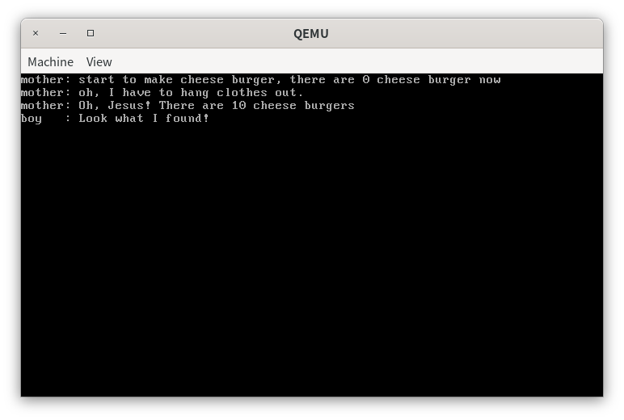
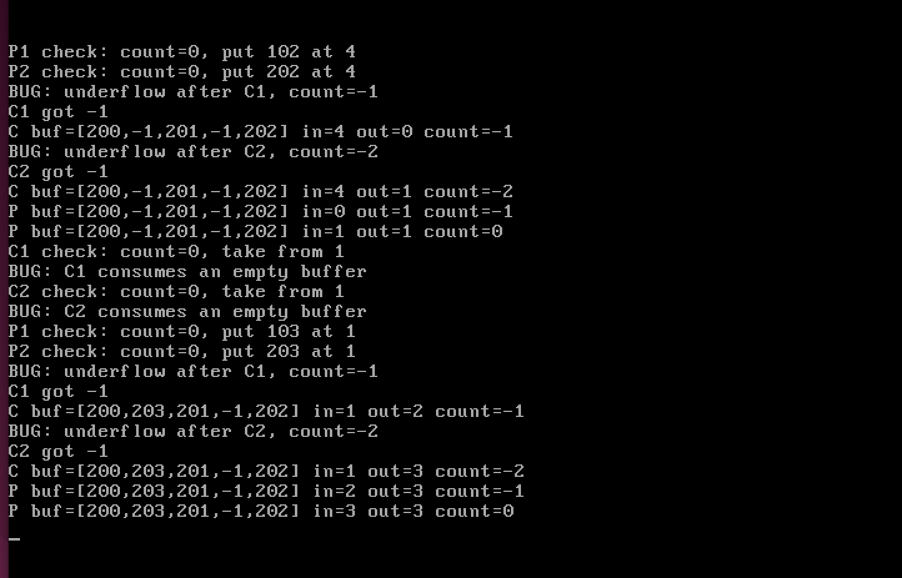
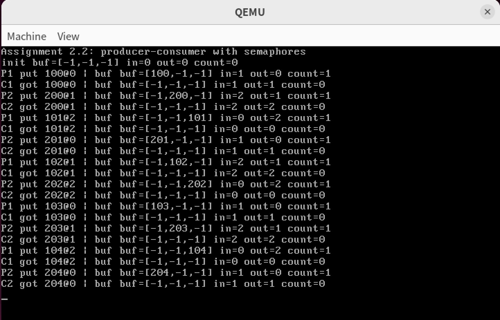
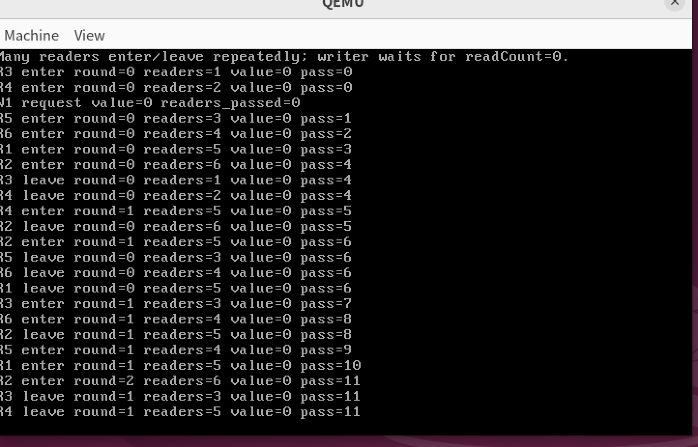
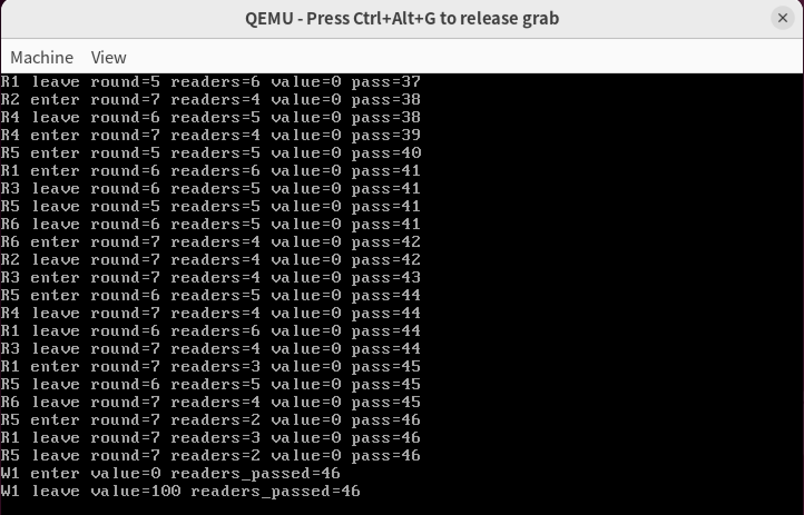

# Lab6 并发与锁机制

本章我们学习的所有内容都是为解决同一个问题：多进程共享内存。

进程可以并发甚至并行执行，可以随时发生中断，部分完成执行。对共享数据的并发访问可能会导致数据不一致。

如果我们不采取任何措施来协调线程之间对共享内存的访问顺序，就会出现的不符合我们预期的执行结果。

这种在并发编程中，当多个线程或进程同时访问和操作同一共享资源时，由于执行顺序的不确定性而导致程序行为错误或结果不可预测的情形，被称为**竞争条件**。

在解决这个问题之前，我们先将问题抽象出来：

每个进程都有一段代码，我们称之为**临界区**：

临界区可能是在更改公共变量、更新表、写入文件等。会需要访问共享内存的内容。

解决问题的关键在于：当一个进程处于临界区时，其他进程不得处于其临界区。

> 实际上，解决临界区问题需要满足三个条件：
>
> **1.** 互斥（Mutual exclusion）-如果进程Pi在其临界区执行，则其他进程不能在其临界区执行；
>
> **2.** 推进（progress）-如果没有进程在其临界区执行，并且存在一些希望进入其临界区的进程，则不能无限期推迟选择下一个将进入临界区的进程；
>
> **3.** 有限等待（Bounded waiting）-在进程发出进入其临界区的请求后，以及在该请求被批准之前，其他进程允许进入其临界区的次数必须存在上限；假设每个进程以非零速度执行；关于n个进程的相对速度以及处理器的速度并没有任何假设；

典型进程临界区的通用结构如下：

```c++
while (true) {
    entry section
        critical section
    exit section
        remainder section
}
```

### A1 自旋锁与信号量复现

#### 自旋锁

**自旋锁**(spin lock)是最简单的锁，是用来实现互斥的工具。

自旋锁的本质是维护一个共享的标志位（ `bolt`）：

- **bolt = 0**：表示临界区是安全的，当前没有人在里面。
- **bolt = 1**：表示临界区已经有人了。

任何想要进入临界区的线程，都会不断地去查看 `bolt` 的状态，直到它变成 `0` 为止。

同一时刻只能有一个线程在临界区中，并且线程的循环等待并不能保证有限等待的原则。因此在使用自旋锁的时候，我们假设了各个线程在临界区的时间是短暂的。

```c++
#ifndef SYNC_H
#define SYNC_H

#include "os_type.h"

class SpinLock
{
private:
    // 共享变量
    uint32 bolt;
public:
    SpinLock();
    void initialize();
    // 请求进入临界区
    void lock();
    // 离开临界区
    void unlock();
};

SpinLock::SpinLock()
{
    initialize();
}

// 由于全局变量的构造函数在我们的操作系统实验中不会被自动调用 我们需要手动初始化
void SpinLock::initialize()
{
    bolt = 0;
}

// 这是自旋锁的核心内容
void SpinLock::lock()
{
    uint32 key = 1;
    do
    {
        asm_atomic_exchange(&key, &bolt); // 这个函数用于交换两个变量的值
    } while (key);
}

void SpinLock::unlock()
{
    bolt = 0;
}

#endif
```

`lock()`的关键在于它内部的`key`和`do...while()`循环，当一个进程执行到这一步时：

| 锁初始状态 (bolt) | key  | 交换后的锁 (bolt) | 交换后的key | 循环结果                           |
| ----------------- | ---- | ----------------- | ----------- | ---------------------------------- |
| **0 (没人)**      | 1    | 1 (上锁)          | 0           | 退出循环，成功进入临界区           |
| **1 (有人)**      | 1    | 1 (保持上锁)      | 1           | 继续 `while(1)` 循环，原地自旋等待 |

被锁住的进程会进入循环，不会进入临界区。

这里的关键在于`asm_atomic_exchange(&key, &bolt)`需要是一个**原子指令**，保证两个值在交换的过程中不会被中断。它的实现如下：

```assembly
asm_atomic_exchange:
    ; 1. 保存调用现场
    push ebp
    mov ebp, esp
    pushad

    ; 2. 将第一个参数（key的值）读入寄存器 eax
    mov ebx, [ebp + 4 * 2]  ; 获取第一个参数 register (&key) 的内存地址，存入 ebx
    mov eax, [ebx]          ; 将 ebx 指向的内存中的值（key的值，也就是1）取出，放入 eax 寄存器

    ; 3. 核心：执行硬件级原子交换
    mov ebx, [ebp + 4 * 3]  ; 获取第二个参数 memory (&bolt) 的内存地址，存入 ebx
    xchg [ebx], eax         ; [关键指令] 将 ebx 指向的内存值 (bolt) 与 eax 寄存器的值进行交换！

    ; 4. 将交换来的值写回给第一个参数
    mov ebx, [ebp + 4 * 2]  ; 再次获取第一个参数 register (&key) 的内存地址，存入 ebx
    mov [ebx], eax          ; 将交换后 eax 中的值（原 bolt 的值），赋值给 key

    ; 5. 恢复现场并返回
    popad
    pop ebp
    ret
```

可以看出它并不是一个真正意义上的原子指令，但我们通过一些技巧实现了类似原子操作的效果。

这里的关键在于：**`key` 是一个局部变量**，局部变量是分配在每个线程独立的栈（Stack）上的。这意味着：

线程 A 有一个专属的 `key`。线程 B 也有一个专属的 `key`。它们彼此绝对无法访问对方的 `key`。

在`asm_atomic_exchange`中读写`key`的时候，因为 `key` 是线程私有的，不会发生数据竞争。

唯一涉及共享内存的部分`xchg [ebx], eax`是一个系统级的原子指令。

#### 自旋锁运用

```c++
int cheese_burger;

void a_mother(void *arg)
{
    aLock.lock();
    
    int delay = 0;

    printf("mother: start to make cheese burger, there are %d cheese burger now\n", 
           cheese_burger);
	 ...
    printf("mother: Oh, Jesus! There are %d cheese burgers\n", cheese_burger);
    
    aLock.unlock();
}

void a_naughty_boy(void *arg)
{
    aLock.lock();
    printf("boy   : Look what I found!\n");
    // eat all cheese_burgers out secretly
    cheese_burger -= 10;
    // run away as fast as possible
    aLock.unlock();
}
```

我们只需要给共享同一内存的进程应用同一个锁，就可以实现一个解决方案。

#### 信号量

自旋锁会存在如下缺点： 忙等待，消耗处理机时间。 可能饥饿。可能死锁。

为此，我们寻求更好的解决机制——信号量。

信号量维护一个非负整数`counter`来表示当前可用的临界资源数量，同时维护一个阻塞队列`waiting`来保存暂时无法获得资源的线程。线程申请资源时执行`P()`操作，释放资源时执行`V()`操作：

- 当`counter > 0`时，说明还有资源可用，`P()`会让`counter--`，线程进入临界区。
- 当`counter == 0`时，说明资源已经被占用，`P()`会把当前线程加入阻塞队列，并把线程状态改为`BLOCKED`。
- 当线程离开临界区时执行`V()`，`counter++`，如果阻塞队列中有线程，则唤醒其中一个线程。

由于`counter`和`waiting`本身也是**共享数据**，所以信号量内部仍然需要用自旋锁`semLock`保护这些成员。

```c++
class Semaphore
{
private:
    uint32 counter;
    List waiting;
    SpinLock semLock;

public:
    Semaphore();
    void initialize(uint32 counter);
    void P();
    void V();
};
```

初始化时，需要设置可用资源数量，并初始化内部的自旋锁和阻塞队列：

```c++
Semaphore::Semaphore()
{
    initialize(0);
}

void Semaphore::initialize(uint32 counter)
{
    this->counter = counter;
    semLock.initialize();
    waiting.initialize();
}
```

##### P 操作

`P()`操作用于申请资源。它首先获取内部自旋锁，检查`counter`是否大于0。如果资源可用，则将`counter`减一并返回；如果没有资源，就将当前运行线程放入`waiting`队列，将其状态设为`BLOCKED`，释放内部锁后调用调度器切换到其他线程。

```c++
void Semaphore::P()
{
    PCB *cur = nullptr;

    while (true)
    {
        semLock.lock();
        if (counter > 0)
        {
            --counter;
            semLock.unlock();
            return;
        }

        cur = programManager.running;
        waiting.push_back(&(cur->tagInGeneralList));
        cur->status = ProgramStatus::BLOCKED;

        semLock.unlock();
        programManager.schedule();
    }
}
```

这里`while (true)`不是多余的。实验中采用的是 MESA 唤醒模型，被唤醒的线程不会立刻执行，而是先进入就绪队列等待调度。在它真正重新运行之前，资源可能已经被其他线程抢走，所以线程被唤醒后必须重新检查`counter`，不能假设自己一定已经获得资源。

线程阻塞的关键在于`cur->status = ProgramStatus::BLOCKED`。

调度器`ProgramManager::schedule()`只会把仍处于`RUNNING`状态的线程重新放回就绪队列；当前线程被改成`BLOCKED`后，就不会继续参与普通调度，只能等待信号量的`V()`操作唤醒。

##### V 操作

`V()`操作用于释放资源。它先让`counter++`，表示归还一个资源；如果阻塞队列中存在等待线程，就取出队头线程并调用`MESA_WakeUp()`唤醒。

```c++
void Semaphore::V()
{
    semLock.lock();
    ++counter;
    if (waiting.size())
    {
        PCB *program = ListItem2PCB(waiting.front(), tagInGeneralList);
        waiting.pop_front();
        semLock.unlock();
        programManager.MESA_WakeUp(program);
    }
    else
    {
        semLock.unlock();
    }
}
```

唤醒操作的实现如下：

```c++
void ProgramManager::MESA_WakeUp(PCB *program)
{
    program->status = ProgramStatus::READY;
    readyPrograms.push_front(&(program->tagInGeneralList));
}
```

也就是说，阻塞线程被唤醒后只是重新进入就绪队列，并不会立即抢占当前线程。这种实现简单，符合本实验中使用的 MESA 模型。

##### 信号量运用

在“消失的芝士汉堡”问题中，`cheese_burger`是一个共享变量，同一时刻只允许一个线程访问。因此可以把信号量初始化为1，把它当作互斥信号量使用。

```c++
Semaphore semaphore;
int cheese_burger;

void a_mother(void *arg)
{
    semaphore.P();
    int delay = 0;

    printf("mother: start to make cheese burger, there are %d cheese burger now\n",
           cheese_burger);
    cheese_burger += 10;

    printf("mother: oh, I have to hang clothes out.\n");
    delay = 0xfffffff;
    while (delay)
        --delay;

    printf("mother: Oh, Jesus! There are %d cheese burgers\n", cheese_burger);
    semaphore.V();
}

void a_naughty_boy(void *arg)
{
    semaphore.P();
    printf("boy   : Look what I found!\n");
    cheese_burger -= 10;
    semaphore.V();
}
```

在第一个线程中，需要先清空屏幕、初始化共享变量，并调用`semaphore.initialize(1)`。这里的初始值为1，表示临界区一次只允许一个线程进入。

```c++
void first_thread(void *arg)
{
    stdio.moveCursor(0);
    for (int i = 0; i < 25 * 80; ++i)
    {
        stdio.print(' ');
    }
    stdio.moveCursor(0);

    cheese_burger = 0;
    semaphore.initialize(1);

    programManager.executeThread(a_mother, nullptr, "second thread", 1);
    programManager.executeThread(a_naughty_boy, nullptr, "third thread", 1);

    asm_halt();
}
```

运行结果中，母亲线程先执行`P()`进入临界区，制作10个汉堡并在延时期间保持信号量资源；儿子线程执行`P()`时发现资源不可用，因此被阻塞。等母亲线程打印出`cheese_burger`为10并执行`V()`后，儿子线程才会被唤醒并继续执行。因此，母亲前后看到的汉堡数量符合预期，说明信号量成功实现了对共享变量的互斥访问。

#### A1.1 自旋锁与信号量执行效果



#### A1.2 替代锁机制实现

在教程的 `xchg` 自旋锁之外，我另外实现了基于 `lock cmpxchg` 的 `CASLock`。

它仍然使用一个共享变量 `bolt` 表示锁状态：`bolt = 0` 表示锁空闲，`bolt = 1` 表示锁已被占用。

不同的是，加锁时不再无条件交换 `key` 和 `bolt`，而是使用 CAS（Compare And Swap）的思想：只有当 `bolt` 当前仍然等于期望值 `0` 时，才把它原子地改成 `1`。

首先在 `include/asm_utils.h` 中声明一个新的汇编函数：

```c++
extern "C" uint32 asm_atomic_cmpxchg(uint32 *mem, uint32 old_value, uint32 new_value);
```

对应的汇编实现在 `src/utils/asm_utils.asm` 中：

```assembly
asm_atomic_compare_exchange:
    push ebp
    mov ebp, esp
    push ebx
    push edx

    mov ebx, [ebp + 4 * 2] ; memory
    mov eax, [ebp + 4 * 3] ; old_value
    mov edx, [ebp + 4 * 4] ; new_value
    lock cmpxchg [ebx], edx

    pop edx
    pop ebx
    pop ebp
    ret
```

`cmpxchg [ebx], edx` 会把 `eax` 中的期望值和内存 `[ebx]` 中的实际值进行比较：

- 如果二者相等，说明锁仍然空闲，于是把 `[ebx]` 改成 `edx` 中的目标值，也就是把 `bolt` 从 `0` 改成 `1`。
- 如果二者不相等，说明锁已经被其他线程占用，此时不会修改 `[ebx]`，而是把 `[ebx]` 的实际旧值放回 `eax`。

外层的 `lock` 前缀保证这次“读出旧值、比较、条件写入”的读-改-写过程是原子的。函数返回时，`eax` 保存的是锁变量的旧值，因此 C++ 层只需要判断返回值是否为 `0`，就能知道本次加锁是否成功。

在 `include/sync.h` 中封装新的锁类：

```c++
class CASLock
{
private:
    uint32 bolt;

public:
    CASLock();
    void initialize();
    void lock();
    void unlock();
};
```

具体实现在 `src/kernel/sync.cpp` 中：

```c++
CASLock::CASLock()
{
    initialize();
}

void CASLock::initialize()
{
    bolt = 0;
}

void CASLock::lock()
{
    while (asm_atomic_cmpxchg(&bolt, 0, 1) != 0)
    {
    }
}

void CASLock::unlock()
{
    bolt = 0;
}
```

这里的 `lock()` 会不断尝试把 `bolt` 从 `0` 改成 `1`。如果返回值为 `0`，说明当前线程成功获得锁；如果返回值为 `1`，说明锁已经被占用，线程继续自旋等待。

最后在“消失的芝士汉堡”问题中，把全局锁对象改为 `CASLock`：

```c++
CASLock burgerLock;
```

母亲线程和男孩线程仍然在访问共享变量 `cheese_burger` 前后调用 `aLock.lock()` 与 `aLock.unlock()`：

```c++
void a_mother(void *arg)
{
    burgerLock.lock();
    int delay = 0;

    printf("mother: start to make cheese burger, there are %d cheese burger now\n", cheese_burger);
    cheese_burger += 10;

    printf("mother: oh, I have to hang clothes out.\n");
    delay = 0xfffffff;
    while (delay)
        --delay;

    printf("mother: Oh, Jesus! There are %d cheese burgers\n", cheese_burger);
    burgerLock.unlock();
}

void a_naughty_boy(void *arg)
{
    burgerLock.lock();
    printf("boy   : Look what I found!\n");
    cheese_burger -= 10;
    burgerLock.unlock();
}
```

运行结果与自旋锁互斥成功时一致：


`a_mother` 线程进入临界区后会先制作 10 个芝士汉堡，然后故意延时。此时如果 `a_naughty_boy` 被调度运行，它会在 `CASLock::lock()` 中自旋，直到母亲线程打印结果并释放锁。因此母亲线程看到的数量仍为 10，避免了未加锁时出现的“消失的芝士汉堡”问题。

母亲线程输出 `There are 10 cheese burgers` 后，男孩线程才进入临界区并输出 `Look what I found!`。

##### 与`xchg`锁的对比

相同点：

- 二者都依赖 x86 **原子**读-改-写指令实现互斥。
- 二者都是自旋锁，等待期间不会主动阻塞线程，会持续占用 CPU。
- 加锁成功后都把锁变量从 0 改为 1，释放锁时把锁变量写回 0。

不同点：

- `xchg` 方案每次尝试都会把 1 写入锁变量，并返回旧值；即使锁已被占用，也会产生一次写操作。
- `lock cmpxchg` 方案只有在锁变量等于期望值 0 时才把锁值改为 1；锁已被占用时锁值保持不变，并通过返回值表示加锁失败。
- `cmpxchg` 可以表达“如果状态仍是我期望的值才更新”，更适合扩展到无锁数据结构、引用计数等 CAS 风格算法；`xchg` 语义更简单，适合最基础的 test-and-set 锁。
- 教程中的 `asm_atomic_exchange(&key, &bolt)` 需要保证第一个参数 `key` 是线程私有变量，否则整个封装函数就可能不再表现为原子交换；而 `asm_atomic_cmpxchg` 只把共享变量作为唯一的内存操作数，`old_value` 和 `new_value` 都通过寄存器传递，更贴近硬件 CAS 指令本身的使用方式。

优缺点：

- `xchg`：实现短、语义直观，而且在访问内存操作数时天然具有原子交换语义；缺点是竞争激烈时每次失败尝试也会写锁变量，缓存一致性流量较大。
- `lock cmpxchg`：语义更通用，便于扩展到更复杂的同步原语；缺点是指令和封装稍复杂，带 `lock` 前缀的失败尝试仍会产生缓存一致性开销，简单互斥场景下不如 `xchg` 直观。

综合来看，`CASLock` 和教程中的 `SpinLock` 都能解决本实验中的互斥问题。对于只需要最简单互斥的场景，`xchg` 写法更容易理解；如果后续要实现“只有状态未变化才更新”的同步逻辑，`lock cmpxchg` 的表达能力会更强。

### A2 生产者-消费者问题

#### A2.1 展示竞态条条件

我们先来实现一个有界缓冲区的生产者-消费者场景。

```c++
const int BUFFER_SIZE = 5;
const int PRODUCER_REPEAT = 4;
const int CONSUMER_REPEAT = 4;

int buffer[BUFFER_SIZE];
int bufferIn;
int bufferOut;
int bufferCount;
int producerIds[2] = {1, 2};
int consumerIds[2] = {1, 2};
```

缓冲区大小设置为 5， `bufferIn` 表示下一个写入位置，`bufferOut` 表示下一个读取位置，`bufferCount` 表示当前缓冲区中的元素数量。

生产者和消费者的实现如下：

```c++
void producer(void *arg)
{
    int id = *((int *)arg);

    for (int i = 0; i < PRODUCER_REPEAT; ++i)
    {
        int item = id * 100 + i;
        int slot = bufferIn;

        printf("P%d check: count=%d, put %d at %d\n", id, bufferCount, item, slot);

        yield_cpu();
        buffer[slot] = item;
        yield_cpu();
        bufferIn = (bufferIn + 1) % BUFFER_SIZE;
        ++bufferCount;

        show_buffer("P");
        yield_cpu();
    }
}

void consumer(void *arg)
{
    int id = *((int *)arg);

    for (int i = 0; i < CONSUMER_REPEAT; ++i)
    {
        int slot = bufferOut;

        printf("C%d check: count=%d, take from %d\n", id, bufferCount, slot);
        if (bufferCount <= 0)
        {
            printf("BUG: C%d consumes an empty buffer\n", id);
        }

        yield_cpu();
        int item = buffer[slot];
        buffer[slot] = -1;
        yield_cpu();
        bufferOut = (bufferOut + 1) % BUFFER_SIZE;
        --bufferCount;

        if (bufferCount < 0)
        {
            printf("BUG: underflow after C%d, count=%d\n", id, bufferCount);
        }

        printf("C%d got %d\n", id, item);
        show_buffer("C");
        yield_cpu();
    }
}
```

实验中创建了 2 个生产者线程和 2 个消费者线程，每个线程会多次执行生产或消费操作。

为了观察竞态条件，本部分没有使用自旋锁、信号量或其他同步互斥工具。生产者和消费者会直接访问共享变量 `buffer`、`bufferIn`、`bufferOut` 和 `bufferCount`。同时，在检查缓冲区状态和真正读写缓冲区之间主动进行线程调度，从而放大线程交错执行带来的问题。

```c++
void yield_cpu() //用于主动让出cpu加大竞争
{
    int delay = 0xffff;
    while (delay)
    {
        --delay;
    }
    programManager.schedule();
}
```

运行效果如下：



其中可以观察到如下错误：

```
C1 check: count=0, take from 1
BUG: C1 consumes an empty buffer
C2 check: count=0, take from 1
BUG: C2 consumes an empty buffer
...
BUG: underflow after C1, count=-1
C1 got -1
...
BUG: underflow after C2, count=-2
C2 got -1
```

这说明消费者在线程并发执行时读取了空缓冲区。正常情况下，当 `bufferCount == 0` 时，消费者应该等待生产者放入数据后再消费。但由于没有同步机制，消费者仍然继续执行读取操作，最终读到了初始化时用于表示空槽位的 `-1`，并且将 `bufferCount` 减为了负数，出现了缓冲区下溢。

此外，运行结果中还可以看到两个生产者在相同状态下操作同一个位置：

```
P1 check: count=0, put 103 at 1
P2 check: count=0, put 203 at 1
```

两个生产者都观察到 `count=0`，并且都准备向下标 `1` 写入数据。由于它们之间没有互斥保护，后写入的生产者会覆盖先写入的数据，造成数据丢失。例如 `103` 可能被 `203` 覆盖，消费者之后无法再正确读取到被覆盖的数据。

出现这些错误的根本原因是：对共享缓冲区的访问**不是原子操作**。一次生产或消费实际上包含多个步骤，例如检查 `bufferCount`、读写 `buffer`、更新 `bufferIn` 或 `bufferOut`、修改 `bufferCount`。线程可能在任意两个步骤之间被切换出去，导致其他线程看到的是不一致的中间状态。多个线程基于过期的状态继续执行，就会产生空缓冲区消费、计数器下溢、同一位置重复写入和数据覆盖等问题。

#### A2.2 使用信号量解决

在有界缓冲区生产者-消费者问题基础上，我们引入信号量机制，保证多个生产者线程和多个消费者线程并发访问共享缓冲区时不会发生覆盖写入、重复读取、缓冲区上溢或下溢。

为了便于演示，我们设置一个大小为 3 的循环缓冲区 `buffer`，创建 2 个生产者线程和 2 个消费者线程，每个线程循环执行 5 次生产或消费操作。

为了解决同步与互斥问题，我们定义了 3 个信号量：

- `empty`：表示空槽数量，初始值为 `BUFFER_SIZE`。生产者执行生产前需要先执行 `empty.P()`，当缓冲区满时生产者会阻塞。
- `full`：表示已有产品数量，初始值为 0。消费者执行消费前需要先执行 `full.P()`，当缓冲区空时消费者会阻塞。
- `mutex`：二元信号量，初始值为 1，用于保护 `buffer`、`bufferIn`、`bufferOut` 和 `bufferCount` 等共享变量，保证同一时刻只有一个线程进入临界区。

```c++
Semaphore empty;
Semaphore full;
Semaphore mutex;

empty.initialize(BUFFER_SIZE);
full.initialize(0);
mutex.initialize(1);
```

生产者的执行顺序为：

```cpp
empty.P();
mutex.P();
// 写入 buffer，更新 bufferIn 和 bufferCount
mutex.V();
full.V();
```

消费者的执行顺序为：

```cpp
full.P();
mutex.P();
// 读取 buffer，更新 bufferOut 和 bufferCount
mutex.V();
empty.V();
```

其中，`empty/full` 负责生产者和消费者之间的同步关系，`mutex` 负责对共享缓冲区的互斥访问。

运行效果如下：



运行后，屏幕上每一次生产或消费都会输出一行缓冲区状态，例如 `P1 put 100@0 | ...` 表示生产者 1 将数据 100 写入 0 号槽，`C1 got 100@0 | ...` 表示消费者 1 从 0 号槽取出数据 100。

整个运行过程中，`count` 始终保持在 `0` 到 `BUFFER_SIZE` 之间，不会出现未同步版本中的 `overflow`、`underflow`、空读或满写等错误。缓冲区下标 `bufferIn` 和 `bufferOut` 按循环队列方式移动，生产与消费顺序保持一致。由于生产者线程先创建且缓冲区大小为 3，当前 3 个空槽被用完后，后续生产者会在 `empty.P()` 处阻塞，直到消费者执行 `empty.V()` 释放空槽；如果消费者先运行或产品被取完，则会在 `full.P()` 处阻塞，直到生产者执行 `full.V()`。

通过 `empty`、`full` 和 `mutex` 三个信号量，可以把生产者-消费者问题拆成两个层面的约束：一是缓冲区空满条件带来的线程同步，二是共享缓冲区读写带来的互斥。生产者在满缓冲区上阻塞，消费者在空缓冲区上阻塞，而任意时刻只有一个线程能够修改缓冲区状态，因此并发执行结果稳定且符合预期。

#### A2.3 读者-写者问题

我们现在在已有线程与信号量环境下模拟读者-写者问题，并采用读者优先策略完成同步控制。

读者优先的核心特点是：只要当前已经存在读者正在访问共享资源，后续到来的读者可以继续进入临界区，而不需要等待已经阻塞的写者。

因此，在读者持续交错到达时，写者可能长时间得不到写入机会，出现“饥饿”现象。

我们在内核代码中创建多个读者线程和一个写者线程。读者不会一直占用临界区，而是反复执行“进入临界区、读取一段时间、退出临界区、等待一段随机时间”的过程。多个读者交错运行，使共享资源上的读者数量在较长时间内难以下降到 0，从而体现写者等待。

我们使用了三个信号量和若干共享变量：

```cpp
int sharedValue;
int readCount;
int writerWaiting;
int readerPassAfterWriterWait;
Semaphore resource;
Semaphore readCountMutex;
Semaphore printMutex;
```

其中：

- `resource` 是读写共享资源锁，初值为 1。写者需要独占该信号量；读者中的第一个读者负责申请它，最后一个读者负责释放它。
- `readCountMutex` 用于互斥访问 `readCount`，避免多个读者同时修改读者计数导致错误。
- `printMutex` 用于保护输出，避免多个线程同时 `printf` 造成屏幕内容交错。
- `writerWaiting` 用于标记写者已经发出写请求。
- `readerPassAfterWriterWait` 统计写者请求后仍然成功进入临界区的读者次数，用于在输出中直观体现写者饥饿。

读者优先算法如下：

1. 读者进入时，先申请 `readCountMutex`，然后令 `readCount++`。
2. 如果当前读者是第一个读者，即 `readCount == 1`，则申请 `resource`，阻止写者进入。
3. 后续读者到达时，由于 `readCount > 1`，它们不再申请 `resource`，可以直接加入读者队列。
4. 读者退出时令 `readCount--`。
5. 只有最后一个读者退出，即 `readCount == 0` 时，才释放 `resource`，写者才有机会进入。

这个策略没有检查是否已经有写者在等待，所以当写者阻塞在 `resource.P()` 上时，新来的读者仍然可以进入读临界区。这正是读者优先可能造成写者饥饿的原因。

##### 伪随机数与线程交错

由于我们的内核环境中不能直接使用标准库的随机数函数，因此这里实现了一个简单的线性同余伪随机数生成器：

```cpp
uint32 kernel_random()
{
    randomState = randomState * 1103515245 + 12345;
    return (randomState >> 16) & 0x7fff;
}

void random_yield(int base, int range)
{
    int times = base + kernel_random() % range;
    for (int i = 0; i < times; ++i)
    {
        yield_cpu();
    }
}
```

核心代码如下：

```cpp
void reader(void *arg)
{
    int id = *((int *)arg);

    random_yield(id % 3, 3);

    for (int i = 0; i < READER_REPEAT; ++i)
    {
        readCountMutex.P();
        ++readCount;
        if (writerWaiting)
        {
            ++readerPassAfterWriterWait;
        }
        if (readCount == 1)
        {
            resource.P();
        }
        int currentReaders = readCount;
        readCountMutex.V();

        safe_printf_reader("enter", id, i, currentReaders);
        random_yield(2, 3);
        safe_printf_reader("leave", id, i, currentReaders);

        readCountMutex.P();
        --readCount;
        currentReaders = readCount;
        if (readCount == 0)
        {
            resource.V();
        }
        readCountMutex.V();

        random_yield(id % 2, 2);
    }
}
```

```cpp
void writer(void *arg)
{
    int id = *((int *)arg);

    random_yield(1, 2);

    for (int i = 0; i < WRITER_REPEAT; ++i)
    {
        writerWaiting = 1;
        safe_printf_writer("request", id);

        resource.P();

        writerWaiting = 0;
        safe_printf_writer("enter", id);
        sharedValue += 100;
        random_yield(3, 2);
        safe_printf_writer("leave", id);

        resource.V();
        random_yield(2, 2);
    }
}
```

初始化与线程创建代码如下：

```cpp
sharedValue = 0;
readCount = 0;
writerWaiting = 0;
readerPassAfterWriterWait = 0;
randomState = 0x20260621;
resource.initialize(1);
readCountMutex.initialize(1);
printMutex.initialize(1);

for (int i = 0; i < READER_AMOUNT; ++i)
{
    programManager.executeThread(reader, &readerIds[i], "reader", 1);
}
programManager.executeThread(writer, &writerIds[0], "writer", 1);
```

程序运行后，屏幕上会先输出任务标题，然后输出多个读者的进入和退出记录，以及写者的请求、进入、退出记录。

运行效果如下：





输出形式如下：

```text
Assignment 2.3: reader-first readers-writers
Many readers enter/leave repeatedly; writer waits for readCount=0.
R1 enter round=0 readers=1 value=0 pass=0
R2 enter round=0 readers=2 value=0 pass=0
W1 request value=0 readers_passed=0
R3 enter round=0 readers=3 value=0 pass=1
R4 enter round=0 readers=4 value=0 pass=2
...
W1 enter value=0 readers_passed=若干
W1 leave value=100 readers_passed=若干
```

如果在 `W1 request` 之后，仍然连续出现多条 `R? enter`，且 `pass` 或 `readers_passed` 不断增大，说明写者已经提出写请求，但新读者仍然可以进入临界区。写者只有等到某一时刻 `readCount` 降为 0 后，才能真正输出 `W1 enter`。这说明读者优先策略下读者具有更高进入权限，写者可能长时间等待。

### A3 死锁

