## Lab3 从实模式到保护模式

### 实验环境

- 操作系统版本：虚拟机 Ubuntu ARM64 22.04 LTS
- CPU 架构：ARM64
- 目标平台：x86 32 位保护模式
- 主要工具：NASM、QEMU、gdb/gdb-multiarch 或 QEMU Monitor、make

### 实验概述

本次实验围绕 x86 计算机启动流程、磁盘加载、实模式到保护模式的切换以及 32 位保护模式编程展开。

计算机启动后，BIOS 只会把磁盘第 0 个扇区的 MBR 加载到 `0x7c00` 处执行。由于 MBR 只有 512 字节，无法容纳后续复杂逻辑，因此需要由 MBR 继续从磁盘读取 bootloader，将其加载到约定的内存地址 `0x7e00`，再跳转到 bootloader 执行。

在 bootloader 中，本实验进一步构造 GDT，加载 GDTR，打开 A20 地址线，设置 CR0 的 PE 位，并通过远跳转进入 32 位保护模式。进入保护模式后，程序不再依赖实模式 BIOS 中断，而是通过 GDT 中的代码段、数据段、栈段和视频段描述符建立基本运行环境，并直接访问 VGA 显存输出字符。

本实验主要包括以下任务：

- Assignment 1：复现并改造 MBR 加载 bootloader 的过程，分别使用 LBA28 与 CHS 方式读取磁盘，并为 bootloader 加载过程增加魔数校验。
- Assignment 2：调试进入保护模式的四个关键步骤，手工解析 GDT 中的数据段描述符，并新增一个自定义数据段描述符验证段式寻址。
- Assignment 3：将 Lab2 的汇编小程序移植到 32 位保护模式，并实现保护模式下的十六进制内存转储函数。

### A1 磁盘加载

#### A1.1 LBA28 方式加载 bootloader

计算机启动时，BIOS 只会把 MBR 加载到 `0x7c00`。为了突破 MBR 的 512 字节限制，本实验把后续逻辑放入 bootloader，并让 MBR 负责把 bootloader 从磁盘第 1 个扇区开始读入内存。

本实验采用如下内存规划：

| 名称 | 起始地址 | 长度 | 结束地址 |
|------|----------|------|----------|
| MBR | `0x7c00` | `0x200`，即 512B | `0x7e00` |
| bootloader | `0x7e00` | `0xa00`，即 5 个扇区 | `0x8800` |
| GDT | `0x8800` | 预留若干个 8 字节描述符 | `0x8880` 附近 |

在 LBA28 读取方式中，MBR 不需要关心磁盘的磁头、柱面和扇区结构，只需要给出逻辑扇区号。由于 LBA28 的逻辑扇区号共有 28 位，因此需要把它拆分后写入多个 I/O 端口：

| 端口 | 作用 |
|------|------|
| `0x1f2` | 本次读取的扇区数 |
| `0x1f3` | LBA 地址 bit 0 到 bit 7 |
| `0x1f4` | LBA 地址 bit 8 到 bit 15 |
| `0x1f5` | LBA 地址 bit 16 到 bit 23 |
| `0x1f6` | 选择主盘、LBA 模式以及 LBA 地址 bit 24 到 bit 27 |
| `0x1f7` | 命令端口与状态端口 |
| `0x1f0` | 数据端口，每次读出 16 位数据 |

读取过程可以概括为：

1. 初始化 `ds`、`es`、`ss`、`fs`、`gs` 等段寄存器，并设置栈顶为 `0x7c00`。
2. 从逻辑扇区 `1` 开始，连续读取 5 个扇区到 `0x7e00`。
3. 每次读取前，设置 LBA 地址、读取扇区数和读命令 `0x20`。
4. 轮询 `0x1f7` 端口，等待硬盘状态满足可读条件。
5. 从 `0x1f0` 连续读取 256 个 word，即 512 字节。
6. 读取完成后，通过远跳转 `jmp 0x0000:0x7e00` 进入 bootloader。

这里必须使用远跳转，而不是普通近跳转。实模式下物理地址由 `段地址 * 16 + 偏移地址` 得到，`jmp 0x0000:0x7e00` 会同时设置 `cs` 和 `ip`，使 CPU 从物理地址 `0x7e00` 开始执行 bootloader。

本任务复现时，bootloader 的功能是直接写 VGA 显存，在屏幕左上角输出 `run bootloader`。如果屏幕上能看到该字符串，说明 MBR 已经正确地从磁盘加载并跳转到了 bootloader。

**核心代码：**

MBR 负责初始化段寄存器和栈，然后循环读取 5 个扇区将 bootloader 加载到 `0x7e00`。以下是 `mbr.asm` 中 LBA28 方式读取硬盘的核心函数 `asm_read_hard_disk`：

```asm
; asm_read_hard_disk(memory, block)
; 加载逻辑扇区号为block的扇区到内存地址memory
; 调用方式：push ax(扇区号) / push bx(目标地址) / call asm_read_hard_disk / add sp, 4
asm_read_hard_disk:
    push bp
    mov bp, sp
    push ax
    push bx
    push cx
    push dx

    mov ax, [bp + 2 * 3]  ; 从栈中取出逻辑扇区低16位

    mov dx, 0x1f3
    out dx, al             ; LBA地址7~0
    inc dx                 ; 0x1f4
    mov al, ah
    out dx, al             ; LBA地址15~8

    xor ax, ax
    inc dx                 ; 0x1f5
    out dx, al             ; LBA地址23~16 = 0
    inc dx                 ; 0x1f6
    mov al, ah
    and al, 0x0f
    or al, 0xe0            ; LBA地址27~24 = 0, 选择主盘LBA模式
    out dx, al

    mov dx, 0x1f2
    mov al, 1
    out dx, al             ; 读取1个扇区

    mov dx, 0x1f7
    mov al, 0x20           ; 读命令
    out dx, al

  .waits:                  ; 轮询等待硬盘就绪
    in al, dx
    and al, 0x88
    cmp al, 0x08
    jnz .waits

    mov bx, [bp + 2 * 2]  ; 从栈中取出目标地址
    mov cx, 256            ; 每次读取1个字(2字节)，共256次 = 512字节
    mov dx, 0x1f0
  .readw:
    in ax, dx
    mov [bx], ax
    add bx, 2
    loop .readw

    pop dx
    pop cx
    pop bx
    pop ax
    pop bp
    ret
```

MBR 加载 bootloader 的主循环与跳转逻辑：

```asm
mov ax, LOADER_START_SECTOR    ; 起始逻辑扇区号 = 1
mov cx, LOADER_SECTOR_COUNT    ; 扇区数 = 5
mov bx, LOADER_START_ADDRESS   ; 加载地址 = 0x7e00

load_bootloader:
    push ax
    push bx
    call asm_read_hard_disk    ; 读取一个扇区
    add sp, 4                  ; 清理栈中参数
    inc ax                     ; 下一个扇区
    add bx, 512                ; 目标地址 +512
    loop load_bootloader       ; cx-- , 不为0则继续

    jmp 0x0000:0x7e00          ; 远跳转到bootloader执行
```

bootloader 被加载到 `0x7e00` 后，通过直接写 VGA 显存 `0xb8000` 输出 `run bootloader`：

```asm
org 0x7e00
[bits 16]
mov ax, 0xb800
mov gs, ax
mov ah, 0x03                   ; 青色属性
mov ecx, bootloader_tag_end - bootloader_tag
xor ebx, ebx
mov esi, bootloader_tag
output_bootloader_tag:
    mov al, [esi]
    mov word[gs:bx], ax        ; 写入字符+属性到VGA显存
    inc esi
    add ebx, 2
    loop output_bootloader_tag
jmp $                          ; 死循环

bootloader_tag db 'run bootloader'
bootloader_tag_end:
```

运行效果如下：

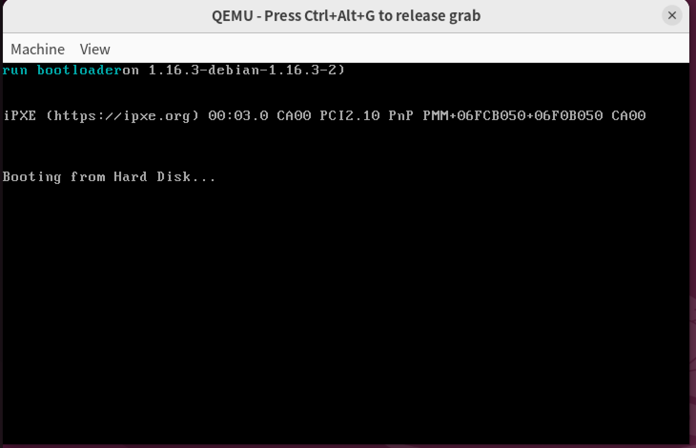

#### A1.2 使用 CHS 方式读取 bootloader

Example 1 使用 LBA28 方式读取硬盘。LBA 的优点是直接使用逻辑扇区号，程序只需要把扇区号拆分写入硬盘 I/O 端口即可。

BIOS 在实模式下还提供了 `int 13h` 磁盘服务，可以使用 CHS 模式读取磁盘。CHS 分别表示：

- C：Cylinder，柱面号
- H：Head，磁头号
- S：Sector，扇区号

本实验给定参数如下：

| 参数 | 数值 |
|------|------|
| 驱动器号 `DL` | `0x80` |
| 每磁道扇区数 `SPT` | 63 |
| 每柱面磁头数 `HPC` | 18 |

逻辑扇区号到 CHS 的转换公式为：

$$
C = \left\lfloor \frac{LBA}{SPT \times HPC} \right\rfloor
$$

$$
H = \left\lfloor \frac{LBA}{SPT} \right\rfloor \bmod HPC
$$

$$
S = (LBA \bmod SPT) + 1
$$

其中，LBA 从 0 开始编号，而 CHS 中的扇区号从 1 开始编号，因此计算 `S` 时需要额外加 1。

在本实验中，MBR 需要读取 LBA 1 到 LBA 5。代入 `SPT = 63`、`HPC = 18` 后，这 5 个扇区都位于第 0 柱面、第 0 磁头上，对应的 CHS 如下：

| LBA | C | H | S |
|-----|---|---|---|
| 1 | 0 | 0 | 2 |
| 2 | 0 | 0 | 3 |
| 3 | 0 | 0 | 4 |
| 4 | 0 | 0 | 5 |
| 5 | 0 | 0 | 6 |

使用 BIOS `int 13h` 读取时，关键寄存器含义如下：

| 寄存器 | 含义 |
|--------|------|
| `AH = 0x02` | 读取扇区功能 |
| `AL` | 读取扇区数量 |
| `CH` | 柱面号低 8 位 |
| `CL` | bit 0 到 bit 5 为扇区号，bit 6 到 bit 7 为柱面号高 2 位 |
| `DH` | 磁头号 |
| `DL = 0x80` | 第一个硬盘 |
| `ES:BX` | 读入内存地址 |

实现时，我将原先的 LBA28 端口读写过程替换为 BIOS `int 13h` 调用。每次循环读取一个扇区，先根据当前 LBA 计算出 `C`、`H`、`S`，再设置 `AH`、`AL`、`CH`、`CL`、`DH`、`DL` 和 `ES:BX`，最后执行 `int 13h`。读取成功后更新目标地址和下一个 LBA。

与 LBA28 方式相比，CHS 方式的优点是代码可以交给 BIOS 完成底层硬盘访问，不需要手动轮询 `0x1f7` 状态端口，也不需要从 `0x1f0` 逐字读取数据。缺点是需要自己完成 LBA 到 CHS 的转换，并且 CHS 编址方式受到柱面、磁头和扇区格式限制，不如 LBA 直接。

**核心代码：**

以下是 `mbr.asm` 中的 CHS 磁盘读取函数 `asm_read_hard_disk_chs`，使用 BIOS `int 13h` 中断代替 LBA28 的 I/O 端口操作。LBA→CHS 的转换通过两次 `div` 指令完成：

```asm
asm_read_hard_disk_chs:
; 从硬盘读取一个逻辑扇区（CHS模式，使用BIOS int 13h中断）
; 参数：ax = 逻辑扇区号(LBA), bx = 加载目标地址
    push ax
    push cx
    push dx

    ; ---- LBA → CHS 转换 ----
    ; S = (LBA mod 63) + 1
    mov cl, 63
    div cl          ; al = LBA/63 (商), ah = LBA mod 63 (余数)
    inc ah          ; ah = S (扇区号，从1开始)
    mov ch, ah      ; 暂存S到ch

    ; C = (LBA/63) / 18,  H = (LBA/63) mod 18
    xor ah, ah      ; ax = LBA/63
    mov cl, 18
    div cl          ; al = C (柱面号), ah = H (磁头号)

    ; ---- 设置 int 13h 参数 ----
    mov dh, ah      ; DH = 磁头号 H
    mov dl, 0x80    ; DL = 驱动器号 (第一块硬盘)
    mov cl, ch      ; CL = 扇区号 S
    mov ch, al      ; CH = 柱面号 C

    mov al, 1       ; 读取1个扇区
    mov ah, 0x02    ; AH=02h: BIOS读磁盘扇区
    int 0x13        ; 调用BIOS磁盘中断

    pop dx
    pop cx
    pop ax
    add bx, 512     ; 更新目标地址
    ret
```

MBR 中的加载循环与 A1.1 类似，只是将 `call asm_read_hard_disk` 替换为 `call asm_read_hard_disk_chs`：

```asm
mov ax, 1                ; 起始逻辑扇区号
mov bx, 0x7e00           ; bootloader加载地址
load_bootloader:
    call asm_read_hard_disk_chs  ; CHS方式读取一个扇区
    inc ax                         ; 下一个LBA
    cmp ax, 5
    jle load_bootloader           ; 读取扇区1~5
    jmp 0x0000:0x7e00             ; 远跳转到bootloader
```

运行效果如下：


#### A1.3 bootloader 加载校验

在 Example 1 中，MBR 读取完 bootloader 后会直接跳转到 `0x7e00`。这种做法默认磁盘读取结果一定正确，但实际操作系统启动过程中通常需要对加载内容进行校验，避免跳转到错误或不完整的代码。

我们在 bootloader 末尾放置 4 字节魔数，例如：

```text
0xCAFEBABE
```

MBR 在读取完 bootloader 后、跳转到 bootloader 前，检查内存中约定位置的魔数是否存在：

- 如果魔数正确，输出 `BOOT OK`，再跳转到 `0x7e00`。
- 如果魔数错误，输出 `BOOT ERR`，然后停机。

由于本实验固定把 bootloader 放在 `0x7e00`，并预留 5 个扇区，因此一种稳定做法是让 bootloader 文件固定填充到 5 个扇区，并把魔数放在第 5 个扇区末尾。此时检查地址为：

$$
0x7e00 + 5 \times 512 - 4 = 0x87fc
$$

如果后续实现时选择不把 bootloader 填充到固定 5 个扇区，则需要根据 bootloader 的实际大小 `N` 来计算魔数地址：

$$
\text{magic address} = 0x7e00 + N - 4
$$

为了让 MBR 端也能知道这个地址，实践中更推荐采用固定加载大小和固定魔数位置的方式。本实验中可以将魔数固定放在 `0x87fc`，这样 MBR 只需要比较：

```text
[0x87fc] == 0xCAFEBABE
```

输出 `BOOT OK` 或 `BOOT ERR` 时，程序仍然处于实模式，可以选择直接写 VGA 显存，也可以使用 BIOS 显示中断。为了与后续保护模式保持一致，我倾向于直接写 `0xb8000` 显存。

验证时需要准备两组结果：

1. 正确魔数：MBR 输出 `BOOT OK`，随后成功跳转到 bootloader。
2. 错误魔数：故意修改 bootloader 末尾魔数或 MBR 中的比较值，MBR 输出 `BOOT ERR`，并执行 `hlt` 停机。

**核心代码：**

bootloader 末尾使用 `times` 伪指令填充到固定大小，并在最后 4 字节放置魔数 `0xCAFEBABE`：

```asm
; bootloader.asm 末尾
bootloader_tag db 'run bootloader'
bootloader_tag_end:

times 2556-($-$$) db 0     ; 填充到第2556字节（总大小2560字节 = 5扇区）
dd 0xCAFEBABE              ; 最后4字节为魔数，位于 0x7e00 + 2556
```

MBR 在加载完所有扇区后、跳转之前，使用 `cmp dword` 校验魔数。校验通过输出 "BOOT OK" 并跳转，失败输出 "BOOT ERR" 并停机：

```asm
check_magic_number:
    cmp dword [0x7e00 + 2556], 0xCAFEBABE   ; 检查bootloader末尾的魔数
    je .boot_ok

    ; ---- 校验失败：输出 "BOOT ERR" 并停机 ----
    mov ax, 0x1301       ; BIOS int 10h: 显示字符串
    mov bx, 0x000c       ; 红色属性
    mov cx, 8            ; "BOOT ERR" 长度
    mov dx, 0x0100       ; 行1, 列0
    mov bp, msg_err
    int 0x10
    hlt                  ; 停机
    jmp $                ; 安全死循环

    .boot_ok:
        ; ---- 校验通过：输出 "BOOT OK" 并跳转 ----
        mov ax, 0x1301
        mov bx, 0x0002       ; 绿色属性
        mov cx, 7            ; "BOOT OK" 长度
        mov dx, 0x0200       ; 行2, 列0
        mov bp, msg_ok
        int 0x10
        jmp 0x0000:0x7e00    ; 远跳转到bootloader

msg_ok  db "BOOT OK"
msg_err db "BOOT ERR"
```

> 校验的核心在于 `cmp dword [0x7e00 + 2556], 0xCAFEBABE`：bootloader 被加载到 `0x7e00`，总大小 2560 字节，魔数位于末尾偏移 2556 处。MBR 一次性比较 4 字节，确保加载数据完整无误。

运行效果如下：

校验成功：

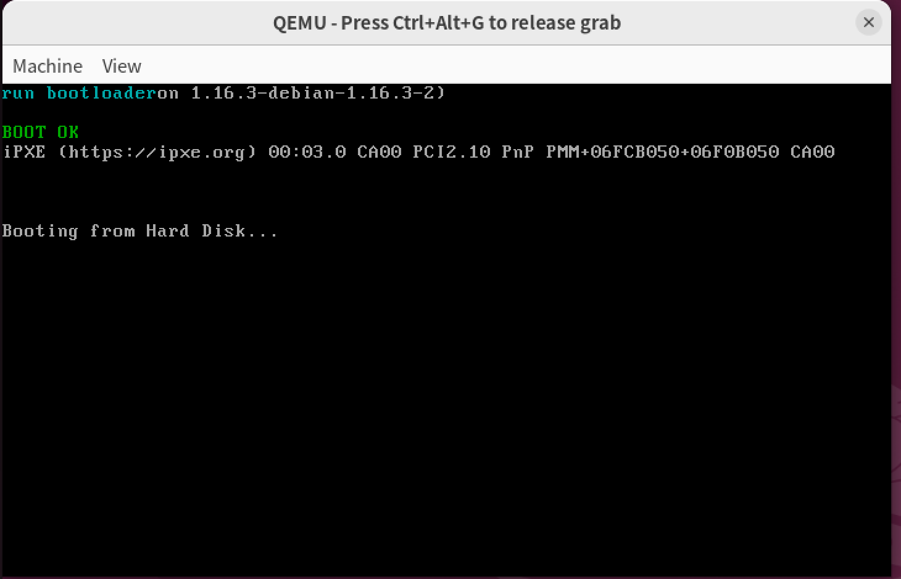

校验失败并停机：

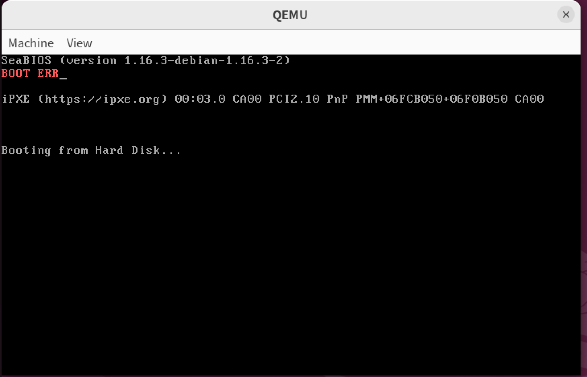

### A2 保护模式分析

#### A2.1 调试进入保护模式的四个关键步骤

进入保护模式需要完成四个关键步骤：

1. 使用 `lgdt` 加载 GDT 信息到 GDTR。
2. 打开 A20 地址线，使 CPU 能够访问 1MB 以上的地址。
3. 设置 CR0 的 PE 位，使 CPU 从实模式切换到保护模式。
4. 执行远跳转，刷新流水线并让 `CS:EIP` 进入 32 位代码段。

本实验中，GDT 起始地址为 `0x8800`，初始包含 5 个描述符：

| GDT 偏移 | 描述符 |
|----------|--------|
| `0x00` | 空描述符 |
| `0x08` | 平坦数据段描述符 |
| `0x10` | 栈段描述符 |
| `0x18` | 视频段描述符 |
| `0x20` | 平坦代码段描述符 |

加载 GDTR 前，需要先在内存中写入 GDT 的起始地址和界限。当前共有 5 个描述符，每个描述符 8 字节，因此 GDT 界限为：

$$
5 \times 8 - 1 = 39 = 0x27
$$

如果后续 A2.3 中新增第 6 个描述符，则 GDT 界限应改为：

$$
6 \times 8 - 1 = 47 = 0x2f
$$

调试时我们使用 gdb 在以下位置设置断点观察寄存器和物理内存。

| 步骤 | 关键指令 | 需要观察的内容 |
|------|----------|----------------|
| 加载 GDT | `lgdt [pgdt]` | `GDTR` 的 base 是否为 `0x8800`，limit 是否为 `0x27` 或 `0x2f` |
| 打开 A20 | `in al, 0x92`、`or al, 0000_0010B`、`out 0x92, al` | 端口 `0x92` 的 bit 1 被置 1 |
| 设置 PE 位 | `mov eax, cr0`、`or eax, 1`、`mov cr0, eax` | `CR0` 的 bit 0 变为 1，例如 `CR0=0x00000011` |
| 远跳转 | `jmp dword CODE_SELECTOR:protect_mode_begin` | `CS` 变为 `0x20`，后续以 `[bits 32]` 指令执行 |

进入保护模式后，程序继续加载各个段寄存器：

| 段寄存器 | 选择子 | 含义 |
|----------|--------|------|
| `CS` | `0x20` | 32 位平坦代码段 |
| `DS` | `0x08` | 32 位平坦数据段 |
| `ES` | `0x08` | 32 位平坦数据段 |
| `SS` | `0x10` | 栈段 |
| `GS` | `0x18` | 视频段，基地址为 `0xb8000` |

**核心代码：**

以下是 `bootloader.asm` 中进入保护模式的完整代码流程。首先在实模式下构造 GDT，然后依次完成 4 个关键步骤：

```asm
%include "boot.inc"
org 0x7e00
[bits 16]
; ... 省略输出 bootloader_tag 的代码 ...

; ---- 构造 GDT (5个描述符) ----
; 空描述符 (0x00)
mov dword [GDT_START_ADDRESS+0x00], 0x00000000
mov dword [GDT_START_ADDRESS+0x04], 0x00000000

; 平坦数据段描述符 (0x08): base=0, limit=4GB, G=4KB
mov dword [GDT_START_ADDRESS+0x08], 0x0000ffff
mov dword [GDT_START_ADDRESS+0x0c], 0x00cf9200

; 栈段描述符 (0x10): base=0, limit=0, G=1B
mov dword [GDT_START_ADDRESS+0x10], 0x00000000
mov dword [GDT_START_ADDRESS+0x14], 0x00409600

; 显存段描述符 (0x18): base=0xb8000, limit=0x7fff, G=1B
mov dword [GDT_START_ADDRESS+0x18], 0x80007fff
mov dword [GDT_START_ADDRESS+0x1c], 0x0040920b

; 平坦代码段描述符 (0x20): base=0, limit=4GB, G=4KB
mov dword [GDT_START_ADDRESS+0x20], 0x0000ffff
mov dword [GDT_START_ADDRESS+0x24], 0x00cf9800

; ---- 步骤1: 加载 GDT ----
mov word [pgdt], 39          ; 5描述符 × 8 - 1 = 39
lgdt [pgdt]                   ; 将 GDTR 信息加载到 CPU

; ---- 步骤2: 打开 A20 地址线 ----
in al, 0x92                   ; 南桥芯片端口
or al, 0000_0010B
out 0x92, al                  ; A20 地址线开启

; ---- 步骤3: 设置 CR0 的 PE 位 ----
cli                            ; 关闭中断
mov eax, cr0
or eax, 1
mov cr0, eax                  ; PE=1, 进入保护模式

; ---- 步骤4: 远跳转进入 32 位代码段 ----
jmp dword CODE_SELECTOR:protect_mode_begin

[bits 32]
protect_mode_begin:
    mov eax, DATA_SELECTOR     ; 加载数据段选择子 0x08
    mov ds, eax
    mov es, eax
    mov eax, STACK_SELECTOR    ; 加载栈段选择子 0x10
    mov ss, eax
    mov eax, VIDEO_SELECTOR    ; 加载视频段选择子 0x18
    mov gs, eax
```

> 执行 `lgdt` 前，GDTR 为 0：
>
> 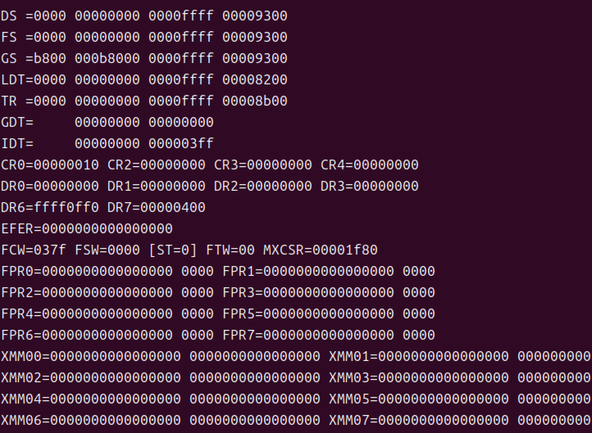

> 执行 `lgdt` 后，GDTR 指向 `0x8800` ：
>
> 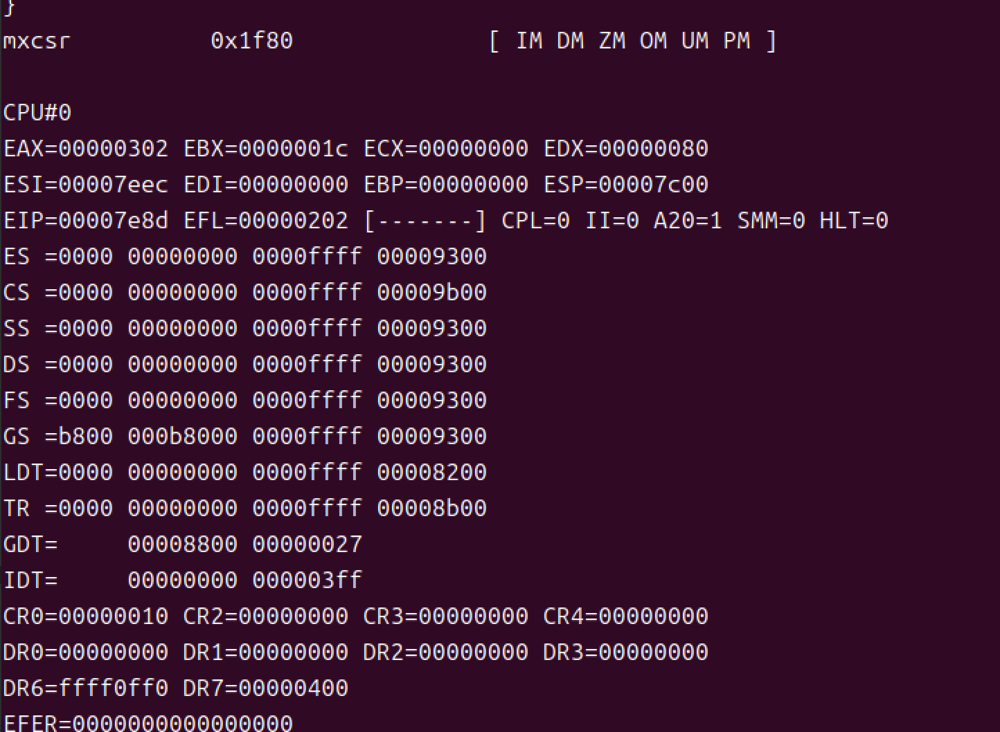

> 打开 A20 地址线后：
>
> 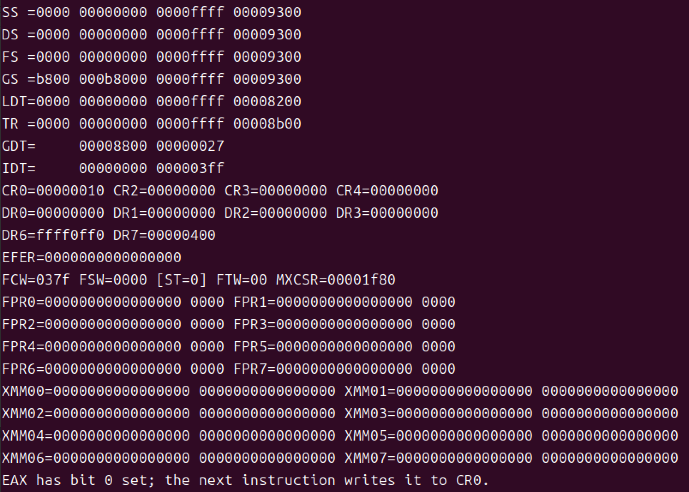

> 设置 CR0 的 PE 位后，`CR0` 低位为 1 ：
>
> 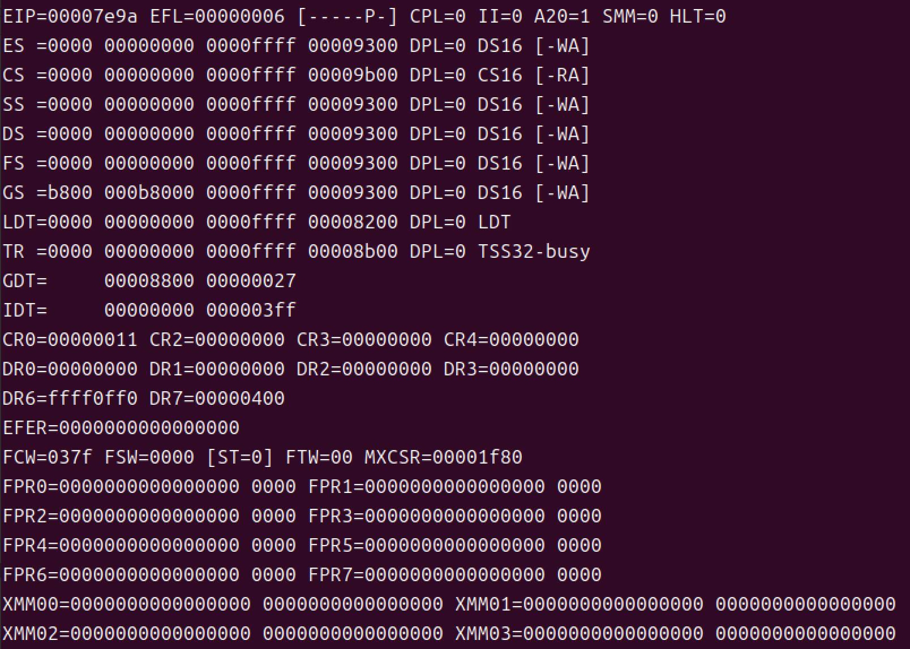

> 远跳转后，`CS=0x20` 进入 32 位保护模式：
>
> 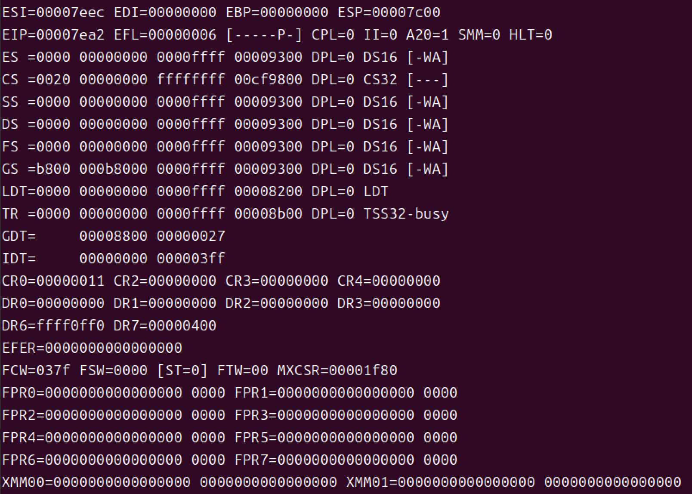

#### A2.2 手工解析数据段描述符

Example 2 的 GDT 中，第 2 个描述符位于 GDT 偏移 `0x08`，是平坦数据段描述符。源码中该描述符写入方式为：

```text
低 32 位：0x0000ffff
高 32 位：0x00cf9200
```

因此，如果从物理地址 `0x8808` 开始读取 8 字节，理论上可以得到：

```text
ff ff 00 00 00 92 cf 00
```

如果在加载 `DS` 之后再读取，也可能看到高 32 位变为 `0x00cf9300`。这是因为 x86 CPU 在加载段描述符时可能自动设置 Accessed 位，即 TYPE 字段最低位从 0 变为 1。此时描述符含义不变，只是访问位被置位。

我们通过GDB读取0x8800位置的内容：

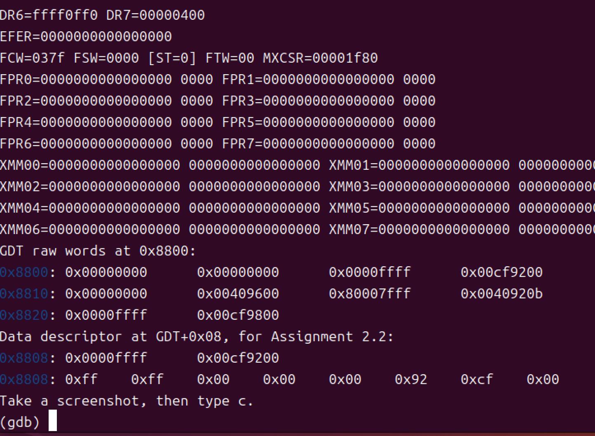

可以发现内容正是`ff ff 00 00 00 92 cf 00`。

按照段描述符格式，8 字节数据可拆分如下：

| 字段 | 来源 | 解析结果 |
|------|------|----------|
| Limit 低 16 位 | byte 0 到 byte 1 | `0xffff` |
| Base 低 16 位 | byte 2 到 byte 3 | `0x0000` |
| Base 中间 8 位 | byte 4 | `0x00` |
| Access 字节 | byte 5 | `0x92`，或访问后为 `0x93` |
| Limit 高 4 位 | byte 6 低 4 位 | `0xf` |
| Flags | byte 6 高 4 位 | `0xc` |
| Base 高 8 位 | byte 7 | `0x00` |

段基地址由三部分拼接：

$$
Base = Base_{low16} \;|\; (Base_{mid8} << 16) \;|\; (Base_{high8} << 24)
$$

代入本描述符：

$$
Base = 0x0000 | (0x00 << 16) | (0x00 << 24) = 0x00000000
$$

段界限由低 16 位和高 4 位拼接：

$$
Limit = 0xffff | (0xf << 16) = 0xfffff
$$

Flags 字节高 4 位为 `0xc`，二进制为 `1100`，对应：

| 位 | 值 | 含义 |
|----|----|------|
| G | 1 | 段界限粒度为 4KB |
| D/B | 1 | 默认操作数大小为 32 位 |
| L | 0 | 非 64 位代码段 |
| AVL | 0 | 保留位，未使用 |

由于 `G=1`，段界限以 4KB 为单位，实际可访问范围为：

$$
0x00000000 \sim (0xfffff << 12) + 0xfff = 0xffffffff
$$

因此该数据段是一个基地址为 0、覆盖 4GB 线性地址空间的平坦数据段。

Access 字节 `0x92` 的二进制形式为：

```text
1001 0010
```

可解析为：

| 字段 | 值 | 含义 |
|------|----|------|
| P | 1 | 段存在 |
| DPL | 0 | 最高特权级 |
| S | 1 | 代码或数据段描述符 |
| TYPE | `0010` | 数据段，可读写，向上扩展，Accessed 位初始为 0 |

如果调试器读到 `0x93`，则 TYPE 为 `0011`，表示同一个可读写数据段的 Accessed 位已经被置 1。

从原始内存布局也可以看出，x86 使用小端存储。例如，源码中低 32 位是 `0x0000ffff`，但从低地址到高地址读取到的是：

```text
ff ff 00 00
```

这说明低有效字节存放在低地址处，因此采用小端存储方式。

#### A2.3 新增自定义段描述符

本任务需要在 Example 2 的 GDT 中新增第 6 个描述符，GDT 偏移为：

$$
5 \times 8 = 0x28
$$

因此该段的段选择子为：

```text
0x28
```

新增段要求如下：

| 字段 | 要求 |
|------|------|
| 段类型 | 数据段 |
| 基地址 | `0x7000` |
| 段界限 | `0x1fff` |
| 粒度 | 字节粒度，`G=0` |
| D/B | 32 位，`D/B=1` |
| DPL | 0 |
| P | 1 |

按照段描述符格式拆分：

| 字段 | 值 |
|------|----|
| Limit 低 16 位 | `0x1fff` |
| Base 低 16 位 | `0x7000` |
| Base 中间 8 位 | `0x00` |
| Access | `0x92` |
| Flags + Limit 高 4 位 | `0x40` |
| Base 高 8 位 | `0x00` |

因此该描述符在内存中的 8 字节为：

```text
ff 1f 00 70 00 92 40 00
```

按源码中写入两个 dword 的形式，可以表示为：

```text
低 32 位：0x70001fff
高 32 位：0x00409200
```

新增该描述符后，GDT 共有 6 个描述符，因此 GDTR 界限需要从 `39` 修改为 `47`。

进入保护模式后，需要把选择子 `0x28` 加载到 `FS`：

```text
FS = 0x28
```

然后通过两种方式访问同一物理地址：

| 访问方式 | 计算过程 | 物理地址 |
|----------|----------|----------|
| `FS:0` | `FS` 段基地址 `0x7000` + 偏移 `0` | `0x7000` |
| `DS:0x7000` | `DS` 段基地址 `0` + 偏移 `0x7000` | `0x7000` |

实验中先通过 `FS:0` 写入一个标识字符串；再通过平坦数据段 `DS:0x7000` 读取同一地址并输出到屏幕。若屏幕输出与写入字符串一致，就说明自定义段描述符生效，并验证了保护模式下"段基地址 + 段内偏移 = 线性地址"的寻址方式。

**核心代码：**

在 `bootloader.asm` 中新增第 6 个 GDT 描述符，并修改 GDTR 界限。与 A2.1 相比，新增的部分如下：

```asm
; ---- 新增第6个描述符 (0x28): 自定义数据段, base=0x7000, limit=0x1FFF, 字节粒度 ----
mov dword [GDT_START_ADDRESS+0x28], 0x70001fff    ; 低32位: base低16位=0x7000, limit低16位=0x1FFF
mov dword [GDT_START_ADDRESS+0x2c], 0x00409200    ; 高32位: base高16位=0, access=0x92, flags=0x40

; GDTR 界限从 39 改为 47 (6描述符 × 8 - 1 = 47)
mov word [pgdt], 47
```

进入保护模式后，加载自定义段选择子到 `FS`，并通过 `FS:0` 和 `DS:0x7000` 两种方式访问同一物理地址：

```asm
[bits 32]
protect_mode_begin:
    ; ... 加载 DS/ES/SS/GS 选择子 (同 A2.1) ...
    mov eax, CUSTOM_DATA_SELECTOR   ; 0x28
    mov fs, ax                       ; FS = 0x28, 指向 base=0x7000 的自定义数据段

    ; ---- 通过 FS:0 写入标识字符串 ----
    mov ecx, assignment23_tag_end - assignment23_tag
    xor edi, edi                    ; 偏移 = 0
    mov esi, assignment23_tag
write_assignment23_tag:
    mov al, [esi]
    mov byte [fs:edi], al           ; 物理地址 = 0x7000 + edi
    inc esi
    inc edi
    loop write_assignment23_tag
    mov byte [fs:edi], 0            ; 字符串结束符

    ; ---- 通过 DS:0x7000 读取同一物理地址并输出到屏幕 ----
    mov ecx, assignment23_tag_end - assignment23_tag
    mov ebx, 80 * 2 * 2             ; 屏幕第2行
    mov esi, 0x7000                  ; 平坦数据段偏移 = 物理地址
    mov ah, 0x0a                     ; 绿色属性
output_assignment23_tag:
    mov al, [esi]                    ; DS:0x7000+i = 物理地址 0x7000+i
    mov word [gs:ebx], ax
    add ebx, 2
    inc esi
    loop output_assignment23_tag

assignment23_tag db 'ASSIGNMENT-2.3 FS->DS'
assignment23_tag_end:
```

> 两种访问方式指向同一物理地址：`FS:0` → `0x7000 + 0 = 0x7000`；`DS:0x7000` → `0 + 0x7000 = 0x7000`。屏幕上读出的字符串与写入内容一致，验证了自定义段描述符的正确性。

> 调试器中 GDT 偏移 `0x28` 处新增描述符的原始 8 字节。
>
> 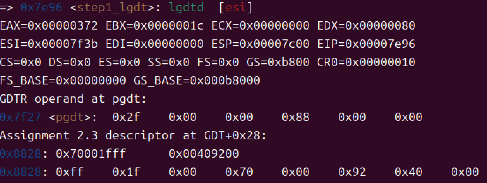

> 屏幕输出通过 `FS:0` 写入、再通过 `DS:0x7000` 读取到的标识字符串。
>
> 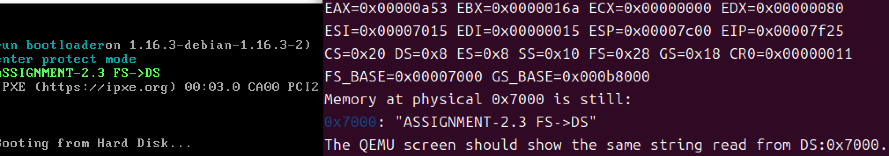

### A3 32 位保护模式编程

#### A3.1 移植 Lab2 Assignment 4 到保护模式

Lab2 Assignment 4 的字符回旋程序运行在 16 位实模式下，可以使用 BIOS 中断完成输出、延时等操作。

但进入保护模式后，实模式中断向量表不再适用于当前执行环境，直接调用 `int 10h`、`int 16h` 或 `int 15h` 可能导致程序异常。

因此，将 Lab2 程序移植到 32 位保护模式时，我们需要修改以下部分：

1. 使用 `[bits 32]`，并将主要寄存器从 `ax`、`bx`、`cx`、`dx` 改为 `eax`、`ebx`、`ecx`、`edx` 等 32 位寄存器。
2. 不再使用 BIOS 显示中断，而是直接写 VGA 显存。
3. 在保护模式下通过 `GS` 视频段访问显存，`GS` 需要提前加载视频段选择子 `0x18`。
5. 原程序使用 BIOS 延时中断，我们需要改为空循环等其他保护模式下可用的延时方式。

保护模式下的屏幕字符地址计算方式与实模式下写显存的思想一致。VGA 文本模式每个字符占 2 字节：

- 低字节：ASCII 字符
- 高字节：颜色属性

第 `row` 行、第 `col` 列对应的显存偏移为：

$$
offset = 2 \times (80 \times row + col)
$$

由于视频段描述符的基地址已经设置为 `0xb8000`，因此可以通过：

```text
GS:offset
```

访问屏幕上对应字符位置。

我们的实现思路是：在 bootloader 成功进入保护模式后，先完成段寄存器初始化，再调用改造后的 32 位字符回旋程序。程序内部用直接写显存的方式绘制字符位置，用变量记录当前位置、方向和颜色，在每轮循环中更新坐标并刷新屏幕。

**核心代码：**

进入保护模式后，先清屏，再显示标题和 GDT hex dump，最后进入字符回旋主循环。以下是 `bootloader.asm` 中的关键部分。

清屏子程序，用空格字符填充整个 VGA 显存区域（80×25 字符）：

```asm
clear_screen:
    pushad
    xor edi, edi
    mov ecx, 80 * 25
    mov ax, 0x0720           ; 0x07=灰色属性, 0x20=空格
.clear_loop:
    mov word[gs:edi], ax
    add edi, 2
    loop .clear_loop
    popad
    ret
```

字符回旋程序的核心思路：预先把屏幕外围一圈的 207 个 VGA 显存偏移写入位置表（存于 `0x9000`），然后主循环依次从位置表取出偏移，在每个位置写入回旋字符 `|/-\`，并循环变换颜色属性，通过延时循环控制速度：

```asm
[bits 32]
    ; ---- 生成外围一圈的位置偏移表，存于 PERIM_TABLE_ADDR (0x9000) ----
    ; 路径顺序：顶行(80) → 右列(24) → 底行(79) → 左列(24) = 207个位置
    mov edi, PERIM_TABLE_ADDR
    ; 顶行: row=0, col=0..79
    xor ecx, ecx
.top_row:
    cmp ecx, 80
    jge .top_done
    mov eax, ecx
    shl eax, 1              ; offset = col * 2
    mov [edi], ax
    add edi, 2
    inc ecx
    jmp .top_row
.top_done:
    ; 右列: col=79, row=1..24
    ; 底行: row=24, col=78..0
    ; 左列: col=0, row=23..1
    ; (类似逻辑，此处省略)

    ; ---- 回旋主循环 ----
    xor esi, esi            ; 外围位置索引
    xor edi, edi            ; 字符索引 (对应 | / - \)
    xor ebp, ebp            ; 颜色索引
.spin_loop:
    mov eax, esi
    shl eax, 1
    add eax, PERIM_TABLE_ADDR
    movzx ebx, word [eax]   ; 从位置表读取VGA偏移

    mov eax, edi
    and eax, 3
    mov al, [spin_chars + eax]   ; 取回旋字符 |/-\

    mov ecx, ebp
    and ecx, 7
    mov ah, byte [spin_colors + ecx]  ; 取颜色属性

    mov word [gs:ebx], ax   ; 写入VGA显存

    inc esi                  ; 推进位置索引
    cmp esi, edx             ; edx = 总位置数 207
    jb .no_wrap
    xor esi, esi             ; 回到起点
.no_wrap:
    inc edi
    inc ebp

    mov ecx, 10000000        ; 延时循环
.delay:
    dec ecx
    jnz .delay
    jmp .spin_loop

spin_chars db '|', '/', '-', '\'
spin_colors db 0x01, 0x02, 0x03, 0x04, 0x05, 0x06, 0x0E, 0x0A
```

> 字符回旋程序在 32 位保护模式下运行的屏幕结果:
>
> 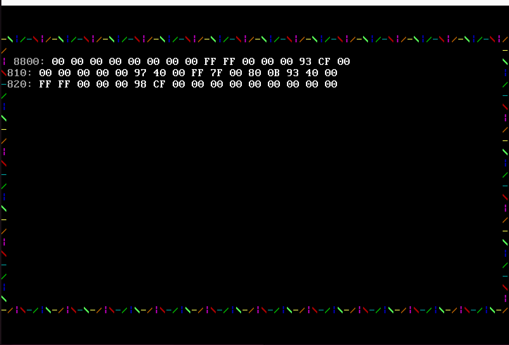

#### A3.2 实现 32 位十六进制内存转储函数

本任务要求在保护模式下实现一个可复用的 `hex_dump` 子程序，用于把指定内存区域以十六进制形式输出到屏幕。

约定输入为：

| 寄存器 | 含义 |
|--------|------|
| `ESI` | 起始内存地址 |
| `ECX` | 要显示的字节数 |

输出格式示例：

```text
7C00: EA 05 7C 00 00 00 00 00 B8 00 B8 8E E8 B4 03 B9
```

每一行由三部分组成：

1. 当前行起始地址的低 16 位，显示为 4 位十六进制数。
2. 冒号和空格。
3. 本行最多 16 个字节，每个字节显示为两位十六进制数，字节之间用空格分隔。

实现 `hex_dump` 的关键在于把一个 4 bit 的 nibble 转换为十六进制字符。可以准备一个查找表：

```text
0123456789ABCDEF
```

对于一个字节 `value`：

- 高 4 位为 `(value >> 4) & 0xf`
- 低 4 位为 `value & 0xf`

分别查表后输出两个字符，即可得到两位十六进制表示。

我将该功能拆分为几个子过程：

| 子过程 | 功能 |
|--------|------|
| `put_char` | 向 `GS` 视频段当前位置写入一个字符 |
| `print_hex_nibble` | 输出 1 个 4 bit 十六进制数字 |
| `print_hex_byte` | 输出 1 个字节的两位十六进制形式 |
| `print_hex_word` | 输出地址低 16 位的 4 位十六进制形式 |
| `hex_dump` | 按 16 字节每行循环输出指定内存区域 |

在本实验中，需要对 GDT 所在内存区域进行转储。GDT 起始地址为：

```text
0x8800
```

至少输出 32 字节，即前 4 个 GDT 描述符：

| 地址 | 内容 |
|------|------|
| `0x8800` 到 `0x8807` | 空描述符 |
| `0x8808` 到 `0x880f` | 平坦数据段描述符 |
| `0x8810` 到 `0x8817` | 栈段描述符 |
| `0x8818` 到 `0x881f` | 视频段描述符 |

根据源码，理论输出中数据段描述符对应的 8 字节应包含：

```text
FF FF 00 00 00 92 CF 00
```

如果在段寄存器加载后转储，也可能看到：

```text
FF FF 00 00 00 93 CF 00
```

这与 A2.2 中说明的 Accessed 位被 CPU 自动置位相对应。

通过比较 hex dump 输出与 A2.2 的手工解析结果，可以验证：

- GDT 确实位于 `0x8800`。
- 数据段描述符的基地址为 `0x00000000`。
- 数据段描述符的界限为 `0xfffff`，粒度为 4KB。
- x86 使用小端方式存储多字节数据。

**核心代码：**

以下是 `bootloader.asm` 中的 `hex_dump` 子程序。它使用查找表 `hex_table` 把每个字节拆分为高、低两个 nibble，分别转换为十六进制字符后写入 VGA 显存。每行显示 4 位地址 + 冒号 + 最多 16 字节数据：

```asm
; 十六进制字符查找表
hex_table db '0123456789ABCDEF'

; hex_dump 子程序
; 输入: ESI=起始地址, ECX=字节数, EBX=VGA显存偏移
hex_dump:
    pushad
.outer:
    test ecx, ecx
    jz .done

    ; --- 显示当前地址（4位十六进制）---
    mov eax, esi
    and eax, 0xFFFF
    call .write_hex4          ; 输出 4 位地址

    ; 输出 ": "
    mov byte[gs:ebx], ':'
    mov byte[gs:ebx+1], 0x07
    add ebx, 2
    mov byte[gs:ebx], ' '
    mov byte[gs:ebx+1], 0x07
    add ebx, 2

    ; --- 计算本行字节数 min(16, ECX) ---
    mov edi, 16
    cmp edi, ecx
    jbe .count_set
    mov edi, ecx
.count_set:

    ; --- 逐字节输出十六进制 ---
.byte_loop:
    test edi, edi
    jz .pad_loop
    mov al, [esi]
    inc esi

    ; 高 4 位
    mov edx, eax
    shr edx, 4
    and edx, 0xF
    mov dl, [hex_table + edx]  ; 查表得到十六进制字符
    mov byte[gs:ebx], dl
    mov byte[gs:ebx+1], 0x0F   ; 白色属性
    add ebx, 2

    ; 低 4 位
    mov edx, eax
    and edx, 0xF
    mov dl, [hex_table + edx]
    mov byte[gs:ebx], dl
    mov byte[gs:ebx+1], 0x0F
    add ebx, 2

    mov byte[gs:ebx], ' '      ; 字节间空格
    mov byte[gs:ebx+1], 0x07
    add ebx, 2

    dec ecx
    dec edi
    test ecx, ecx
    jz .pad_loop
    jmp .byte_loop

.pad_loop:                     ; 不足 16 字节时填充空格
    test edi, edi
    jz .newline
    ; 每个空槽填充 3 个空格
    mov byte[gs:ebx], ' '
    mov byte[gs:ebx+1], 0x07
    add ebx, 2
    ; ... (重复 2 次)
    dec edi
    jmp .pad_loop

.newline:                      ; 换行：对齐到下一行起始位置
    mov eax, ebx
    xor edx, edx
    mov edi, 160               ; 每行 160 字节 (80字符×2)
    div edi
    inc eax
    imul ebx, eax, 160
    jmp .outer

.done:
    popad
    ret

; 辅助: 将 EAX 低 16 位输出为 4 个 hex 字符
.write_hex4:
    push eax
    push edx
    ; 依次取 bit15-12, bit11-8, bit7-4, bit3-0 查表输出
    mov edx, eax
    shr edx, 12
    mov dl, [hex_table + edx]
    mov byte[gs:ebx], dl
    mov byte[gs:ebx+1], 0x07
    add ebx, 2
    ; ... (其余 3 个 nibble 类似)
    pop edx
    pop eax
    ret
```

调用 `hex_dump` 对 GDT 所在内存区域进行转储：

```asm
    mov esi, 0x8800            ; GDT 起始地址
    mov ecx, 48                ; 48字节 (6个描述符区域)
    mov ebx, 80 * 2 * 2 + 4   ; 显示在第2行第2列
    call hex_dump
```

> 屏幕显示从 `0x8800` 的 hex dump 输出：
>
> 

### 实验总结与心得体会

本次实验把前面实验中对 MBR 和实模式汇编的理解继续推进到了 bootloader 和保护模式。

在磁盘加载部分，我理解了 MBR 只负责完成最小启动逻辑，真正复杂的初始化工作需要交给 bootloader 完成。LBA28 方式体现了通过 I/O 端口直接和硬盘控制器交互的过程，而 CHS 方式则体现了 BIOS 在实模式下对磁盘访问的封装。通过加入 bootloader 魔数校验，也可以看到实际操作系统启动流程中加载校验的重要性。

在保护模式部分，GDT、GDTR、段描述符和段选择子的关系更加清晰。GDT 中保存段描述符，GDTR 指向 GDT 的位置和界限，段选择子用于索引 GDT 中的某个描述符，CPU 再根据描述符中的基地址、界限和属性完成段式地址转换与权限检查。

通过手工解析数据段描述符，我进一步理解了段描述符中 base、limit、G、D/B、S、TYPE、DPL 和 P 等字段的布局，也通过原始内存转储观察到了 x86 的小端存储方式。新增 `FS` 段描述符的任务则更直观地说明了保护模式下的地址计算方式：线性地址来自段基地址与段内偏移的相加。

最后，在 32 位保护模式编程中，原本实模式下可以依赖 BIOS 中断完成的屏幕输出、键盘读取和延时逻辑，都需要改为直接访问硬件或自己实现。这使我意识到进入保护模式并不只是寄存器宽度从 16 位变成 32 位，更意味着程序从 BIOS 提供的实模式运行环境中脱离出来，需要自己逐步建立操作系统内核所需的基础设施。
