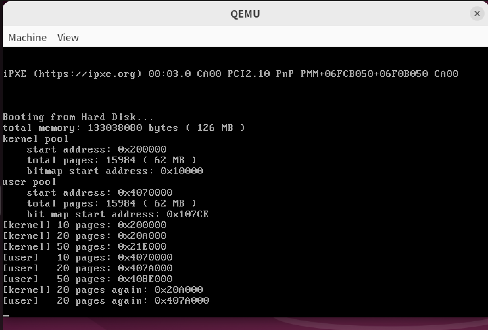
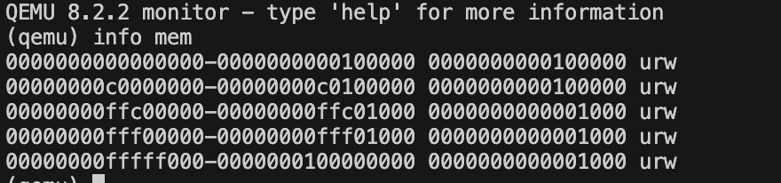
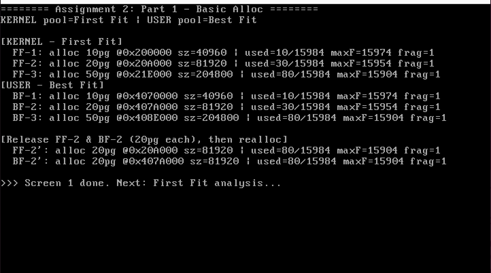
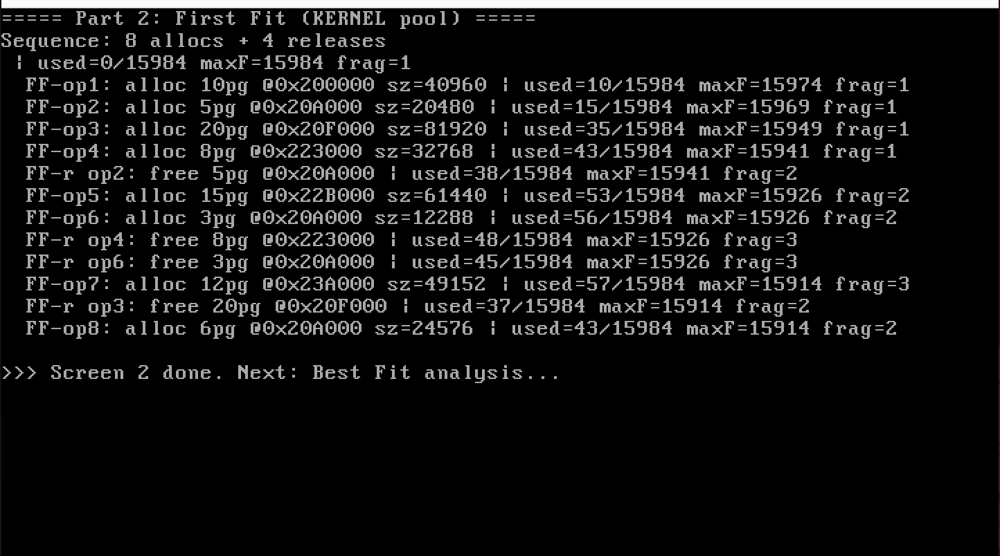
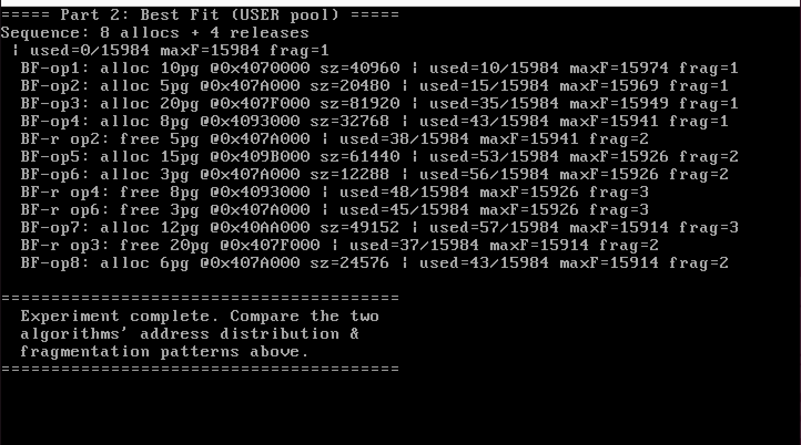
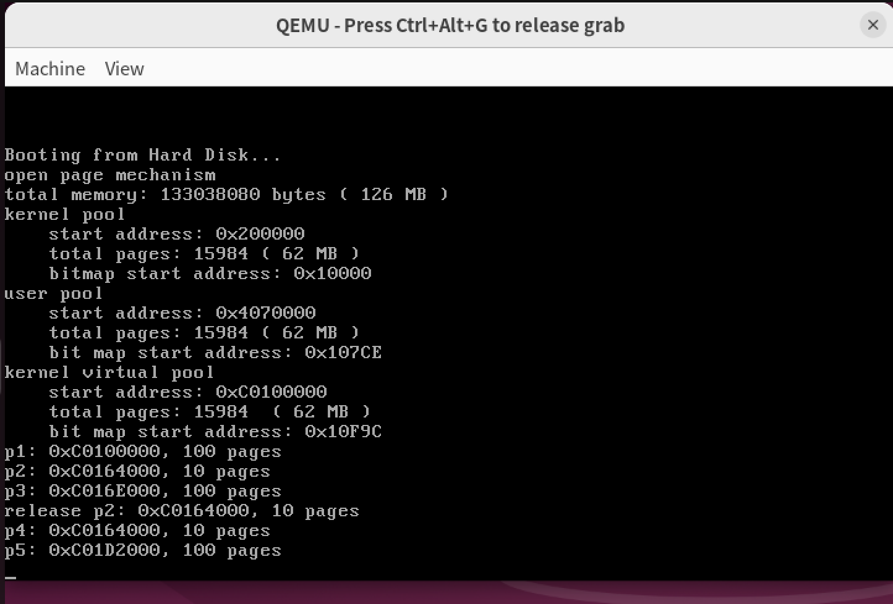
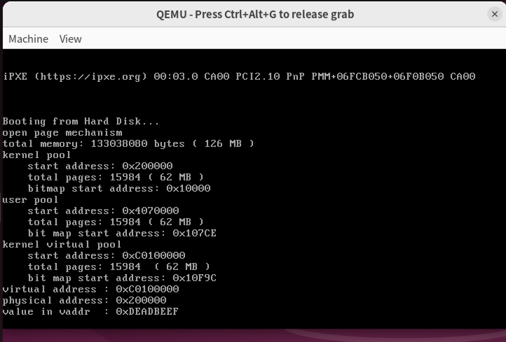
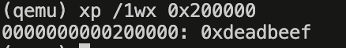
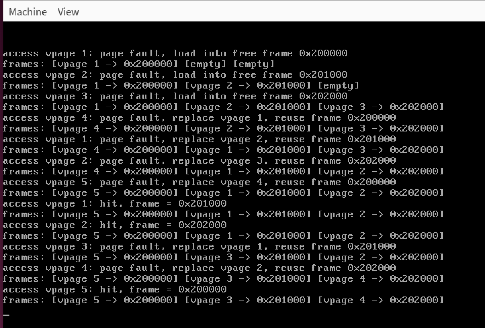

## Lab7 内存管理

### 实验环境

- 操作系统版本：虚拟机ubuntu arm64 24.04LTS
- CPU 架构：ARM64
- 主要工具：QEMU、gdb/gdb-multiarch、gcc/g++ 或 i686-elf-gcc/g++

### 实验概述

本次实验围绕操作系统中的内存管理展开，重点理解物理页管理、二级分页机制、虚拟页管理以及虚拟地址到物理地址的转换过程。

在开启分页机制之前，程序中使用的地址可以近似看作物理地址；而开启分页机制后，程序访问的是虚拟地址，CPU 会通过页目录表和页表将虚拟地址转换为最终访问的物理地址。由此，操作系统可以把连续的虚拟地址映射到不连续的物理页上，也可以让不同进程拥有相同的虚拟地址但对应不同的物理内存。

本实验的主要任务如下：

- 实验任务1：复现物理页内存管理和二级分页机制，理解 `BitMap`、`AddressPool` 和 `MemoryManager` 三层结构的关系，并通过 QEMU Monitor 验证分页开启后的映射关系。
- 实验任务2：实现并比较至少两种动态分区分配算法。本报告选择 First Fit 和 Best Fit 作为对比对象，并从地址分布、碎片数量和最大连续空闲块角度分析差异。
- 实验任务3：复现虚拟页内存管理，分析虚拟页分配、物理页分配和页表映射建立的完整过程，并推导自映射页目录项位置变化后 PDE/PTE 的虚拟地址。
- 实验任务4：模拟页面置换算法。本报告选择 FIFO 页面置换算法作为实现对象，观察物理页帧数量受限时的缺页和淘汰过程。

### A1 物理页内存管理与分页机制

#### A1.1 物理页内存管理复现

物理页内存管理的目标是把可管理的物理内存按照页大小划分，并记录每一个物理页当前是否已经被分配。实验中页大小为 4KB，因此只要知道某个页的页号，就可以通过页号乘以 `PAGE_SIZE` 得到它相对地址池起始位置的偏移。

本实验中的物理页管理分为三层：

- `BitMap`：负责用位来表示资源状态。每一位对应一个页，`0` 表示空闲，`1` 表示已分配。
- `AddressPool`：在 `BitMap` 的基础上加入地址池起始地址。`BitMap` 返回的是资源序号，而 `AddressPool` 负责把序号转换成实际物理地址。
- `MemoryManager`：统一管理内核物理地址池和用户物理地址池，并提供 `allocatePhysicalPages` 和 `releasePhysicalPages` 等接口。

初始化时，`MemoryManager::initialize` 首先通过 `getTotalMemory` 从 `MEMORY_SIZE_ADDRESS` 读取实模式下保存的内存容量。然后预留低端内存、内核空间和页表相关空间，再把剩余物理内存按页数划分为内核物理地址池和用户物理地址池。

具体流程可以概括为：

1. 读取总内存容量，计算已预留内存和剩余可分配内存。
2. 将剩余内存转换为可管理页数，并划分为内核页和用户页。
3. 确定内核物理地址池和用户物理地址池的起始地址。
4. 在 `BITMAP_START_ADDRESS` 开始处为两个地址池安排位图空间。
5. 调用两个 `AddressPool` 的 `initialize`，把位图、页数和起始地址绑定起来。

分配物理页时，`MemoryManager` 根据 `AddressPoolType` 选择对应地址池，再由 `AddressPool` 调用 `BitMap::allocate` 寻找连续空闲页。释放物理页时，先根据物理地址和地址池起始地址计算页号，再把对应位图重新置为 0。

我们将在 `first_thread` 中分别从内核物理地址池和用户物理地址池分配 10 页、20 页和 50 页，并打印每次分配得到的起始地址。随后释放其中一段空间并再次申请，观察新申请的地址是否复用了刚刚释放的区域。

关键测试代码如下。代码位于 `src/3/src/kernel/setup.cpp` ，用来验证内核物理地址池、用户物理地址池的分配和释放。

```cpp
void first_thread(void *arg)
{
    int k10 = memoryManager.allocatePhysicalPages(AddressPoolType::KERNEL, 10);
    int k20 = memoryManager.allocatePhysicalPages(AddressPoolType::KERNEL, 20);
    int k50 = memoryManager.allocatePhysicalPages(AddressPoolType::KERNEL, 50);

    int u10 = memoryManager.allocatePhysicalPages(AddressPoolType::USER, 10);
    int u20 = memoryManager.allocatePhysicalPages(AddressPoolType::USER, 20);
    int u50 = memoryManager.allocatePhysicalPages(AddressPoolType::USER, 50);

    printf("[kernel] 10 pages: 0x%x\n", k10);
    printf("[kernel] 20 pages: 0x%x\n", k20);
    printf("[kernel] 50 pages: 0x%x\n", k50);

    printf("[user]   10 pages: 0x%x\n", u10);
    printf("[user]   20 pages: 0x%x\n", u20);
    printf("[user]   50 pages: 0x%x\n", u50);

    memoryManager.releasePhysicalPages(AddressPoolType::KERNEL, k20, 20);
    memoryManager.releasePhysicalPages(AddressPoolType::USER, u20, 20);

    int k20Again = memoryManager.allocatePhysicalPages(AddressPoolType::KERNEL, 20);
    int u20Again = memoryManager.allocatePhysicalPages(AddressPoolType::USER, 20);

    printf("[kernel] 20 pages again: 0x%x\n", k20Again);
    printf("[user]   20 pages again: 0x%x\n", u20Again);

    asm_halt();
}
```

如果 `k20 Again` 与 `k20` 相同，`u20 Again` 与 `u20` 相同，则说明释放后的连续页被重新标记为空闲，并能够被后续分配复用。也同时能验证了 `releasePhysicalPages -> AddressPool::release -> BitMap::release` 这条释放链路的正确性。

运行效果如下：

> 

#### A1.2 开启二级分页机制

分页机制的核心思想是把程序访问的虚拟地址转换为物理地址。在 IA-32 的二级分页机制中，一个 32 位虚拟地址被划分为三部分：

- 高 10 位：页目录项序号。
- 中间 10 位：页表项序号。
- 低 12 位：页内偏移。

开启分页机制需要三步：

1. 初始化页目录表和页表。
2. 将页目录表的物理地址写入 CR3。
3. 将 CR0 的 PG 位置 1，使 CPU 开始使用分页机制。

在 `openPageMechanism` 中，页目录表被放在 `PAGE_DIRECTORY`，也就是 `0x100000`。紧随其后的一个页被用作最初的页表，用于建立 0 到 1MB 的恒等映射。恒等映射意味着虚拟地址和物理地址相同，这样可以保证分页刚开启时，当前正在运行的内核代码仍然能够被正确访问。

页目录表中几个关键项的含义如下：

- `directory[0]`：指向 0 到 4MB 线性地址对应的页表。本实验只初始化其中前 256 个页表项，所以实际建立的是 0 到 1MB 的恒等映射。
- `directory[768]`：与 `directory[0]` 指向同一张页表，使得虚拟地址 `0xc0000000` 到 `0xc00fffff` 也可以映射到物理地址 0 到 1MB。这为后续将内核映射到 3GB 以上高地址空间做准备。
- `directory[1023]`：指向页目录表本身。这个自映射设计让操作系统可以通过一段特殊的虚拟地址访问页目录项和页表项，后续 `toPDE` 和 `toPTE` 就依赖这个技巧。

分页寄存器初始化由 `asm_init_page_reg` 完成。它先把页目录表地址写入 CR3，再读取 CR0，将最高位 PG 置 1 后写回 CR0。完成后，程序中的地址就会经过分页机制转换。

开启分页的关键代码如下。代码位于 `src/4/src/kernel/memory.cpp` 中。

```cpp
void MemoryManager::openPageMechanism()
{
    int *directory = (int *)PAGE_DIRECTORY;
    int *page = (int *)(PAGE_DIRECTORY + PAGE_SIZE);

    memset(directory, 0, PAGE_SIZE);
    memset(page, 0, PAGE_SIZE);

    int address = 0;
    for (int i = 0; i < 256; ++i)
    {
        page[i] = address | 0x7;
        address += PAGE_SIZE;
    }

    directory[0] = ((int)page) | 0x7;
    directory[768] = directory[0];
    directory[1023] = ((int)directory) | 0x7;

    asm_init_page_reg(directory);

    printf("open page mechanism\n");
}
```

其中 `0x7` 表示同时置位 `P`、`R/W` 和 `U/S`。分页寄存器初始化由汇编函数完成。

```asm
asm_init_page_reg:
    push ebp
    mov ebp, esp

    push eax

    mov eax, [ebp + 4 * 2]
    mov cr3, eax
    mov eax, cr0
    or eax, 0x80000000
    mov cr0, eax

    pop eax
    pop ebp
    ret
```

`setup_kernel` 中需要先开启分页，再初始化内存管理器。这样 `MemoryManager::initialize` 后续访问的地址就已经处在分页机制下。

```cpp
memoryManager.openPageMechanism();
memoryManager.initialize();
```

运行效果如下：



图片内容文本形式：

```
(qemu) info mem
0000000000000000-0000000000100000 0000000000100000 urw
00000000c0000000-00000000c0100000 0000000000100000 urw
00000000ffc00000-00000000ffc01000 0000000000001000 urw
00000000fff00000-00000000fff01000 0000000000001000 urw
00000000fffff000-0000000100000000 0000000000001000 urw
```


### A2 动态分区分配算法

#### A2.1 First Fit 与 Best Fit 实现思路

动态分区分配算法的目标是在一段空闲资源中为请求找到合适的连续空间。为了便于和原实验代码衔接，本实验选择在位图层面实现多种分配策略，在 `BitMap` 中新增 `allocateWithStrategy` 方法支持不同算法。代码中实际实现了 First Fit、Best Fit 和 Worst Fit 三种策略，测试时选取 First Fit 和 Best Fit 进行对比。

First Fit 的思想是从位图开头开始扫描，遇到第一个长度不小于申请页数的连续空闲块就立即分配。它的优点是实现简单、搜索速度通常较快；缺点是低地址区域容易被反复切分，可能较早产生较多小碎片。

Best Fit 的思想是扫描全部空闲块，选择能够满足申请请求且大小最接近请求页数的空闲块。它的优点是每次分配后剩余空间较小，看起来更节省；缺点是需要完整扫描，开销更大，并且容易留下很多非常小、难以再次利用的碎片。

为了比较两种算法，实验在内核物理地址池（KERNEL）上使用 First Fit，在用户物理地址池（USER）上使用 Best Fit，在两个池上执行完全相同的分配/释放序列，从而在一次运行中同时观察两种算法的行为差异。地址越靠前，说明算法越倾向于复用低地址空闲块；最大连续空闲块越小、空闲碎片数量越多，说明碎片化越严重。

首先在 `src/6/include/bitmap.h` 中增加算法策略枚举和对应接口。为了兼容原框架，保留原有的 `allocate(count)`（默认 First Fit），新增 `allocateWithStrategy` 方法。

```cpp
enum AllocationStrategy
{
    FIRST_FIT,  // 首次适应：从头开始，找到第一个足够大的空闲分区
    BEST_FIT,   // 最佳适应：找到最小的足够大的空闲分区
    WORST_FIT   // 最坏适应：找到最大的空闲分区
};

class BitMap
{
public:
    int length;
    char *bitmap;

public:
    BitMap();
    void initialize(char *bitmap, const int length);
    bool get(const int index) const;
    void set(const int index, const bool status);

    int allocate(const int count);
    int allocateWithStrategy(const int count, AllocationStrategy strategy);
    void release(const int index, const int count);
    char *getBitmap();
    int size() const;

    int getUsedCount() const;
    int getMaxFreeBlock() const;
    int getFreeFragmentCount() const;

private:
    BitMap(const BitMap &) {}
    void operator=(const BitMap &) {}
};
```

`allocate(count)` 保持原有的 First Fit 逻辑：从低地址向高地址扫描，遇到第一个满足大小的连续空闲块就分配。

```cpp
int BitMap::allocate(const int count)
{
    if (count == 0)
        return -1;

    int index, empty, start;
    index = 0;
    while (index < length)
    {
        while (index < length && get(index))
            ++index;
        if (index == length)
            return -1;

        empty = 0;
        start = index;
        while ((index < length) && (!get(index)) && (empty < count))
        {
            ++empty;
            ++index;
        }

        if (empty == count)
        {
            for (int i = 0; i < count; ++i)
                set(start + i, true);
            return start;
        }
    }
    return -1;
}
```

`allocateWithStrategy` 通过 `switch` 分发到不同策略。First Fit 直接复用 `allocate`；Best Fit 完整扫描位图，找到满足请求且长度最小的空闲块；Worst Fit 找到最大的空闲块。

```cpp
int BitMap::allocateWithStrategy(const int count, AllocationStrategy strategy)
{
    if (count == 0)
        return -1;

    switch (strategy)
    {
    case FIRST_FIT:
        return allocate(count);

    case BEST_FIT:
    {
        int bestStart = -1;
        int bestSize = length + 1;
        int index = 0;
        while (index < length)
        {
            while (index < length && get(index))
                ++index;
            if (index == length)
                break;

            int freeStart = index;
            int freeSize = 0;
            while (index < length && !get(index))
            {
                ++freeSize;
                ++index;
            }

            if (freeSize >= count && freeSize < bestSize)
            {
                bestSize = freeSize;
                bestStart = freeStart;
            }
        }

        if (bestStart != -1)
        {
            for (int i = 0; i < count; ++i)
                set(bestStart + i, true);
            return bestStart;
        }
        return -1;
    }

    case WORST_FIT:
    {
        // 类似 Best Fit，但选择 freeSize 最大的空闲块
        int worstStart = -1;
        int worstSize = 0;
        int index = 0;
        while (index < length)
        {
            while (index < length && get(index))
                ++index;
            if (index == length)
                break;

            int freeStart = index;
            int freeSize = 0;
            while (index < length && !get(index))
            {
                ++freeSize;
                ++index;
            }

            if (freeSize >= count && freeSize > worstSize)
            {
                worstSize = freeSize;
                worstStart = freeStart;
            }
        }

        if (worstStart != -1)
        {
            for (int i = 0; i < count; ++i)
                set(worstStart + i, true);
            return worstStart;
        }
        return -1;
    }

    default:
        return allocate(count);
    }
}
```

`AddressPool` 增加带策略参数的分配接口，将位图返回的页号转换为地址。

```cpp
int AddressPool::allocateWithStrategy(const int count, AllocationStrategy strategy)
{
    int start = resources.allocateWithStrategy(count, strategy);
    return (start == -1) ? -1 : (start * PAGE_SIZE + startAddress);
}
```

`MemoryManager` 同步增加 `allocatePhysicalPagesWithStrategy` 和 `getBitMap` 接口。前者根据 `AddressPoolType` 选择地址池并调用 `allocateWithStrategy`，后者返回指定地址池的位图引用，用于统计。

```cpp
int MemoryManager::allocatePhysicalPagesWithStrategy(
    enum AddressPoolType type, const int count, AllocationStrategy strategy)
{
    int start = -1;
    if (type == AddressPoolType::KERNEL)
        start = kernelPhysical.allocateWithStrategy(count, strategy);
    else if (type == AddressPoolType::USER)
        start = userPhysical.allocateWithStrategy(count, strategy);
    return (start == -1) ? 0 : start;
}

BitMap &MemoryManager::getBitMap(enum AddressPoolType type)
{
    if (type == AddressPoolType::KERNEL)
        return kernelPhysical.resources;
    else
        return userPhysical.resources;
}
```

Part 1 的基本分配测试代码位于 `src/6/src/kernel/setup.cpp`，在 `first_thread` 中分别对 KERNEL 池（First Fit）和 USER 池（Best Fit）执行相同的分配序列：分配 10、20、50 页，释放中间 20 页后重新分配 20 页，打印每次分配的起始地址和分区大小。

```cpp
int doAlloc(const char *tag, AddressPoolType type, int pages, AllocationStrategy strategy)
{
    int addr = memoryManager.allocatePhysicalPagesWithStrategy(type, pages, strategy);
    if (addr)
        printf("  %s: alloc %d pages -> addr=0x%x  size=%d bytes\n",
               tag, pages, addr, pages * PAGE_SIZE);
    else
        printf("  %s: alloc %2d pages -> FAILED\n", tag, pages);
    return addr;
}

// Part 1 片段
int kf1 = doAlloc("FF-1", KERNEL, 10, FIRST_FIT);
int kf2 = doAlloc("FF-2", KERNEL, 20, FIRST_FIT);
int kf3 = doAlloc("FF-3", KERNEL, 50, FIRST_FIT);

int uf1 = doAlloc("BF-1", USER, 10, BEST_FIT);
int uf2 = doAlloc("BF-2", USER, 20, BEST_FIT);
int uf3 = doAlloc("BF-3", USER, 50, BEST_FIT);

memoryManager.releasePhysicalPages(KERNEL, kf2, 20);
memoryManager.releasePhysicalPages(USER, uf2, 20);

int kf2again = doAlloc("FF-2'", KERNEL, 20, FIRST_FIT);
int uf2again = doAlloc("BF-2'", USER, 20, BEST_FIT);
```

> First Fit 与 Best Fit 在同一分配序列下的地址分布对比：
>
> 

#### A2.2 内存利用率分析

为了观察不同算法对碎片的影响，本实验设计了如下测试序列（8 次分配 + 4 次释放），在 KERNEL 池（First Fit）和 USER 池（Best Fit）上分别执行：

| 步骤 | 操作 | 说明 |
| ---- | ---- | ---- |
| 1 | alloc op1 = 10 | 分配 10 页 |
| 2 | alloc op2 = 5 | 分配 5 页 |
| 3 | alloc op3 = 20 | 分配 20 页 |
| 4 | alloc op4 = 8 | 分配 8 页 |
| 5 | free op2 | 释放 5 页空间 |
| 6 | alloc op5 = 15 | 观察是否复用 op2 的空间 |
| 7 | alloc op6 = 3 | 继续切分剩余空闲块 |
| 8 | free op4 | 释放 8 页 |
| 9 | free op6 | 释放 3 页，产生小碎片 |
| 10 | alloc op7 = 12 | 观察两种算法对不同碎片的选择 |
| 11 | free op3 | 释放较大的连续空间 |
| 12 | alloc op8 = 6 | 观察大块释放后的落点 |

每一步操作后统计三个指标：

- 已分配页数 / 总页数：反映总体内存使用率。
- 最大连续空闲块大小：反映后续还能满足多大规模的连续分配请求。
- 空闲碎片数量：反映空闲空间被切分成了多少段。

统计函数可以在 `BitMap` 中补充，例如统计已分配位数、扫描最长连续 0 的长度，以及统计从已分配状态进入空闲状态的次数。由于位图本身已经保存了每一页的分配状态，这些指标都可以通过一次线性扫描得到。

预期对比结果如下：First Fit 的分配位置通常更靠前，运行速度更快，但低地址区域更容易出现零散空洞；Best Fit 会优先选择最贴合请求大小的空闲块，在某些序列下能够保留较大的空闲块，但也可能留下更多很小的碎片。

统计函数可以直接放在 `BitMap` 中。`getUsedCount` 统计已经置 1 的页数，`getMaxFreeBlock` 统计最长连续空闲页数，`getFreeFragmentCount` 统计空闲块段数。

```cpp
int BitMap::getUsedCount() const
{
    int count = 0;
    for (int i = 0; i < length; ++i)
    {
        if (get(i))
            ++count;
    }
    return count;
}

int BitMap::getMaxFreeBlock() const
{
    int maxBlock = 0;
    int currentBlock = 0;

    for (int i = 0; i < length; ++i)
    {
        if (!get(i))
        {
            ++currentBlock;
            if (currentBlock > maxBlock)
                maxBlock = currentBlock;
        }
        else
            currentBlock = 0;
    }
    return maxBlock;
}

int BitMap::getFreeFragmentCount() const
{
    int fragments = 0;
    bool inFree = false;

    for (int i = 0; i < length; ++i)
    {
        if (!get(i))
        {
            if (!inFree)
            {
                ++fragments;
                inFree = true;
            }
        }
        else
            inFree = false;
    }
    return fragments;
}
```

测试中通过 `memoryManager.getBitMap(type)` 获取位图引用并打印统计信息。`printStats` 和 `doAlloc` 是两个辅助函数，分别用于打印统计指标和执行分配操作。

```cpp
void printStats(const char *label, AddressPoolType type)
{
    BitMap &bm = memoryManager.getBitMap(type);
    int total = bm.size();
    int used = bm.getUsedCount();
    int maxFree = bm.getMaxFreeBlock();
    int frags = bm.getFreeFragmentCount();

    printf("[%s] used=%d/%d  maxFreeBlock=%d  fragments=%d\n",
           label, used, total, maxFree, frags);
}

int doAlloc(const char *tag, AddressPoolType type, int pages, AllocationStrategy strategy)
{
    int addr = memoryManager.allocatePhysicalPagesWithStrategy(type, pages, strategy);
    if (addr)
        printf("  %s: alloc %d pages -> addr=0x%x  size=%d bytes\n",
               tag, pages, addr, pages * PAGE_SIZE);
    else
        printf("  %s: alloc %2d pages -> FAILED\n", tag, pages);
    return addr;
}
```

Part 2 测试在 `first_thread` 中对 KERNEL 池和 USER 池分别执行上述序列，每次操作后调用 `printStats` 打印统计结果。由于两个地址池的初始状态相同（页数相同、全部空闲），且分配/释放序列完全一致，因此可以直接对比两种算法的碎片情况和地址分布。下面是 KERNEL 池（First Fit）的测试片段，USER 池（Best Fit）执行完全相同的序列。

```cpp
// Part 2 片段（KERNEL 池 - First Fit）
printStats("initial   ", KERNEL);
doAlloc("FF-op1 ", KERNEL, 10, FIRST_FIT);
printStats("after op1 ", KERNEL);
int ffa2 = doAlloc("FF-op2 ", KERNEL, 5, FIRST_FIT);
printStats("after op2 ", KERNEL);
int ffa3 = doAlloc("FF-op3 ", KERNEL, 20, FIRST_FIT);
printStats("after op3 ", KERNEL);
int ffa4 = doAlloc("FF-op4 ", KERNEL, 8, FIRST_FIT);
printStats("after op4 ", KERNEL);

memoryManager.releasePhysicalPages(KERNEL, ffa2, 5);
printStats("after rel ", KERNEL);
doAlloc("FF-op5 ", KERNEL, 15, FIRST_FIT);
printStats("after op5 ", KERNEL);
int ffa6 = doAlloc("FF-op6 ", KERNEL, 3, FIRST_FIT);
printStats("after op6 ", KERNEL);

memoryManager.releasePhysicalPages(KERNEL, ffa4, 8);
printStats("after rel ", KERNEL);
memoryManager.releasePhysicalPages(KERNEL, ffa6, 3);
printStats("after rel ", KERNEL);
doAlloc("FF-op7 ", KERNEL, 12, FIRST_FIT);
printStats("after op7 ", KERNEL);

memoryManager.releasePhysicalPages(KERNEL, ffa3, 20);
printStats("after rel ", KERNEL);
doAlloc("FF-op8 ", KERNEL, 6, FIRST_FIT);
printStats("after op8 ", KERNEL);
```

USER 池（Best Fit）执行完全相同的序列，只需将 `KERNEL` 改为 `USER`、`FIRST_FIT` 改为 `BEST_FIT`。





### A3 虚拟页内存管理与地址变换

#### A3.1 复现虚拟页内存管理

开启分页机制后，程序使用的是虚拟地址。此时分配内存不再只是寻找物理页，而是要同时管理虚拟地址和物理地址，并在页目录表和页表中建立二者之间的映射关系。

本实验中的虚拟页分配分为三步：

1. 从内核虚拟地址池中分配连续的虚拟页。
2. 对每一个虚拟页，从对应的物理地址池中分配一个物理页。
3. 通过页目录项和页表项建立虚拟页到物理页的映射。

`MemoryManager` 在原有 `kernelPhysical` 和 `userPhysical` 的基础上增加 `kernelVirtual`。内核虚拟地址池的起始地址为 `KERNEL_VIRTUAL_START`，也就是 `0xc0100000`。这是因为 0 到 1MB 的物理内核空间已经被映射到高地址空间的 `0xc0000000` 起始区域，而新的内核虚拟页从 `0xc0100000` 开始更符合内核高地址映射的布局。

`allocatePages` 先调用 `allocateVirtualPages` 得到连续虚拟页起始地址，再逐页申请物理页。每得到一个物理页，就调用 `connectPhysicalVirtualPage` 建立映射。如果中途某个物理页申请失败，需要释放之前已经成功分配的虚拟页和物理页，避免内存泄漏。

`connectPhysicalVirtualPage` 的关键在于先通过 `toPDE` 和 `toPTE` 找到虚拟地址对应的页目录项和页表项。如果页目录项不存在，说明对应页表还没有分配，此时需要先从内核物理地址池中分配一个页作为页表，并把页表地址写入 PDE。随后再把目标物理页地址写入 PTE。

测试时，可以在 `first_thread` 中依次分配 100 页、10 页和 100 页，打印三段虚拟地址；释放中间的 10 页后再次申请不同大小的页块，观察新地址是否复用了释放区域，或者因为连续空间不足而选择新的虚拟地址区间。

虚拟页管理的测试代码位于 `src/5/src/kernel/setup.cpp` 的 `first_thread` 中。在当前代码中，A3.1 的测试代码被注释掉，而 A3.3 的虚拟地址验证代码处于激活状态。要运行 A3.1 测试，需要取消注释下面的代码，同时注释掉 A3.3 的测试代码。下面代码先分配三段连续虚拟页，再释放中间 10 页并重新分配，用于观察虚拟地址复用情况。

```cpp
void first_thread(void *arg)
{
    int p1 = memoryManager.allocatePages(AddressPoolType::KERNEL, 100);
    int p2 = memoryManager.allocatePages(AddressPoolType::KERNEL, 10);
    int p3 = memoryManager.allocatePages(AddressPoolType::KERNEL, 100);

    printf("p1: 0x%x, 100 pages\n", p1);
    printf("p2: 0x%x, 10 pages\n", p2);
    printf("p3: 0x%x, 100 pages\n", p3);

    memoryManager.releasePages(AddressPoolType::KERNEL, p2, 10);
    printf("release p2: 0x%x, 10 pages\n", p2);

    int p4 = memoryManager.allocatePages(AddressPoolType::KERNEL, 10);
    printf("p4: 0x%x, 10 pages\n", p4);

    int p5 = memoryManager.allocatePages(AddressPoolType::KERNEL, 100);
    printf("p5: 0x%x, 100 pages\n", p5);

    asm_halt();
}
```

理论上，如果释放后的 10 页仍然满足下一次 10 页申请，`p4` 应该与原来的 `p2` 相同。这说明内核虚拟地址池中的位图已经正确释放并重新分配。如果后续申请 100 页，由于原来释放的空洞只有 10 页，`p5` 不会落在 `p2` 原位置，而会继续向后寻找新的连续虚拟页区间。

>  虚拟页分配、释放和重新分配后的虚拟地址输出截图如下：
>
> 

#### A3.2 PDE/PTE 虚拟地址构造

实验代码中，`openPageMechanism` 将第 1023 个页目录项指向页目录表本身。这样，系统可以构造出页目录项和页表项的虚拟地址。原本的公式为：

- PDE 虚拟地址：`0xfffff000 + 页目录项序号 * 4`
- PTE 虚拟地址：`0xffc00000 + 页目录项序号 * 0x1000 + 页表项序号 * 4`

现在假设自映射页目录项从第 1023 项改为第 1000 项。记自映射项序号为 `R = 1000 = 0x3e8`。

此时 PDE 和 PTE 的通用构造方式变为：

- 第 `i` 个页目录项的虚拟地址为 `(R << 22) | (R << 12) | (i * 4)`。
- 第 `p` 个页目录项指向的页表中，第 `t` 个页表项的虚拟地址为 `(R << 22) | (p << 12) | (t * 4)`。

先推导第 141 个页目录项的虚拟地址。

`R << 22 = 0xfa000000`，`R << 12 = 0x003e8000`，`141 * 4 = 564 = 0x234`。

因此：

`PDE[141] = 0xfa000000 + 0x003e8000 + 0x234 = 0xfa3e8234`

再推导第 891 个页目录项指向的页表中，第 109 个页表项的虚拟地址。

`R << 22 = 0xfa000000`，`891 << 12 = 0x0037b000`，`109 * 4 = 436 = 0x1b4`。

因此：

`PTE[891][109] = 0xfa000000 + 0x0037b000 + 0x1b4 = 0xfa37b1b4`

可以看到，当自映射项从 1023 改为 1000 后，高 10 位不再是全 1，而是 `0x3e8` 对应的二进制值，所以 PDE/PTE 虚拟地址所在的高地址区域也从 `0xff...` 变为 `0xfa...`。

#### A3.3 虚拟地址到物理地址的验证

`vaddr2paddr` 用于把一个虚拟地址转换为物理地址。它先调用 `toPTE` 找到虚拟地址对应的页表项，再取页表项高 20 位作为物理页起始地址，最后加上虚拟地址低 12 位的页内偏移。

验证流程如下：

1. 使用 `allocatePages(AddressPoolType::KERNEL, 1)` 分配一页内核虚拟内存。
2. 调用 `vaddr2paddr` 计算该虚拟地址对应的物理地址，并打印两者。
3. 向该虚拟地址写入特定值，例如 `0xDEADBEEF`。
4. 在 QEMU Monitor 中使用 `xp` 查看对应物理地址处的内容。
5. 如果 QEMU Monitor 中看到的物理地址内容与写入值一致，说明虚拟地址到物理地址的映射正确。

这一验证的关键点是：程序写入的是虚拟地址，但 QEMU Monitor 的 `xp` 查看的是物理地址。如果两处值一致，就说明 MMU 根据页表完成了正确转换。

验证虚拟地址到物理地址转换时，可以在 `first_thread` 中加入如下测试代码。

```cpp
void first_thread(void *arg)
{
    int vaddr = memoryManager.allocatePages(AddressPoolType::KERNEL, 1);
    int paddr = memoryManager.vaddr2paddr(vaddr);

    *((uint32 *)vaddr) = 0xDEADBEEF;

    printf("virtual address : 0x%x\n", vaddr);
    printf("physical address: 0x%x\n", paddr);
    printf("value in vaddr  : 0x%x\n", *((uint32 *)vaddr));

    asm_halt();
}
```

程序运行后，记录输出的物理地址，然后在 QEMU Monitor 中查看该地址。

```text
xp /1wx 0x200000
```

Monitor 中显示的值为 `0xdeadbeef`，说明虚拟地址 `vaddr` 被正确映射到了 `paddr` 所在的物理页。

> 程序输出虚拟地址和物理地址的截图如下：
>
> 

> QEMU Monitor 使用 `xp` 查看物理地址内容的截图如下：
>
> 

### A4 页面置换算法模拟

#### A4.1 FIFO 页面置换算法

真实操作系统中的页面置换通常与缺页异常、页表状态位、磁盘换入换出等机制配合完成。本实验要求实现的是简化模拟，不需要真的依赖缺页中断，也不需要把被淘汰页写回磁盘，而是在物理页帧数量受限时，通过输出信息展示页面置换过程。

本报告选择 FIFO 页面置换算法。FIFO 的思想是：物理页帧满时，淘汰最早进入内存的虚拟页。它的实现比较直观，可以用一个队列记录已经装入物理页帧的虚拟页。每次访问虚拟页时：

1. 如果虚拟页已经在物理页帧中，则命中，不发生置换。
2. 如果虚拟页不在物理页帧中且仍有空闲页帧，则分配一个页帧并把该虚拟页加入队列。
3. 如果虚拟页不在物理页帧中且没有空闲页帧，则弹出队首虚拟页，将其对应页帧分配给新的虚拟页，并输出被淘汰页号、复用的物理页帧和新虚拟页号。

测试访问序列可以设置为：

`1, 2, 3, 4, 1, 2, 5, 1, 2, 3, 4, 5`

若物理页帧数量限制为 3，则该序列会多次触发缺页和淘汰，便于观察 FIFO 的行为。FIFO 的优点是实现简单、维护成本低；缺点是只根据进入内存的时间淘汰页面，不考虑近期是否被访问，因此可能淘汰正在频繁使用的页面。

`src/7` 在 `src/5` 虚拟页内存管理代码的基础上，在 `MemoryManager` 中加入了一个简化的 FIFO 页面置换模拟器。先在 `src/7/include/memory.h` 中增加接口声明。

```cpp
class MemoryManager
{
public:
    // ... 原有成员

    void initializePageReplacement();
    void accessPage(const int virtualPage);
    void printPageFrames();
};
```

然后在 `src/7/src/kernel/memory.cpp` 中加入固定数量的模拟物理页帧。这里将物理页帧数量限制为 3，便于快速触发置换。

```cpp
const int SIM_FRAME_COUNT = 3;

struct SimFrame
{
    bool valid;          // 该页帧是否已被占用
    int virtualPage;     // 当前装入该页帧的虚拟页号
    int physicalPage;    // 该页帧对应的物理页起始地址
};

SimFrame simFrames[SIM_FRAME_COUNT];
int fifoHead = 0;
int loadedFrames = 0;

int findSimFrame(const int virtualPage)
{
    for (int i = 0; i < SIM_FRAME_COUNT; ++i)
    {
        if (simFrames[i].valid && simFrames[i].virtualPage == virtualPage)
            return i;
    }

    return -1;
}
```

初始化时，先从内核物理地址池中取出 3 个物理页作为模拟页帧。后续发生置换时，只复用这些物理页帧。

```cpp
void MemoryManager::initializePageReplacement()
{
    fifoHead = 0;
    loadedFrames = 0;

    for (int i = 0; i < SIM_FRAME_COUNT; ++i)
    {
        simFrames[i].valid = false;
        simFrames[i].virtualPage = -1;
        simFrames[i].physicalPage =
            allocatePhysicalPages(AddressPoolType::KERNEL, 1);

        if (!simFrames[i].physicalPage)
        {
            printf("can not allocate simulated frame\n");
            asm_halt();
        }
    }

    printf("page replacement simulator initialized, frame count = %d\n",
           SIM_FRAME_COUNT);
}
```

每次访问虚拟页时，先判断是否命中。若未命中且还有空闲模拟页帧，则直接装入；若未命中且页帧已满，则淘汰 FIFO 队首对应的虚拟页。

```cpp
void MemoryManager::accessPage(const int virtualPage)
{
    int frame = findSimFrame(virtualPage);

    if (frame != -1)
    {
        printf("access vpage %d: hit, frame = 0x%x\n",
               virtualPage, simFrames[frame].physicalPage);
        printPageFrames();
        return;
    }

    printf("access vpage %d: page fault, ", virtualPage);

    if (loadedFrames < SIM_FRAME_COUNT)
    {
        int index = loadedFrames;
        ++loadedFrames;

        simFrames[index].valid = true;
        simFrames[index].virtualPage = virtualPage;

        printf("load into free frame 0x%x\n",
               simFrames[index].physicalPage);
        printPageFrames();
        return;
    }

    int victim = fifoHead;
    fifoHead = (fifoHead + 1) % SIM_FRAME_COUNT;

    int oldVirtualPage = simFrames[victim].virtualPage;
    simFrames[victim].virtualPage = virtualPage;

    printf("replace vpage %d, reuse frame 0x%x\n",
           oldVirtualPage,
           simFrames[victim].physicalPage);

    printPageFrames();
}
```

为了让输出更直观，可以在每次访问后打印当前 3 个页帧中保存的虚拟页号。

```cpp
void MemoryManager::printPageFrames()
{
    printf("frames: ");

    for (int i = 0; i < SIM_FRAME_COUNT; ++i)
    {
        if (simFrames[i].valid)
        {
            printf("[vpage %d -> 0x%x] ",
                   simFrames[i].virtualPage,
                   simFrames[i].physicalPage);
        }
        else
        {
            printf("[empty] ");
        }
    }

    printf("\n");
}
```

最后在 `src/7/src/kernel/setup.cpp` 的 `first_thread` 中设计访问序列。`setup_kernel` 中先调用 `openPageMechanism` 开启分页机制，再调用 `initialize` 初始化内存管理器，与 `src/5` 保持一致。

```cpp
void first_thread(void *arg)
{
    int sequence[] = {1, 2, 3, 4, 1, 2, 5, 1, 2, 3, 4, 5};
    int count = sizeof(sequence) / sizeof(sequence[0]);

    memoryManager.initializePageReplacement();

    for (int i = 0; i < count; ++i)
    {
        memoryManager.accessPage(sequence[i]);
    }

    asm_halt();
}
```

这段代码模拟的是页面置换策略本身，而不是完整的缺页异常处理流程。它没有真的修改页表映射，也没有把被淘汰页写回磁盘，但能够清楚展示 FIFO 在页帧不足时如何选择被淘汰页面。

FIFO 页面置换模拟输出截图，包括命中、缺页、淘汰页号和当前物理页帧状态：



```
access vpage 1: page fault, load into free frame 0x200000
frames: [vpage 1 -> 0x200000] [empty] [empty]
access vpage 2: page fault, load into free frame 0x201000
frames: [vpage 1 -> 0x200000] [vpage 2 -> 0x201000] [empty]
access vpage 3: page fault, load into free frame 0x202000
frames: [vpage 1 -> 0x200000] [vpage 2 -> 0x201000] [vpage 3 -> 0x202000]
access vpage 4: page fault, replace vpage 1, reuse frame 0x200000   ← FIFO淘汰队首
...
access vpage 1: hit, frame = 0x201000                                 ← 命中
access vpage 2: hit, frame = 0x202000                                 ← 命中
...
access vpage 5: hit, frame = 0x200000                                 ← 命中
```


### 思考题

1. 相比于一级页表，二级页表的好处是什么？在什么情况下二级页表的空间开销反而更大？

一级页表需要一次性准备能够覆盖整个 4GB 地址空间的页表。对于 4KB 页大小，一级页表需要 1M 个页表项，每项 4 字节，总大小为 4MB。二级页表把页表拆成页目录表和多个页表，只有实际使用到某段虚拟地址时才分配对应页表，因此能够节省大量空闲地址空间对应的页表开销。

不过，如果一个进程几乎使用了完整的 4GB 虚拟地址空间，二级页表仍然需要分配大量页表，再加上额外的页目录表，空间开销会比一级页表略大。

2. 如果将功能号 `0xe801` 的 `0x15` 中断改为 `0xe820`，需要修改哪些代码？`0xe820` 的优势是什么？

需要修改 MBR 或 bootloader 中获取内存容量的实模式中断调用逻辑，因为 `0xe820` 返回的是一组内存地址范围描述符，而不是简单的低端/高端内存大小。相应地，保护模式下读取内存信息的代码也要修改，不能再只从 `MEMORY_SIZE_ADDRESS` 读取一个 32 位结果，而应该解析保存下来的内存布局表。

`0xe820` 的优势是能返回更完整的物理内存布局，包括哪些区域可用、哪些区域被 BIOS、设备或保留内存占用，因此更适合真实操作系统进行精确内存管理。

3. 在多进程环境下，如何保证不同进程的虚拟地址空间互不干扰？页目录表和页表在其中扮演什么角色？

不同进程可以拥有各自独立的页目录表和页表。即使两个进程使用相同的虚拟地址，只要它们的页表映射到不同的物理页，就不会访问到彼此的数据。进程切换时，操作系统切换 CR3 中的页目录表地址，也就是切换当前地址空间。

页目录表负责找到虚拟地址高 10 位对应的页表，页表负责找到虚拟地址中间 10 位对应的物理页。二者共同决定了一个进程的虚拟地址到物理地址的映射关系。

4. 我们是如何通过一个指向页目录表的页目录项来构造 PDE 和 PTE 的虚拟地址的？

核心思想是让页目录表的某个目录项指向页目录表自身。这样，页目录表既是页目录表，也可以被当作一张页表来访问。当虚拟地址的高 10 位选择这个自映射目录项时，地址转换会再次落到页目录表，从而让操作系统通过特殊虚拟地址访问 PDE 和 PTE。

在本实验默认设置中，第 1023 个页目录项指向页目录表本身，所以 PDE 位于 `0xfffff000` 开始的区域，PTE 位于 `0xffc00000` 开始的区域。通过拼接自映射项序号、目标页目录项序号、目标页表项序号和 4 字节偏移，就可以构造出对应 PDE 或 PTE 的虚拟地址。

### 实验总结与心得体会

本次实验最核心的收获是理解了“地址”在开启分页机制前后的含义变化。开启分页之前，程序中看到的地址基本就是实际访问的物理地址；开启分页之后，程序中的地址只是虚拟地址，真正访问哪里取决于页目录表和页表中的映射关系。

物理页管理部分让我理解了位图和地址池之间的分工。`BitMap` 只关心资源是否空闲，`AddressPool` 负责把资源序号转换为地址，`MemoryManager` 再进一步区分内核空间和用户空间。这种分层让内存管理逻辑更清晰，也方便后续加入虚拟地址池。

分页机制部分最容易混淆的是 PDE 和 PTE 的地址构造。页目录表和页表本身存放在物理内存中，但开启分页后程序不能直接把物理地址当作可访问地址使用。通过让最后一个页目录项指向页目录表本身，操作系统能够在虚拟地址空间中构造出访问页目录项和页表项的入口，这是本实验中最巧妙的一点。

通过动态分区分配算法和页面置换模拟，我也进一步认识到内存管理不只是“能分配、能释放”，还要考虑碎片、局部性和置换策略。不同算法面对同一组请求会产生不同的空间分布，算法选择会直接影响后续分配成功率和系统运行效率。
