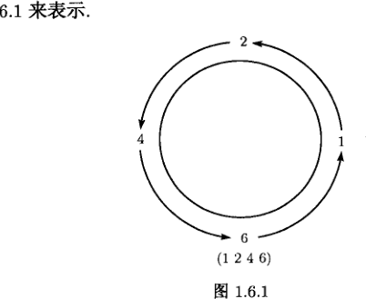
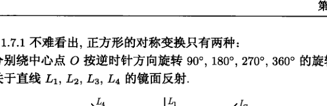
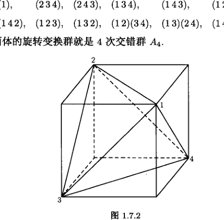
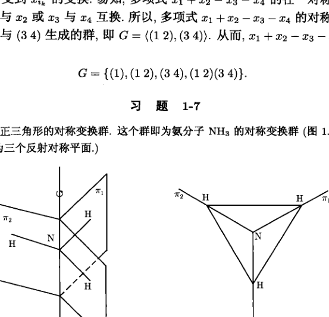
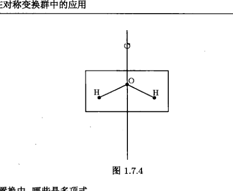
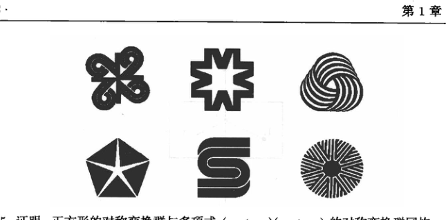
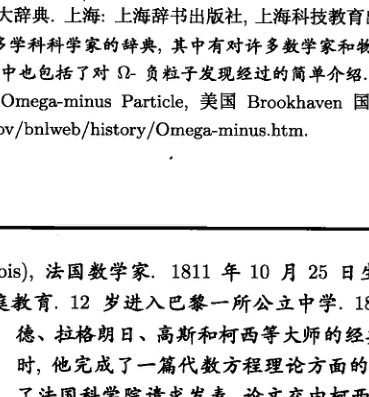

# 第 1 章 群

近世代数的主要研究对象是具有代数运算的集合，这样的集合称为代数系. 群是具有一个代数运算的代数系. 群的理论是近代数学的一个重要分支，它在物理学、化学、信息学等许多领域都有广泛的应用.

本章和第 2 章介绍群的初步理论. 本章的 1.1 节讨论等价关系和集合的分类以及它们之间的联系. 1.1 节的内容虽然不属于群论的范畴，但等价关系和集合的分类却是近世代数中经常出现的两个基本概念，所以先作一个介绍. 1.2 节 ~ 1.4 节介绍群、子群、群同构的概念及有关性质. 这是了解群的第一步. 1.5 节和 1.6 节较为详细地讨论了两类最常见的群 —— 循环群与置换群. 学习这部分内容可以熟悉群的运算和性质，加深对群的理解. 1.7 节是选学内容，介绍置换群的某些应用，初学时可以略去，并不影响后面的学习.

## 1.1 等价关系与集合的分类

在数学研究中，常常要对一个集合的元素加以比较，希望通过元素之间的联系去了解整个集合. 另一方面，也常常要把一个集合分成若干个子集，以便对各个子集进行分类研究，或对其中某些特殊子集加以讨论，从而了解整个集合的性质. 例如，在实数集中，任意两个实数 $a$ 与 $b$ 之间就有 $a$ 大于 $b$ 或 $a$ 不大于 $b$ 两种情况. 同时，根据一个实数是否大于零，可以把整个实数集合分解为正实数集 $\mathbf{R}^+$，负实数集 $\mathbf{R}^-$ 和单独一个数 $0$ 组成的集合 $\{0\}$ 这三个子集合. 又如，在数域 $F$ 上的一元多项式环 $F[x]$ 中，对任意两个多项式 $f(x)$ 与 $g(x)$，有 $f(x)$ 可被 $g(x)$ 整除或 $f(x)$ 不可被 $g(x)$ 整除两种情况. 根据一个多项式被一个非零多项式 $g(x)$ 所除的余式，可以把整个多项式环 $F[x]$ 分解为许多个子集，不同的子集没有公共元素，同一个子集中的多项式在被 $g(x)$ 除时余式都相同.

将上面两个例子中所涉及的概念加以推广，就得到集合上一般的关系的概念和集合的分类的概念. 本节的主要目的就是介绍这两个概念以及它们之间的联系.

> **定义 1.1.1** 设 $S$ 是一个非空集合，$R$ 是关于 $S$ 的元素的一个条件. 如果对 $S$ 中任意一个有序元素对 $(a, b)$，我们总能确定 $a$ 与 $b$ 是否满足条件 $R$，就称 $R$ 是 $S$ 的一个关系(relation). 如果 $a$ 与 $b$ 满足条件 $R$，则称 $a$ 与 $b$ 有关系 $R$，记作 $a R b$；否则称 $a$ 与 $b$ 无关系 $R$. 关系 $R$ 也称为二元关系.

上面提到的实数集中元素之间的大于和 $F[x]$ 中多项式的整除都是关系.

> **例 1** 设 $S$ 是一个非空集合, $S$ 的所有子集组成的集合记为 $\mathcal{P}(S)$. 因为对 $S$ 的任意两个子集 $A, B$, $A \subseteq B$ 或 $A \nsubseteq B$ 有且仅有一个成立, 所以集合的包含关系“$\subseteq$”是 $\mathcal{P}(S)$ 的一个关系. 进一步讨论可以发现, 这个关系还具有下面两条性质:
> (1) 反身性, 即对 $S$ 的任一子集 $A$, 有 $A \subseteq A$;
> (2) 传递性, 即对 $S$ 的任意子集 $A, B, C$, 如果 $A \subseteq B, B \subseteq C$, 则有 $A \subseteq C$.

> **例 2** 在整数集 $\mathbf{Z}$ 中, 规定 $a\mathcal{R}b \iff a \mid b$. 因为 $a \mid b$ 与 $a \nmid b$ 有且仅有一个成立, 所以 “$\mid$” 是 $\mathbf{Z}$ 的一个关系. 这个关系也具有反身性和传递性.

> **例 3** 在整数集 $\mathbf{Z}$ 中, 规定 $a\mathcal{R}b \iff (a, b) = 1$ (即 $a$ 与 $b$ 互素). 因为 $(a, b) = 1$ 与 $(a, b) \neq 1$ 有且仅有一个成立, 所以是 $\mathbf{Z}$ 的一个关系. 这个关系既不满足反身性也不满足传递性, 但却满足所谓的对称性, 即对任意两个整数 $a, b$, 由 $(a, b) = 1$ 可推出 $(b, a) = 1$.

同时具有反身性、对称性和传递性三条性质的关系是我们特别感兴趣的.

> **定义 1.1.2** 设 $\mathcal{R}$ 是非空集合 $S$ 的一个关系, 如果 $\mathcal{R}$ 满足
> (E1) 反身性, 即对任意的 $a \in S$, 有 $a\mathcal{R}a$;
> (E2) 对称性, 即若 $a\mathcal{R}b$, 则 $b\mathcal{R}a$;
> (E3) 传递性, 即若 $a\mathcal{R}b$, 且 $b\mathcal{R}c$, 则 $a\mathcal{R}c$,
> 则称 $\mathcal{R}$ 是 $S$ 的一个等价关系(equivalence relation), 并且如果 $a\mathcal{R}b$, 则称 $a$ 等价于 $b$, 记作 $a \sim b$.

> **定义 1.1.3** 如果 $\sim$ 是集合 $S$ 的一个等价关系, 对 $a \in S$, 令
> $$[a] = \{x \in S \mid x \sim a\}.$$
> 称子集 $[a]$ 为 $S$ 的一个等价类(equivalence class). $S$ 的全体等价类的集合称为集合 $S$ 在等价关系下的商集(quotient set), 记 $S / \sim$.

> **例 4** 易知, 三角形的全等、相似, 数域 $K$ 上 $n$ 阶方阵的等价、相似、相合同等都是等价关系, 而例 1、例 2、例 3 及本节开头所述的关系都不是等价关系.

> **例 5** 设 $m$ 是正整数, 在整数集 $\mathbf{Z}$ 中, 规定
> $$a\mathcal{R}b \iff m \mid a - b, \quad \forall a, b \in \mathbf{Z},$$
> 则
> (1) 对任意整数 $a$, 有 $m \mid a - a$;
> (2) 若 $m \mid a - b$, 则 $m \mid b - a$;
> (3) 若 $m \mid a - b$, $m \mid b - c$, 则 $m \mid a - c$,
> 所以 $\mathcal{R}$ 是 $\mathbf{Z}$ 的一个等价关系. 显然 $a$ 与 $b$ 等价当且仅当 $a$ 与 $b$ 被 $m$ 除有相同的余数, 因此称这个关系为同余关系(congruence relation), 并记作 $a \equiv b \pmod m$ (读作 “$a$ 同余于 $b$, 模 $m$”). 整数的同余关系及其性质是初等数论的基础.

设 $a \in \mathbf{Z}$, 则
$$
\begin{aligned}
[a] &= \{x \in \mathbf{Z} \mid x \equiv a \pmod m\} \\
&= \{x \in \mathbf{Z} \mid m \mid x - a\} \\
&= \{a + mz \mid z \in \mathbf{Z}\},
\end{aligned}
$$
$[a]$ 称为整数集 $\mathbf{Z}$ 的一个（与 $a$ 同余的）模 $m$ 剩余类, 在数论中, $[a]$ 常记作 $\bar{a}$, 而相应的商集称为 $\mathbf{Z}$ 的模 $m$ 剩余类集, 记作 $\mathbf{Z}_m$.

由
$$
\bar{a} = \bar{b} \iff m \mid a - b,
$$
易得
$$
\begin{aligned}
\bar{0} &= \{\cdots, -2m, -m, 0, m, 2m, \cdots\}, \\
\bar{1} &= \{\cdots, -2m + 1, -m + 1, 1, m + 1, 2m + 1, \cdots\}, \\
&\cdots\cdots \\
\overline{m - 1} &= \{\cdots, -2m - 1, -m - 1, -1, m - 1, 2m - 1, \cdots\}
\end{aligned}
$$
是模 $m$ 的全体不同的剩余类, 所以
$$
\mathbf{Z}_m = \{\bar{0}, \bar{1}, \bar{2}, \cdots, \overline{m - 1}\}. \quad \square
$$

集合的等价关系常和下面的概念联系在一起.

> **定义 1.1.4** 如果非空集合 $S$ 是它的某些两两不相交的非空子集的并, 则称这些子集为集合 $S$ 的一种**分类**(partition), 其中每个子集称为 $S$ 一个**类**(class). 如果 $S$ 的子集族 $\{S_i \mid i \in I\}$ 构成 $S$ 的一种分类, 则记作 $\mathcal{P} = \{S_i \mid i \in I\}$.

由此定义可知, 集合 $S$ 的子集族 $\{S_i \mid i \in I\}$ 构成 $S$ 的一种分类当且仅当
(P1) $S = \bigcup\limits_{i \in I} S_i$;
(P2) $S_i \cap S_j = \varnothing, i \neq j$.
(P1) 说明 $\{S_i\}$ 这些子集无遗漏地包含了 $S$ 的全部元素; (P2) 说明两个不同的子集无公共元素. 从而 $S$ 的元素属于且仅属于一个子集. 这表明, $S$ 的一个分类必须满足不漏不重的原则.

> **例 6** 设 $M$ 为数域 $F$ 上全体 $n$ 阶方阵的集合, 令 $M_r$ 表示所有秩为 $r$ 的 $n$ 阶方阵构成的子集, 则有
> (1) $M = \bigcup\limits_{i=0}^n M_i$;
> (2) $M_i \cap M_j = \varnothing, i \neq j$.
> 所以 $\{M_i \mid i = 0, 1, \cdots, n\}$ 是 $M$ 的一种分类.

**例 7** $Z_m = \{\bar{a} \mid a = 0, 1, 2, \cdots, m-1\}$ 是整数集 $\mathbf{Z}$ 的一种分类.

**例 8** 对实数集 $\mathbf{R}$, 令子集 $\mathbf{R}_i = [i, i+1]$, $i \in \mathbf{Z}$. 由于 $i \in \mathbf{R}_i$, 且 $i \in \mathbf{R}_{i-1}$, 同一元素在两个子集中重复出现, 所以 $\{[i, i+1] \mid i \in \mathbf{Z}\}$ 不是 $\mathbf{R}$ 的一种分类.

下面的定理揭示了集合的等价关系与集合的分类这两个概念之间的联系.

> **定理 1.1.1** 集合 $S$ 的任何一个等价关系都确定了 $S$ 的一种分类, 且其中每一个类都是集合 $S$ 的一个等价类. 反之, 集合 $S$ 的任何一种分类也都给出了集合 $S$ 的一个等价关系, 且相应的等价类就是原分类中的那些类.
>
> **证明** 首先, 设 $\sim$ 为集合 $S$ 的一个等价关系, 则
> (1) 对任意的 $a \in S$, 由反身性知 $a \in [a]$, 所以 $S = \bigcup\limits_{a \in S} [a]$.
> (2) 如果 $[a] \cap [b] \neq \varnothing$, 则有 $c \in [a] \cap [b]$. 于是 $c \sim b, c \sim a$, 从而由对称性知 $b \sim c$, 再由传递性知 $b \sim a$. 又对任意的 $b' \in [b]$, 则 $b' \sim b$, 同样由传递性得 $b' \sim a$. 于是 $b' \in [a]$, 因此 $[b] \subseteq [a]$. 同理可证 $[a] \subseteq [b]$. 于是 $[a] = [b]$. 所以不同的类没有公共元素.
>
> 从而由 (P1), (P2) 知, 全体等价类形成 $S$ 的一种分类, 显然每一个类都是 $S$ 的等价类.
>
> 其次, 如果已知集合 $S$ 的一种分类 $\mathcal{P}$, 在 $S$ 中规定关系 “$\sim$”:
> $$a \sim b \Longleftrightarrow a \text{ 与 } b \text{ 属于同一类}, \quad a, b \in S.$$
>
> 对任意的 $a \in S$, 由于 $a$ 属于其本身所在的类, 所以 $a \sim a$. 如果 $a \sim b$, 即 $a$ 与 $b$ 属于同一类, 自然 $b$ 与 $a$ 也属于同一类, 所以 $b \sim a$. 最后, 如果 $a \sim b, b \sim c$, 即 $a$ 与 $b$ 属于同一类, $b$ 与 $c$ 属于同一类, 因而 $a$ 与 $c$ 同在 $b$ 所在的类中, 所以 $a \sim c$. 因此 “$\sim$” 是 $S$ 的一个等价关系. 显然, 由此等价关系得到的等价类就是原分类中的那些类. $\square$

定理 1.1.1 说明, 一个集合的分类可以通过等价关系来描述. 试比较例 4、例 5 及例 6、例 7, 可以看出, 这样做在很多情况下是方便的. 另一方面, 等价关系也可以用集合的分类来表示. 通过对集合的各种分类的了解, 使我们能够对集合的不同等价关系及其相互联系进行研究. 不过, 本书不准备对此进行深入的讨论. 仅以下面的例子来说明集合的分类对研究集合的等价关系的作用.

> **例 9** 设 $S = \{a, b, c\}$, 试确定集合 $S$ 的全部等价关系.
>
> **解** 由定理 1.1.1 知, 只要求出 $S$ 的全部分类, 即求出 $S$ 的所有可能的子集划分即可.
> (1) 如果 $S$ 仅划分为一个子集, 则有 $\mathcal{P}_1 = \{S\}$;
> (2) 如果 $S$ 分划为两个子集, 则有
> $$\mathcal{P}_2 = \{\{a\}, \{b, c\}\}, \quad \mathcal{P}_3 = \{\{b\}, \{a, c\}\}, \quad \mathcal{P}_4 = \{\{c\}, \{a, b\}\};$$
> (3) 如果 $S$ 分划为三个子集，则有 $\mathcal{P}_5 = \{\{a\}, \{b\}, \{c\}\}$.
> 因此，集合 $S$ 共有五个不同的等价关系，它们是
> $$
> \begin{aligned}
> \sim_1 &= \{a \sim a, b \sim b, c \sim c, a \sim b, b \sim a, a \sim c, c \sim a, b \sim c, c \sim b\}; \\
> \sim_2 &= \{a \sim a, b \sim b, c \sim c, b \sim c, c \sim b\}; \\
> \sim_3 &= \{a \sim a, b \sim b, c \sim c, a \sim c, c \sim a\}; \\
> \sim_4 &= \{a \sim a, b \sim b, c \sim c, a \sim b, b \sim a\}; \\
> \sim_5 &= \{a \sim a, b \sim b, c \sim c\}.
> \end{aligned}
> $$

> **注** 如果用 $B(n)$ 表示一个具有 $n$ 个元素的集合上的不同等价关系的个数，则有下列的递推公式：
> $$B(n+1) = \sum_{k=0}^n C_n^k B(k), \quad n \geqslant 1, \tag{1.1.1}$$
> 其中 $C_n^k$ 为二项式系数，并规定 $B(0) = 1, B(1) = 1$。这个公式的证明以及对 $B(n)$ 的性质的讨论，已超出本书的范围。有兴趣的读者可参考组合数学方面的书籍（如文献 [2]）。

### 习题 1-1

1. 试分别举出满足下列条件的关系：
   (1) 有对称性，传递性，但无反身性；
   (2) 有反身性，传递性，但无对称性；
   (3) 有反身性，对称性，但无传递性。
2. 找出下列证明中的错误：
   有人断言，若 $S$ 的关系 $\mathcal{R}$ 有对称性和传递性，则必有反身性。这是因为，对任意的 $a \in S$，由对称性，如果 $a \mathcal{R} b$，则 $b \mathcal{R} a$。再由传递性，得 $a \mathcal{R} a$，所以 $\mathcal{R}$ 有反身性。
3. 证明：在数域 $F$ 上全体 $n$ 阶方阵的集合 $M$ 中，矩阵的等价、相合和相似都是等价关系。
4. 设 $\phi$ 是集合 $A$ 到 $B$ 的映射，$a, b \in A$，规定关系 “$\sim$”：
   $$a \sim b \Longleftrightarrow \phi(a) = \phi(b).$$
   证明：$\sim$ 是 $A$ 的一个等价关系，并求其等价类。
5. 设 $A = \{1, 2, 3, 4\}$，在 $\mathcal{P}(A)$ 中规定关系 “$\sim$”：
   $$S_1 \sim S_2 \Longleftrightarrow S_1 \text{ 与 } S_2 \text{ 含有相同个数的元素}.$$
   证明：$\sim$ 是 $\mathcal{P}(A)$ 的一个等价关系，并求商集 $\mathcal{P}(A)/\sim$。
6. 在有理数集 $\mathbf{Q}$ 中，规定关系 “$\sim$”：
   $$a \sim b \Longleftrightarrow a - b \in \mathbf{Z}.$$
   证明: $\sim$ 是 $\mathbf{Q}$ 的一个等价关系, 并求出所有的等价类.
7. 在复数集 $\mathbf{C}$ 中, 规定关系 “$\sim$”:
   $$a \sim b \Longleftrightarrow |a| = |b|.$$
   证明: $\sim$ 是 $\mathbf{C}$ 的一个等价关系, 试确定相应的商集 $\mathbf{C}/\sim$, 并给出每个等价类的一个代表元素.
8. 设集合
   $$S = \{(a, b) \mid a, b \in \mathbf{Z}, b \neq 0\},$$
   在集合 $S$ 中, 规定关系 “$\sim$”:
   $$(a, b) \sim (c, d) \Longleftrightarrow ad = bc.$$
   证明: $\sim$ 是 $S$ 的一个等价关系.
   ^*9. 设 $A = \{a, b, c, d\}$, 试写出集合 $A$ 的所有不同的等价关系.
   ^*10. 不用公式 (1.1.1), 直接算出集合 $A = \{1, 2, 3, 4, 5\}$ 的不同的分类数.

### 参考文献及阅读材料

[1] 闵嗣鹤, 严士健. 初等数论. 第 2 版. 北京: 高等教育出版社, 1990.
    本书第 1 章有关于整数整除性的详细讨论, 第 3 章则介绍了同余的概念及其性质.
[2] Aigner M. Combinatorial Theory. Berlin, Heidelberg, New York: Springer-Verlag, 1979.

## 1.2 群的概念

代数最初主要研究的是数, 以及由数所衍生出来的对象. 例如, 代数方程的求根. 初等代数主要研究的就是数以及数的运算. 中学数学虽然有所谓代数式的概念, 但这些概念本质上代表的仍然是数. 高等代数虽引入了行列式、矩阵等概念, 但还是离不开数. 数的一个基本特征是可以进行加法、乘法等运算. 这些运算的共同特点是对任意两个数, 通过某个法则 (如加法法则或乘法法则等), 可唯一求得第三个数. 数学家们发现, 许多抽象的对象也都具有类似于数的这一特征, 于是对它们的结构 and 性质进行了研究, 并且应用它们解决了许多重大的数学问题和实际问题. 这就导致了近世代数的产生和发展. 近世代数拓展了代数的研究领域, 它所研究的已不再仅仅是数, 而是具有某种运算的代数系统, 这其中最基本的就是群、环和域.

本节的主要目的就是介绍群的基本概念和简单性质. 为此, 首先要对运算这一概念给出明确的定义.

> **定义 1.2.1** 设 $A$ 是一个非空集合, 若对 $A$ 中任意两个元素 $a, b$, 通过某个法则 “$\cdot$”, 有 $A$ 中唯一确定的元素 $c$ 与之对应, 则称法则 “$\cdot$” 为集合 $A$ 上的一个**代数运算** (algebraic operation). 元素 $c$ 是 $a, b$ 通过运算 “$\cdot$” 作用的结果, 将此结果记为 $a \cdot b = c$.

> **例 1** 有理数的加法、减法和乘法都是有理数集 $\mathbf{Q}$ 上的代数运算，但除法不是 $\mathbf{Q}$ 上的代数运算．如果只考虑所有非零有理数的集合 $\mathbf{Q}^*$，则除法是 $\mathbf{Q}^*$ 上的代数运算．

> **例 2** 设 $m$ 为大于 1 的正整数，$\mathbf{Z}_m$ 为 $\mathbf{Z}$ 的模 $m$ 剩余类集．对 $\bar{a}, \bar{b} \in \mathbf{Z}_m$，规定
> $$\bar{a} + \bar{b} = \overline{a+b},$$
> $$\bar{a} \cdot \bar{b} = \overline{ab},$$
> 则 $+$ 与 $\cdot$ 都是 $\mathbf{Z}_m$ 上的代数运算．
>
> **证明** 只要证明上面规定的运算与剩余类的代表元的选取无关即可．设
> $$\bar{a} = \overline{a'}, \quad \bar{b} = \overline{b'},$$
> 则
> $$m \mid a - a', \quad m \mid b - b',$$
> 于是
> $$m \mid (a - a') + (b - b') = (a + b) - (a' + b'),$$
> $$m \mid (a - a')b + (b - b')a' = (ab) - (a'b'),$$
> 从而
> $$\overline{a+b} = \overline{a'+b'}, \quad \overline{ab} = \overline{a'b'},$$
> 所以“$+$”与“$\cdot$”都是 $\mathbf{Z}_m$ 上的代数运算． $\Box$

分析上面几个例子中的代数运算发现，这些代数运算不仅仅给出运算的结果，而且还具有一些相似的运算性质．比如，结合律、交换律等．在比较理想的情况下（就像在 $\mathbf{Q}^*$ 中），还有单位元、可逆元和逆元．将这些加以综合与推广，就得到群的概念．

> **定义 1.2.2** 设 $G$ 是一个非空集合，“$\cdot$”是 $G$ 上的一个代数运算，即对所有的 $a, b \in G$，有 $a \cdot b \in G$．如果 $G$ 的运算还满足
> (G1) 结合律，即对所有的 $a, b, c \in G$，有 $(a \cdot b) \cdot c = a \cdot (b \cdot c)$；
> (G2) $G$ 中有元素 $e$，使对每个 $a \in G$，有 $e \cdot a = a \cdot e = a$；
> (G3) 对 $G$ 中每个元素 $a$，存在元素 $b \in G$，使 $a \cdot b = b \cdot a = e$，
> 则称 $G$ 关于运算“$\cdot$”构成一个群(group)，记作 $(G, \cdot)$．在不致引起混淆的情况下，也称 $G$ 为群．

> **注** (1) (G2) 中的元素 $e$ 称为群 $G$ 的单位元(unit element) 或恒等元(identity)；(G3) 中的元素 $b$ 称为 $a$ 的逆元(inverse)．我们将证明，群 $G$ 的单位元 $e$ 和每个元素的逆元都是唯一的．$G$ 中元素 $a$ 的唯一的逆元通常记作 $a^{-1}$．
> (2) 如果群 $G$ 的运算还满足交换律，即对任意的 $a, b \in G$，有 $a \cdot b = b \cdot a$，则称 $G$ 是一个**交换群**(commutative group) 或**阿贝尔群**(Abelian group).
> (3) 群 $G$ 中元素的个数称为群 $G$ 的**阶**(order)，记为 $|G|$. 如果 $|G|$ 是有限数，则称 $G$ 为**有限群**(finite group)，否则称 $G$ 为**无限群**(infinite group).

> **例 3** 整数集 $\mathbf{Z}$ 关于数的加法构成群. 这个群称为整数加群.
> **证明** 对任意的 $a, b \in \mathbf{Z}$，有 $a + b \in \mathbf{Z}$，所以“$+$”是 $\mathbf{Z}$ 上的一个代数运算. 同时，对任意的 $a, b, c \in \mathbf{Z}$，有
> $$(a + b) + c = a + (b + c),$$
> 所以结合律成立. 另一方面，$0 \in \mathbf{Z}$，且对每个 $a \in \mathbf{Z}$，有
> $$a + 0 = 0 + a = a,$$
> 所以 $0$ 为 $\mathbf{Z}$ 的单位元. 又对每个 $a \in \mathbf{Z}$，有
> $$a + (-a) = (-a) + a = 0,$$
> 所以 $-a$ 是 $a$ 的逆元，从而 $\mathbf{Z}$ 关于“$+$”构成群，显然这是一个交换群. $\square$

当群 $G$ 的运算用加号“$+$”表示时，通常将 $G$ 的单位元记作 $0$，并称 $0$ 为 $G$ 的**零元**；将 $a \in G$ 的逆元记作 $-a$，并称 $-a$ 为 $a$ 的**负元**. 习惯上，只有当群为交换群时，才用“$+$”来表示群的运算，并称这个运算为**加法**，把运算的结果叫做**和**，同时称这样的群为**加群**. 相应地，将不是加群的群称为**乘群**，并把乘群的运算叫做**乘法**，运算的结果叫做**积**. 在运算过程中，乘群的运算符号通常省略不写. 今后，如不作特别声明，总假定群的运算是乘法. 当然，所有关于乘群的结论对加群也成立 (必要时作一些相关的记号和术语上的改变).

> **例 4** 全体非零有理数的集合 $\mathbf{Q}^*$，关于数的乘法构成交换群，这个群的单位元是数 $1$，非零有理数 $\frac{a}{b}$ 的逆元是 $\frac{a}{b}$ 的倒数 $\frac{b}{a}$. 同理，全体非零实数的集合 $\mathbf{R}^*、全体非零复数的集合 \mathbf{C}^*$ 关于数的乘法也构成交换群.

> **例 5** 实数域 $\mathbf{R}$ 上全体 $n$ 阶方阵的集合 $M_n(\mathbf{R})$，关于矩阵 of 加法构成一个交换群. 全体 $n$ 阶可逆方阵的集合 $GL_n(\mathbf{R})$ 关于矩阵的乘法构成群，群 $GL_n(\mathbf{R})$ 中的单位元是单位矩阵 $E_n$，可逆方阵 $A \in GL_n(\mathbf{R})$ 的逆元是 $A$ 的逆矩阵 $A^{-1}$. 当 $n > 1$ 时，$GL_n(\mathbf{R})$ 是一个非交换群.

> **例 6** 集合 $\{1, -1, i, -i\}$ 关于数的乘法构成交换群.

> **例 7** 全体 $n$ 次单位根组成的集合
> $$U_n = \{x \in \mathbf{C} \mid x^n = 1\}$$
> $$= \left\{ \cos \frac{2k\pi}{n} + \mathrm{i}\sin \frac{2k\pi}{n} \;\middle|\; k = 0, 1, 2, \cdots, n-1 \right\}$$
> 关于数的乘法构成一个 $n$ 阶交换群。
>
> 事实上，对任意的 $x, y \in U_n$，因为 $x^n = 1, y^n = 1$，所以
> $$(xy)^n = x^n y^n = 1 \cdot 1 = 1,$$
> 因此 $xy \in U_n$。因为数的乘法满足交换律和结合律，所以 $U_n$ 的乘法也满足交换律和结合律。
>
> 由于 $1 \in U_n$，且对任意的 $x \in U_n$，$1 \cdot x = x \cdot 1 = x$，所以 $1$ 为 $U_n$ 的单位元。又由于对任意的 $x \in U_n$，$x^{n-1} \in U_n$ 且
> $$x \cdot x^{n-1} = x^{n-1} \cdot x = x^n = 1,$$
> 所以 $x$ 有逆元 $x^{n-1}$。因此，$U_n$ 关于数的乘法构成一个群。通常称这个群为 $n$ 次单位根群，显然 $U_n$ 是一个具有 $n$ 个元素的交换群。

> **例 8** 设 $m$ 是大于 $1$ 的正整数，则 $\mathbf{Z}_m$ 关于剩余类的加法构成加群。这个群称为 $\mathbf{Z}$ 的模 $m$ 剩余类加群。
>
> **证明** 由例 2 知，剩余类的加法 “$+$” 是 $\mathbf{Z}_m$ 的代数运算。
> 
> (1) 对任意的 $\bar{a}, \bar{b}, \bar{c} \in \mathbf{Z}_m$，
> $$
> \begin{aligned}
> (\bar{a} + \bar{b}) + \bar{c} &= \overline{a+b} + \bar{c} = \overline{(a+b)+c} \\
> &= \overline{a+(b+c)} = \bar{a} + \overline{b+c} \\
> &= \bar{a} + (\bar{b} + \bar{c}),
> \end{aligned}
> $$
> 所以结合律成立。
> 
> (2) 对任意的 $\bar{a}, \bar{b} \in \mathbf{Z}_m$，
> $$\bar{a} + \bar{b} = \overline{a+b} = \overline{b+a} = \bar{b} + \bar{a},$$
> 所以交换律成立。
> 
> (3) 对任意的 $\bar{a} \in \mathbf{Z}_m$，
> $$\bar{a} + \bar{0} = \overline{a+0} = \bar{a},$$
> $$\bar{0} + \bar{a} = \overline{0+a} = \bar{a}.$$
> 所以 $\bar{0}$ 为 $\mathbf{Z}_m$ 的零元。
> 
> (4) 对任意的 $\bar{a} \in \mathbf{Z}_m$，
> $$\bar{a} + \overline{-a} = \overline{a+(-a)} = \bar{0},$$
> $$\overline{-a} + \bar{a} = \overline{(-a)+a} = \bar{0}.$$
> 所以 $\overline{-a}$ 为 $\bar{a}$ 的负元.
> 从而知, $\mathbf{Z}_m$ 关于剩余类的加法构成加群. $\square$

当 $m > 1$ 时, $\mathbf{Z}_m$ 关于剩余类的乘法不构成群. 下面的例子说明, $\mathbf{Z}_m$ 的部分元素关于剩余类的乘法是可以构成群的.

> **例 9** 设 $m$ 是大于 $1$ 的正整数, 记
> $$U(m) = \{\bar{a} \in \mathbf{Z}_m \mid (a, m) = 1\},$$
> 则 $U(m)$ 关于剩余类的乘法构成群.
>
> **证明** (1) 对任意的 $\bar{a}, \bar{b} \in U(m)$, 有 $(a, m) = 1$, $(b, m) = 1$, 于是 $(ab, m) = 1$, 从而 $\overline{ab} \in U(m)$. 所以剩余类的乘法 “$\cdot$” 是 $U(m)$ 的代数运算.
> (2) 对任意的 $\bar{a}, \bar{b}, \bar{c} \in U(m)$,
> $$
> \begin{aligned}
> (\bar{a} \cdot \bar{b}) \cdot \bar{c} & = \overline{ab} \cdot \bar{c} = \overline{(ab)c} = \overline{a(bc)} \\
> & = \bar{a} \cdot \overline{bc} = \bar{a} \cdot (\bar{b} \cdot \bar{c}).
> \end{aligned}
> $$
> 所以结合律成立.
> (3) 因为 $(1, m) = 1$, 从而 $\bar{1} \in U_m$, 且对任意的 $\bar{a} \in U(m)$,
> $$\bar{a} \cdot \bar{1} = \overline{a \cdot 1} = \bar{a},$$
> $$\bar{1} \cdot \bar{a} = \overline{1 \cdot a} = \bar{a},$$
> 所以 $\bar{1}$ 为 $U(m)$ 的单位元.
> (4) 对任意的 $\bar{a} \in U(m)$, 有 $(a, m) = 1$. 由整数的性质可知, 存在 $u, v \in \mathbf{Z}$, 使
> $$au + mv = 1.$$
> 显然 $(u, m) = 1$, 所以 $\bar{u} \in U(m)$, 且
> $$
> \begin{aligned}
> \bar{a} \cdot \bar{u} & = \overline{au} \\
> & = \overline{au + mv} \quad (\text{因为 } m \mid mv = (au+mv) - au) \\
> & = \bar{1},
> \end{aligned}
> $$
> $$\bar{u} \cdot \bar{a} = \overline{ua} = \overline{au} = \bar{1},$$
> 所以 $\bar{u}$ 为 $\bar{a}$ 的逆元. 从而知, $U(m)$ 的每个元素在 $U(m)$ 中都可逆.
> 这就证明了, $U(m)$ 关于剩余类的乘法构成群. $\square$

群 $(U(m), \cdot)$ 称为 $\mathbf{Z}$ 的模 $m$ 单位群, 显然这是一个交换群. 当 $p$ 为素数时, $U(p)$ 常记作 $\mathbf{Z}_p^*$. 易知
$$\mathbf{Z}_p^* = \{\bar{1}, \bar{2}, \cdots, \overline{p-1}\}.$$

> **注 (4)** 由初等数论可知, $U(m)$ 的阶等于 $\phi(m)$, 这里 $\phi(m)$ 是欧拉函数, 如果
> $$m = p_1^{r_1} p_2^{r_2} \cdots p_s^{r_s},$$
> 其中 $p_1, p_2, \cdots, p_s$ 为 $m$ 的不同素因子, 那么
> $$
> \begin{aligned}
> \phi(m) &= (p_1^{r_1} - p_1^{r_1-1})(p_2^{r_2} - p_2^{r_2-1}) \cdots (p_s^{r_s} - p_s^{r_s-1}) \\
> &= m \prod_{i=1}^s \left(1 - \frac{1}{p_i}\right).
> \end{aligned}
> $$

> **例 10** 具体写出 $\mathbf{Z}_5^*$ 中任意两个元素的乘积以及每一个元素的逆元素. 易知
> $$\mathbf{Z}_5^* = \{\bar{1}, \bar{2}, \bar{3}, \bar{4}\}.$$
>
> 直接计算, 可得
>
> **表 1.2.1**
> 
> | | | | |
> | :---: | :---: | :---: | :---: |
> | $1 \cdot 1 = 1$ | $1 \cdot 2 = 2$ | $1 \cdot 3 = 3$ | $1 \cdot 4 = 4$ |
> | $2 \cdot 1 = 2$ | $2 \cdot 2 = 4$ | $2 \cdot 3 = 1$ | $2 \cdot 4 = 3$ |
> | $3 \cdot 1 = 3$ | $3 \cdot 2 = 1$ | $3 \cdot 3 = 4$ | $3 \cdot 4 = 2$ |
> | $4 \cdot 1 = 4$ | $4 \cdot 2 = 3$ | $4 \cdot 3 = 2$ | $4 \cdot 4 = 1$ |
>
> 在表 1.2.1 中, 我们把 $\bar{1}, \bar{2}, \bar{3}, \bar{4}$ 简记为 $1, 2, 3, 4$. 这在进行 $\mathbf{Z}_m$ 中的运算时是经常这样做的. 由表中很容易看出:
> $$\bar{1}^{-1} = \bar{1},\quad \bar{2}^{-1} = \bar{3},\quad \bar{3}^{-1} = \bar{2},\quad \bar{4}^{-1} = \bar{4}.$$
> 
> 观察表 1.2.1, 发现可以把表 1.2.1 表示为更加简单的形式 (表 1.2.2).
> 
> **表 1.2.2**
> 
> | | 1 | 2 | 3 | 4 |
> | :---: | :---: | :---: | :---: | :---: |
> | **1** | 1 | 2 | 3 | 4 |
> | **2** | 2 | 4 | 1 | 3 |
> | **3** | 3 | 1 | 4 | 2 |
> | **4** | 4 | 3 | 2 | 1 |
> 
> 形如表 1.2.2 的表通常称为群的**乘法表** (multiplication table), 也称**群表** (group table) 或**凯莱表** (Cayley table). 人们常用群表来表示有限群的运算. 一般的群表如表 1.2.3 所示.
> 
> 在一个群表中, 表的左上角列出了群的运算符号 (有时省略), 表的最上面一行则依次列出群的所有元素 (通常单位元列在最前面), 表的最左列按同样的次序列出群的所有元素. 表中的其余部分则是最左列的元素和最上面一行的元素的乘积. 注意, 在乘积 $a \circ b$ 中, 左边的因子 $a$ 是左列上的元素, 右边的因子 $b$ 是最上面一行的元素. 由群表很容易确定一个元素的逆元素. 又如果一个群的群表是对称的, 则可以肯定, 这个群一定是交换群.
> 
> **表 1.2.3**
> 
> | $\circ$ | $e$ | $\cdots$ | $b$ | $\cdots$ |
> | :---: | :---: | :---: | :---: | :---: |
> | $e$ | $e$ | $\cdots$ | $b$ | $\cdots$ |
> | $\vdots$ | $\vdots$ | $\ddots$ | $\vdots$ | $\ddots$ |
> | $a$ | $a$ | $\cdots$ | $a \circ b$ | $\cdots$ |
> | $\vdots$ | $\vdots$ | $\ddots$ | $\vdots$ | $\ddots$ |

在对群有了初步的认识以后, 下面来讨论群的一些简单性质.

> **定理 1.2.1** 设 $G$ 为群, 则有
> (1) 群 $G$ 的单位元是唯一的;
> (2) 群 $G$ 的每个元素的逆元是唯一的;
> (3) 对任意的 $a \in G$, 有 $(a^{-1})^{-1} = a$;
> (4) 对任意 of $a, b \in G$, 有 $(ab)^{-1} = b^{-1}a^{-1}$;
> (5) 在群中消去律成立, 即设 $a, b, c \in G$, 如果 $ab = ac$, 或 $ba = ca$, 则 $b = c$.
>
> **证明** (1) 如果 $e_1, e_2$ 都是 $G$ 的单位元, 则
> $$e_1 \cdot e_2 = e_2, \quad (\text{因为 } e_1 \text{ 是 } G \text{ 的单位元})$$
> $$e_1 \cdot e_2 = e_1, \quad (\text{因为 } e_2 \text{ 是 } G \text{ 的单位元})$$
> 因此,
> $$e_2 = e_1 \cdot e_2 = e_1,$$
> 所以单位元是唯一的.
> 
> (2) 设 $b, c$ 都是 $a \in G$ 的逆元, 则
> $$ab = ba = e, \quad ac = ca = e,$$
> 于是
> $$c = c \cdot e = c(ab) = (ca)b = e \cdot b = b,$$
> 所以 $a$ 的逆元是唯一的.
> 
> (3) 因为 $a^{-1}$ 是 $a$ 的逆元, 所以
> $$a^{-1}a = aa^{-1} = e.$$
> 从而由逆元的定义知, $a$ 是 $a^{-1}$ 的逆元. 又由逆元的唯一性得
> $$(a^{-1})^{-1} = a.$$
> 
> (4) 直接计算可得
> $$(ab) \cdot (b^{-1}a^{-1}) = a(bb^{-1})a^{-1} = aea^{-1} = aa^{-1} = e$$
> 及
> $$(b^{-1}a^{-1}) \cdot (ab) = b^{-1}(a^{-1}a)b = b^{-1}eb = b^{-1}b = e,$$
> 从而由逆元的唯一性得
> $$(ab)^{-1} = b^{-1}a^{-1}.$$
> 
> (5) 如果 $ab = ac$, 则
> $$b = eb = (a^{-1}a)b = a^{-1}(ab) = a^{-1}(ac) = (a^{-1}a)c = ec = c,$$
> 同理可证另一消去律. $\square$

> **定理 1.2.2** 设 $G$ 是群, 那么对任意的 $a, b \in G$, 方程
> $$ax = b \quad \text{及} \quad ya = b$$
> 在 $G$ 中都有唯一解.
>
> **证明** 取 $x = a^{-1}b$, 则
> $$a(a^{-1}b) = (aa^{-1})b = eb = b,$$
> 所以方程 $ax = b$ 有解 $x = a^{-1}b$.
> 又如, $x = c$ 为方程 $ax = b$ 的任一解, 即 $ac = b$, 则
> $$c = ec = (a^{-1}a)c = a^{-1}(ac) = a^{-1}b,$$
> 这就证明了唯一性.
> 同理可证另一个方程也有唯一解. $\square$

群的定义中的结合律表明, 群中三个元素 $a, b, c$ 的乘积与运算的顺序无关, 因此可以简单地写成: $abc$. 进一步可知, 在群 $G$ 中, 任意 $k$ 个元素 $a_1, a_2, \cdots, a_k$ 的乘积与运算的顺序无关, 因此可以写成 $a_1 a_2 \cdots a_k$.

据此, 可以定义群的元素的方幂:
对任意的正整数 $n$, 定义
$$a^n = \underbrace{a \cdot a \cdots a}_{n\text{个}a},$$
再约定
$$a^0 = e,$$
$$a^{-n} = (a^{-1})^n \quad (n \text{ 为正整数}),$$
则 $a^n$ 对任意整数 $n$ 都有意义, 并且不难证明, 对任意的 $a \in G, m, n \in \mathbf{Z}$, 有下列的指数法则:
(1) $a^n \cdot a^m = a^{n+m}$;
(2) $(a^n)^m = a^{nm}$;
(3) 如果 $G$ 是交换群, 则 $(ab)^n = a^n b^n$.
注意, 如果群 $G$ 不是交换群, 则
$$(ab)^n = a^n b^n$$
一般是不成立的.

当 $G$ 是加群时, 元素的方幂则应改写为倍数
$$na = \underbrace{a + a + \cdots + a}_{n \text{个} a},$$
$$0a = 0,$$
$$(-n)a = n(-a).$$
相应地, 指数法则变为倍数法则,
(1) $na + ma = (n + m)a$;
(2) $m(na) = (mn)a$;
(3) $n(a + b) = na + nb$.
因为加群是交换群, 所以 (3) 总是成立的.

下面两个定理给出了判别一个非空集合关于所给的运算是否构成群的另一途径.

> **定理 1.2.3** 设 $G$ 是一个具有代数运算的非空集合, 则 $G$ 关于所给的运算构成群的充分必要条件是
> (1) $G$ 的运算满足结合律;
> (2) $G$ 中有一个元素 $e$ (称为 $G$ 的左单位元), 使对任意的 $a \in G$, 有 $ea = a$;
> (3) 对 $G$ 的每一个元素 $a$, 存在 $a' \in G$ (称为 $a$ 的左逆元), 使 $a'a = e$. 这里 $e$ 是 $G$ 的左单位元.
>
> **证明**
> **必要性.** 由群的定义, 这是显然的.
> **充分性.** 只需证: $e$ 是 $G$ 的单位元, $a'$ 是 $a$ 的逆元即可.
> 设 $a \in G$, 由 (3) 知, 存在 $a' \in G$, 使
> $$a'a = e.$$
> 又由 (3) 知, 存在 $a'' \in G$, 使
> $$a''a' = e.$$
> 于是
> $$aa' = e(aa') = (a''a')(aa') = a''(a'a)a' = a''(ea') = a''a' = e,$$
> 且
> $$ae = a(a'a) = (aa')a = e \cdot a = a.$$
> 又联系到条件 (2) 和 (3) 知, $e$ 是 $G$ 的单位元, $a'$ 是 $a$ 的逆元. 进而再由条件 (1) 知, $G$ 为群. $\Box$

定理 1.2.3 说明, 一个具有乘法运算的非空集合 $G$, 只要满足结合律, 有左单位元, 每个元素有左逆元, 就构成一个群.

同理可证, 一个具有乘法运算的非空集合 $G$, 如果满足结合律, 有右单位元, 且 $G$ 中每个元素有右逆元, 则 $G$ 也构成群 (见本节习题 15).

> **定理 1.2.4** 设 $G$ 是一个具有乘法运算且满足结合律的非空集合, 则 $G$ 构成群的充分必要条件是对任意的 $a, b \in G$, 方程
> $$ax = b \quad \text{与} \quad ya = b$$
> 在 $G$ 中都有解.
>
> **证明**
> **必要性.** 已证 (见定理 1.2.2).
> **充分性.** 任取 $b \in G$, 由条件知, $yb = b$ 有解, 设为 $e$, 则 $eb = b$. 又对任意的 $a \in G$, $bx = a$ 有解, 设为 $c$. 于是
> $$ea = e(bc) = (eb)c = bc = a,$$
> 从而知 $e$ 是 $G$ 的左单位元.
> 其次, 对每个 $a \in G$, $ya = e$ 有解, 设为 $a'$. 于是
> $$a'a = e,$$
> 从而知 $a$ 有左逆元.
> 于是由定理 1.2.3 知, $G$ 构成群. $\Box$

最后, 作为定理 1.2.4 的一个应用, 下面来证明下述结论.

> **例 11** 设 $G$ 是一个具有乘法运算的非空有限集合, 如果 $G$ 满足结合律, 且两个消去律成立, 则 $G$ 构成群.
>
> **证明** 设
> $$G = \{a_1, a_2, \cdots, a_n\}.$$
> 对任意的 $a, b \in G$, 考察 $aa_i$ 与 $aa_j$. 如果 $aa_i = aa_j$, 则由左消去律得 $a_i = a_j$, 于是 $i = j$. 这说明, $aa_1, aa_2, \cdots, aa_n$ 是 $G$ 中 $n$ 个互不相同的元素. 因为 $|G| = n$,  所以
> $$\{aa_1, aa_2, \cdots, aa_n\} = G = \{a_1, a_2, \cdots, a_n\},$$
> 由于 $b \in G$,  因此必存在 $a_i \in G$, 使 $aa_i = b$. 这说明方程 $ax = b$ 在 $G$ 中有解. 同理可证, 方程 $ya = b$ 在 $G$ 中也有解. 从而由定理 1.2.4 知 $G$ 构成群. $\square$

要注意的是, 如果没有有限的条件, 一个具有代数运算的集合, 仅仅满足结合律和两个消去律, 并不一定构成群.

### 习题 1-2

1. 证明: 实数域 $\mathbf{R}$ 上全体 $n$ 阶方阵的集合 $M_n(\mathbf{R})$, 关于矩阵的加法构成一个交换群.
2. 证明: 实数域 $\mathbf{R}$ 上全体 $n$ 阶可逆方阵的集合 $GL_n(\mathbf{R})$ 关于矩阵的乘法构成群. 这个群称为 $n$ 阶一般线性群.
3. 证明: 实数域 $\mathbf{R}$ 上全体 $n$ 阶正交矩阵的集合 $O_n(\mathbf{R})$, 关于矩阵的乘法构成一个群. 这个群称为 $n$ 阶正交群.
4. 证明: 所有行列式等于 1 的 $n$ 阶整数矩阵组成的集合 $SL_n(\mathbf{Z})$, 关于矩阵的乘法构成群.
5. 在整数集 $\mathbf{Z}$ 中, 规定运算 “$\oplus$” 如下:
   $$a \oplus b = a + b - 2, \quad \forall a, b \in \mathbf{Z}.$$
   证明: $(\mathbf{Z}, \oplus)$ 构成群.
6. 分别写出下列各群的乘法表.
   (1) 例 6 中的群;
   (2) 群 $U_7$;
   (3) 群 $\mathbf{Z}_7^*$;
   (4) 群 $U(18)$.
7. 设 $G = \left\{ \left. \begin{pmatrix} a & a \\ a & a \end{pmatrix} \right| a \in \mathbf{R}, a \neq 0 \right\}$. 证明: $G$ 关于矩阵的乘法构成群.
8. 证明: 所有形如 $2^m 3^n (m, n \in \mathbf{Z})$ 的有理数的集合关于数的乘法构成群.
9. 证明: 所有形如
   $$\begin{pmatrix}
   1 & a & b \\
   0 & 1 & c \\
   0 & 0 & 1
   \end{pmatrix}$$
   的 $3 \times 3$ 实矩阵关于矩阵的乘法构成一个群. 这个群以诺贝尔物理学奖获得者海森伯格 (Werner Heisenberg) 的名字命名, 称为海森伯格群 (Hessenberg group).
10. 设 $G$ 是群, $a_1, a_2, \cdots, a_r \in G$. 证明:
    $$(a_1 a_2 \cdots a_r)^{-1} = a_r^{-1} a_{r-1}^{-1} \cdots a_1^{-1}.$$
11. 设 $G$ 是群，$a, b \in G$. 证明: 如果 $ab = e$，则 $ba = e$.
12. 设 $G$ 是群. 证明: 如果对任意的 $x \in G$，都有 $x^2 = e$，则 $G$ 是一个交换群.
13. 设 $G$ 是群. 证明: $G$ 是交换群的充分必要条件是对任意的 $a, b \in G$，$(ab)^2 = a^2b^2$.
14. 设 $G$ 是一个具有乘法运算的非空有限集合. 证明: 如果 $G$ 满足结合律，有右单位元，且右消去律成立，则 $G$ 是一个群.
15. 证明: 一个具有乘法运算的非空集合 $G$，如果满足结合律，有右单位元 (即有 $e \in G$，使对任意的 $a \in G$，有 $ae = a$)，且 $G$ 中每个元素有右逆元 (即对每个 $a \in G$，有 $a' \in G$，使 $aa' = e$)，则 $G$ 构成群.
16. 设 $G$ 是有限群. 证明: $G$ 中使 $x^3 = e$ 的元素 $x$ 的个数是奇数.
*17. 设 $p, q$ 是两个不同的素数. 假设 $H$ 是整数集的真子集，且 $H$ 关于加法是群，$H$ 恰好包含集合 $\{p, p+q, pq, p^q, q^p\}$ 中的三个元素. 试确定以下各组元素中哪一组是 $H$ 中的这三个元素?
    (A) $pq, p^q, q^p$; (B) $p, p+q, pq$; (C) $p, pq, p^q$; (D) $p+q, pq, p^q$; (E) $p, p^q, q^p$.
*18. 已知下表是一个群的乘法表. 试填出未列出的元.

| | $e$ | $a$ | $b$ | $c$ | $d$ |
| :---: | :---: | :---: | :---: | :---: | :---: |
| $e$ | $e$ | — | — | — | — |
| $a$ | — | $b$ | — | — | $e$ |
| $b$ | — | $c$ | $d$ | $e$ | — |
| $c$ | — | $d$ | — | $a$ | $b$ |
| $d$ | — | — | — | — | — |

### 参考文献及阅读材料

[1] 潘承洞, 潘承彪. 初等数论. 北京: 北京大学出版社, 1998.
[2] 《中国大百科全书》编辑委员会. 中国大百科全书·数学. 北京, 上海: 中国大百科全书出版社, 1988.
[3] 《数学大百科全书》编译委员会. 数学百科全书 (第二卷). 北京: 科学出版社, 1995.

文献 [2] 和 [3] 中有关于群，特别是群的起源及其发展的较详细的介绍. 文献 [3] 是根据苏联大百科全书出版社出版的，由著名数学家维诺格拉多夫主编、几百位数学家共同撰写的同名大型数学工具书，经由中国数学会组织翻译而成的巨著，全书共五卷.

### 群论的起源

群的概念在数学史上出现是在 19 世纪的上半叶，但是其思想的萌芽在古希腊欧几里得 (Euclid, 约公元前 330 ~ 前 275) 的《几何原本》中就已经出现了. 此后，群的概念以运动和变换作为基础潜在地形成. 到了 19 世纪后期，它才正式出现，不久就在整个数学中占有重要的地位，成为现代数学的基础之一.
有意识地开辟通向群的概念的道路始于 18 世纪末, 当时, 拉格朗日 (J. L. Lagrange, 1736~1813), 范德蒙德 (A. T. Vandermonde, 1735~1796), 鲁菲尼 (P. Ruffini, 1765~1822) 等试图发现高次代数方程的代数解法, 因研究方程诸根之间的置换而注意到了群的概念. 基于这种思考方式, 阿贝尔 (N. H. Abel, 1802~1829) 证明了 5 次以上的一般的代数方程没有根式解. 而置换群与代数方程之间的关系的完全描述是由伽罗瓦 (E. Galois, 1811~1832) 在 1830 年左右作出的 (现称为伽罗瓦理论), 这一工作后来在若尔当 (C. Jordan, 1838~1921) 的名著《置换和代数方程专论》中得到了很好的介绍和发展. 置换群是最终形成抽象群的第一个主要来源.

群的思想也以独立的方式产生于几何学. 19 世纪中叶, 几何学的研究重点逐渐转移到研究几何图形的变换以及它们的分类上. 默比乌斯 (A. Möbius, 1790~1868) 对此广泛地进行了研究. 以凯莱 (A. Cayley, 1821~1895) 为首的不变量理论的英国学派给出了几何学的更为系统的分类. 凯莱明确地使用了“群”这个术语. 这个发展的最后阶段是克莱因 (C. F. Klein, 1849~1925) 在 1872 年提出了著名的“埃尔兰根纲领”. 他指出: 几何的分类可以通过变换群来实现.

数论是群的概念的第三个来源. 早在 1761 年, 欧拉 (L. Euler, 1707~1783) 就使用了同余式 and 由此产生的同余类. 这在群论的语言中就意味着把一个群分解成子群的陪集. 高斯 (C. F. Gauss, 1777~1855) 则研究了分圆方程, 并且实际上确定了它们的伽罗瓦群的子群. 戴德金 (J. W. Dedekind, 1831~1916) 于 1858 年和克罗内克 (L. Kronecker, 1823~1891) 于 1870 年在他们各自的代数数论的研究中也引入了有限交换群以至有限群.

到了 19 世纪 80 年代, 综合上述三个主要来源, 数学家们终于成功地概括出了抽象群论的公理系统. 大约在 1890 年这一公理系统得到公认.

## 1.3 子群

认识一件事物, 通常有三种途径: 一是由局部到整体, 二是由整体到局部, 三是从一事物与同类事物的联系与比较中去了解事物. 近世代数中也常采用这样的方法. 而当对一件事物或其同类的事物还知之甚少时, 采用局部到整体的方法就比较方便. 比如, 在讨论集合时, 引入了子集的概念; 在线性空间中, 引入了子空间的概念. 在进行群的研究时, 也常常要了解群的某些子集的性质. 特别使我们感兴趣的是群的这样一些子集: 它们本身按群的运算也构成群. 这就导致了群的子群的概念.

> **定义 1.3.1** 设 $G$ 是一个群, $H$ 是 $G$ 的一个非空子集. 如果 $H$ 关于 $G$ 的运算也构成群, 则称 $H$ 为 $G$ 的一个子群 (subgroup), 记作 $H < G$.

**例 1** 对任意群 $G$，$G$ 本身以及只含单位元 $e$ 的子集 $H = \{e\}$ 是 $G$ 的子群，这两个子群称为 $G$ 的**平凡子群**(trivial subgroup)。群 $G$ 的其他子群称为 $G$ 的**非平凡子群**(nontrivial subgroup)；群 $G$ 的不等于它自身的子群称为 $G$ 的**真子群**(proper subgroup)。

**例 2** 设 $m$ 是一个整数，令
$$H = \{mz \mid z \in \mathbf{Z}\},$$
则 $H$ 为整数加群 $\mathbf{Z}$ 的子群。这个群称为由 $m$ 所生成的子群，常记作 $m\mathbf{Z}$ 或 $\langle m \rangle$。

> **证明**
> (1) 因为 $0 = m \times 0 \in H$，所以 $H$ 非空.
> (2) 对任意的 $mx, my \in H$，有
> $$mx + my = m(x+y) \in H,$$
> 所以 $H$ 关于 $\mathbf{Z}$ 的运算封闭.
> (3) 因为结合律对 $\mathbf{Z}$ 成立，所以对 $H$ 也成立.
> (4) 因为 $0 \in H$，且对任意的 $mx \in H$，
> $$0 + mx = mx + 0 = mx,$$
> 所以 $0$ 为 $H$ 的零元.
> (5) 对 $mx \in H$，有 $-mx = m(-x) \in H$，且
> $$(-mx) + mx = mx + (-mx) = 0,$$
> 所以 $-mx$ 为 $mx$ 的负元.
> 从而由子群 of 定义知，$H < G$。 $\square$

由于群 $G$ 的运算满足结合律，所以结合律在 $G$ 的任何关于 $G$ 的运算封闭的非空子集 $H$ 上都成立。于是，由群的定义知，如果群 $G$ 的非空子集 $H$ 满足下列条件：
(1) $H$ 在群的运算下封闭；
(2) $H$ 有单位元；
(3) $H$ 包含它的每个元素的逆元，
则 $H$ 是群 $G$ 的子群。

$H$ 作为群 $G$ 的子群，有单位元，而 $G$ 也有单位元. 同时，$H$ 中的元素 $a$ 在 $H$ 中有逆元，而 $a$ 又是 $G$ 的元素，它在 $G$ 中也有逆元. 自然要问，两者有何关系？在例 2 中我们发现，$m\mathbf{Z}$ 的单位元（即零元）就是 $\mathbf{Z}$ 的单位元（即零元），$m\mathbf{Z}$ 的元素 $mx$ 的逆元（即负元）$-mx$ 就是 $mx$ 在 $\mathbf{Z}$ 中的逆元（即负元）. 事实上，$m\mathbf{Z}$ 的这一性质对一般的群也都成立.

> **定理 1.3.1** 设 $G$ 为群, $H$ 是 $G$ 的子群, 则
> (1) 群 $G$ 的单位元 $e$ 是 $H$ 的单位元;
> (2) 对任意的 $a \in H$, $a$ 在 $G$ 中的逆元 $a^{-1}$ 就是 $a$ 在 $H$ 中的逆元.
>
> **证明** (1) 以 $e'$ 表示 $H$ 的单位元, $e'$ 当然也是 $G$ 的元素, 则
> $$e' \cdot e' = e' = e' \cdot e,$$
> 由群 $G$ 的消去律得 $e' = e$.
> (2) 以 $a'$ 表示 $a$ 在 $H$ 中的逆元, 则
> $$a \cdot a' = e' = e = a \cdot a^{-1}.$$
> 同样由 $G$ 的消去律得 $a' = a^{-1}$. $\square$

有了定理 1.3.1, 可以把上面判别子群的三个条件分别等价地用下面两个定理来叙述.

> **定理 1.3.2** 设 $G$ 为群, $H$ 是群 $G$ 的非空子集, 则 $H$ 成为群 $G$ 的子群的充分必要条件是
> (1) 对任意 $a, b \in H$, 有 $ab \in H$;
> (2) 对任意 $a \in H$, 有 $a^{-1} \in H$.
>
> **证明** **必要性.** 如果 $H < G$, 则条件 (1) 自然成立. 又由定理 1.3.1 知, 条件 (2) 也成立.
> **充分性.** 由条件 (1) 知, $G$ 的乘法是 $H$ 的代数运算. 乘法结合律对 $G$ 的所有元素都成立, 自然对 $H$ 的元素也成立. 对任意的 $a \in H$, 由条件 (2), $a^{-1} \in H$, 再由条件 (1), $e = a^{-1}a \in H$. 显然 $e$ 是 $H$ 的单位元, 且 $a^{-1}$ 是 $a$ 在 $H$ 中的逆元. 这就证明了 $H$ 是 $G$ 的子群. $\square$

上面验证子群的两个条件也可以用一个条件来代替.

> **定理 1.3.3** 设 $G$ 为群, $H$ 是群 $G$ 的非空子集, 则 $H$ 成为 $G$ 的子群的充分必要条件是对任意的 $a, b \in H$, 有 $ab^{-1} \in H$.
>
> **证明** **必要性.** 设 $H$ 是 $G$ 的子群, 则对任意的 $b \in H$, 有 $b^{-1} \in H$. 又对任意的 $a \in H$, 因 $H$ 关于 $G$ 的运算封闭, 所以 $ab^{-1} \in H$.
> **充分性.** 如果对任意的 $a, b \in H$, 有 $ab^{-1} \in H$, 则对 $a \in H$, 有
> $$e = aa^{-1} \in H.$$
> 于是又得
> $$a^{-1} = ea^{-1} \in H,$$
> 从而定理 1.3.2 的条件 (2) 成立.
> 又对任意的 $a, b \in H$, 由前段所证, 知 $b^{-1} \in H$, 所以
> $$ab = a(b^{-1})^{-1} \in H,$$
> 从而定理 1.3.2 的条件 (1) 也成立.
> 
> 因此 $H$ 是 $G$ 的子群. $\hfill\Box$

> **例 3** $GL_n(\mathbf{R})$ 表示所有 $n$ 阶可逆实矩阵关于矩阵的乘法构成的群. 记
> $$SL_n(\mathbf{R}) = \{ A \in M_n(\mathbf{R}) \mid \det(A) = 1 \},$$
> 则 $SL_n(\mathbf{R})$ 是 $GL_n(\mathbf{R})$ 的子群.
> 
> **证明** (1) 显然, 对单位方阵 $E_n \in M_n(\mathbf{R})$, 有 $\det(E_n) = 1$, 故 $E_n \in SL_n(\mathbf{R})$. 且对每个 $A \in SL_n(\mathbf{R})$, 由于 $\det(A) = 1$, 故 $A$ 可逆, 从而 $A \in GL_n(\mathbf{R})$, 所以 $SL_n(\mathbf{R})$ 是 $GL_n(\mathbf{R})$ 的非空子集.
> 
> (2) 对任意的 $A, B \in SL_n(\mathbf{R})$, $\det(A) = \det(B) = 1$, 于是 $B$ 可逆, $AB^{-1} \in M_n(\mathbf{R})$. 且
> $$\det(AB^{-1}) = \det(A) \cdot \det(B)^{-1} = 1 \cdot 1^{-1} = 1,$$
> 所以 $AB^{-1} \in SL_n(\mathbf{R})$.
> 
> 从而 $SL_n(\mathbf{R})$ 是 $GL_n(\mathbf{R})$ 的子群 (群 $SL_n(\mathbf{R})$ 称为特殊线性群). $\hfill\Box$

> **例 4** 设 $G$ 为群, 记
> $$C(G) = \{ g \in G \mid gx = xg, \forall x \in G \},$$
> 则 $C(G)$ 是 $G$ 的子群. 称 $C(G)$ 为 $G$ 的中心(center).
> 
> **证明** (1) 对任意的 $x \in G$, 有 $ex = xe$, 故 $e \in C(G)$, 所以, $C(G)$ 是 $G$ 的非空子集.
> 
> (2) 如果 $a, b \in C(G)$, 则对任意的 $x \in G$, 有
> $$(ab)x = a(bx) = a(xb) = (ax)b = (xa)b = x(ab),$$
> 所以 $ab \in C(G)$. 从而定理 1.3.2 的条件 (1) 成立.
> 
> (3) 如果 $a \in C(G)$, 则对任意的 $x \in G$, 有
> $$ax = xa,$$
> 上式两边同时左乘和右乘 $a^{-1}$ 得
> $$a^{-1}axa^{-1} = a^{-1}xaa^{-1},$$
> 化简得 $xa^{-1} = a^{-1}x$, 所以 $a^{-1} \in C(G)$. 从而定理 1.3.2 的条件 (2) 也成立.
> 
> 于是由定理 1.3.2 知, $C(G)$ 为 $G$ 的子群. $\hfill\Box$

**例 5** 设 $G = \mathbf{Z}_7^*$, 令
$$H = \{1, 2, 4\} \subseteq G.$$
$H$ 的乘法表见表 1.3.1。

##### 表 1.3.1

| $\cdot$ | $1$ | $2$ | $4$ |
| :---: | :---: | :---: | :---: |
| $1$ | $1$ | $2$ | $4$ |
| $2$ | $2$ | $4$ | $1$ |
| $4$ | $4$ | $1$ | $2$ |

由表 1.3.1 可以看出, $H$ 关于 $\mathbf{Z}_7^*$ 的乘法封闭, 且 $H$ 包含它的每个元素的逆元素. 由定理 1.3.2 知 $H$ 是 $\mathbf{Z}_7^*$ 的子群. $\hfill \square$

> **定理 1.3.4** 群 $G$ 的任意两个子群的交集还是 $G$ 的子群.
> 
> **证明** 设 $H_1, H_2$ 是群 $G$ 的两个子群.
> 
> (1) 因 $G$ 的单位元 $e \in H_1 \cap H_2$, 所以 $H_1 \cap H_2$ 是 $G$ 的非空子集.
> 
> (2) 对任意 $a, b \in H_1 \cap H_2$, 有 $a, b \in H_1$, $a, b \in H_2$, 而 $H_1, H_2$ 都是 $G$ 的子群, 所以 $ab^{-1} \in H_1$, $ab^{-1} \in H_2$. 于是 $ab^{-1} \in H_1 \cap H_2$, 从而由定理 1.3.3 知 $H_1 \cap H_2$ 是 $G$ 的子群. $\hfill \square$

> **注** 一般地可以证明, 群 $G$ 的任意 (有限或无限) 多个子群 $\{H_i \mid i \in I\}$ 的交集
> $$\bigcap_{i \in I} H_i$$
> 仍是 $G$ 的子群 (见本节习题 16).

**例 6** 在整数加群 $\mathbf{Z}$ 中,
$$H_1 = \{2z \mid z \in \mathbf{Z}\}$$
和
$$H_2 = \{3z \mid z \in \mathbf{Z}\}$$
都是 $\mathbf{Z}$ 的子群. 令
$$H = H_1 \cup H_2 = \{2z_1, 3z_2 \mid z_1, z_2 \in \mathbf{Z}\}.$$
易知, $2 \in H_1$, $3 \in H_2$, 但 $2 + 3 = 5$ 既不是 $2$ 的倍数, 也不是 $3$ 的倍数, 所以
$$2 + 3 \notin H_1 \cup H_2.$$
由此可知, $H_1 \cup H_2$ 对加法不封闭. 所以 $H_1 \cup H_2$ 关于 $\mathbf{Z}$ 的加法不构成群. 例 6 说明，群 $G$ 的两个子群 $H_1, H_2$ 的并集 $H_1 \cup H_2$ 不一定是 $G$ 的子群.

在群的研究中，常常要考虑那些包含特定元素的子群.

设 $S$ 是群 $G$ 的一个非空子集，令 $M$ 表示 $G$ 中所有包含 $S$ 的子群所组成的集合，即
$$M = \{H < G \mid S \subseteq H\},$$
$G$ 本身显然包含 $S$，所以 $G \in M$，从而 $M$ 非空. 令
$$K = \bigcap_{H \in M} H,$$
则 $K$ 是 $G$ 的子群，称 $K$ 为群 $G$ 的由子集 $S$ 所生成的子群，简称生成子群，记作 $\langle S \rangle$，即
$$\langle S \rangle = \bigcap_{S \subseteq H < G} H,$$
子集 $S$ 称为 $\langle S \rangle$ 的生成元组.

如果 $S = \{a_1, a_2, \cdots, a_r\}$ 为有限集，则记
$$\langle S \rangle = \langle a_1, a_2, \cdots, a_r \rangle.$$

下面的定理给出了生成子群的基本特征.

> **定理 1.3.5** 设 $S$ 是群 $G$ 的非空子集，则
> (1) $\langle S \rangle$ 是 $G$ 的包含 $S$ 的最小子群；
> (2) $\langle S \rangle = \{a_1^{l_1} a_2^{l_2} \cdots a_k^{l_k} \mid a_i \in S, l_i = \pm 1, k \in \mathbf{N}\}$.
> 
> **证明** (1) 设 $H$ 是 $G$ 的子群. 如果 $S \subseteq H$，由于 $\langle S \rangle$ 是 $G$ 的所有包含 $S$ 的子群的交，所以 $\langle S \rangle \subseteq H$，且 $S \subseteq \langle S \rangle$. 这就证明了 (1).
> 
> (2) $\langle S \rangle$ 是包含 $S$ 的子群，所以对任意的 $a \in S$，$a^{-1} \in \langle S \rangle$. 从而对任意的 $a_i \in S$ 及任意的 $l_i = \pm 1$ ($i = 1, 2, \cdots, k$),
> $$a_1^{l_1} a_2^{l_2} \cdots a_k^{l_k} \in \langle S \rangle.$$
> 令
> $$T = \{a_1^{l_1} a_2^{l_2} \cdots a_k^{l_k} \mid a_i \in S, l_i = \pm 1, k \in \mathbf{N}\},$$
> 则 $T \subseteq \langle S \rangle$.
> 
> 现证 $T = \langle S \rangle$. 因为形式为
> $$a_1^{l_1} a_2^{l_2} \cdots a_k^{l_k}$$
> 的元素的乘积仍为这一形式，所以 $T$ 对乘法封闭. 又每个这种形式的元素的逆也是这种形式的元素，所以 $T$ 中每个元素的逆元仍在 $T$ 中，从而 $T$ 是 $G$ 的子群. 又因为显然有 $S \subseteq T$，所以又得 $\langle S \rangle \subseteq T$. 于是 $\langle S \rangle = T$. 从而 (2) 得证. $\square$

**例 7** 当 $S$ 只包含群 $G$ 的一个元素 $a$ 时，由于
$$a^{l_1} a^{l_2} \cdots a^{l_k} = a^{\sum_{i=1}^k l_i},$$
so
$$\langle a \rangle = \{a^r \mid r \in \mathbf{Z}\}.$$
这种由一个元素 $a$ 生成的子群称为由 $a$ 生成的循环群(cyclic group).

**例 8** 如果 $S = \{a, b\}$，且 $ab = ba$，则
$$\langle a, b \rangle = \{a^m b^n \mid m, n \in \mathbf{Z}\}.$$

**例 9** 设 $S = \{a, b\}$，且 $a, b$ 满足关系
(1) $a^2 = b^3 = e$;
(2) $ba = ab^2$.
试列出群 $\langle a, b \rangle$ 的所有元素以及 $\langle a, b \rangle$ 的乘法表．

**解** 由关系 (1) 得
$$a^{-1} = a,\quad b^{-1} = b^2.$$
从而由定理 1.3.5 知，$\langle a, b \rangle$ 中的每个元素都是一些形如
$$a^k,\quad b^l\quad (k = 0, 1;\, l = 0, 1, 2)$$
的元素的乘积．应用关系 (2) 可得
$$b^k a = a b^{2k},$$
所以对每一个由 $a^{k_i}$ 与 $b^{l_j}$ 所组成的乘式，总可以连续地应用关系 (2)，最终将所有的因子 $a^{k_i}$ 移至乘式的左端，而把因子 $b^{l_j}$ 置于乘式的右端．所以
$$\langle a, b \rangle = \{a^k b^l \mid k, l \in \mathbf{N} \cup \{0\}\}.$$
再应用关系 (1) 得
$$\langle a, b \rangle = \{e, a, b, b^2, ab, ab^2\}.$$
进一步应用关系 (1) 和 (2) 可得 $\langle a, b \rangle$ 的乘法表如表 1.3.2.

**表 1.3.2**

| | $e$ | $a$ | $b$ | $b^2$ | $ab$ | $ab^2$ |
| :---: | :---: | :---: | :---: | :---: | :---: | :---: |
| $e$ | $e$ | $a$ | $b$ | $b^2$ | $ab$ | $ab^2$ |
| $a$ | $a$ | $e$ | $ab$ | $ab^2$ | $b$ | $b^2$ |
| $b$ | $b$ | $ab^2$ | $b^2$ | $e$ | $a$ | $ab$ |
| $b^2$ | $b^2$ | $ab$ | $e$ | $b$ | $ab^2$ | $a$ |
| $ab$ | $ab$ | $b^2$ | $ab^2$ | $a$ | $e$ | $b$ |
| $ab^2$ | $ab^2$ | $b$ | $a$ | $ab$ | $b^2$ | $e$ |

对于子群，我们在 2.1 节和 2.2 节中还要作进一步讨论。

## 习题 1-3

1. 群 $U_4 = \{1, -1, i, -i\}$ 的下列子集是否构成群 $U_4$ 的子群？
   (1) $\{1, -1\}$;
   (2) $\{i, -i\}$;
   (3) $\{1, i\}$;
   (4) $\{1, -i\}$.
2. 设 $H = \{a + bi \in \mathbf{C} \mid a, b \in \mathbf{R}, a^2 + b^2 = 1, i^2 = -1\}$。证明：$H$ 关于数的乘法构成 $\mathbf{C}^*$ 的子群（见 1.2 节例 4）。试描述 $H$ 中元素的几何性质。
3. 在 $\mathbf{Z}_{10}$ 中，令
   $$H = \{\bar{2}, \bar{4}, \bar{6}, \bar{8}\}.$$
   证明：$H$ 关于剩余类的乘法构成群。$H$ 是 $(\mathbf{Z}_{10}, \cdot)$ 的子群吗？为什么？
4. 设 $G = \mathrm{GL}_2(\mathbf{R})$, $H = \{A \in G \mid \det(A) \text{ 是 } 3 \text{ 的整数次幂}\}$。证明：$H$ 是 $G$ 的子群。
5. 设 $G$ 是交换群，$m$ 是固定的整数。令
   $$H = \{a \in G \mid a^m = e\}.$$
   证明：$H$ 是 $G$ 的子群。
6. 设 $H$ 是群 $G$ 的子群。证明：对任意的 $g \in G$，集合
   $$gHg^{-1} = \{ghg^{-1} \mid h \in H\}$$
   是 $G$ 的子群。
7. 设 $a$ 是群 $G$ 的元素。定义 $a$ 在 $G$ 中的中心化子 (centralizer) 为
   $$C(a) = \{g \in G \mid ga = ag\}.$$
   证明：$C(a)$ 是 $G$ 的子群。
8. 设 $G$ 是群。证明：$C(G) = \bigcap_{a \in G} C(a)$ (即 $G$ 的中心是所有形如 $C(a)$ 的子群的交)。
9. 设 $G$ 是群，$a \in G$。证明：$C(a) = C(a^{-1})$。
10. 设群 $G = \mathrm{GL}_2(\mathbf{R})$。$A = \begin{pmatrix} 1 & 0 \\ 0 & 2 \end{pmatrix}$, $B = \begin{pmatrix} 0 & 1 \\ 1 & 0 \end{pmatrix}$，求 $C(A)$ 和 $C(B)$。
11. 设群 $G = \mathrm{GL}_2(\mathbf{R})$，求 $C(G)$。
12. 设 $H$ 是群 $G$ 的子群，定义 $H$ 的中心化子为
    $$C(H) = \{g \in G \mid gh = hg, \text{对所有 } h \in H\}.$$
    证明：$C(H)$ 是 $G$ 的子群。
13. 设 $S$ 是群 $G$ 的非空子集。证明：$G$ 中与 $S$ 的每个元素可交换的元素构成 $G$ 的子群。
14. 设 $H$ 是群 $G$ 的非空子集。证明：$H$ 是 $G$ 的子群的充分必要条件是对任意的 $a, b \in H$，有 $a^{-1}b \in H$。
15. 设 $H$ 是群 $G$ 的非空有限集。证明：$H$ 是 $G$ 的子群的充分必要条件是 $H$ 关于 $G$ 的运算封闭。
16. 证明：群 $G$ 的任意多个子群的交仍是 $G$ 的子群.
17. 设 $H, K$ 是群 $G$ 的两个子群. 证明：当且仅当 $H \subseteq K$ 或 $K \subseteq H$ 时，$H \cup K$ 是 $G$ 的子群. 利用此结论证明，群 $G$ 不能被它的两个真子群所覆盖. $G$ 能被它的三个真子群所覆盖吗？
18. 在整数加群 $\mathbb{Z}$ 中，设 $m, n \in \mathbb{Z}$，$d$ 为 $m$ 与 $n$ 的最大公因数. 证明：$\langle m, n \rangle = \langle d \rangle$.
19. 在整数加群 $\mathbb{Z}$ 中，证明：$\langle m \rangle = \langle n \rangle$ 当且仅当 $m = \pm n$.
20. 设 $\mathbb{Q}$ 是有理数加群，$\mathbb{Q}^*$ 是非零有理数集关于数的乘法构成的群.
    (1) 在 $\mathbb{Q}$ 中列出 $\left\langle \frac{1}{2} \right\rangle$ 中的元素；
    (2) 在 $\mathbb{Q}^*$ 中列出 $\left\langle \frac{1}{2} \right\rangle$ 中的元素.
21. 在群 $\mathbb{Z}_{13}^*$ 中，分别列出子群 $\langle 8 \rangle$ 和 $\langle 4 \rangle$ 中的元素和每个子群的乘法表.
22. 设群 $K$ 由元素 $a, b$ 和关系 $a^2 = b^2 = e, ab = ba$ 所定义. 试列出群 $K$ 的乘法表.

### 参考文献及阅读材料

[1] White J E. Introduction to group theory for chemists. J. of Chemical Education, 1967, 44: 128~135.

对化学感兴趣的读者会发现这篇文章是非常值得一读的. 文章首先列举了群的一些简单例子，然后介绍了群在化学中的应用.

---

## 阿贝尔 小传

阿贝尔 (Niels Henrik Abel) 是 19 世纪最伟大的数学家之一. 他 1802 年 8 月 5 日出生于挪威. 16 岁时，他就开始学习牛顿、欧拉、拉格朗日和高斯的经典数学著作. 在他 18 岁那年，他父亲去世，生活的重担从此就压在了他的身上. 阿贝尔一边当私塾老师，并接一些杂活，并继续作他的数学研究. 19 岁时，他解决了一个让一些著名数学家烦恼了数百年的难题. 他证明了虽然一元二次、三次甚至四次方程都有求根公式，但是对于一般的五次方程却不存在这样的求根公式！

[插图: 阿贝尔肖像]

虽然阿贝尔在近世代数的许多研究领域建立起来之前就早早地去世了，但是他对于五次方程求解问题的解决为这些研究领域做出了基础性的工作. 此外，他还在椭圆函数论、椭圆积分、阿贝尔积分以及无穷级数等方面作出过杰出的贡献. 正当他的工作开始受到他所应受到的重视时，阿贝尔染上了肺结核，于 1829 年 4 月 6 日不幸逝世，年仅 27 岁. 1872 年，若尔当 (Camille Jordan) 引入了阿贝尔群这一术语，以纪念这位英年早逝的天才数学家.

## 1.4 群的同构

设想有两位学生，一位是中国学生，一位是英国学生，在一起作计算. 当中国学生数“一，二，三，四……”时，英国学生却说“one, two, three, four……”. 虽然他们说的是不同的语言，但我们知道，他们所做的是同一件事——数数. 同样，当中国学生在纸上写下：一加一等于二，英国学生在纸上写下：One plus one equals two 时，虽然他们使用的是不同的文字，但我们知道，他们也在做同一件事：进行数的加法，并且计算的是同一个算式. 为什么知道他们做的是同样的事呢？那是因为，我们在中文 and 英文之间建立了一种一一对应的关系，比如说：一对应 one，二对应 two，三对应 three，四对应 four，以及加对应 plus，等于对应 equal 等. 而且每一对中的两个词所表示的是同一个概念. 根据这个对应，可以把中文的句子同一地翻译为英文的句子. 不仅如此，还可以借助一种语言来完成原来要求在另一种语言下完成的工作. 比如，一旦英国学生完成了算式：two plus three equals five，中国学生不用计算就可以知道：二加三一定等于五. 这就是说，上述对应关系不仅建立了中文的词与英文的词之间的联系，而且当用词组成句子时，这种联系依然保持不变. 两者的区别也仅仅在于对同一个概念使用了不同的术语和记号. 类似的情况也出现在群论中. 经常会遇到这样一些群，它们表面上看起来很不相同：它们的元素不同，运算也不同. 但却可以在它们的元素之间建立起一一对应的关系，而且这种对应关系还保持元素间的运算关系. 由于群的性质是由它的元素和元素之间的运算所唯一确定的，这样，借助这种一一对应的关系，就可以把在一个群中所证明的结论翻译为另一个群的相应结论，而不必在这个群中再另证一遍. 换言之，这两个群有完全相同的结构，所不同的仅仅是表述它们的元素及运算的术语和记号. 这样做的意义当然是十分明显的. 把这一情况综合起来，就得到群的同构的概念.

> **定义 1.4.1** 设 $G$ 与 $G'$ 是两个群，$\phi$ 是 $G$ 到 $G'$ 的一一对应，使
> $$\phi(a \cdot b) = \phi(a) \cdot \phi(b), \quad \forall a, b \in G,$$
> 则称 $\phi$ 为群 $G$ 到 $G'$ 的一个**同构映射**(isomorphism)，简称**同构**，并称群 $G$ 与 $G'$ **同构**(isomorphic)，记作
> $$\phi : G \cong G'.$$

群 $G$ 到它自身的同构映射称为群 $G$ 的**自同构**(automorphism).

> **注** 在群同构的定义中，虽然使用了同一个符号 “$\cdot$” 表示群 $G$ 与 $G'$ 的运算，但这仅仅是为了方便. 事实上，$a \cdot b$ 与 $\phi(a) \cdot \phi(b)$ 分别是在群 $G$ 与群 $G'$ 中进行的运算，一般来说它们是不相同的. 在讨论具体的群时，应该把 “$\cdot$” 用它们各自的运算符号来代替.

**例 1** 设 $G$ 是群, $\iota$ 是 $G$ 的恒等映射:
$$\iota : G \longrightarrow G,$$
$$a \longmapsto a, \quad \forall a \in G,$$
显然 $\iota$ 是一一对应. 又对任意的 $a, b \in G$,
$$\iota(ab) = ab = \iota(a)\iota(b),$$
所以, $\iota$ 是 $G$ 的一个自同构, 这个同构称为恒等同构.

**例 2** 设 $\mathbf{R}$ 是全体实数组成的加法群, $\mathbf{R}^+$ 表示全体正实数组成的乘法群, 则群 $\mathbf{R}$ 与 $\mathbf{R}^+$ 同构.

**证明** (1) 对任意的 $x \in \mathbf{R}$, 令
$$\phi(x) = 2^x,$$
则 $\phi$ 是 $\mathbf{R}$ 到 $\mathbf{R}^+$ 的映射.

(2) 设 $x, y \in \mathbf{R}$, 如果 $\phi(x) = \phi(y)$, 即 $2^x = 2^y$, 则 $x = y$. 所以 $\phi$ 是 $\mathbf{R}$ 到 $\mathbf{R}^+$ 的单映射.

(3) 对任意的 $r \in \mathbf{R}^+$, 令 $x = \log_2 r$, 则 $x \in \mathbf{R}$, 且
$$\phi(x) = 2^x = 2^{\log_2 r} = r,$$
    所以 $\phi$ 是 $\mathbf{R}$ 到 $\mathbf{R}^+$ 的满映射.

(4) 对任意的 $x, y \in \mathbf{R}$,
$$\phi(x + y) = 2^{x+y} = 2^x \cdot 2^y = \phi(x) \cdot \phi(y),$$
所以 $\phi$ 保持运算.

这就证明了 $\phi$ 是 $\mathbf{R}$ 到 $\mathbf{R}^+$ 的同构映射, 从而
$$\phi : \mathbf{R} \cong \mathbf{R}^+. \hfill \square$$

易知, 对任一正实数 $a \neq 1$, 映射 $\phi(x) = a^x\ (x \in \mathbf{R})$ 也是 $\mathbf{R}$ 到 $\mathbf{R}^+$ 的同构映射. 这说明, 同构的群之间可以有不止一个同构映射.

从这个例子可以看出, 证明群之间的同构, 一般有四个步骤:
* **第一步** 构建群 $G$ 与群 $G'$ 的元素间的对应关系 $\phi$, 并证明 $\phi$ 是 $G$ 到 $G'$ 的映射;
* **第二步** 证明 $\phi$ 是 $G$ 到 $G'$ 的单映射. 即对任意的 $x, y \in G$, 证明由 $\phi(x) = \phi(y)$ 可推出 $x = y$;
* **第三步** 证明 $\phi$ 是 $G$ 到 $G'$ 的满映射. 即对任意的 $x' \in G'$, 证明存在 $x \in G$, 使 $\phi(x) = x'$;
* **第四步** 证明 $\phi$ 保持运算. 即对任意的 $x, y \in G$, 证明 $\phi(xy) = \phi(x)\phi(y)$.

由同构的定义, 易得同构的下列性质.

> **定理 1.4.1** 设 $\phi$ 是群 $G$ 到 $G'$ 的同构映射, $e$ 与 $e'$ 分别是 $G$ 与 $G'$ 的单位元, $a$ 是 $G$ 的任一元素, 则
> (1) $\phi(e) = e'$;
> (2) $\phi(a^{-1}) = (\phi(a))^{-1}$;
> (3) $\phi$ 是可逆映射, 且 $\phi$ 的逆映射 $\phi^{-1}$ 是群 $G'$ 到群 $G$ 的同构映射.
>
> **证明**
> (1) 对任意 $a \in G$, 有 $ea = a$, 则
> $$\phi(e)\phi(a) = \phi(ea) = \phi(a) = e'\phi(a),$$
> 由消去律得 $\phi(e) = e'$.
>
> (2) 因
> $$\phi(a^{-1})\phi(a) = \phi(a^{-1}a) = \phi(e) = e',$$
> 所以 $\phi(a^{-1})$ 为 $\phi(a)$ 的逆元. 从而由逆元的唯一性知
> $$\phi(a^{-1}) = (\phi(a))^{-1}.$$
>
> (3) $\phi$ 是群 $G$ 到 $G'$ 的一一对应, 所以 $\phi$ 是可逆的映射, 且其逆映射 $\phi^{-1}$ 是 $G$ 到 $G'$ 的一一对应. 下面证明 $\phi^{-1}$ 保持运算.
> 对任意的 $a', b' \in G'$, 由于可逆映射是满映射, 所以存在 $a, b \in G$, 使
> $$\phi(a) = a', \quad \phi(b) = b'.$$
> 于是, $\phi^{-1}(a') = a, \phi^{-1}(b') = b$, 且
> $$\begin{aligned}
> \phi^{-1}(a' \cdot b') &= \phi^{-1}(\phi(a) \cdot \phi(b)) \\
> &= \phi^{-1}(\phi(a \cdot b)) \\
> &= (\phi^{-1} \circ \phi)(a \cdot b) \\
> &= a \cdot b \\
> &= \phi^{-1}(a') \cdot \phi^{-1}(b'),
> \end{aligned}$$
> 这就证明了 $\phi^{-1}$ 是 $G'$ 到 $G$ 的同构映射. $\square$

这个定理说明, 群的同构映射把单位元变为单位元, 把逆元变为逆元. 由同构的定义, 还容易证明:
设群 $G$ 与 $G'$ 同构. 如果 $G$ 是交换群, 则 $G'$ 也是交换群; 如果 $G$ 是有限群, 则 $G'$ 也是有限群, 且 $|G| = |G'|$.

> **定理 1.4.2** 群的同构是一个等价关系, 即
> (1) $G \cong G$ (反身性);
> (2) 若 $G \cong G'$, 则 $G' \cong G$ (对称性);
> (3) 若 $G \cong G'$, $G' \cong G''$, 则 $G \cong G''$ (传递性),
> 其中 $G, G', G''$ 都是群.
>
> **证明** (1)(2) 已证 (见本节例 1 及定理 1.4.1(3)). 现证 (3).
> 设 $\phi$ 是 $G$ 到 $G'$ 的同构映射, $\psi$ 是 $G'$ 到 $G''$ 的同构映射, 则 $\psi \circ \phi$ 是 $G$ 到 $G''$ 的一一对应. 又对任意的 $x, y \in G$,
> $$
> \begin{aligned}
> (\psi \circ \phi)(xy) &= \psi(\phi(xy)) \\
> &= \psi(\phi(x)\phi(y)) \\
> &= \psi(\phi(x))\psi(\phi(y)) \\
> &= (\psi \circ \phi)(x)(\psi \circ \phi)(y),
> \end{aligned}
> $$
> 所以 $\psi \circ \phi$ 是 $G$ 到 $G''$ 的同构映射, 从而 $G \cong G''$. 这就证明了 (3). $\hfill\Box$

> **例 3** 设群 $U_4 = \{1, -1, i, -i\}$ 是 4 次单位根群 (见 1.2 节例 7), $K = \{e, a, b, ab\}$ 是由元素 $a, b$ 及关系 $a^2 = b^2 = e$ 和 $ab = ba$ 所定义的群 (见习题 1-3 的 22 题). 问 $U_4$ 与 $K$ 是否同构, 为什么?
>
> **解** 如果 $U_4$ 与 $K$ 同构, 设 $\phi$ 是 $U_4$ 到 $K$ 的同构映射. 令 $\phi(i) = x$. 易知, $x^2 = e$. 从而
> $$
> \phi(-1) = \phi(i^2) = (\phi(i))^2 = x^2 = e.
> $$
> 另一方面, $\phi(1) = e$. 由于 $\phi$ 是单映射, 所以 $-1 = 1$. 这是一个矛盾. 从而知 $U_4$ 与 $K$ 不同构.

群同构的定义表明: 在同构映射之下, 对应的元素在各自的运算之下有相同的关系. 从而, 同构的群具有完全相同的群性质. 因此, 当研究一个群时, 可以撇开群的元素的个性以及运算的具体含义不管, 而且由一个群所得到的一切性质, 对任意一个与之同构的群都适用. 反之, 为了研究一个抽象的群, 可以转而去研究一个具体的与之同构的群. 如果这个具体的群的性质搞清楚了, 那么就可以借助于群同构, 把这个群的性质转化为原来那个抽象的群的性质了.

在所有的群中, 最早研究的一类群是和集合的可逆变换联系在一起的. 这类群通常称为变换群. 而一般群的概念正是从变换群的概念抽象出来的. 本节的剩余部分就来简单讨论一下这类群.

设 $X$ 是任一非空集合, 令 $S_X$ 是 $X$ 的全体可逆变换所组成的集合. 如果 $\sigma, \tau$ 是 $X$ 的任意两个可逆变换, 则变换的合成
$$\tau \circ \sigma: X \longrightarrow X,$$
$$x \longmapsto \tau(\sigma(x)), \quad \forall x \in X$$
仍是 $X$ 的可逆变换. 所以 $\circ$ 是 $S_X$ 的代数运算. 以下, 把 $\circ$ 简记为 $\cdot$, 并用 $\tau \sigma$ 表示 $\tau \circ \sigma$.

(1) 由于映射的合成满足结合律, 所以 $S_X$ 的运算也满足结合律;
(2) 设 $\iota$ 是 $X$ 的恒等变换, 则 $\iota \in S_X$ 且对任意的 $\sigma \in S_X$, $x \in X$,
$$(\iota \sigma)(x) = \iota(\sigma(x)) = \sigma(x),$$
$$(\sigma \iota)(x) = \sigma(\iota(x)) = \sigma(x),$$
所以
$$\iota \sigma = \sigma = \sigma \iota.$$
由此知, $\iota$ 是 $S_X$ 的单位元.
(3) 设 $\sigma$ 是 $X$ 的任一可逆变换, 则 $\sigma$ 的逆变换 $\sigma^{-1}$ 也是可逆的, 并且
$$\sigma \sigma^{-1} = \iota = \sigma^{-1} \sigma,$$
所以 $S_X$ 的每一个元素在 $S_X$ 中都有逆元.
从而由群的定义知, $S_X$ 关于变换的合成构成群.

> **定义 1.4.2** 非空集合 $X$ 的全体可逆变换关于变换的合成所构成的群 $S_X$ 称为集合 $X$ 的**对称群(symmetric group)**, $S_X$ 的任一子群称为 $X$ 的一个**变换群(transformation group)**.

下面的定理揭示了变换群和一般群之间的联系.

> **定理 1.4.3 (凯莱定理 (Cayley, 1854))** 每一个群都同构于一个变换群.
>
> **证明** 设 $G$ 是群, $a \in G$, 定义 $\phi_a$ 如下:
> $$\phi_a(x) = ax, \quad \forall x \in G,$$
> 则 $\phi_a$ 是 $G$ 的一个变换 (称为左乘变换). 令
> $$G_l = \{\phi_a \mid a \in G\}.$$
> 现在来证明 $G_l$ 关于变换的合成构成群 $S_G$ 的一个子群.
> 设 $e$ 是 $G$ 的单位元, 则 $\phi_e$ 是 $G$ 的恒等变换, 即 $\phi_e = \iota \in S_G$. 又对任意的 $x \in G$,
> $$(\phi_a \phi_b)(x) = \phi_a(\phi_b(x)) = \phi_a(bx) = abx = \phi_{ab}(x),$$
> 所以 $\phi_a \phi_b = \phi_{ab}$. 于是
> $$\phi_a \phi_{a^{-1}} = \phi_{a^{-1}} \phi_a = \phi_e = \iota,$$
> 即每个 $\phi_a$ 都是 $G$ 的可逆变换, 且 $(\phi_a)^{-1} = \phi_{a^{-1}}$. 从而, $G_l$ 是 $S_G$ 的非空子集, 且对任意的 $\phi_a, \phi_b \in G_l$, 有
> $$\phi_a \phi_b = \phi_{ab} \in G_l, \quad (\phi_a)^{-1} = \phi_{a^{-1}} \in G_l.$$
> 由定理 1.3.2 知 $G_l$ 是 $S_G$ 的子群, 因而是一个变换群.
>
> 下面证明 $G$ 与 $G_l$ 同构.
> 令
> $$
> \begin{aligned}
> \rho: \quad & G \longrightarrow G_l, \\
> & a \longmapsto \phi_a, \quad \forall a \in G,
> \end{aligned}
> $$
> 显然 $\rho$ 是 $G$ 到 $G_l$ 的映射.
> (1) 设 $a, b \in G$, 如果 $\rho(a) = \rho(b)$, 即 $\phi_a = \phi_b$, 从而
> $$\phi_a(e) = \phi_b(e),$$
> 即 $ae = be$, 于是 $a = b$. 所以 $\rho$ 是 $G$ 到 $G_l$ 的单映射.
> (2) 对任意的 $\phi_a \in G_l$, 有 $a \in G$, 使 $\rho(a) = \phi_a$. 所以 $\rho$ 是 $G$ 到 $G_l$ 的满映射.
> (3) 对任意的 $a, b \in G$, 有
> $$\rho(ab) = \phi_{ab} = \phi_a \phi_b = \rho(a)\rho(b),$$
> 所以 $\rho$ 是 $G$ 到 $G_l$ 的同构映射, 即
> $$\rho : G \cong G_l. \hfill \square$$

变换群 $G_l$ 称为 $G$ 的**左正则表示**(left regular representation), 变换 $\phi_a$ 称为由元素 $a$ 所确定的**左平移**(left translation).
如果定义 $\psi_a(x) = xa^{-1}$, 那么同样可以证明,
$$G_r = \{\psi_a \mid a \in G\}$$
也是群 $G$ 的一个变换群, 称为 $G$ 的**右正则表示**, 同时也有 $G \cong G_r$.
关于有限集的对称群, 将在 1.6 节中作进一步讨论.

### 习题 1-4

1. 证明: 整数加群 $\mathbb{Z}$ 与偶数加群 $2\mathbb{Z}$ 同构.
2. 证明: 任意二阶群与乘法群 $\{1, -1\}$ 同构.
3. 设 $G$ 是群. 证明: $G$ 是交换群的充分必要条件是映射
   $$\phi : x \longmapsto x^{-1}$$
   是 $G$ 的同构映射.
4. 设 $G$ 是群, $a \in G$. 规定映射
   $$\phi : x \longmapsto axa^{-1}, \quad \forall x \in G.$$
   证明：$\phi$ 是 $G$ 到 $G$ 的同构映射 (称为由 $a$ 导出的内自同构(inner automorphism).
5. 对有理数加群 $\mathbb{Q}$, 取定非零有理数 $a$, 规定映射
   $$\phi : x \longmapsto ax, \quad \forall x \in \mathbb{Q}.$$
   证明：$\phi$ 是 $\mathbb{Q}$ 的一个自同构.
6. 试举出两个群 $G$ 与 $H$, 使 $G$ 同构于 $H$ 的一个真子群, 且 $H$ 也同构于 $G$ 的一个真子群.
7. 证明：群 $G$ 的所有自同构关于变换的乘法构成一个群, 记作 $\text{Aut}(G)$. 这个群称为 $G$ 的自同构群(group of automorphisms).
8. 设群 $G = (\mathbb{R}, +)$. 证明：对于 $G$ 中任意两个非零元 $a, b$, 存在 $\phi \in \text{Aut}(G)$, 使得 $\phi(a) = b$.
9. 求整数加群 $\mathbb{Z}$ 的自同构群 $\text{Aut}(\mathbb{Z})$.
10. 求有理数加群 $\mathbb{Q}$ 的自同构群 $\text{Aut}(\mathbb{Q})$.
11. 设 $g$ 是群 $G$ 的固定元素, $H$ 是 $G$ 的子群. 证明：群 $H$ 与群 $gHg^{-1}$ 同构 (见习题 1-3 的第 6 题).
12. 设 $G$ 是群, 记 $\text{Inn}(G)$ 为 $G$ 的所有内自同构的集合.
    (1) 证明：$\text{Inn}(G)$ 是 $G$ 的自同构群 $\text{Aut}(G)$ 的子群;
    (2) 如果 $C(G) = \{e\}$, 证明：$G$ 与 $\text{Inn}(G)$ 同构.
13. 求 $U_4$ 的自同构群 $\text{Aut}(U_4)$ (见本节例 3).
14. 证明：映射 $\phi : a + b\mathrm{i} \longmapsto a - b\mathrm{i} \ (a, b \in \mathbb{R})$ 是复数加群 $\mathbb{C}$ 的一个自同构.
15. 证明：整数加群 $\mathbb{Z}$ 不与有理数加群 $\mathbb{Q}$ 同构.
16. 设 $G = \{a + b\sqrt{2} \mid a, b \in \mathbb{Q}\}$,
    $$H = \left\{ \left. \begin{pmatrix} a & 2b \\ b & a \end{pmatrix} \right| a, b \in \mathbb{Q} \right\}.$$
    证明：(1) $G$ 与 $H$ 关于加法运算同构; (2) $G$ 和 $H$ 关于乘法封闭, 你给出的同构也保持乘法运算吗?
17. 设 $G = \{0, \pm 2, \pm 4, \pm 6, \cdots \}$, $H = \{0, \pm 5, \pm 10, \pm 15, \cdots \}$. 证明：加法群 $G$ 与 $H$ 同构.

---

## 凯莱 小传

凯莱 (Arthur Cayley), 1821 年 8 月 16 日出生在英格兰. 父亲在俄国经商, 凯莱的童年在那里度过. 8 岁时随父母返回英国. 14 岁入国王学校学习, 即显露数学才华, 擅长大数运算. 17 岁考入剑桥大学三一学院, 20 岁不到就发表了他的第一篇论文, 第二年又发表了 8 篇论文.
也就是从 20 岁开始, 他在代数不变量、群论、矩阵代数等领域作出了许多奠基性的工作. 他是现代代数学的奠基人之一. 为了纪念他, 人们用他的名字命名了许多数学概念, 如凯莱表、凯莱定理等. 1895 年 1 月 26 日, 凯莱逝世, 终年 74 岁.

## 1.5 循环群

在 1.3 节中, 把由一个元素生成的群称为循环群. 循环群是一类非常简单的群, 是能够对其作出精确刻画的少数几类群之一. 同时, 循环群也是一类非常重要的群, 许多数学分支, 如数论、有限域论等, 都和循环群有着密切的联系. 另一方面, 循环群也是一类非常基本的群, 由循环群所构成的有限生成阿贝尔群具有重要的理论意义和实际应用. 本节的主要目的就是要对循环群作较为详细的讨论. 作为准备, 先给出群的元素的阶的概念 and 有关的性质.

> **定义 1.5.1** 设 $G$ 是一个群, $e$ 是 $G$ 的单位元, $a \in G$. 如果存在正整数 $r$, 使 $a^r = e$, 则称 $a$ 是有限阶的, 否则称 $a$ 是无限阶的. 使 $a^r = e$ 的最小正整数 $r$ 称为元素 $a$ 的阶 (order), 记作 $\operatorname{ord} a = r$. 如果 $a$ 是无限阶的, 则记作 $\operatorname{ord} a = \infty$.

由此定义立即可得, 在任何一个群中, 单位元的阶总是 1.

**例 1** 在 $\mathbf{Z}_6$ 中, 计算每个元素的阶.

**解** $\mathbf{Z}_6 = \{\bar{0}, \bar{1}, \bar{2}, \bar{3}, \bar{4}, \bar{5}\}$. 因为
$$1 \cdot \bar{2} = \bar{2}, \quad 2 \cdot \bar{2} = \bar{4}, \quad 3 \cdot \bar{2} = \bar{6} = \bar{0},$$
所以 $\operatorname{ord} \bar{2} = 3$. 类似地, 可得
$$\operatorname{ord} \bar{0} = 1, \quad \operatorname{ord} \bar{1} = 6, \quad \operatorname{ord} \bar{3} = 2, \quad \operatorname{ord} \bar{4} = 3, \quad \operatorname{ord} \bar{5} = 6.$$

**例 2** 在 $\mathbf{Z}_5^*$ 中, 计算每个元素的阶.

**解** $\mathbf{Z}_5^* = \{1, 2, 3, 4\}$. 直接计算可得
$$
\begin{aligned}
1^1 &= 1; \\
2^1 &= 2; \quad 2^2 = 4; \quad 2^3 = 3; \quad 2^4 = 1; \\
3^1 &= 3; \quad 3^2 = 4; \quad 3^3 = 2; \quad 3^4 = 1; \\
4^1 &= 4; \quad 4^2 = 1.
\end{aligned}
$$
由此得 $\operatorname{ord} 1 = 1$, $\operatorname{ord} 2 = 4$, $\operatorname{ord} 3 = 4$, $\operatorname{ord} 4 = 2$.

> **例 3** 在整数加群 $\mathbf{Z}$ 中, 除零元 0 外, 每个元素都是无限阶的.

> **例 4** 在群 $GL_2(\mathbf{R})$ 中,
> $$A = \begin{pmatrix} 0 & -1 \\ 1 & -1 \end{pmatrix}, \quad B = \begin{pmatrix} 0 & -1 \\ 1 & 0 \end{pmatrix}.$$
> 试计算 $A, B, AB$ 的阶.
>
> **解** 直接计算可得
> $$A^2 = \begin{pmatrix} -1 & 1 \\ -1 & 0 \end{pmatrix}, \quad A^3 = E,$$
> $$B^2 = -E, \quad B^3 = -B, \quad B^4 = E,$$
> 其中 $E$ 为单位矩阵. 由此知, $\operatorname{ord} A = 3$, $\operatorname{ord} B = 4$.
>
> 下面讨论 $AB$ 的阶. 有
> $$AB = \begin{pmatrix} -1 & 0 \\ -1 & -1 \end{pmatrix}.$$
> 容易算出, $AB$ 的特征多项式
> $$f(\lambda) = |\lambda E - AB| = (\lambda + 1)^2.$$
> 显然, $f(\lambda)$ 也是 $AB$ 的极小多项式. 如果 $AB$ 是有限阶的, 则存在 $n \in \mathbf{N}$, 使 $(AB)^n = E$. 从而 $\lambda^n - 1$ 是 $AB$ 的零化多项式. 于是应有
> $$f(\lambda) \mid \lambda^n - 1. \tag{1.5.1}$$
> 另一方面, $f(\lambda)$ 有重根 $\lambda = -1$, 而 $\lambda = -1$ 至多是 $\lambda^n - 1$ 的单根, 所以
> $$f(\lambda) \nmid \lambda^n - 1,$$
> 与 (1.5.1) 式矛盾. 这说明 $AB$ 不可能是有限阶的, 即 $\operatorname{ord}(AB) = \infty$.

上面的例子说明，在一个群中，$\operatorname{ord} a$, $\operatorname{ord} b$ 与 $\operatorname{ord}(ab)$ 之间的关系是非常复杂的，一般不能由 $a$ 与 $b$ 的阶直接得到 $ab$ 的阶 (比较下列定理 1.5.1(4)).

下面是有关群元素的阶的几个常用性质.

> **定理 1.5.1** 设 $G$ 为群，$e$ 为 $G$ 的单位元.
> (1) 对任意的 $a \in G$, 有 $\operatorname{ord} a = \operatorname{ord} a^{-1}$;
> (2) 设 $\operatorname{ord} a = n$, 如果有 $m \in \mathbf{Z}$, 使 $a^m = e$, 则 $n \mid m$;
> (3) 设 $\operatorname{ord} a = n$, 则对任意的 $m \in \mathbf{Z}$, $\operatorname{ord} a^m = \frac{n}{(n, m)}$;
> (4) 设 $\operatorname{ord} a = n$, $\operatorname{ord} b = m$, 如果 $ab = ba$, 且 $\operatorname{gcd}(n, m) = 1$, 则 $\operatorname{ord}(ab) = mn$.
>
> **证明** (1) 和 (3) 作为练习 (见本节习题 14), 这里仅证 (2) 和 (4).
>
> 对于 (2), 因为 $n \neq 0$, 所以存在 $q, r \in \mathbf{Z}$, 使
> $$m = nq + r,$$
> 其中 $0 \leqslant r < n$. 如果 $r > 0$, 则
> $$a^r = a^{m-nq} = a^m \cdot (a^n)^{-q} = e \cdot e = e,$$
> 与 $n$ 的选取矛盾. 从而 $r = 0$. 由此得 $n \mid m$.
>
> 对于 (4), 设 $\operatorname{ord}(ab) = r$, 则
> $$
> \begin{aligned}
> a^{rm} &= a^{rm} \cdot b^{rm} \quad (\text{因为 } \operatorname{ord} b = m) \\
> &= (ab)^{rm} = e,
> \end{aligned}
> $$
> 所以 $n \mid rm$. 又因为 $\operatorname{gcd}(n, m) = 1$, 所以 $n \mid r$. 同理可证 $m \mid r$. 由 $\operatorname{gcd}(n, m) = 1$, 进一步可得
> $$mn \mid r. \tag{1.5.2}$$
>
> 另一方面，
> $$(ab)^{mn} = a^{mn} \cdot b^{mn} = e \cdot e = e,$$
> 所以又得
> $$r \mid mn. \tag{1.5.3}$$
>
> 将 (1.5.2) 式和 (1.5.3) 式结合起来，即得
> $$r = mn.$$
> 这就是所要证明的. $\square$

注意在 (4) 中，如果没有 $\operatorname{gcd}(n, m) = 1$, 一般不能得到 $\operatorname{ord}(ab) = [n, m]$ (见本节习题 16).

> **定理 1.5.2** 设 $G$ 是一个有限群, $|G| = n$, 则对任意的 $a \in G$, $a$ 是有限阶的, 且 $\operatorname{ord } a \mid |G|$, 即有限群的任何一个元素的阶都是群阶数的因子.

这个定理的证明将在 2.1 节中给出.

下面讨论循环群.

> **定义 1.5.2** 设 $G$ 是群, 如果存在 $a \in G$, 使得 $G = \langle a \rangle$, 则称 $G$ 为一个**循环群**(cyclic group), 并称 $a$ 为 $G$ 的一个**生成元**(generator). 当 $G$ 的元素个数无限时, 称 $G$ 为**无限循环群**; 当 $G$ 的元素个数为 $n$ 时, 称 $G$ 为 $n$ **阶循环群**.

> **注** 由循环群的定义容易推出
> (1) $\langle a^{-1} \rangle = \langle a \rangle$;
> (2) 如果 $G$ 是有限群, 则 G = \langle a \rangle \Longleftrightarrow |G| = \text{ord } a;
> (3) 如果 $G$ 为无限循环群, 则
> $$G = \{e, a, a^{-1}, a^2, a^{-2}, a^3, a^{-3}, \cdots \},$$
> 且对 $k, l \in \mathbf{Z}$, 由 $a^k = a^l$, 必可推出 $k = l$;
> (4) 如果 $G$ 为 $n$ 阶循环群, 则
> $$G = \{e, a, a^2, a^3, \cdots, a^{n-1} \},$$
> 且对 $k, l \in \mathbf{Z}$,
> $$a^k = a^l \Longleftrightarrow n \mid k - l.$$

由上面的注可以知道, 在无限循环群中, 当 $k \neq l$ 时, 一定有 $a^k \neq a^l$, 所以 $\langle a \rangle$ 的每个元素对应唯一的形式 $a^k$. 而在 $n$ 阶循环群中就不同了, 因为 $a^n = e$, 所以有
$$a^k = a^{k+n} = a^{k+2n} = \cdots,$$
因而 $\langle a \rangle$ 的每个元素 $a^k$ 可表为 $a$ 的无限多种乘幂的形式. 这一点, 在对有限循环群进行讨论时, 要给予充分的重视.

> **例 5** 整数加群 $\mathbf{Z}$ 是无限循环群.
>
> **证明** 显然, $\mathbf{Z}$ 是无限群. 又因为
> $$\mathbf{Z} = \{ n \cdot 1 \mid n \in \mathbf{Z} \},$$
> 所以 $\mathbf{Z} = \langle 1 \rangle$. 容易看出, $\mathbf{Z} = \langle -1 \rangle$, 所以 1 与 $-1$ 都是 $\mathbf{Z}$ 的生成元. 并且对任意的 $d \in \mathbf{Z}, d \neq \pm 1$, 显然有 $1 \notin \langle d \rangle$, 所以 $\langle d \rangle \neq \mathbf{Z}$. 从而知, 1 与 $-1$ 是群 $\mathbf{Z}$ 的仅有的两个生成元. $\square$

> **例 6** 设 $m$ 为正整数, 则模 $m$ 剩余类加群
> $$\begin{aligned}
> \mathbf{Z}_m &= \{\overline{0}, \overline{1}, \overline{2}, \cdots, \overline{m-1}\} \\
> &= \{0 \cdot \overline{1}, 1 \cdot \overline{1}, 2 \cdot \overline{1}, \cdots, (m-1) \cdot \overline{1}\} = \langle\overline{1}\rangle.
> \end{aligned}$$
> 所以 $\mathbf{Z}_m$ 是 $m$ 阶循环群.

**例 7** 对 $n$ 次单位根群
$$U_n = \left\{ \cos \frac{2k\pi}{n} + \mathrm{i}\sin \frac{2k\pi}{n} \;\middle|\; k = 0, 1, 2, \cdots, n-1 \right\}.$$
令
$$\omega = \cos \frac{2\pi}{n} + \mathrm{i}\sin \frac{2\pi}{n},$$
则
$$U_n = \langle\omega\rangle = \{1, \omega, \omega^2, \cdots, \omega^{n-1}\},$$
所以 $U_n$ 是一个 $n$ 阶循环群. 直接验证可知, 当 $(k, n) = 1$ 时, $\omega^k$ 都是 $U_n$ 的生成元.

**例 8** 由例 2 可知, 在 $\mathbf{Z}_5^*$ 中,
$$\operatorname{ord} 2 = \operatorname{ord} 3 = |\mathbf{Z}_5^*| = 4,$$
所以 $\mathbf{Z}_5^*$ 是 4 阶循环群, 且 2 与 3 是 $\mathbf{Z}_5^*$ 的两个生成元 (显然是 $\mathbf{Z}_5^*$ 的两个仅有的生成元).

一般地, 可以证明下述结论.

> **定理 1.5.3** 设 $p$ 为素数, 则 $\mathbf{Z}_p^*$ 是 $p-1$ 阶循环群.

这个定理的证明已超出本书的范围, 将不在这里给出, 有兴趣的读者可参看初等数论方面的书籍 (参见文献 [2]). 对于循环群 $\mathbf{Z}_p^*$, 如果 $\bar{a}$ 是 $\mathbf{Z}_p^*$ 的生成元, 则称数 $a$ 是 $\mathbf{Z}$ 的一个模 $p$ **原根** (primitive root modulo $p$).

**例 9** $U(15)$ 是否是循环群?
**解** $U(15) = \{1, 2, 4, 7, 8, 11, 13, 14\}$. 容易算出
$$2^4 = 4^4 = 7^4 = 8^4 = 11^4 = 13^4 = 14^4 = 1,$$
所以 $U(15)$ 中每一个元素的阶都小于 $U(15)$ 的阶 8, 从而由注 (2) 知, $U(15)$ 不是循环群.

> **定理 1.5.4** 设 $G = \langle a\rangle$ 为循环群, 则
> (1) 如果 $|G| = \infty$, 则 $a$ 与 $a^{-1}$ 是 $G$ 的两个仅有的生成元;
> (2) 如果 $|G| = n$, 则 $G$ 恰有 $\phi(n)$ 个生成元, 且 $a^r$ 是 $G$ 的生成元的充分必要条件是 $(n, r) = 1$, 其中, $\phi(n)$ 是欧拉函数.
>
> **证明** (1) 显然, $a$ 与 $a^{-1}$ 都是 $G$ 的生成元. 又如, $a^k$ 是 $G$ 的任一生成元, 则存在 $n \in \mathbf{Z}$, 使
> $$(a^k)^n = a^{kn} = a.$$
> 由注 (3) 得 kn = 1, 从而 $k = \pm 1$. 这就证明了 (1).
>
> (2) 由定理 1.5.1(3), $\text{ord } a^r = \frac{n}{(n, r)}$, 从而
> $$
> \begin{aligned}
> a^r \text{ 为 } G \text{ 的生成元 } &\Longleftrightarrow \text{ord } a^r = n \\
> &\Longleftrightarrow \frac{n}{(n, r)} = n \\
> &\Longleftrightarrow (n, r) = 1,
> \end{aligned}
> $$
> 故由欧拉函数的定义 (见 1.2 节) 知 $G$ 的生成元的个数为 $\phi(n)$. $\square$

> **例 10** 求 $\mathbf{Z}_{12}$ 的全部生成元.
> **解** 因 $\mathbf{Z}_{12} = \langle \bar{1} \rangle$,  所以 $\bar{r} = r \cdot \bar{1}$ 是 $\mathbf{Z}_{12}$ 的生成元的充分必要条件是
> $$(r, 12) = 1, \quad \text{且 } 0 < r < 12.$$
> 由此得 $\mathbf{Z}_{12}$ 的全部生成元为
> $$\bar{1}, \quad \bar{5}, \quad \bar{7}, \quad \bar{11}.$$

在群论中, 一个重要而有意义的问题是找出已知群的所有子群. 对于循环群来说, 这个问题是比较容易解决的. 因为有下面的结论.

> **定理 1.5.5** 循环群的任一子群也是循环群.
>
> **证明** 设 $G = \langle a \rangle$ 为循环群, $H$ 为 $G$ 的一个子群.
> 如果 $H = \{e\}$, 则 $H = \langle e \rangle$ 是循环群.
> 如果 $H \neq \{e\}$, 则 $H$ 必含有某个 $a^k, k \neq 0$, 因而 $H$ 也含有 $a^{-k}$, 从而 $H$ 必含有 $a$ 的某些正整数幂. 设 $r$ 是使 $a^r \in H$ 的最小正整数, 下面证明
> $$H = \langle a^r \rangle.$$
> 对任意的 $a^k \in H, k \in \mathbf{Z}$, 存在 $s, t \in \mathbf{Z}, 0 \leqslant t < r$, 使
> $$k = sr + t,$$
> 则
> $$a^t = a^{k-sr} = a^k \cdot (a^r)^{-s} \in H.$$
> 因为 $t < r$, 所以由 $r$ 的选取知 $t = 0$. 于是
> $$a^k = a^{sr} = (a^r)^s \in \langle a^r \rangle.$$
> 又显然有 $\langle a^r \rangle \subseteq H$,  所以
> $$H = \langle a^r \rangle$$
> 为循环群。 $\hfill \square$

由定理 1.5.5 的证明, 还可以得到下述结论.

> **推论 1** 设 $\text{ord } a = n$, $r$ 是任一整数. 如果 $(n, r) = d$, 则
> $$\langle a^r \rangle = \langle a^d \rangle.$$

> **推论 2** 设 $G = \langle a \rangle$ 为循环群,
> (1) 如果 $|G| = \infty$, 则 $G$ 的全部子群为
> $$\{\langle a^d \rangle \mid d = 0, 1, 2, \cdots\};$$
> (2) 如果 $|G| = n$, 则 $G$ 的全部子群为
> $$\{\langle a^d \rangle \mid d \text{ 为 } n \text{ 的正因子}\}.$$

> **例 11** 求 $\mathbf{Z}_{12}$ 的全部子群.
> **解** 因 12 的全部正因子为
> $$1,\quad 2,\quad 3,\quad 4,\quad 6,\quad 12,$$
> 所以 $\mathbf{Z}_{12}$ 的子群共有以下 6 个:
> $$
> \begin{aligned}
> \langle \bar{1} \rangle &= \mathbf{Z}_{12}, \\
> \langle \bar{2} \rangle &= 2\mathbf{Z}_{12} = \{\bar{0}, \bar{2}, \bar{4}, \bar{6}, \bar{8}, \bar{10}\}, \\
> \langle \bar{3} \rangle &= 3\mathbf{Z}_{12} = \{\bar{0}, \bar{3}, \bar{6}, \bar{9}\}, \\
> \langle \bar{4} \rangle &= 4\mathbf{Z}_{12} = \{\bar{0}, \bar{4}, \bar{8}\}, \\
> \langle \bar{6} \rangle &= 6\mathbf{Z}_{12} = \{\bar{0}, \bar{6}\}, \\
> \langle \bar{12} \rangle &= 12\mathbf{Z}_{12} = \{\bar{0}\}.
> \end{aligned}
> $$

最后, 给出循环群的基本定理.

> **定理 1.5.6 (循环群的结构定理)** 设 $G$ 为循环群.
> (1) 如果 $G = \langle a \rangle$ 是无限循环群, 则 $G \cong (\mathbf{Z}, +);$
> (2) 如果 $G = \langle a \rangle$ 是 $n$ 阶循环群, 则 $G \cong (\mathbf{Z}_n, +)$.
>
> **证明** (1) 令
> $$
> \begin{aligned}
> \phi: \mathbf{Z} &\longrightarrow G, \\
> k &\longmapsto a^k, \quad \forall k \in \mathbf{Z}.
> \end{aligned}
> $$
> (i) 显然 $\phi$ 是 $\mathbf{Z}$ 到 $G$ 的映射;
> (ii) 设 $k, l \in \mathbf{Z}$, 如果 $a^k = a^l$, 则由注 (3) 得, $k = l$, 所以 $\phi$ 为 $\mathbf{Z}$ 到 $G$ 的单映射;
> (iii) 对任意的 $a^k \in G$, 有 $k \in \mathbf{Z}$, 使 $\phi(k) = a^k$, 所以 $\phi$ 是 $\mathbf{Z}$ 到 $G$ 的满映射;
> (iv) 对任意的 $k, l \in \mathbf{Z}$,
> $$
> \phi(k+l) = a^{k+l} = a^k \cdot a^l = \phi(k) \cdot \phi(l),
> $$
> 所以 $\phi$ 是 $\mathbf{Z}$ 到 $G$ 的同构映射. 因此, $G \cong (\mathbf{Z}, +)$.
>
> (2) 令
> $$
> \begin{aligned}
> \phi: \mathbf{Z}_n &\longrightarrow G, \\
> \bar{k} &\longmapsto a^k, \quad \forall \bar{k} \in \mathbf{Z}_n.
> \end{aligned}
> $$
> (i) 设 $\bar{k} = \bar{l}$, 则 $n \mid k - l$, 于是 $a^{k-l} = e$, 从而 $a^k = a^l$, 所以 $\phi$ 是 $\mathbf{Z}_n$ 到 $G$ 的映射;
> (ii) 设 $\bar{k}, \bar{l} \in \mathbf{Z}_n$, 如果 $\phi(\bar{k}) = \phi(\bar{l})$, 即 $a^k = a^l$, 则 $n \mid k - l$, 从而 $\bar{k} = \bar{l}$, 所以 $\phi$ 是 $\mathbf{Z}_n$ 到 $G$ 的单映射;
> (iii) 对任意的 $a^k \in G$,  有 $\bar{k} \in \mathbf{Z}_n$, 使 $\phi(\bar{k}) = a^k$, 所以 $\phi$ 是 $\mathbf{Z}_n$ 到 $G$ 的满映射;
> (iv) 对任意的 $\bar{k}, \bar{l} \in \mathbf{Z}_n$, 有
> $$
> \phi(\bar{k} + \bar{l}) = \phi(\overline{k + l}) = a^{k+l} = a^k \cdot a^l = \phi(\bar{k}) \cdot \phi(\bar{l}),
> $$
> 所以 $\phi$ 是 $\mathbf{Z}_n$ 到 $G$ 的同构映射. 因此 $G \cong (\mathbf{Z}_n, +)$.
>
> 这就证明了结论. $\square$

由这个定理可以知道, 从同构的观点看, 循环群仅有两类, 即整数加群 $(\mathbf{Z}, +)$ 和模 $n$ 剩余类加群 $(\mathbf{Z}_n, +)$, 所以掌握了这两类群, 也就等于把一切循环群都弄清楚了.

### 习题 1-5

1. 对 $n$ 的不同值, 分别求出群 $\mathbf{Z}_n$ 的每个元素的阶.
   (1) 7; (2) 8;
   (3) 10; (4) 14;
   (5) 15; (6) 18.
2. 对 $n$ 的不同值, 分别求出群 $U(n)$ 的每个元素的阶.
   (1) 8;  (2) 10;
   (3) 15; (4) 24;
   (5) 18; (6) 30.
3. 在群 $GL_2(\mathbb{R})$ 中, 设
   $$A = \begin{pmatrix} 1 & 1 \\ -1 & -2 \end{pmatrix}, \quad B = \begin{pmatrix} 1 & 1 \\ -2 & -1 \end{pmatrix}.$$
   试求 $A, B, AB, BA$ 的阶.
4. 对 $n$ 的不同值, 分别求出循环群 $\mathbb{Z}_n$ 的所有生成元和所有子群.
   (1) 7;  (2) 8;
   (3) 10; (4) 14;
   (5) 15; (6) 18.
5. 对 $n$ 的不同值, 确定群 $U(n)$ 是否是循环群. 对于循环群, 找出其所有的生成元.
   (1) 8;  (2) 9;
   (3) 10; (4) 13;
   (5) 14; (6) 21.
6. 求群 $U(20)$ 的所有循环子群.
7. 求群 $U(20)$ 的所有子群.
8. 在群 $G = GL_2(\mathbb{R})$ 中确定由元素
   $$A = \begin{pmatrix} 2 & 3 \\ -1 & -1 \end{pmatrix}$$
   所生成的循环群 $H$ 的所有元素.
9. 对素数 $p$ 的不同值, 找出循环群 $\mathbb{Z}_p^*$ 的一个生成元, 并将每个元素表示成生成元的方幂的形式.
   (1) 7;  (2) 11;
   (3) 13; (4) 17;
   (5) 19; (6) 23.
10. 对素数 $p$ 的不同值, 找出循环群 $\mathbb{Z}_p^*$ 的所有生成元 and 所有子群.
    (1) 7;  (2) 11;
    (3) 13; (4) 17;
    (5) 19; (6) 23.
11. 设 $\operatorname{ord} a = 18$. 求 $\langle a^{14} \rangle \cap \langle a^{10} \rangle$ 的生成元.
12. 设 $G$ 是群, $a, g \in G$. 证明: $gag^{-1}$ 与 $a$ 有相同的阶.
13. 设 $G$ 是群, $a, b \in G$. 证明: $ab$ 与 $ba$ 有相同的阶.
14. 证明定理 1.5.1(1) 和 (3).
15. 设 $\phi$ 是群 $G$ 到 $G'$ 的同构映射, $a \in G$. 证明:
    $$\operatorname{ord} a = \operatorname{ord} \phi(a).$$
16. 设 $G$ 是群, $a, b \in G$, $\operatorname{ord} a = m$, $\operatorname{ord} b = n$. 证明: 如果 $ab = ba$ 且 $\langle a \rangle \cap \langle b \rangle = \{e\}$, 则 $\operatorname{ord} ab = [m, n]$.
17. 证明定理 1.5.5 的推论 1.
18. 证明定理 1.5.5 的推论 2.
19. 证明：循环群是交换群.
20. 设正整数 $n$ 的标准分解式为
    $$n = p_1^{r_1} p_2^{r_2} \cdots p_s^{r_s},$$
    其中 $p_1, p_2, \cdots, p_s$ 是 $n$ 的不同素因子. 证明：$n$ 阶循环群 $G$ 的子群的个数为
    $$\tau = (r_1 + 1)(r_2 + 1) \cdots (r_s + 1).$$
21. 证明：群 $G$ 仅有平凡子群的充分必要条件是 $G = \{e\}$ 或 $G$ 是素数阶循环群.
22. 设 $p$ 是素数. 证明每一个 $p$ 阶群都是循环群，且以每一个非单位元的元素作为它的生成元.
23. 证明：任一偶数阶群必含有阶为 $2$ 的元素.

### 参考文献及阅读材料

[1] Hungerford T W. 代数学. 冯克勤译. 长沙: 湖南教育出版社, 1985.
[2] 潘承洞, 潘承彪. 初等数论. 北京: 北京大学出版社, 1998.

### 欧拉 小传

[插图: 欧拉肖像]

欧拉（Léonard Euler），瑞士数学家、物理学家、天文学家. 他1707年4月15日生于瑞士巴塞尔. 1722年在巴塞尔获学士学位，第二年又获硕士学位. 对数学有浓厚的兴趣，并得到约翰·伯努利的指导，18岁起开始发表论文. 1727年应邀请到俄国圣彼得堡，1731年任圣彼得堡科学院物理教授，1733年又任该院院士和数学教授. 大量的写作使他在1735年右眼因眼疾而失明. 1741年他应普鲁士腓特烈大帝的邀请到柏林科学院物理数学研究所所长，长达25年之久. 1766年回圣彼得堡. 1771年的一场大病使他的左眼也完全失明. 然而他仍凭着惊人的记忆力和心算技巧进行研究，通过口授完成了大量的论著. 他的全集有74卷之多，他的《无穷小分析引论》、《微分学原理》、《积分学原理》已成为数学中的经典著作. 他的研究几乎涉及数学的每个分支. 数学中有许多定理和公式都是以欧拉的名字命名的，如：关于多面体的欧拉定理、数论中的欧拉函数、复变函数中的欧拉公式以及微分方程中的欧拉方程等. 欧拉早在1761年时就给出了群 $U(n)$ 的例子. 他最突出的数学贡献是扩展了微积分的领域，为分析学的一些重要分支与微分几何的产生和发展奠定了基础. 他还在代数、数论、组合数学等许多数学领域有所创建，如发现了实系数多项式的分解定理；给出费马小定理的三个证明，并引入了数论中重要的欧拉函数；解决了著名的哥尼斯堡七桥问题等. 现在的许多数学符号也起源于欧拉, 如用 $\sum$ 来表示求和 (1755 年), 用 $i$ 表示虚数单位 (1777 年), 用 $e$ 表示自然对数的底 (1736 年) 等. 法国天文学家、物理学家阿拉戈 (D. F. J. Arago) 称赞欧拉道: “欧拉计算起来轻松自如, 就像人们呼吸, 鹰在空中飞翔.”
欧拉于 1783 年 9 月 18 日卒于俄国圣彼得堡.

## 1.6 置换群与对称群

本节要对置换与置换群作较详细的讨论.
在 1.4 节中, 证明了非空集合 $X$ 的全体可逆变换关于映射的合成构成集合 $X$ 的对称群 $S_X$, 并且把 $S_X$ 的任一子群叫做 $X$ 的一个变换群. 如果 $X$ 是由 $n$ 个元素组成的有限集合, 则通常把 $X$ 的一个可逆变换叫做一个 $n$ 阶**置换** (permutation), 称 $S_X$ 为 $n$ 次对称群 (symmetric group of degree $n$), 并把 $S_X$ 记作 $S_n$, 同时称 $S_n$ 的子群为**置换群** (permutation group). 这样, 由定理 1.4.3 立即可得

> **定理 1.6.1** 每一个有限群都同构于一个置换群.

由于集合 $X$ 的元素本身与我们所讨论的问题无关, 所以可不妨记
$$X = \{1, 2, 3, \cdots, n\}.$$
以下, 总假定 $X$ 就代表这个集合. 设 $\sigma$ 为 $X$ 的任一置换, 如果 $\sigma$ 把 $1$ 映成 $k_1$, $2$ 映成 $k_2$, $\cdots$, $n$ 映成 $k_n$, 则可以把这个置换记作
$$\sigma = \begin{pmatrix} 1 & 2 & 3 & \cdots & n \\ k_1 & k_2 & k_3 & \cdots & k_n \end{pmatrix}, \tag{1.6.1}$$
其中第一行表示集合 $X$ 的 $n$ 个元素, 第二行的元素 $k_i$ 表示第一行的元素 $i$ 在映射 $\sigma$ 的作用下所对应的象. 由于集合 $X$ 的元素的次序与映射 $\sigma$ 无关, 因此也可把 $\sigma$ 表示成
$$\sigma = \begin{pmatrix} 2 & 1 & 3 & \cdots & n \\ k_2 & k_1 & k_3 & \cdots & k_n \end{pmatrix} \quad \text{或} \quad \sigma = \begin{pmatrix} 2 & 3 & 1 & \cdots & n \\ k_2 & k_3 & k_1 & \cdots & k_n \end{pmatrix} \tag{1.6.2}$$
等, 只要在 $\sigma$ 下两行的元素上下对应就可以了.

观察 (1.6.1) 式发现, 如果固定第一行元素的次序, 则第二行就是 $1, 2, \cdots, n$ 的一个排列, 且每一个置换都唯一对应了一个这样的排列. 反之, 每一个 $n$ 阶排列也可按 (1.6.1) 式得到唯一的一个 $n$ 阶置换. 由于 $n$ 个数共有 $n!$ 个 $n$ 阶排列, 所以 $n$ 个元素的集合共有 $n!$ 个 $n$ 阶置换. 这样, 我们就证明了以下定理.

> **定理 1.6.2** $n$ 次对称群 $S_n$ 的阶是 $n!$.
由此定理可以知道, $S_3$ 有 $3! = 6$ 个元素, $S_4$ 有 $4! = 24$ 个元素, $S_5$ 有 $5! = 120$ 个元素等.

> **例 1**  写出 $S_3$ 的全部元素.
>
> **解**  按 (1.6.1) 式, 我们只要在每个置换的第一行按顺序写上 $1, 2, 3$, 再在第二行分别写上 $1, 2, 3$ 的全部 $6$ 个排列即可. 据此得到 $S_3$ 的 $6$ 个元素为
> $$
> \begin{pmatrix} 1 & 2 & 3 \\ 1 & 2 & 3 \end{pmatrix}, \quad \begin{pmatrix} 1 & 2 & 3 \\ 1 & 3 & 2 \end{pmatrix}, \quad \begin{pmatrix} 1 & 2 & 3 \\ 3 & 2 & 1 \end{pmatrix},
> $$
> $$
> \begin{pmatrix} 1 & 2 & 3 \\ 2 & 1 & 3 \end{pmatrix}, \quad \begin{pmatrix} 1 & 2 & 3 \\ 3 & 1 & 2 \end{pmatrix}, \quad \begin{pmatrix} 1 & 2 & 3 \\ 2 & 3 & 1 \end{pmatrix}.
> $$

> **例 2**  设置换 $\sigma$ 将 $1$ 变为 $3$, $2$ 变为 $5$, $3$ 变为 $2$, $4$ 变为 $4$, $5$ 变为 $1$, 即 $\sigma(1)=3$, $\sigma(2)=5$, $\sigma(3)=2$, $\sigma(4)=4$, $\sigma(5)=1$, 则
> $$
> \sigma = \begin{pmatrix} 1 & 2 & 3 & 4 & 5 \\ 3 & 5 & 2 & 4 & 1 \end{pmatrix}.
> $$
> 按 (1.6.2) 式, 还可以把这个置换写成
> $$
> \sigma = \begin{pmatrix} 2 & 1 & 4 & 3 & 5 \\ 5 & 3 & 4 & 2 & 1 \end{pmatrix} \quad \text{或} \quad \sigma = \begin{pmatrix} 5 & 3 & 1 & 4 & 2 \\ 1 & 2 & 3 & 4 & 5 \end{pmatrix}
> $$
> 等.

两个置换 $\sigma, \tau$ 的乘积 $\sigma \cdot \tau$ 是按通常映射合成的法则进行的, 即
$$
(\sigma \cdot \tau)(i) = \sigma(\tau(i)), \quad i = 1, 2, \cdots, n,
$$
它是先用 $\tau$ 作用于 $i$, 再用 $\sigma$ 作用于 $\tau(i)$. 例如,
$$
\sigma = \begin{pmatrix} 1 & 2 & 3 \\ 3 & 1 & 2 \end{pmatrix}, \quad \tau = \begin{pmatrix} 1 & 2 & 3 \\ 3 & 2 & 1 \end{pmatrix},
$$
则
$$
\sigma\tau = \begin{pmatrix} 1 & 2 & 3 \\ 3 & 1 & 2 \end{pmatrix} \begin{pmatrix} 1 & 2 & 3 \\ 3 & 2 & 1 \end{pmatrix} = \begin{pmatrix} 1 & 2 & 3 \\ 2 & 1 & 3 \end{pmatrix}.
$$
上式右边的置换是这样得到的: 首先在第一行上写上 $1, 2, 3$. 然后, 为了找到 $1$ 所对应的元素, 先在 $\tau$ 的第二行上找到 $1$ 所对应的元素 $3$, 再在 $\sigma$ 的第二行上找到 $3$ 所对应的元素 $2$, 这就是 $\sigma\tau(1)$ 的值, 也就是第二行上 $1$ 所对应的元素. 类似地, 可得第二行上其他的元素. 上述乘积也可这样得到: 按 (1.6.2) 式改写 $\sigma$, 使 $\sigma$ 的第一行元素与 $\tau$ 的第二行元素的排列次序相同, 则 $\tau$ 的第一行就是乘积的第一行, 改写后的 $\sigma$ 的第二行就是乘积的第二行. 如下所示:

$$
\begin{aligned}
\tau : \quad & \begin{array}{rcccl} & 1 & 2 & 3 & \leftarrow \text{乘积的第一行,} \\ & 3 & 2 & 1 & \end{array} \\
\sigma : \quad & \begin{array}{rcccl} & 3 & 2 & 1 & \\ & 2 & 1 & 3 & \leftarrow \text{乘积的第二行.} \end{array}
\end{aligned}
$$
第 1 章 群

用同样的方法可得
$$\tau \sigma = \begin{pmatrix} 1 & 2 & 3 \\ 3 & 2 & 1 \end{pmatrix} \begin{pmatrix} 1 & 2 & 3 \\ 3 & 1 & 2 \end{pmatrix} = \begin{pmatrix} 1 & 2 & 3 \\ 1 & 3 & 2 \end{pmatrix}.$$

由于 $\sigma \tau \neq \tau \sigma$, 所以 $S_3$ 不是交换群. 类似可以知道, 当 $n \ge 3$ 时, $S_n$ 都不是交换群.

> **注** 由于置换的乘法本质上是映射的合成, 所以置换的乘法习惯上总是按从右到左的顺序进行的. 但在有的教科书上, 也有按从左到右的顺序进行的. 这一点, 读者在阅读或进行置换的乘法时要特别注意. 在本教材中, 总是按从右到左的顺序计算置换的乘法.

由置换的定义容易知道, 在 $n$ 阶置换中, 恒等置换
$$e = \begin{pmatrix} 1 & 2 & \cdots & n \\ 1 & 2 & \cdots & n \end{pmatrix}$$
是群 $S_n$ 的单位元, 置换
$$\sigma = \begin{pmatrix} 1 & 2 & \cdots & n \\ i_1 & i_2 & \cdots & i_n \end{pmatrix}$$
的逆元为其逆置换
$$\sigma^{-1} = \begin{pmatrix} i_1 & i_2 & \cdots & i_n \\ 1 & 2 & \cdots & n \end{pmatrix}.$$

下面的公式是进行置换的运算时经常要用到的:

(F1) 设置换
$$\tau = \begin{pmatrix} 1 & 2 & \cdots & n \\ k_1 & k_2 & \cdots & k_n \end{pmatrix},$$
则对任一 $n$ 阶置换 $\sigma$,
$$\sigma \tau \sigma^{-1} = \begin{pmatrix} \sigma(1) & \sigma(2) & \cdots & \sigma(n) \\ \sigma(k_1) & \sigma(k_2) & \cdots & \sigma(k_n) \end{pmatrix}. \tag{1.6.3}$$

> **证明** 首先, 由于置换是一一对应, 所以
$$\{\sigma(1), \sigma(2), \cdots, \sigma(n)\}$$
恰好包含了集合 $X = \{1, 2, \cdots, n\}$ 中的 $n$ 个数. 又对任意的 $\sigma(i) \in X$,
$$\sigma \tau \sigma^{-1}(\sigma(i)) = \sigma \tau(i) = \sigma(k_i),$$
所以 $\sigma \tau \sigma^{-1}$ 将 $\sigma(i)$ 映到 $\sigma(k_i)$ ($i = 1, 2, \cdots, n$), 即
$$\sigma \tau \sigma^{-1} = \begin{pmatrix} \sigma(1) & \sigma(2) & \cdots & \sigma(n) \\ \sigma(k_1) & \sigma(k_2) & \cdots & \sigma(k_n) \end{pmatrix}. \tag*{$\square$}$$
下面，我们给出置换的另一种表示法.

> **定义 1.6.1** 设 $\sigma$ 是一个 $n$ 阶置换. 如果存在 $1$ 到 $n$ 中的 $r$ 个不同的数 $i_1, i_2, \cdots, i_r$, 使
> $$\sigma(i_1) = i_2, \sigma(i_2) = i_3, \cdots, \sigma(i_{r-1}) = i_r, \sigma(i_r) = i_1,$$
> 并且 $\sigma$ 保持其余的元素不变，则称 $\sigma$ 是一个长度为 $r$ 的**轮换**(cycle)，简称 $r$ 轮换，记作
> $$\sigma = (i_1\ i_2\ \cdots\ i_r).$$

$2$ 轮换称为**对换**(transposition).

由定义容易知道，$1$ 轮换 $(a)$ 就是恒等置换，并且显然有
$$(1) = (2) = \cdots = (n).$$

由定义还可以知道，轮换的表示一般不是唯一的. 例如，置换
$$\sigma = \begin{pmatrix} 1 & 2 & 3 & 4 & 5 & 6 & 7 \\ 2 & 4 & 3 & 6 & 5 & 1 & 7 \end{pmatrix}$$
可分别表示为
$$\begin{aligned}
\sigma &= (1\ 2\ 4\ 6) \\
&= (2\ 4\ 6\ 1) \\
&= (4\ 6\ 1\ 2) \\
&= (6\ 1\ 2\ 4).
\end{aligned}$$

这可用图 1.6.1 来表示.

> **定义 1.6.2** 设 $\sigma = (i_1\ i_2\ \cdots\ i_r)$ 与 $\tau = (j_1\ j_2\ \cdots\ j_s)$ 是两个轮换, 如果
> $$i_k \neq j_l, \quad k = 1, 2, \cdots, r; \ l = 1, 2, \cdots, s,$$
> 则称 $\sigma$ 与 $\tau$ 为两个不相交的轮换.

> **定理 1.6.3** 任何两个不相交轮换的乘积是可以交换的.
> 
> **证明** 设 $\sigma = (i_1\ i_2\ \cdots\ i_r)$ 与 $\tau = (j_1\ j_2\ \cdots\ j_s)$ 是两个不相交的轮换, $a$ 是 $X$ 中的任意一个数.
> (1) 如果 $a \neq i_k, j_l \ (k = 1, 2, \cdots, r; \ l = 1, 2, \cdots, s)$, 则
> $$\sigma\tau(a) = \sigma(a) = a,$$
> $$\tau\sigma(a) = \tau(a) = a,$$
> 所以 $\sigma\tau(a) = \tau\sigma(a)$.
> (2) 如果 $a = i_k \ (1 \le k \le r)$, 则 $a, \sigma(a) \neq j_l \ (l = 1, 2, \cdots, s)$. 从而
> $$\sigma\tau(a) = \sigma(a),$$
> $$\tau\sigma(a) = \tau(\sigma(a)) = \sigma(a),$$
> 所以 $\sigma\tau(a) = \tau\sigma(a)$.
> (3) 同理可证, 如果 $a = j_l \ (1 \le l \le s)$, 也有 $\sigma\tau(a) = \tau\sigma(a)$.
> 这就证明了结论. $\square$

一个置换不一定就是轮换, 但是有下述结论.

> **定理 1.6.4** 每一个置换可表为一些不相交轮换的乘积.
> 
> **证明** 对 $X$ 的元素个数 $n$ 用数学归纳法.
> 当 $n = 1$ 时, $1$ 阶置换只有 $\alpha = (1)$, 已经是轮换, 因此结论对 $n = 1$ 成立.
> 假定结论对 $n - 1$ 成立, 考察 $n$ 阶置换
> $$ \alpha = \begin{pmatrix} 1 & 2 & \cdots & n - 1 & n \\ i_1 & i_2 & \cdots & i_{n-1} & i_n \end{pmatrix}. $$
> (1) 如果 $i_n = n$, 即
> $$ \alpha = \begin{pmatrix} 1 & 2 & \cdots & n - 1 & n \\ i_1 & i_2 & \cdots & i_{n-1} & n \end{pmatrix}. $$
> 令
> $$ \alpha_1 = \begin{pmatrix} 1 & 2 & \cdots & n - 1 \\ i_1 & i_2 & \cdots & i_{n-1} \end{pmatrix}, $$
则 $\alpha_1$ 是一个 $n-1$ 阶置换. 由归纳假设, $\alpha_1$ 可表为一些不相交轮换的乘积
$$\alpha_1 = \tau_1 \tau_2 \cdots \tau_r.$$
将 $\tau_i$ 看作 $n$ 阶置换, 即得
$$\alpha = \tau_1 \tau_2 \cdots \tau_r \cdot (n) = \tau_1 \tau_2 \cdots \tau_r.$$
(2) 如果 $i_n \neq n$, 则有某个 $k(1 \leqslant k \leqslant n-1)$, 使得 $i_k = n$. 令
$$\beta = (i_k \ i_n)\alpha = \begin{pmatrix} 1 & 2 & \cdots & k-1 & k & k+1 & \cdots & n-1 & n \\ i_1 & i_2 & \cdots & i_{k-1} & i_n & i_{k+1} & \cdots & i_{n-1} & n \end{pmatrix}.$$
由 (1) 所证, $\beta$ 可表为一些不相交轮换的乘积. 设
$$\beta = \alpha_1 \alpha_2 \cdots \alpha_r,$$
其中, $\alpha_1, \alpha_2, \cdots, \alpha_r$ 为互不相交的轮换, 则
$$\alpha = (i_k \ i_n)\alpha_1\alpha_2 \cdots \alpha_r.$$
如果每个 $\alpha_i$ 都不与 $(i_k \ i_n)$ 相交, 则
$$\alpha = (i_k \ i_n)\alpha_1\alpha_2 \cdots \alpha_r$$
为不相交轮换的乘积. 如果有某个 $\alpha_i$ 与 $(i_k \ i_n)$ 相交, 则至多有一个 $\alpha_i$ 与 $(i_k \ i_n)$ 相交. 不妨设 $\alpha_1 = (i_n \ a \ \cdots \ b)$, 则
$$\begin{aligned}
\alpha &= (i_k \ i_n)(i_n \ a \ \cdots \ b)\alpha_2\alpha_3 \cdots \alpha_r \\
&= (i_k \ i_n \ a \ \cdots \ b)\alpha_2\alpha_3 \cdots \alpha_r
\end{aligned}$$
为不相交轮换的乘积. 从而由归纳法知结论成立. $\hfill\square$

进一步可以知道, 将一个置换分解为不相交轮换的乘积, 如果不考虑因子的次序和乘积中 $1$ 轮换的个数, 则这个分解式是唯一的 (见本节习题 23). 一般地, 如果一个置换不是恒等置换, 则在它的分解式中, 常将出现的 $1$ 轮换省略不写.

对于轮换的乘积, 容易证明下面两个有用的等式:
$$(F2)\quad (k\ l)(k\ a\ \cdots\ b)(l\ c\ \cdots\ d) = (k\ a\ \cdots\ b\ l\ c\ \cdots\ d).$$
$$(F3)\quad (k\ l)(k\ a\ \cdots\ b\ l\ c\ \cdots\ d) = (k\ a\ \cdots\ b)(l\ c\ \cdots\ d).$$
其中 $a, \cdots, b, c, \cdots, d, k, l$ 为互不相同的正整数

> **例 3** 将 $\sigma = \begin{pmatrix} 1 & 2 & 3 & 4 & 5 & 6 \\ 4 & 3 & 6 & 1 & 5 & 2 \end{pmatrix}$ 表为不相交轮换的乘积.
>
> **解** 容易看出, $\sigma$ 以下列顺序作用于 $X$ 的元素:
> $$
> \begin{aligned}
> 1 &\longmapsto 4 \longmapsto 1, \\
> 2 &\longmapsto 3 \longmapsto 6 \longmapsto 2, \\
> 5 &\longmapsto 5.
> \end{aligned}
> $$
> 所以 $\begin{pmatrix} 1 & 2 & 3 & 4 & 5 & 6 \\ 4 & 3 & 6 & 1 & 5 & 2 \end{pmatrix} = (14)(236)(5) = (14)(236)$.

> **例 4** 三次对称群 $S_3$ 的 6 个元素的轮换表示为
> $$
> \begin{aligned}
> \sigma_1 &= (1); & \sigma_2 &= (12); & \sigma_3 &= (13); \\
> \sigma_4 &= (23); & \sigma_5 &= (123); & \sigma_6 &= (132).
> \end{aligned}
> $$

> **例 5** 将下列轮换的乘积表示为不相交轮换的乘积:
> $$(3\ 6\ 5\ 4)(3\ 2\ 4\ 1)(3\ 1\ 5\ 2\ 4).$$

> **解** 设 $\sigma = (3\ 6\ 5\ 4)$, $\delta = (3\ 2\ 4\ 1)$, $\eta = (3\ 1\ 5\ 2\ 4)$, 则有
> $$
> \sigma\delta\eta : \quad
> \begin{aligned}
> 1 &\overset{\eta}{\longmapsto} 5 \overset{\delta}{\longmapsto} 5 \overset{\sigma}{\longmapsto} 4 \\
> 4 &\overset{\eta}{\longmapsto} 3 \overset{\delta}{\longmapsto} 2 \overset{\sigma}{\longmapsto} 2 \\
> 2 &\overset{\eta}{\longmapsto} 4 \overset{\delta}{\longmapsto} 1 \overset{\sigma}{\longmapsto} 1 \\
> 3 &\overset{\eta}{\longmapsto} 1 \overset{\delta}{\longmapsto} 3 \overset{\sigma}{\longmapsto} 6 \\
> 6 &\overset{\eta}{\longmapsto} 6 \overset{\delta}{\longmapsto} 6 \overset{\sigma}{\longmapsto} 5 \\
> 5 &\overset{\eta}{\longmapsto} 2 \overset{\delta}{\longmapsto} 4 \overset{\sigma}{\longmapsto} 3
> \end{aligned}
> $$
> 由此得
> $$(3\ 6\ 5\ 4)(3\ 2\ 4\ 1)(3\ 1\ 5\ 2\ 4) = (1\ 4\ 2)(3\ 6\ 5).$$

注意, 计算的顺序应是从右到左.

在对称群的元素进行运算时, 经常需要计算元素的阶, 这对于置换是很容易做到的.
有

(F4) 如果 $\sigma$ 是一个 $r$ 轮换, 则 $\text{ord}\,\sigma = r$.

(F5) 如果 $\sigma$ 是一些不相交轮换的乘积
$$\sigma = \sigma_1 \sigma_2 \cdots \sigma_s,$$
其中 $\sigma_i$ 是 $r_i$ 轮换, 则 $\text{ord}\,\sigma = [r_1, r_2, \cdots, r_s]$.

证明作为练习 (见本节习题 17, 18).

> **例 6** 设 $\sigma$ 是一个 7 阶置换, 已知
> $$\sigma^3 = (1\ 4\ 3\ 7\ 5\ 6\ 2),$$
试求 $\sigma$.

**解 1** 由已知, $\sigma$ 是 $1 \sim 7$ 的一个置换. 因为 $\sigma^3$ 是一个 $7$ 轮换, 所以 $\sigma$ 也是一个 $7$ 轮换, 从而 $\text{ord}\,\sigma = 7$. 这样
$$\sigma = (\sigma^3)^5 = (1\ 4\ 3\ 7\ 5\ 6\ 2)^5 = (1\ 6\ 7\ 4\ 2\ 5\ 3).$$

**解 2** 本题也可按下面的方法求解:
易知, $\sigma$ 是一个 $7$ 轮换. 设
$$\sigma = (i_1\ i_2\ i_3\ i_4\ i_5\ i_6\ i_7),$$
则
$$\sigma^3 = (i_1\ i_4\ i_7\ i_3\ i_6\ i_2\ i_5).$$
将这与
$$\sigma^3 = (1\ 4\ 3\ 7\ 5\ 6\ 2)$$
比较, 可得 $i_1 = 1, i_2 = 6, i_3 = 7, i_4 = 4, i_5 = 2, i_6 = 5, i_7 = 3$, 即
$$\sigma = (1\ 6\ 7\ 4\ 2\ 5\ 3).$$

对换是一类最简单的置换, 在置换群的研究中很有用. 下面简单讨论一下对换.

**定理 1.6.5** 每个置换都可表为对换的乘积.

**证明** 首先, 设 $\sigma = (i_1\ i_2\ \cdots\ i_r)$ 是一个 $r$ 轮换, 则
$$\sigma = (i_1\ i_2)(i_2\ i_3)\cdots(i_{r-2}\ i_{r-1})(i_{r-1}\ i_r),$$
所以每个轮换可以表示为对换的乘积. 由于每个置换可以表示为不相交轮换的乘积, 所以每个置换也可以表示为对换的乘积. $\hfill\square$

例如,
$$
\begin{aligned}
\begin{pmatrix}
1 & 2 & 3 & 4 & 5 & 6 & 7 \\
7 & 3 & 6 & 2 & 5 & 4 & 1
\end{pmatrix} & = (1\ 7)(2\ 3)(3\ 6)(6\ 4) \\
& = (7\ 1)(3\ 6)(2\ 5)(6\ 4)(4\ 5)(2\ 5).
\end{aligned}
$$

这个例子说明, 将一个置换表为对换的乘积, 表示法一般不唯一. 但有下述结论.

**定理 1.6.6** 将一个置换表为对换的乘积, 所用对换个数的奇偶性是唯一的.

**证明** 设 $\sigma$ 为任一 $n$ 阶置换, 并设 $\sigma$ 已表为 $s$ 个不相交轮换 (包括 $1$ 轮换) 之积: $\sigma = \tau_1 \tau_2 \cdots \tau_s$.
令
$$N(\sigma) = (-1)^{n-s}.$$
显然, $N(\sigma)$ 由 $\sigma$ 唯一确定.
设 $(ab)$ 为任一对换, 考察乘积
$$(ab)\sigma.$$
如果 $a, b$ 处于 $\sigma$ 的同一个轮换
$$\tau_1 = (a\ c_1\ c_2 \cdots c_k\ b\ d_1\ d_2 \cdots d_h)$$
中, 则由 (F3) 知
$$(ab)\sigma = (a\ c_1\ c_2 \cdots c_k)(b\ d_1\ d_2 \cdots d_h)\tau_2\tau_3 \cdots \tau_s.$$
从而
$$N((ab)\sigma) = (-1)^{n-s-1} = -N(\sigma).$$
如 $a, b$ 分别处于 $\sigma$ 的两个不同轮换
$$\tau_1 = (a\ c_1\ c_2 \cdots c_k),\quad \tau_2 = (b\ d_1\ d_2 \cdots d_h)$$
中, 则由 (F2) 知
$$(ab)\sigma = (a\ c_1\ c_2 \cdots c_k\ b\ d_1\ d_2 \cdots d_h)\tau_3\tau_4 \cdots \tau_s.$$
从而
$$N((ab)\sigma) = (-1)^{n-s+1} = -N(\sigma).$$
设 $\sigma$ 可分别表示为 $h$ 个对换和 $k$ 个对换的乘积
$$
\begin{aligned}
\sigma &= (a_1\ b_1)(a_2\ b_2) \cdots (a_h\ b_h) \\
&= (c_1\ d_1)(c_2\ d_2) \cdots (c_k\ d_k),
\end{aligned}
$$
则
$$
\begin{aligned}
N(\sigma) &= N(\sigma \cdot (1)) \\
&= N((a_1\ b_1)(a_2\ b_2) \cdots (a_h\ b_h) \cdot (1)) \\
&= (-1)^h N((1)) = (-1)^h.
\end{aligned}
$$
同理
$$N(\sigma) = (-1)^k.$$
因此 $(-1)^h = (-1)^k$, 所以 $h$ 与 $k$ 有相同的奇偶性. \hfill $\square$
> **定义 1.6.3** 可表成偶数个对换的乘积的置换叫**偶置换**(even permutation), 可表成奇数个对换的乘积的置换叫**奇置换**(odd permutation).
> 
> 由定义容易知道:
> (1) 任何两个偶 (奇) 置换之积是偶置换;
> (2) 一个偶置换与一个奇置换之积是奇置换;
> (3) 一个偶 (奇) 置换的逆置换仍是一个偶 (奇) 置换 (见本节习题 21).
> 
> 由此容易推出下述结论.

> **定理 1.6.7** 当 $n > 1$ 时, 在全体 $n$ 阶置换中, 奇置换与偶置换各有 $\frac{n!}{2}$ 个.

> **定理 1.6.8** 在 $S_n$ 中, 全体偶置换构成 $S_n$ 的子群.
> 
> 这两个定理的证明留作练习 (见本节习题 26, 27).

> **定义 1.6.4** 由 $S_n$ 的全体偶置换所构成的子群称为 $n$ 次**交代群**(alternating group), 记作 $A_n$.

> **例 7** $S_3$ 的交代群
> $$A_3 = \{(1), (1\ 2\ 3), (1\ 3\ 2)\}.$$

最后讨论一个趣味数学的问题.

> **例 8** 设按顺序排列的 13 张红心纸牌
> $$\text{A}\quad 2\quad 3\quad 4\quad 5\quad 6\quad 7\quad 8\quad 9\quad 10\quad \text{J}\quad \text{Q}\quad \text{K},$$
> 经 1 次洗牌后牌的顺序变为
> $$3\quad 8\quad \text{K}\quad \text{A}\quad 4\quad 10\quad \text{Q}\quad \text{J}\quad 5\quad 7\quad 6\quad 2\quad 9,$$
> 问: 再经两次同样方式的洗牌后, 牌的顺序是怎样的?
> 
> **解** 每洗一次牌, 就相当于对牌的顺序进行一次新的置换. 由题意知, 第一次洗牌所对应的置换为
> $$\tau = \begin{pmatrix} \text{A} & 2 & 3 & 4 & 5 & 6 & 7 & 8 & 9 & 10 & \text{J} & \text{Q} & \text{K} \\ 3 & 8 & \text{K} & \text{A} & 4 & 10 & \text{Q} & \text{J} & 5 & 7 & 6 & 2 & 9 \end{pmatrix},$$
> 则 3 次同样方式的洗牌所对应的置换为
> $$\tau^3 = \begin{pmatrix} \text{A} & 2 & 3 & 4 & 5 & 6 & 7 & 8 & 9 & 10 & \text{J} & \text{Q} & \text{K} \\ 9 & 6 & 5 & \text{K} & 3 & \text{Q} & 8 & 10 & \text{A} & 2 & 7 & \text{J} & 4 \end{pmatrix}.$$
> 因此, 再经两次同样方式的洗牌后, 牌的顺序是
> $$9\quad 6\quad 5\quad \text{K}\quad 3\quad \text{Q}\quad 8\quad 10\quad \text{A}\quad 2\quad 7\quad \text{J}\quad 4.$$
---

### 习题 1-6

1. 把下列置换写成不相交轮换的乘积，并计算置换的奇偶性:
(1) $\begin{pmatrix} 1 & 2 & 3 & 4 & 5 \\ 3 & 4 & 5 & 2 & 1 \end{pmatrix}$;
(2) $\begin{pmatrix} 1 & 2 & 3 & 4 & 5 \\ 1 & 3 & 2 & 5 & 4 \end{pmatrix}$;
(3) $\begin{pmatrix} 1 & 2 & 3 & 4 & 5 & 6 & 7 \\ 3 & 1 & 5 & 6 & 7 & 2 & 4 \end{pmatrix}$;
(4) $\begin{pmatrix} 1 & 2 & 3 & 4 & 5 & 6 & 7 \\ 3 & 4 & 5 & 7 & 6 & 2 & 1 \end{pmatrix}$;
(5) $\begin{pmatrix} 1 & 2 & 3 & 4 & 5 & 6 & 7 \\ 3 & 4 & 5 & 6 & 1 & 2 & 7 \end{pmatrix}$;
(6) $\begin{pmatrix} 1 & 2 & 3 & 4 & 5 & 6 & 7 \\ 5 & 1 & 6 & 7 & 4 & 3 & 2 \end{pmatrix}$;
(7) $\begin{pmatrix} 1 & 2 & 3 & 4 & 5 \\ 1 & 3 & 4 & 5 & 2 \end{pmatrix} \begin{pmatrix} 1 & 2 & 3 & 4 & 5 \\ 3 & 2 & 4 & 1 & 5 \end{pmatrix}$;
(8) $\begin{pmatrix} 1 & 2 & 3 & 4 & 5 & 6 \\ 1 & 3 & 6 & 5 & 2 & 4 \end{pmatrix} \begin{pmatrix} 1 & 2 & 3 & 4 & 5 & 6 \\ 6 & 2 & 4 & 1 & 5 & 3 \end{pmatrix}$.

2. 计算下列置换的乘积，把结果写成不相交轮换的乘积，并计算置换的奇偶性:
(1) $(1\ 9\ 6\ 5)(1\ 4\ 8\ 7)(1\ 9\ 2\ 3)$;
(2) $(1\ 2\ 9\ 3)(2\ 4)(6\ 7\ 9\ 8\ 5)(4\ 7)$;
(3) $(1\ 4\ 8\ 7)(1\ 9\ 6\ 5)(1\ 5\ 3\ 2\ 9)$;
(4) $(1\ 4\ 2\ 3\ 5)(1\ 3\ 4\ 5)$;
(5) $(1\ 3\ 5\ 4\ 2)(1\ 4\ 3\ 5)$;
(6) $(1\ 9\ 2\ 4)(1\ 7\ 6\ 5\ 9)(1\ 2\ 3\ 8)$;
(7) $(2\ 3\ 7)(1\ 2)(3\ 5\ 7\ 6\ 4)(1\ 4)$;
(8) $(4\ 9\ 6\ 7\ 8)(2\ 6\ 4)(1\ 8\ 7)(3\ 5)$.

3. 计算 1、2 两题中各个置换的阶.

4. 把 1、2 两题中各个置换表示为对换的乘积.

5. 对于下列各题中的置换 $\sigma$ 和 $\tau$，计算 $\tau \sigma \tau^{-1}$.
(1) $\sigma = (1\ 2\ 4\ 3)$, $\tau = (1\ 3\ 2)$;
(2) $\sigma = (1\ 3\ 5\ 6)$, $\tau = (2\ 5\ 4\ 6)$;
(3) $\sigma = (2\ 3\ 5\ 4)$, $\tau = (1\ 3\ 2)(4\ 5)$;
(4) $\sigma = (1\ 4)(2\ 3)$, $\tau = (1\ 2\ 3)$;
(5) $\sigma = (1\ 3\ 5)(2\ 4)$, $\tau = (2\ 5)(3\ 4)$;
(6) $\sigma = (1\ 3\ 5\ 2)(4\ 6)$, $\tau = (1\ 3\ 6)(2\ 4\ 5)$.

6. 对于下列各题中的置换 $\sigma$ 和 $\tau$，求置换 $\delta$，使 $\delta \sigma \delta^{-1} = \tau$.
(1) $\sigma = (1\ 5\ 9)$, $\tau = (2\ 6\ 4)$;
(2) $\sigma = (1\ 3\ 5\ 7)$, $\tau = (3\ 4\ 6\ 8)$;
(3) $\sigma = (1\ 3\ 5)(2\ 4)$, $\tau = (2\ 4\ 3)(1\ 5)$;
(4) $\sigma = (1\ 2\ 3)(4\ 5)$, $\tau = (1\ 3\ 4)(2\ 6)$;
(5) $\sigma = (1\ 4\ 7)(2\ 5\ 8)$, $\tau = (1\ 5\ 4)(2\ 3\ 6)$;
(6) $\sigma = (1\ 3\ 5)(2\ 4\ 6)$, $\tau = (1\ 2\ 4)(3\ 5\ 6)$.

7. 设置换 $\sigma = (1\ 2\ 3\ 5\ 4\ 6\ 7)$.

· 55 ·

---

(1) 求置换 $\delta$, 使 $\delta^2 = \sigma$;
(2) 求置换 $\delta$, 使 $\delta^4 = \sigma^{-1}$;
\*(3) 求一个阶为 $3$ 的置换 $\delta$ 和一个阶为 $2$ 的置换 $\tau$, 使 $\sigma = \delta\tau$.
8. 写出四次交代群 $A_4$ 的所有置换.
9. 求 $A_4$ 中所有元素的阶.
10. $S_6$ 中有多少个 $4$ 阶元?
11. $S_7$ 中有多少个 $6$ 阶的奇置换?
12. 求 $S_3$ 的所有子群.
13. 设 $\sigma = (123456) \in S_6$, 求 $\langle \sigma \rangle$.
14. 设 $\alpha = (13)(24)$, 求 $\alpha$ 在 $A_4$ 中的中心化子 $C(\alpha)$.
15. 证明: $(i_1\,i_2\,\cdots\,i_r)^{-1} = (i_r\,i_{r-1}\,\cdots\,i_1)$.
16. 设 $\sigma \in S_n$. 证明:
$$\sigma (i_1\,i_2\,\cdots\,i_k) \sigma^{-1} = (\sigma(i_1)\,\sigma(i_2)\,\cdots\,\sigma(i_k)).$$
17. 证明: 如果 $\sigma$ 是一个 $r$ 轮换, 则 $\text{ord}\,\sigma = r$.
18. 证明鲁菲尼定理: 如果 $\sigma$ 是一些不相交轮换的乘积
$$\sigma = \sigma_1 \sigma_2 \cdots \sigma_s,$$
其中 $\sigma_i$ 是 $r_i$ 轮换, 则 $\text{ord}\,\sigma = [r_1, r_2, \cdots, r_s]$.
19. 证明: $k$ 轮换 $(i_1\,i_2\,\cdots\,i_k)$ 是偶置换的充要条件是 $k$ 为奇数.
20. 设 $\sigma$ 是一个置换, 且 $\text{ord}\,\sigma$ 是奇数. 证明: $\sigma$ 是偶置换.
21. 证明: 置换 $\sigma$ 与 $\sigma^{-1}$ 具有相同的奇偶性.
22. 设 $\sigma$ 为一个 $n$ 阶置换, 集合 $X = \{1, 2, \cdots, n\}$. 在 $X$ 中, 规定关系 “$\sim$”:
$$k \sim l \Longleftrightarrow \text{存在 } r \in \mathbf{Z}, \text{ 使 } \sigma^r(k) = l.$$
(1) 证明: $\sim$ 是 $X$ 的一个等价关系;
(2) 证明: $k \sim l$ 的充分必要条件是 $k$ 与 $l$ 属于 $\sigma$ 的同一个轮换.
(3) 对于置换
$$\sigma = \begin{pmatrix} 1 & 2 & 3 & 4 & 5 & 6 & 7 & 8 & 9 & 10 \\ 3 & 2 & 6 & 8 & 9 & 1 & 7 & 10 & 4 & 5 \end{pmatrix},$$
试确定集合 $X = \{1, 2, \cdots, 10\}$ 的所有等价类.
23. 证明: 将一个置换分解为不相交轮换的乘积, 如果不考虑因子的次序和乘积中 $1$ 轮换的个数, 则这个分解式是唯一的.
24. 设 $G$ 是置换群. 证明: 若 $G$ 中存在奇置换, 则 $G$ 中奇置换的个数与偶置换的个数相同.
25. 设 $G$ 是置换群. 证明: $G$ 中所有偶置换的集合 $H$ 是 $G$ 的子群.
26. 证明定理 1.6.7.
27. 证明定理 1.6.8.
28. 设 $K = \{(1), (12)(34), (13)(24), (14)(23)\}$. 证明: $K$ 是 $S_4$ 的子群.
第 1 章 群

29. 证明习题 28 中的 4 阶群 $K$ 不同构于 $U_4$(见 1.2 节例 7).
\*30. 证明: $S_n$ 可由 $n-1$ 个对换 $(12), (13), \cdots, (1n)$ 生成.
\*31. 证明: $S_n$ 可由轮换 $(123\cdots n)$ 和 $(12)$ 生成.
32. 设按顺序排列的 13 张红心纸牌
$$\text{A}\quad 2\quad 3\quad 4\quad 5\quad 6\quad 7\quad 8\quad 9\quad 10\quad \text{J}\quad \text{Q}\quad \text{K},$$
经两次同样方式的洗牌后, 牌的顺序变为
$$6\quad 10\quad \text{A}\quad \text{Q}\quad 9\quad \text{K}\quad \text{J}\quad 7\quad 4\quad 8\quad 3\quad 2\quad 5$$
求第一次洗牌后牌的顺序.
33. 设 $G$ 是群, $x, y \in G$. 如果存在 $g \in G$ 使得 $y = gxg^{-1}$, 则称 $x$ 与 $y$ 共轭, 记作 $x \sim y$. 证明: 共轭关系是群 $G$ 上的一个等价关系.
34. 确定 $S_3$ 中关于共轭关系的等价类.
35. 分别确定 $S_4$ 及 $A_4$ 中关于共轭关系的等价类及每个类中的元素个数.
36. 设 $\phi$ 是群 $G$ 到 $G'$ 的同构映射, $x, y \in G$. 证明: $x$ 与 $y$ 共轭的充分必要条件是 $\phi(x)$ 与 $\phi(y)$ 共轭 (从而 $\phi$ 将 $G$ 的共轭类映为 $G'$ 的共轭类).
\*37. 求 $S_3$ 的自同构群 $\text{Aut}(S_3)$.
\*38. 证明: $\text{Aut}(S_4) = \text{Inn}(S_4)$.
\*39. 求 $A_4$ 的自同构群 $\text{Aut}(A_4)$.

## 参考文献及阅读材料

[1] Boyer C A. A History of Mathematics. New York: Wiley, 1968.  
    有关代数方程理论历史的更详尽的描述, 可参见该书.  
[2] Nathan Jacobson. Basic Algebra (I) (2ed Edition). New York: W. H. Freeman and Company, 1985.  
    该书的第 1 章和第 2 章包含了近世代数的基本内容. 第 4 章则较详细地介绍了方程的伽罗瓦理论, 也包括了三、四次代数方程的根式解. 此外, 对代数方程理论的历史也有较详细的介绍.

## 置换群的历史回顾

群论的产生最早源于对代数方程求根的研究. 一元二次方程的代数解法早在公元前 2000 年就为古巴比伦人所知道. 一般三次和四次方程的求根公式也在 16 世纪为意大利的数学家费罗 (S. Ferro, 1465 $\sim$ 1526)、塔尔塔利亚 (Niccolo Fontana, 1499? $\sim$ 1557, 塔尔塔利亚是其绰号, 意为口吃者)、卡尔达诺 (G. Cardano, 1501 $\sim$ 1576) 和费拉里 (L. Ferrari) 所先后获得. 在随后的近三百年间, 数学家们希望能找到五次或更高次的方程的求根公式, 但都徒劳无功. 直到 1770 年, 拉格朗日才第一个宣布“不可能用根式解四次以上方程”, 但他却不能证明这个论断. 1799 年, 鲁菲尼给出了一个证明, 但他的证明是不完整的. 1824 年, 年轻的阿贝尔给出了第一个
严格的证明. 阿贝尔在他的工作中, 实际上引入了域的概念, 这是本书第 5 章所要讨论的内容. 阿贝尔虽然证明了 “五次及五次以上的一般方程没有根式解”, 但他并没有解决究竟哪些方程可用根式求解. 这一问题最终被天才的伽罗瓦 (E. Galois, 1811~1832) 所解决 (1831). 伽罗瓦研究了多项式 $f(x)$ 的根的置换所构成的集合. 由于任何两个根的置换的乘积仍是一个根的置换, 所以多项式的根的置换全体关于置换的乘法构成一个代数系统. 伽罗瓦把这个代数系统叫做群. 伽罗瓦发现, 方程的可解性与多项式 $f(x)$ 的根的某些特殊的置换所构成的群 (今天称它为伽罗瓦群) 之间存在着密切的联系. 他仔细地研究了这个群的结构. 在这过程中, 他引入了众多的概念, 如子群、指数、正规子群、可解群等 (这些都是群论中的经典内容), 并最终揭示了这种联系. 他证明, 一个方程可用根式解的充分必要条件是它的伽罗瓦群是可解群. 伽罗瓦是把群这个概念引入数学的第一人. 当然, 伽罗瓦所说的群不过是一个具体的群 —— 置换群. 置换群不仅在伽罗瓦的理论中扮演着重要的角色, 而且也是研究几何体的对称, 晶体的结构等所不可缺少的工具. 今天, 置换群已不仅在数学上, 而且在物理、化学、计算机科学上都有着广泛的应用, 甚至在美学和艺术领域, 也日益发挥着它巨大的影响.

***

## 1.7 置换在对称变换群中的应用

我们都熟悉对称这个概念, 自然界中充满了对称的现象. 而现实世界的这种对称现象总是以某种方式与我们在 1.6 节中所讨论的置换群相联系. 艺术家和科学家们发现, 可以用置换和置换群来很好地刻画他们在艺术创作和科学研究中所遇到的种种对称现象. 艺术家们使用对称与置换来帮助他们设计与构作美妙的图案, 物理学家们使用对称与置换来确定晶体的种类, 化学家们使用对称与置换去研究分子内部的结构. 一个最具说服力的例子是, 1962 年, 物理学家盖尔曼 (Murray Gell-Mann, 1929~ , 获 1969 年诺贝尔物理学奖) 和尼曼 (Yuval Ne'eman) 应用群的理论预言, 存在着一种被称为 $\Omega^-$ 负粒子的新粒子. 两年之后这个预言在实验室里被证实. 这充分显示了理论对于实践的指导意义. 在本节中, 将通过例子来说明置换在研究对称变换中的应用.

> **定义 1.7.1** 使图形不变形地变到与自身重合的变换称为这个图形的**对称变换**(symmetric transformation). 一个图形的一切对称变换关于变换的乘法构成群, 这个群称为这个图形的**对称变换群**.

一个图形的对称变换群常可以用一个置换群来表示, 它能很好地反映图形的对称性质, 是研究图形的对称性质的有力工具.

> **例 1** 求正方形的对称变换群.
由图 1.7.1 不难看出, 正方形的对称变换只有两种:
(1) 分别绕中心点 $O$ 按逆时针方向旋转 $90^\circ, 180^\circ, 270^\circ, 360^\circ$ 的旋转;
(2) 关于直线 $L_1, L_2, L_3, L_4$ 的镜面反射.

图 1.7.1

为了用置换来表示正方形的对称变换, 用数字 $1, 2, 3, 4$ 来代表正方形的四个顶点 (图 1.7.1). 显然, 正方形的每一个对称变换都导致了这四个顶点的一个置换. 如果对称变换将顶点 $i$ 变为顶点 $k_i$, 那么用置换
$$\begin{pmatrix} 1 & 2 & 3 & 4 \\ k_1 & k_2 & k_3 & k_4 \end{pmatrix}$$
来表示这个对称变换. 易知, 由正方形的每一个对称变换都可唯一地确定一个 $4$ 阶置换, 且不同的对称变换对应了不同的置换, 所以, 正方形的每一个对称变换, 都可用唯一的一个 $4$ 阶置换来表示. 表 1.7.1 列出了正方形的对称变换及其相应的置换表示.

表 1.7.1

| 对称变换 | 置换表示 |
| :--- | :--- |
| $c$ 表示绕中心旋转 $90^\circ$ | $(1234)$ |
| $c^2$ 表示绕中心旋转 $180^\circ$ | $(13)(24)$ |
| $c^3$ 表示绕中心旋转 $270^\circ$ | $(1432)$ |
| $c^4$ 表示绕中心旋转 $360^\circ$ (恒等变换) | $(1)$ |
| $v_1$ 表示关于 $L_1$ 的反射 | $(12)(34)$ |
| $v_2$ 表示关于 $L_2$ 的反射 | $(14)(23)$ |
| $v_3$ 表示关于 $L_3$ 的反射 | $(24)$ |
| $v_4$ 表示关于 $L_4$ 的反射 | $(13)$ |

由表 1.7.1 可知, 两个对称变换的乘积对应于相应的置换的乘积. 所以正方形的对称变换群是 $S_4$ 的一个子群, 记作 $D_4$. 由表 1.7.1 可知 $|D_4| = 8$.
一般地，正 $n$ 边形 ($n \geqslant 3$) 的对称变换群是 $S_n$ 的一个子群，记作 $D_n$, 称为二面体群. 易知，正 $n$ 边形有 $n$ 个旋转 (包括恒等变换) 和 $n$ 个反射，所以，二面体群的阶数是 $2n$.

> **例 2** 求正四面体的旋转变换群.
>
> 一个正四面体可以内接于一个正方体 (图 1.7.2). 把正四面体的四个顶点标上 $1, 2, 3, 4$ 四个数字，则正四面体的每一个旋转变换都可用一个 $4$ 阶置换来表示. 因此，正四面体的旋转变换群是 $S_4$ 的一个子群. 共有 $24$ 个 $4$ 阶置换，但并非每一个置换都表示正四面体的旋转变换. 如镜面反射 $(12)$ 就不是正四面体的旋转变换. 容易看出，绕任一条过正四面体的一个顶点及其对面中心的轴按逆时针方向旋转 $120^\circ, 240^\circ$ 的旋转是正四面体的旋转变换，这样的变换有 $8$ 个. 另一方面，绕任一条过正方体的对面中心的轴旋转 $180^\circ$ 的旋转也是正四面体的旋转变换，这样的变换有 $3$ 个. 再加上恒等变换，共 $12$ 个旋转变换. 所以，正四面体至少有 $12$ 个旋转变换. 又因为镜面反射 $(12)$ 不是正四面体的旋转变换，所以镜面反射 $(12)$ 与上述 $12$ 个旋转的乘积也都不是正四面体的旋转变换. 由此可知，上述 $12$ 个旋转恰是正四面体的全部旋转变换. 这 $12$ 个旋转变换用轮换的形式写出来就是
> $$(1),\quad (234),\quad (243),\quad (134),\quad (143),\quad (124),$$
> $$(142),\quad (123),\quad (132),\quad (12)(34),\quad (13)(24),\quad (14)(23).$$
> 因此，正四面体的旋转变换群就是 $4$ 次交错群 $A_4$.

正多面体的旋转变换群也称为多面体群. 我们知道，总共存在五种正多面体，即正四面体、正六面体、正八面体、正十二面体和正二十面体. 上面已经求得了正四面体群. 利用 2.5 节例 9 的方法，可以求得其余几个正多面体群的阶数分别是 $24$、$24$、$60$、$60$, 它们分别是 $4$ 次对称群 $S_4$ 和 $5$ 次交错群 $A_5$.
第 1 章 群

设 $f(x_1, x_2, \cdots, x_n)$ 是数域 $F$ 上的一个 $n$ 元多项式. 如果集合 $X = \{x_1, x_2, \cdots, x_n\}$ 的一个置换保持多项式 $f(x_1, x_2, \cdots, x_n)$ 不变, 则称这个置换为多项式 $f(x_1, x_2, \cdots, x_n)$ 的一个对称变换. 易知, 多项式 $f(x_1, x_2, \cdots, x_n)$ 的全体对称变换关于变换的合成构成 $S_n$ 的一个子群, 这个群称为多项式 $f(x_1, x_2, \cdots, x_n)$ 的对称变换群 (见本节习题 3).

> **例 3** 设 $f(x_1, x_2, \cdots, x_n)$ 是数域 $F$ 上的一个 $n$ 元多项式, 则多项式 $f(x_1, x_2, \cdots, x_n)$ 的对称变换群等于 $S_n$ 的充分必要条件是 $f(x_1, x_2, \cdots, x_n)$ 是 $n$ 元对称多项式.

> **例 4** 试求多项式 $x_1 + x_2 - x_3 - x_4$ 的对称变换群.
>
> **解** 用置换
>
> $$\begin{pmatrix} 1 & 2 & 3 & 4 \\ i_1 & i_2 & i_3 & i_4 \end{pmatrix}$$
>
> 表示将 $x_k$ 变到 $x_{i_k}$ 的变换. 易知, 多项式 $x_1 + x_2 - x_3 - x_4$ 的任一对称变换至多只能将 $x_1$ 与 $x_2$ 或 $x_3$ 与 $x_4$ 互换. 所以, 多项式 $x_1 + x_2 - x_3 - x_4$ 的对称变换群 $G$ 是由 $(1\ 2)$ 与 $(3\ 4)$ 生成的群, 即 $G = \langle(1\ 2), (3\ 4)\rangle$. 从而, $x_1 + x_2 - x_3 - x_4$ 的对称变换群为
>
> $$G = \{(1), (1\ 2), (3\ 4), (1\ 2)(3\ 4)\}.$$

### 习 题 1-7

1. 试求正三角形的对称变换群. 这个群即为氨分子 $\text{NH}_3$ 的对称变换群 (图 1.7.3). (其中 $\pi_1, \pi_2, \pi_3$ 为三个反射对称平面.)

2. 试求水分子 $\text{H}_2\text{O}$ 的对称变换群 (图 1.7.4).

**3.** 在下列置换中, 哪些是多项式
$$f(x_1, x_2, x_3, x_4) = x_1 x_3 + x_1 x_4 + x_2 x_3 + x_2 x_4$$
的对称变换?
(1) $(1\ 2)(3\ 4)$;
(2) $(1\ 2\ 3\ 4)$;
(3) $(1\ 3\ 2\ 4)$;
(4) $(3\ 4)$;
(5) $(1\ 3)(2\ 4)$;
(6) $(1\ 2\ 3)$.

**证明:** 表示多项式的对称变换的所有置换的集合构成一个群 (这个群称为多项式的对称变换群).

**4.** 求下列多项式的对称变换群:
(1) $x_1^2 - 2x_2^2 + x_3^2 \in F[x_1, x_2, x_3]$;
(2) $x_1 x_2 + x_2 x_3 + x_3 x_4 + x_1 x_4 \in F[x_1, x_2, x_3, x_4]$;
(3) $x_1 x_2 - x_2 x_3 + x_3 x_4 - x_4 x_1 \in F[x_1, x_2, x_3, x_4]$;
(4) $x_1 x_2 x_3 + x_2 x_3 x_4 + x_3 x_4 x_1 \in F[x_1, x_2, x_3, x_4]$.

**5.** 对于下面所给出的群, 试分别求出一个以所给群为对称变换群的四元多项式.
(1) $G = \langle(1\ 2\ 3\ 4), (2\ 4)\rangle$;
(2) $G = \langle(1\ 2\ 3\ 4)\rangle$.

**6.** 写出正五边形的对称变换群 $D_5$.

**7.** 写出正六边形的对称变换群 $D_6$.

**8.** 在 $D_n$ 中, 用几何方法说明为何两个反射的复合是一个旋转.

**9.** 在 $D_n$ 中, 用几何方法说明为何两个旋转的复合是一个旋转.

**10.** 在 $D_n$ 中, 用几何方法说明为何一个反射与一个旋转的复合是一个反射.

**11.** 确定 $D_n (n \ge 3)$ 中的元素个数. 问 $D_n$ 中有多少个反射?

**12.** 证明: $D_n$ 与二阶正交群 $O_2(\mathbf{R})$ 的子群同构 (见习题 1-2 第 3 题). 在此同构下, 旋转对应于行列式为 $1$ 的矩阵, 反射对应于行列式为 $-1$ 的矩阵 (用此也可解释本节习题 8~10).

**13.** 试求二面体群 $D_n$ 的中心 $C(D_n)$.

**14.** 对以下各图标, 确定其对称变换群.

15. 证明: 正方形的对称变换群与多项式 $(x_1 + x_3)(x_2 + x_4)$ 的对称变换群同构.

### 参考文献及阅读材料

[1] 张奠宙等. 科学家大辞典. 上海: 上海辞书出版社, 上海科技教育出版社, 2000.
    该书是一本多学科科学家的辞典, 其中有对许多数学家和物理学家的介绍. 在物理学家盖尔曼的生平中也包括了对 $\Omega$-负粒子发现经过的简单介绍.
[2] Discovery of the Omega-minus Particle, 美国 Brookhaven 国家实验室网页, 网址为 http://www.bnl.gov/bnlweb/history/Omega-minus.htm.

## 伽罗瓦 小传

伽罗瓦 (É. Galois), 法国数学家. 1811 年 10 月 25 日生于巴黎近郊布拉伦. 幼年受到良好的家庭教育. 12 岁进入巴黎一所公立中学. 1827 年开始自学勒让德、拉格朗日、高斯和柯西等大师的经典著作和论文. 18 岁时, 他完成了一篇代数方程理论方面的重要论文, 并递交给了法国科学院请求发表. 论文交由柯西审阅, 柯西给予了肯定, 但随后就石沉大海. 以后他投到巴黎科学院的论文又有两次被遗失或退回. 在 1828 至 1830 年期间, 他得到了后来被称为“伽罗瓦理论”的重要结论. 1830 年进入巴黎高等师范学校学习, 由于参加政治斗争, 公开反对国王制度, 被学校除名, 并两次入狱. 1832 年 5 月 30 日, 伽罗瓦由于政治和爱情的纠葛在决斗中被人射中, 第二天就不幸去世, 死时还不满 21 岁. 在伽罗瓦之前, 数学家们已经找到了一至四次代数方程的求根公式, 而“用根式求解一般的五次方程是不可能的”这一结论直到 1824 年阿贝尔才给出了一个基本正确的证明. 伽罗瓦并不知道阿贝尔的工作, 他深入研究了方程能用根式求解所必须满足的本质条件, 建立了方程与由方程的根所定义的扩域以及根的“容许”置换组成的群之间的关系. 他得到了一个代数方程能用根式解的充要条件是它所对应的群可解. 由此,
他认识到五次及五次以上的方程需要用完全不同于低次方程的方法. 他提出的“伽罗瓦域”，“伽罗瓦群”和“伽罗瓦理论”是近世代数所研究的重要课题. 伽罗瓦的工作是 $19$ 世纪数学中最杰出的成就之一. 伽罗瓦理论是代数学发展中的一个里程碑. 伽罗瓦之前, 代数学研究的中心问题是代数方程的求根问题, 而伽罗瓦之后, 代数学的中心问题渐渐转移到研究群、环、域等代数系统的结构与分类, 代数学从此进入了近世代数的阶段.

伽罗瓦生前并未获得应有的荣誉. 在决斗前夕, 他给好友写了封信, 请求把他的论文公之于世, 但并没有引起人们的注意. 直到 $1846$ 年, 他的附有刘维尔注释的手稿才在《纯粹和应用数学杂志》上发表. $1870$ 年, 法国数学家若尔当在其著作《置换和代数方程专论》中对伽罗瓦理论作了长篇论述. 从此, 伽罗瓦的工作才被完全理解, 同时也确立了他在数学史上的地位。