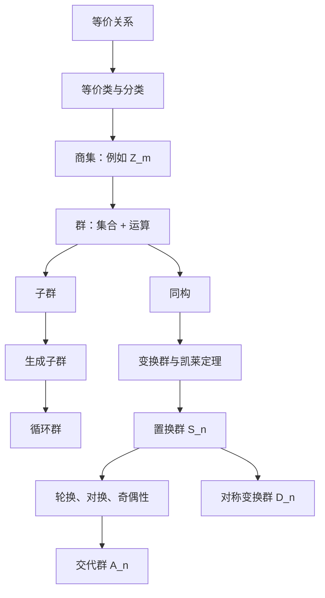

# 08 第一章复习与练习

## 1. 第一章知识网

第一章的核心不是记一堆定义，而是建立一种眼光：

> 先看集合，再看运算，再看结构。

## 2. 最重要的定义

### 等价关系

满足反身性、对称性、传递性的关系。

### 群

非空集合加一种运算，满足封闭性、结合律、单位元、逆元。

### 子群

群 $G$ 的非空子集 $H$，在 $G$ 的原运算下也构成群。

### 同构

保持运算的一一对应。

### 循环群

由一个元素生成的群。

### 对称群

$n$ 个元素的全部置换构成的群 $S_n$。

### 交代群

$S_n$ 中全体偶置换构成的子群 $A_n$。

## 3. 必会公式和结论

### 群基本公式

$$
(ab)^{-1}=b^{-1}a^{-1}.
$$

$$
a^ma^n=a^{m+n}.
$$

若 $G$ 交换，则

$$
(ab)^n=a^nb^n.
$$

### 子群判定

非空 $H\subseteq G$ 是子群，当且仅当

$$
ab^{-1}\in H,\quad \forall a,b\in H.
$$

加法群中是

$$
a-b\in H.
$$

### 元素阶

若 $\operatorname{ord}a=n$，则

$$
\operatorname{ord}(a^m)=\frac{n}{(n,m)}.
$$

### 循环群生成元

若 $G=\langle a\rangle$，$|G|=n$，则

$$
a^r\text{ 是生成元}\Longleftrightarrow (r,n)=1.
$$

### 循环群子群

$n$ 阶循环群的子群与 $n$ 的正因子对应。

### 置换阶

如果置换分解成不相交轮换，轮换长度为 $r_1,\ldots,r_s$，则

$$
\operatorname{ord}\sigma=[r_1,\ldots,r_s].
$$

### 置换共轭

$$
\sigma(i_1\ i_2\ \cdots\ i_k)\sigma^{-1}
=(\sigma(i_1)\ \sigma(i_2)\ \cdots\ \sigma(i_k)).
$$

## 4. 常用证明模板

### 证明 $H$ 是子群

写法：

1. $H$ 非空。
2. 任取 $a,b\in H$。
3. 证明 $ab^{-1}\in H$。
4. 所以 $H<G$。

### 证明两个群同构

写法：

1. 定义 $\phi:G\to G'$。
2. 证明 $\phi$ 是单射。
3. 证明 $\phi$ 是满射。
4. 证明 $\phi(ab)=\phi(a)\phi(b)$。
5. 所以 $G\cong G'$。

### 求有限循环群的子群

写法：

1. 写出群阶 $n$。
2. 列出 $n$ 的全部正因子。
3. 对每个正因子 $d$，写出 $\langle a^d\rangle$。

### 计算置换

写法：

1. 明确乘法从右到左。
2. 逐个追踪数字。
3. 写成不相交轮换。
4. 根据题目继续求阶、逆元或奇偶性。

## 5. 易错点清单

- 关系有对称性和传递性，不一定有反身性。
- $\bar a$ 是剩余类，不是普通整数 $a$。
- 群的运算必须封闭。
- 子群要用原来大群的运算。
- 非交换群中不能随意调换乘法顺序。
- 同构必须保持运算，光有双射不够。
- 循环群一定交换，交换群不一定循环。
- 置换乘法按教材约定从右到左。
- 计算置换阶前必须先分解成不相交轮换。

## 6. 综合练习

### 练习 1：等价类

在 $\mathbb Z$ 中规定

$$
a\sim b \Longleftrightarrow 4\mid a-b.
$$

写出所有等价类。

答案：

$$
\bar0,\bar1,\bar2,\bar3.
$$

### 练习 2：群判定

设

$$
G=\{2^m3^n\mid m,n\in\mathbb Z\}.
$$

证明 $G$ 关于普通乘法构成群。

提示：乘积对应指数相加，逆元对应指数取负。

### 练习 3：子群

设 $G$ 是交换群，固定整数 $m$，令

$$
H=\{a\in G\mid a^m=e\}.
$$

证明 $H<G$。

提示：若 $a^m=b^m=e$，利用交换性证明 $(ab^{-1})^m=e$。

### 练习 4：同构

证明任意二阶群都同构于 $\{1,-1\}$ 关于乘法构成的群。

提示：二阶群只有一个非单位元 $a$，必须满足 $a^2=e$。

### 练习 5：循环群

求 $\mathbb Z_{15}$ 的所有生成元。

答案：

$$
\bar1,\bar2,\bar4,\bar7,\bar8,\bar{11},\bar{13},\bar{14}.
$$

### 练习 6：循环群子群

求 $\mathbb Z_{20}$ 的所有子群个数。

答案方向：$20=2^2\cdot5$，正因子个数为 $(2+1)(1+1)=6$。

### 练习 7：置换分解

把

$$
\sigma=
\begin{pmatrix}
1&2&3&4&5&6\\
2&4&6&1&5&3
\end{pmatrix}
$$

写成不相交轮换并求阶。

答案方向：

$$
\sigma=(1\ 2\ 4)(3\ 6),
$$

所以阶为 $[3,2]=6$。

### 练习 8：奇偶性

判断

$$
(1\ 2\ 3\ 4\ 5)(2\ 6)
$$

的奇偶性。

答案方向：$5$ 轮换是偶置换，对换是奇置换，乘积为奇置换。

### 练习 9：对称群

正六边形的对称变换群有多少个元素？

答案：

$$
|D_6|=12.
$$

### 练习 10：证明循环群交换

设 $G=\langle a\rangle$。证明 $G$ 是交换群。

提示：任意元素可写为 $a^m,a^n$，而

$$
a^ma^n=a^{m+n}=a^{n+m}=a^na^m.
$$

## 7. 学完本章后的自测

如果下面问题你能顺畅回答，就说明第一章主线已经打通：

1. 为什么模 $m$ 同余是等价关系？
2. 为什么 $\mathbb Z_m$ 的加法是良定义的？
3. 群定义中的四个条件分别防止什么问题？
4. 子群判定为什么只需检查 $ab^{-1}$？
5. 同构为什么要保持运算？
6. 如何找有限循环群的所有生成元？
7. 如何找有限循环群的所有子群？
8. 置换乘法为什么要特别注意顺序？
9. 为什么每个置换都能写成不相交轮换？
10. 为什么群适合研究对称？

